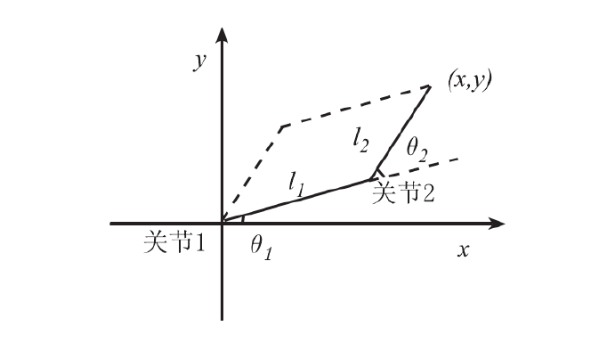

# 2021年总结

## 从SLAM开始

SLAM是Simultaneous Localization and Mapping的缩写，翻译过来是同时定位与重建，指搭载特定传感器的主体在没有先验环境知识的情况下，于运动过程中建立环境的模型，同时估计自己的运动。

在本项目中，环境是先验、已知的，甚至是不容许差错的；而视觉感知也仅限于“传感器信息读取”和“前端”。

### 传感器信息读取

本项目的主要传感器为相机。

#### RGB-D相机

现阶段本项目采用Orbbec Astra Pro相机，相机本身质量不高，也暂时没找着拍照片的方法，应该**尽快拍出照片**

优点：可以同时获取到深度图像，以此可以方便地获取目标物的位置

缺点：对于塑料瓶等透明物品效果极差

### 视觉前端

视觉前端的任务是由相机获取的信息估算目标物体的位置和种类。

现阶段采用GR-ConvNet算法进行位置的选取，**不知道怎么做分类，两个模型可以一体可以分开**

### 机械后端

与SLAM不同，本项目不需要维护一个环境的长期信息；因此可以忽略SLAM的后端，而以机械结构的后端进行替代。

理论上讲，三位空间中六个自由度是完备的，为了简化问题，我们从平面坐标开始，平面坐标有两个参数，可以直接解析解

正运动学求解：
$$
x=l_1cos(\theta_1)+l_2cos(\theta_1+\theta_2)\\
y=l_1sin(\theta_1)+l_2sin(\theta_1+\theta_2)
$$
逆运动学求解：
$$
\left\{\begin{array}{l}
\theta_{1}=\alpha_{2}-\alpha_{1} \\
\theta_{2}=\arctan \left(\left(y-l_{1} \sin \theta_{1}\right) /\left(x-l_{1} \sin \theta_{1}\right)\right)-\theta_{1}
\end{array}\right.
$$
其中$\alpha_1$和$\alpha_2$的计算如下
$$
\left\{\begin{array}{l}
r^{2}=x^{2}+y^{2} \\
\cos \alpha_{3}=\left(l_{1}^{2}+l_{2}^{2}-r^{2}\right) / 2 l_{1} l_{2} \\
\sin \alpha_{3}=\sqrt{1-\cos ^{2} \alpha_{3}} \\
\sin \alpha_{1}=l_{2} \sin \alpha_{3} / r \\
\cos \alpha_{1}=\left(r^{2}+l_{1}^{2}+l_{2}^{2}\right) / 2 l_{1} r \\
\alpha_{2}=\arctan (y, x) \\
\alpha_{1}=\arctan \left(\sin \alpha_{1} / \cos \alpha_{1}\right)
\end{array}\right.
$$
路径规划/运动插补

对于直线轨迹规划，一般利用起点和终点的值以插补的形式计算出中间点的位置。假设机械臂末端需要从$p_1(x_1, y_1)$运动到$p_2(x_2, y_2)$，计算出两点之间的距离为
$$
L=\sqrt{(x_1-x_2)^2+(y_1-y_2)^2)}
$$
$p_1$到$p_2$的方向向量$p_{12}$为
$$
\mathbf{p_{12}} = p_2 - p_1
$$
该方向的单位矢量：
$$
\mathbf{n} = \frac{\sqrt{p_{12}}}{L}
$$
假设使用直线插补，插补时间间隔为$t_s$，则此段时间内End Effector的运行距离$d=vt_s$，共需要插补步数：
$$
N = \frac{L}{d+1}
$$

$$
\Delta x=(x_2-x_1)/N\\
\Delta y=(y_2-y_1)/N
$$

$$
x_{i+1}=x_1+i\Delta x\\
y_{i+1}=y_1+i\Delta y\\
$$

若采用直线插补，

#### 通信协议

#### 控制算法

[1]孙斌,常晓明,段晋军.基于四元数的机械臂平滑姿态规划与仿真[J].机械科学与技术,2015,34(01):56-59.DOI:10.13433/j.cnki.1003-8728.2015.0112.

VERP  https://www.jianshu.com/p/eb3f38c0c5fa

1.Matlab里的simmechanics工具箱。你建立机器人模型后，可以快速用matlab的物理引擎进行计算，通过程序可获取机器人运动状态。

2.Adams。它做动力学分析也很好用，并易于与matlab通信。

刚体动力学的李群表示 http://www.cs.cmu.edu/~junggon/tools/liegroupdynamics.pdf

https://www.coursera.org/learn/robotics1/home

https://www.youtube.com/watch?v=d4EgbgTm0Bg&t=951s