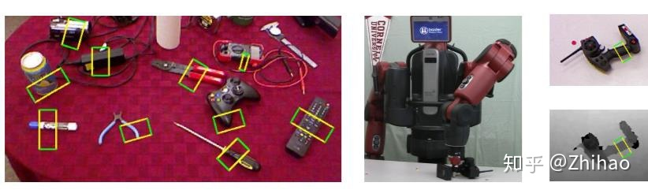

# The Mechanical design of ARGSS

[IEEE Xploer](https://ieeexplore.ieee.org/)暂时登录不上（HTTP 500），先把引文放在这里。【2021/10/17 12:55】

Joseph Redmon的早期论文https://arxiv.org/abs/1412.3128v2中在[康奈尔抓取数据集](https://aistudio.baidu.com/aistudio/datasetdetail/27422)上进行实验，使用AlexNet作为骨干网络。对其进行[引文追踪](https://www.scopus.com/results/citedbyresults.uri?sort=plf-f&cite=2-s2.0-84938282388&src=s&imp=t&sid=3ef6556912b6717d7f7e21b6aeacb6e7&sot=cite&sdt=a&sl=0&origin=inward&editSaveSearch=&txGid=3b22f907e4bee2966cc2936b2225c198)，发现SOTA。

或者也可以去Papers with Code上看[排行榜]（https://paperswithcode.com/sota/robotic-grasping-on-cornell-grasp-dataset-1

Comprehensive Review on Reaching and Grasping of Objects in Robotics https://www.cambridge.org/core/journals/robotica/article/comprehensive-review-on-reaching-and-grasping-of-objects-in-robotics/527CD405F6D4509DEF52FBA3A5E317FE

https://ieeexplore.ieee.org/document/8954887/ 水面清洁无人船？

> 在Cornell抓取的数据集中有两个正样本txt文件中标注是NaN，在进行训练时会导致出错，这两个文件分别为pcd0132cpos.txt和pcd0165cpos.txt。由于其标注方式为每行表示一个点，每4行表示一个抓取框，因此只需要删除掉标注为NaN所在的抓取框相关的4行即可。
> 
> ------------------------------------------------
> 版权声明：本文为CSDN博主「不会写代码的完结」的原创文章，遵循CC 4.0 BY-SA版权协议，转载请附上原文出处链接及本声明。
> 原文链接：https://blog.csdn.net/qq_35218039/article/details/104296240

转载一些机械臂控制的开源项目

机械臂抓取开源项目总结

转自知乎 [Zhihao](https://www.zhihu.com/people/AI-Robotic)

基础入门

1. 首先对机械臂的整体认识:

[http://blog.exbot.net/archives/3337](https://link.zhihu.com/?target=http%3A//blog.exbot.net/archives/3337)

2. CSDN上一个博主写的抓取、机械臂控制、机械臂抓取的代码解析：

[https://blog.csdn.net/zzu_seu/article/details/94617814](https://link.zhihu.com/?target=https%3A//blog.csdn.net/zzu_seu/article/details/94617814)

[https://blog.csdn.net/zzu_seu/article/details/89293241](https://link.zhihu.com/?target=https%3A//blog.csdn.net/zzu_seu/article/details/89293241)

[https://blog.csdn.net/zzu_seu/article/details/91347757](https://link.zhihu.com/?target=https%3A//blog.csdn.net/zzu_seu/article/details/91347757)

进阶攻略

1. 项目主要为了确定抓取位置，物体的哪个位置最容易抓取，最适合抓取，所产生的结果如下图所示，最好的抓取位置通过一个长方形框出。

代码地址：[https://github.com/tnikolla/robot-grasp-detection](https://link.zhihu.com/?target=https%3A//github.com/tnikolla/robot-grasp-detection)

论文：Real-Time Grasp Detection Using Convolutional Neural Networks

2. 分别通过VERP仿真、UR5，实现了机械臂的抓取。

代码地址：[https://github.com/andyzeng/visual-pushing-grasping](https://link.zhihu.com/?target=https%3A//github.com/andyzeng/visual-pushing-grasping)

论文：Learning Synergies between Pushing and Grasping with Self-supervised Deep Reinforcement Learning

3. 代码地址：[https://github.com/mirsking/Deep_learning_for_detectin_robotic_grasps/tree/master/deepGraspingCode](https://link.zhihu.com/?target=https%3A//github.com/mirsking/Deep_learning_for_detectin_robotic_grasps/tree/master/deepGraspingCode)

论文：Deep Learning for Detecting Robotic Grasps

通过matlab实现。

4. 代码地址：[https://github.com/dougsm/ggcnn](https://link.zhihu.com/?target=https%3A//github.com/dougsm/ggcnn)

论文：Closing the Loop for Robotic Grasping: A Real-time, Generative Grasp Synthesis Approach

5. 在GAZEBO仿真中，实现的机器人抓取

[https://github.com/jsbruglie/grasp](https://link.zhihu.com/?target=https%3A//github.com/jsbruglie/grasp)

6. 此项目在[Amazon Robotics Challenge](https://www.zhihu.com/question/268984064#/roboticschallenge)2017（[https://www.amazonrobotics.com/#/](https://www.zhihu.com/question/268984064#/)）中拿到了第一名。

代码地址：[https://github.com/caomw/arc-robot-vision](https://link.zhihu.com/?target=https%3A//github.com/caomw/arc-robot-vision)

论文：Robotic Pick-and-Place of Novel Objects in Clutter with Multi-Affordance Grasping and Cross-Domain Image Matching

7. 通过ROS2实现的机器人抓取

[https://github.com/JuFengWu/techman_robot_grasp_ros2](https://link.zhihu.com/?target=https%3A//github.com/JuFengWu/techman_robot_grasp_ros2)

8. 通过ROS实现UR机器人抓取。

[https://github.com/chjohnkim/MaskRCNN_Grasp_Detection/tree/master/maskrcnn](https://link.zhihu.com/?target=https%3A//github.com/chjohnkim/MaskRCNN_Grasp_Detection/tree/master/maskrcnn)

9. 通过ROS实现带有机械臂的移动机器人抓取。

[https://github.com/nkuzqy/move_and_grasp]()

发布于 2020-02-11

[工业机械臂](https://www.zhihu.com/topic/20682035)

[机器人](https://www.zhihu.com/topic/19551273)

[机械手抓取](https://www.zhihu.com/topic/20077057)
