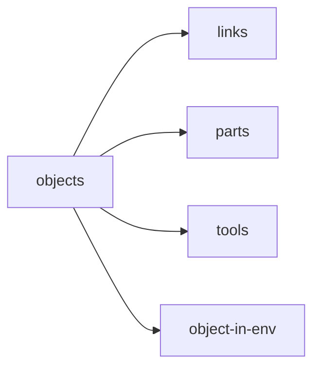

```bib
@book{CraigJohnJ2013ItRM,
  series    = {Pearson custom library},
  abstract  = {For senior-year or first-year graduate level robotics courses generally taught from the mechanical engineering, electrical engineering, or computer science departments. Since its original publication in 1986, Craig's Introduction to Robotics: Mechanics and Control has been the market's leading textbook used for teaching robotics at the university level. With perhaps one-half of the material from traditional mechanical engineering material, one-fourth control theoretical material, and one-fourth computer science, it covers rigid-body transformations, forward and inverse positional kinematics, velocities and Jacobians of linkages, dynamics, linear control, non-linear control, force control methodologies, mechanical design aspects, and programming of robots.},
  publisher = {Pearson Education UK},
  booktitle = {Introduction to Robotics},
  isbn      = {1292040041},
  year      = {2013},
  title     = {Introduction to Robotics: Mechanics and Control},
  language  = {eng},
  address   = {Harlow},
  author    = {Craig, John J},
  keywords  = {Robotics ; Robotics-Study and teaching (Higher)-United States}
}
```

## The machanics and control of mechanical manipulators

In the study of robotics, we are constantly concerned with the **location of objects** in 3-D space.



These objects are described by two attributes: **position** and **orientation**.

In order to describe the position and orientation of a body in space, we always attach a coordinate system, or **frame**, rigidly to the object. Any frame can serve as a reference system, so we often think of _transforming_ or _changing the description of_ these attributes of a body from one frame to another.

**Kinematics** is the science of motion that treats motion without regard to the forces that causes it. The study of the kinematics of manipulators refers to all the geometrical and time-based properties of the motion.

Manipulators consist of nearly rigid **links**, which are connected by **joints** that allow relative motion of neighboring links. These joints are usually instrumented with sensors. In the case of **revolute** joints, these displacements are called **joint angles**. Some manipulators contain **prismatic** joints, in which the relative displacement between links is a translation, sometimes called a **joint offset**.

The number of **degree of freedom** that a manipulator processes if the number of independent position variables that would have to be specified in order to locate all parts of the mechanism.

At the free end of the chain of links that make up the manipulator is the **end-effector**. We generally describe the position of the manipulator by giving a description of the **tool frame**, relative to the **base frame**, which is attached to the non-moving base of the manipulator.

**Forward kinematics** is the static geometrical problem of computing the position and orientation of the end-effector of the manipulator. Specifically, given a set of joint angles, the forward kinematic problem is to compute the position and orientation of the tool frame relative to the base frame. Sometimes, we think of this as changing the representation of manipulator position from a **joint space** description into a **Cartesian space** description.

**Inverse kinematics** is posed as follows: Given the position and orientation of the end-effector of the manipulator, calculate all possible sets of joint angles that could be used to attain this given position and orientation. The existence of nonexistence of a kinematic solution defines the **workspace** of a given manipulator.

In performing velocity analysis of a mechanism, it is convenient to define a matrix quantity called a **Jacobian** of the manipulator. The Jacobian specified a mapping from velocities in joint space to velocities in Cartesian space. At certain points, called **singularities**, this mapping is not invertible.


Manipulators sometimes are also required to touch a workpiece of work surface and apply a static force. In this case the problem arises: Given a desired contact force and moment, what set of **joint torques** is required to generate them? The Jacobian matrix arises quite naturally in the solution of this problem.

**Dynamics** is a huge field of study devoted to studying the forces required to cause motion. In order to accelerate a manipulator from rest(static), glide at a constant end-effector velocity, and finally decelerate to a stop, a complex set of torque functions must be applied by the joint actuators.

One method of controlling a manipulator to follow a desired path involves calculating these actuator torque functions by using the dynamic equations of motion of the manipulator.

A second use of the dynamic equation of motion is in **simulation**. By reformulating the dynamic equations so that acceleration is computed as a function of actuator torque, it is possible to simulate how a manipulator would move under application of a set of actuator torques.
