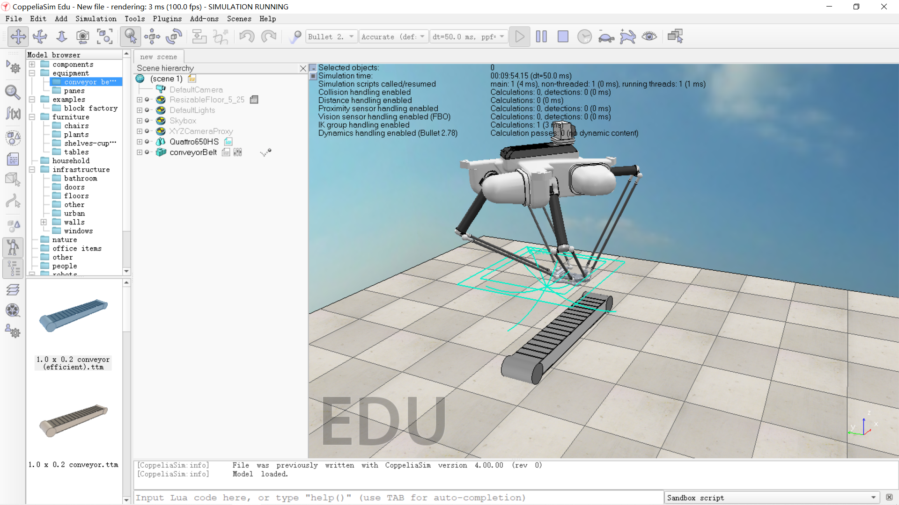

# `CoppeliaSim`

`CoppeliaSim`是瑞士`Coppelia Robotics`公司开发的机器人仿真的集成开发环境，核心库`CoppeliaSim Lib`主要以`GPL`协议开源，周边软件以不同协议授权。

`CoppeliaSim`提供了`Player`，`Edu`，`Pro`三种授权，本文采用`Edu`授权，其内置各种主流机械模型，原生支持`Lua`编程，同时通过`remote API`支持`C++`、`Python`、`MATLAB`等语言。

可导入`SolidWorks`工程文件，配置关节点，编写运动程序。

程序分为`thread`和`non-thread`两种，线程式轮流进行，每个脚本需主动释放线程；非线程式只能通过定时回调函数进行控制。

在`CoppeliaSim`中，我们可以导入设计好的机械结构，对其进行仿真验证。

## References

https://cloud.tencent.com/developer/inventory/491
