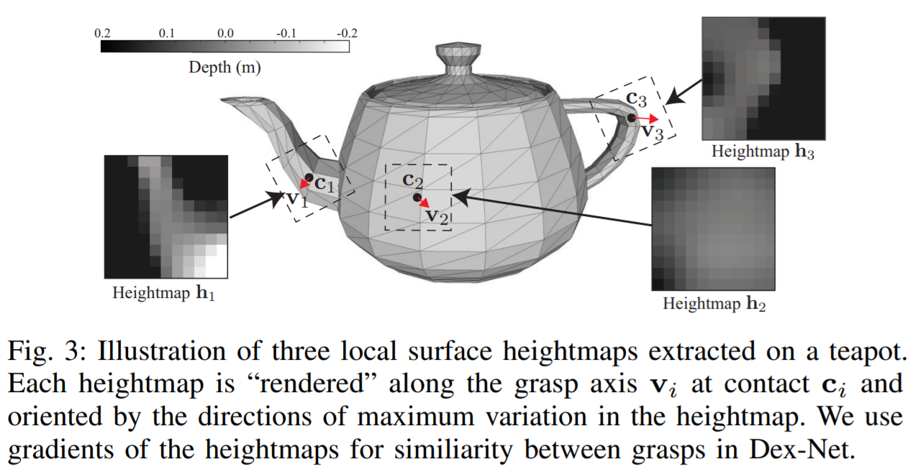
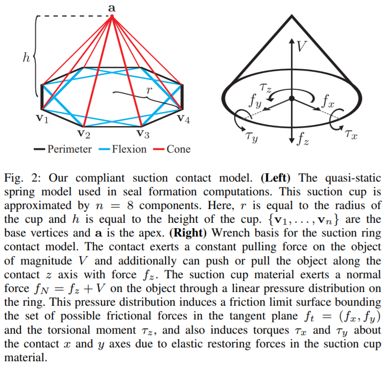
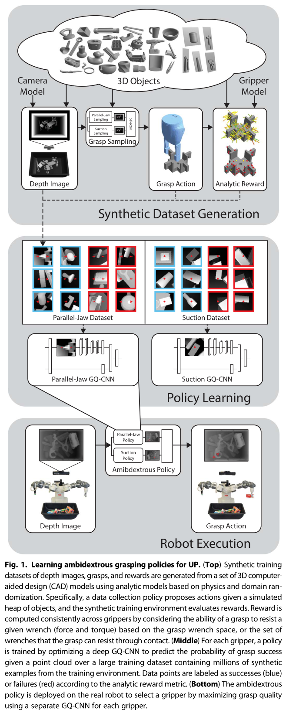

伯克利大学研发的`dex-net`系列宣称对不规则物体的抓取率达到了 99%，在`dex-net 4.0`称对不规则物体的抓取成功率达到了 95%，对于仓储物流业等需要分拣大量物体的行业来说无疑是个非常重要的技术突破。

`dex-net 1.0`采用多视角卷积神经网络。



`dex-net 2.0`采用了`Grasp Quality CNN`，使用卷积神经网络学习图像特征，使用全连接神经网络学习深度特征，


`dex-net 3.0`对吸盘建立了模型，其网络结构依然是`GQ-CNN`。



`dex-net 4.0`作为集成，提出了`Ambidextrous grasping`，在分别训练的`Parallel Jaw`和`Suction`机械臂头的基础上提出了`Ambidextrous Policy`，从两种机械臂中选取一种抓取成功率更高的进行抓取。

> A robot with an overhead depth camera views a heap of novel objects in a bin. On grasp attempt t, a robot observes a point cloud $y_t$ from the depth camera. The robot uses a policy $u_t = p(y_t)$ to plan a grasp action $u_t$ for a gripper g consisting of a 3D rigid position and orientation of the gripper $T_g = (R_g, t_g) ∈ SE (3)$. Upon executing $u_t$, the robot receives a reward $R_t = 1$ if it successfully lifts and transports exactly one object from the bin to a receptacle and $R_t = 0$ otherwise.



至于`GQ-CNN`的代码，虽然说洋洋洒洒几千行，其实大多是给`TensorFlow`填本来该开发者填的坑。`TensorFlow 1`暴露了太多底层`API`，大部分代码都是用来编写自己的类的。我仔细阅读了一下，发现有用的只有下面一段`YAML`：

<details>
    <code>
    	# general optimization params
train_batch_size: 64
val_batch_size: &val_batch_size 64
# logging params
num_epochs: 50        # number of epochs to train for
eval_frequency: 10    # how often to get validation error (in epochs)
save_frequency: 10    # how often to save output (in epochs)
vis_frequency: 10000  # how often to visualize filters (in epochs)
log_frequency: 1      # how often to log output (in steps)
# train / val split params
train_pct: 0.8              # percentage of the data to use for training vs validation
total_pct: 1.0              # percentage of all the files to use
eval_total_train_error: 0   # whether or not to evaluate the total training error on each validataion
max_files_eval: 1000        # the number of validation files to use in each eval
# optimization params
loss: sparse
optimizer: momentum
train_l2_regularizer: 0.0005
base_lr: 0.01
decay_step_multiplier: 0.5   # number of times to go through training datapoints before stepping down decay rate (in epochs)
decay_rate: 0.95
momentum_rate: 0.9
max_training_examples_per_load: 128
drop_rate: 0.0
max_global_grad_norm: 100000000000
# input params
training_mode: classification
image_field_name: tf_depth_ims
pose_field_name: grasps
# label params
target_metric_name: grasp_metrics  # name of the field to use for the labels
metric_thresh: 0.5                 # threshold for positive examples (label = 1 if grasp_metric > metric_thresh)
# preproc params
num_random_files: 10000     # the number of random files to compute dataset statistics in preprocessing (lower speeds initialization)
preproc_log_frequency: 100 # how often to log preprocessing (in steps)
# denoising / synthetic data params
multiplicative_denoising: 0
gamma_shape: 1000.00
symmetrize: 0
gaussian_process_denoising: 0
gaussian_process_rate: 0.5
gaussian_process_scaling_factor: 4.0
gaussian_process_sigma: 0.005
# tensorboard
tensorboard_port: 6006
# debugging params
debug: &debug 0
debug_num_files: 10 # speeds up initialization
seed: &seed 24098
        </code>
</details>

```yaml
### GQCNN CONFIG ###
gqcnn:
  # basic data metrics
  im_height: 96
  im_width: 96
  im_channels: 1
  debug: *debug
  seed: *seed

  # needs to match input data mode that was used for training, determines the pose dimensions for the network
  gripper_mode: parallel_jaw

  # method by which to integrate depth into the network
  input_depth_mode: im_depth_sub

  # used for training with multiple angular predictions
  angular_bins: 16

  # prediction batch size, in training this will be overriden by the val_batch_size in the optimizer's config file
  batch_size: *val_batch_size

  # architecture
  architecture:
    im_stream:
      conv1_1:
        type: conv
        filt_dim: 9
        num_filt: 16
        pool_size: 1
        pool_stride: 1
        pad: VALID
        norm: 0
        norm_type: local_response
      conv1_2:
        type: conv
        filt_dim: 5
        num_filt: 16
        pool_size: 2
        pool_stride: 2
        pad: VALID
        norm: 0
        norm_type: local_response
      conv2_1:
        type: conv
        filt_dim: 5
        num_filt: 16
        pool_size: 1
        pool_stride: 1
        pad: VALID
        norm: 0
        norm_type: local_response
      conv2_2:
        type: conv
        filt_dim: 5
        num_filt: 16
        pool_size: 2
        pool_stride: 2
        pad: VALID
        norm: 0
        norm_type: local_response
      fc3:
        type: fc
        out_size: 128
      fc4:
        type: fc
        out_size: 128
      fc5:
        type: fc
        out_size: 32

  # architecture normalization constants
  radius: 2
  alpha: 2.0e-05
  beta: 0.75
  bias: 1.0

  # leaky relu coefficient
  relu_coeff: 0.0
```

上边是全卷积的，这是原味的：

```yaml
### GQCNN CONFIG ###
gqcnn:
  # basic data metrics
  im_height: 96
  im_width: 96
  im_channels: 1
  debug: *debug
  seed: *seed

  # needs to match input data mode that was used for training, determines the pose dimensions for the network
  gripper_mode: parallel_jaw

  # method by which to integrate depth into the network
  input_depth_mode: pose_stream

  # used for training with multiple angular predictions
  angular_bins: 0

  # prediction batch size, in training this will be overriden by the val_batch_size in the optimizer's config file
  batch_size: *val_batch_size

  # architecture
  architecture:
    im_stream:
      conv1_1:
        type: conv
        filt_dim: 9
        num_filt: 16
        pool_size: 1
        pool_stride: 1
        pad: VALID
        norm: 0
        norm_type: local_response
      conv1_2:
        type: conv
        filt_dim: 5
        num_filt: 16
        pool_size: 2
        pool_stride: 2
        pad: VALID
        norm: 0
        norm_type: local_response
      conv2_1:
        type: conv
        filt_dim: 5
        num_filt: 16
        pool_size: 1
        pool_stride: 1
        pad: VALID
        norm: 0
        norm_type: local_response
      conv2_2:
        type: conv
        filt_dim: 5
        num_filt: 16
        pool_size: 2
        pool_stride: 2
        pad: VALID
        norm: 0
        norm_type: local_response
      fc3:
        type: fc
        out_size: 128
    pose_stream:
      pc1:
        type: pc
        out_size: 16
      pc2:
        type: pc
        out_size: 0
    merge_stream:
      fc4:
        type: fc_merge
        out_size: 128
      fc5:
        type: fc
        out_size: 2

  # architecture normalization constants
  radius: 2
  alpha: 2.0e-05
  beta: 0.75
  bias: 1.0

  # leaky relu coefficient
  relu_coeff: 0.0
```

> 这个文章的强化学习是训练一个$Q_θ(o,a)$，训练的话就用了个监督损失，用$Q
> $拟合$R$，这个$Q$网络输入的是深度图和所有候选动作，输出维度和动作维度相同，候选动作是枚举的，通过前面的定位技术和一些固定的位姿的并集，然后在里面选一个最好的；同时抑制其他动作的估值，这可能是就是 loss 用$CE$的用意吧；训练的话应该是随机给一个目标物体吧，然后看能不能抓。论文提到蒙特卡洛了，然后还有一个尝试次数限制，这个是加在 policy evaluation 里面的。大概就是这些了吧，是一个比较扎实的应用。我感觉这一篇就只涉及到动态规划贝尔曼方程那一套，其他技术都没怎么上
>
> – 20211221 请教王学长

[^dex-net4]: https://www.science.org/doi/10.1126/scirobotics.aau4984
[^dex-net]: https://berkeleyautomation.github.io/dex-net/
