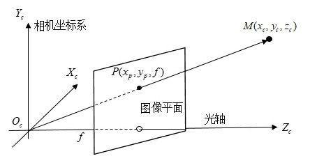
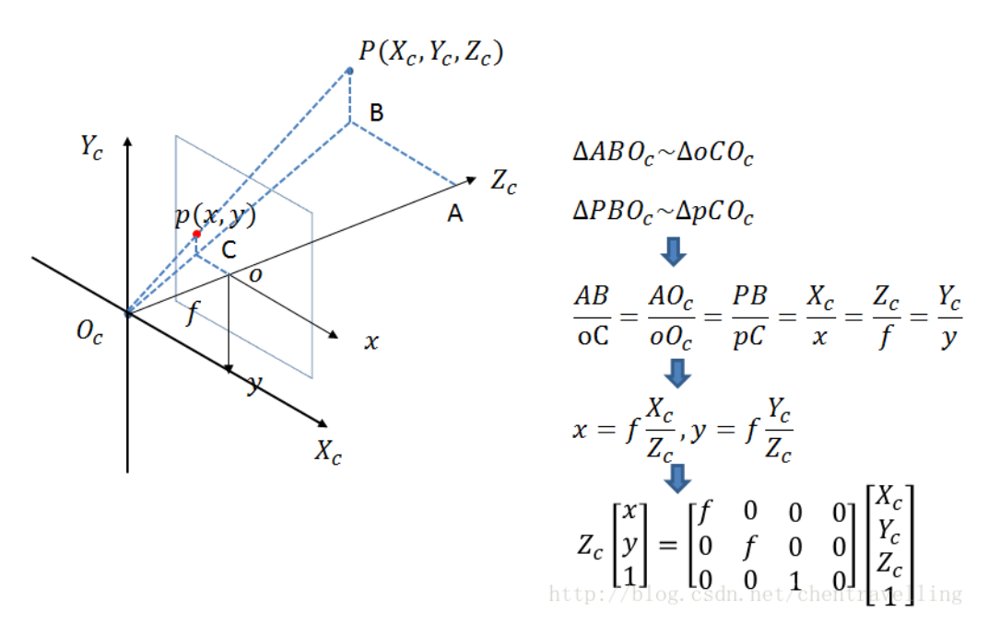
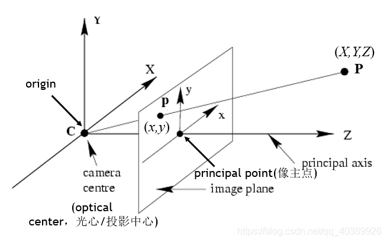

总结来说就是相似三角形，$\frac{x_{c}}{x}=\frac{y_{c}}{y}=\frac{z_{c}}{f}$，通过变换可得$x=\frac{x_{c}}{z_{c}} f, y=\frac{y_{c}}{z_{c}} f$，由此得其增广形式

$$
\left(\begin{array}{l}
x \\
y \\
1
\end{array}\right)=\frac{1}{z_{c}}\left(\begin{array}{llll}
f & 0 & 0 & 0 \\
0 & f & 0 & 0 \\
0 & 0 & 1 & 0
\end{array}\right)\left(\begin{array}{c}
x_{c} \\
y_{c} \\
z_{c} \\
1
\end{array}\right)
$$

相机坐标系到机械臂坐标就是一个平移加旋转，一个矩阵搞定的，一个不够就连乘

如下是绕$z$轴旋转

$$
\left(\begin{array}{l}
x_{c} \\
y_{c} \\
z_{c} \\
1
\end{array}\right)=\left(\begin{array}{ccc}
\cos \alpha & -\sin \alpha & 0 & 0\\
\sin \alpha & \cos \alpha & 0 & 0\\
0 & 0 & 1 & 0\\
0 & 0 & 0 & 1
\end{array}\right)\left(\begin{array}{l}
x_{w} \\
y_{w} \\
z_{w} \\
1
\end{array}\right)
$$

$$
\left[\begin{array}{l}
x \\
y \\
z
\end{array}\right]=\left[\begin{array}{ccc}
\cos \theta & -\sin \theta & 0 \\
\sin \theta & \cos \theta & 0 \\
0 & 0 & 1
\end{array}\right]\left[\begin{array}{l}
x^{\prime} \\
y^{\prime} \\
z^{\circ}
\end{array}\right]=R_{1}\left[\begin{array}{l}
x^{\prime} \\
y^{\circ} \\
z^{\circ}
\end{array}\right]
$$

$$
\left[\begin{array}{l}
x \\
y \\
z
\end{array}\right]=\left[\begin{array}{ccc}
1 & 0 & 0 \\
0 & \cos \varphi & \sin \varphi \\
0 & -\sin \varphi & \cos \varphi
\end{array}\right]\left[\begin{array}{l}
x^{\prime} \\
y^{\prime} \\
1
\end{array}\right]=R_{2}\left[\begin{array}{l}
x^{\prime} \\
y^{\prime} \\
z^{*}
\end{array}\right]
$$

$$
\left[\begin{array}{l}
x \\
y \\
z
\end{array}\right]=\left[\begin{array}{ccc}
\cos \varphi & 0 & -\sin \varphi \\
0 & 1 & 0 \\
\sin \varphi & 0 & \cos \varphi
\end{array}\right]\left[\begin{array}{l}
x^{\prime} \\
y^{\prime} \\
1
\end{array}\right]=R_{3}\left[\begin{array}{l}
x^{\prime} \\
y^{\prime} \\
z^{\prime}
\end{array}\right]
$$

可得到旋转矩阵$R=R_1R_2R_3$

$$
\left[\begin{array}{l}
X_{c} \\
Y_{c} \\
Z_{c}
\end{array}\right]=R\left[\begin{array}{l}
X_{w} \\
Y_{w} \\
Z_{w}
\end{array}\right]+T
$$

$$
\left[\begin{array}{c}
X_{c} \\
Y_{c} \\
Z_{c} \\
1
\end{array}\right]=\left[\begin{array}{ll}
R & T \\
\overrightarrow{0} & 1
\end{array}\right]\left[\begin{array}{c}
X_{w} \\
Y_{w} \\
Z_{w} \\
1
\end{array}\right], \mathrm{R}: 3 * 3, \mathrm{~T}: 3 * 1
$$



齐次 Homogeneous coordinate system

$$
\begin{aligned}
(1,2,3) & \Rightarrow\left(\frac{1}{3}, \frac{2}{3}\right) \\
(2,4,6) & \Rightarrow\left(\frac{2}{6}, \frac{4}{6}\right)=\left(\frac{1}{3}, \frac{2}{3}\right) \\
(4,8,12) & \Rightarrow\left(\frac{4}{12}, \frac{8}{12}\right)=\left(\frac{1}{3}, \frac{2}{3}\right) \\
\vdots & \vdots \\
(1 a, 2 a, 3 a) & \Rightarrow\left(\frac{1 a}{3 a}, \frac{2 a}{3 a}\right)=\left(\frac{1}{3}, \frac{2}{3}\right)
\end{aligned}
$$

平移变换

$$
\left[\begin{array}{lll}
x^{\prime} & y^{\prime} & 1
\end{array}\right]=\left[\begin{array}{lll}
x & y & 1
\end{array}\right]\left|\begin{array}{ccc}
1 & 0 & 0 \\
0 & 1 & 0 \\
\mathrm{~d} x & \mathrm{~d} y & 1
\end{array}\right|
$$

旋转变换

$$
\left[\begin{array}{lll}
x^{\prime} & y^{\prime} & 1
\end{array}\right]=\left[\begin{array}{lll}
x & y & 1
\end{array}\right]\left|\begin{array}{ccc}
\cos \theta & \sin \theta & 0 \\
-\sin \theta & \cos \theta & 0 \\
0 & 0 & 1
\end{array}\right|
$$

缩放变换

$$
\left[\begin{array}{lll}
x^{\prime} & y^{\prime} & 1
\end{array}\right]=\left[\begin{array}{lll}
x & y & 1
\end{array}\right]\left|\begin{array}{ccc}
S_{x} & 0 & 0 \\
0 & S_{y} & 0 \\
0 & 0 & 1
\end{array}\right|
$$

相机的内参矩阵

$$
K = \begin{bmatrix}
f_x & s & s_0 \\
0 & f_y & y_0 \\
0 & 0 & 1
\end{bmatrix}
$$

$f_x, f_y$为焦距，$x_0, y_0$为原点坐标，$s$为坐标轴倾斜参数

---

**从世界坐标系到相机坐标系**

设某点在世界坐标系下坐标为$P_w=(x_w, y_w, z_w)^\top$，在相机坐标系下的坐标为$P_c=(x_c, y_c, z_c)^\top$，则

$$
P_c = \begin{bmatrix}
R & T \\
0 & 1
\end{bmatrix} P_w
$$

其中，$R$为正交旋转矩阵，$T$为平移矩阵

**从相机坐标系到图像坐标系**

假设空间点$X_c$在相机坐标系下，$P_c = (x_c, y_c, z_c, 1)^\top$，其像点$m$在图像坐标系下的齐次坐标为$m = (x_p, y_p, 1)$，由相似三角形可得

$$
\left\{
\begin{array}{}
x_p = \frac{fx_c}{z_c} \\
y_p = \frac{fy_c}{z_c}
\end{array}
\right.
$$

矩阵表示为

$$
z_{c} m=\left[\begin{array}{llll}
f & 0 & 0 & 0 \\
0 & f & 0 & 0 \\
0 & 0 & 1 & 0
\end{array}\right] P_{c}
$$

实际中，主点可能不在图像坐标系原点，若主点在图像中的坐标为

$$
p = (x_0, y_0, 1)^\top
$$

则

$$
z_{c} m=\left[\begin{array}{c}
f x \\
f y \\
1
\end{array}\right]=\left[\begin{array}{cccc}
f & 0 & x_{0} & 0 \\
0 & f & y_{0} & 0 \\
0 & 0 & 1 & 0
\end{array}\right] P_{c}
$$

从图像坐标系到像素坐标系

假设一个像素的长和宽分别为$dx， dy$，设像素坐标$Pix = (u, v, 1)^\top$，则

$$
\left[\begin{array}{l}
u \\
v \\
1
\end{array}\right]=\left[\begin{array}{ccc}
1 / d_{x} & 0 & 0 \\
0 & 1 / d_{y} & 0 \\
0 & 0 & 1
\end{array}\right]\left[\begin{array}{c}
x_{p} \\
y_{p} \\
1
\end{array}\right]
$$

结合相机到图像的变换，相机到像素的变换为：

$$
K=\left[\begin{array}{ccc}
1 / d_{x} & 0 & 0 \\
0 & 1 / d_{y} & 0 \\
0 & 0 & 1
\end{array}\right]\left[\begin{array}{ccc}
f & 0 & x_{0} \\
0 & f & y_{0} \\
0 & 0 & 1
\end{array}\right]=\left[\begin{array}{ccc}
f_{x} & 0 & u_{0} \\
0 & f_{y} & v_{0} \\
0 & 0 & 1
\end{array}\right]
$$

其中，$f_x = f/dx, y = f/dy$成为相机在$u$轴和$v$轴方向上的尺度因子，相机主点为$(u_0, v_0)^\top = (x_0/dx, y_0/dy)^\top$

从世界坐标系到像素坐标系的变换为：

$$
z_{c}\left[\begin{array}{l}
u \\
v \\
1
\end{array}\right]=K \cdot\left[\begin{array}{cc}
R & T \\
0 & 1
\end{array}\right]\left[\begin{array}{c}
x_{w} \\
y_{w} \\
z_{w} \\
1
\end{array}\right]
$$

16 个相机参数：

- 10 个内部参数
  - 五个内部矩阵参数$K$：$f, dx, dy, u_0, v_0$（也可视作四个参数$f_x, f_y, u_0, v_0$
  - 五个畸变参数：$D$：$k_1, k_2, k_3, p_1, p_2$
- 6 个外部参数
  - 3 个旋转参数$R$
  - 3 个平移参数$T$

```python
import cv2
import numpy as np

#读取相机内参
with np.load('C:\\Users\\wlx\\Documents\\py_study\\camera calibration\\data\\intrinsic_parameters.npz') as X:
    mtx,dist = [X[i] for i in ('mtx','dist')]

def draw(img, corners, imgpts):
    corner = tuple(corners[0].ravel())
    img = cv2.line(img, corner, tuple(imgpts[0].ravel()), (255,0,0), 5)
    img = cv2.line(img, corner, tuple(imgpts[1].ravel()), (0,255,0), 5)
    img = cv2.line(img, corner, tuple(imgpts[2].ravel()), (0,0,255), 5)
    return img

#标定图像保存路径
photo_path = "C:\\Users\\wlx\\Documents\\py_study\\camera calibration\\image\\6.jpg"
#标定图像
def calibration_photo(photo_path):
    #设置要标定的角点个数
    x_nums = 8                                                          #x方向上的角点个数
    y_nums = 5
    #设置(生成)标定图在世界坐标中的坐标
    world_point = np.zeros((x_nums * y_nums,3),np.float32)            #生成x_nums*y_nums个坐标，每个坐标包含x,y,z三个元素
    world_point[:,:2] = np.mgrid[:x_nums,:y_nums].T.reshape(-1, 2)    #mgrid[]生成包含两个二维矩阵的矩阵，每个矩阵都有x_nums列,y_nums行
                                                                        #.T矩阵的转置
                                                                        #reshape()重新规划矩阵，但不改变矩阵元素
    #设置世界坐标的坐标
    axis = np.float32([[3,0,0], [0,3,0], [0,0,-3]]).reshape(-1,3)
    #设置角点查找限制
    criteria = (cv2.TERM_CRITERIA_EPS + cv2.TERM_CRITERIA_MAX_ITER,30,0.001)

    image = cv2.imread(photo_path)

    gray = cv2.cvtColor(image,cv2.COLOR_RGB2GRAY)
    #查找角点
    ok,corners = cv2.findChessboardCorners(gray,(x_nums,y_nums),)
    #print(ok)
    if ok:
        #获取更精确的角点位置
        exact_corners = cv2.cornerSubPix(gray,corners,(11,11),(-1,-1),criteria)

        #获取外参
        _,rvec, tvec, inliers = cv2.solvePnPRansac(world_point, exact_corners, mtx, dist)

        imgpts, jac = cv2.projectPoints(axis, rvec, tvec, mtx, dist)
        #可视化角点
        img = draw(image, corners, imgpts)
        cv2.imshow('img', img)


if __name__ == '__main__':
    calibration_photo(photo_path)
    cv2.waitKey()
    cv2.destroyAllWindows()
```

---

$$
\text { camera matrix }=\left[\begin{array}{ccc}
f_{x} & 0 & c_{x} \\
0 & f_{y} & c_{y} \\
0 & 0 & 1
\end{array}\right]
$$

$$
\text { Distortion coefficients }=\left(\begin{array}{lllll}
k_{1} & k_{2} & p_{1} & p_{2} & k_{3}
\end{array}\right)
$$

$$
R = \left[\begin{array}{ccc}
\cos \theta \cos \phi & \sin \psi \sin \theta \cos \phi-\cos \psi \sin \phi & \cos \psi \sin \theta \cos \phi+\sin \psi \sin \phi \\
\cos \theta \sin \phi & \sin \psi \sin \theta \sin \phi+\cos \psi \cos \phi & \cos \psi \sin \theta \sin \phi-\sin \psi \cos \phi \\
-\sin \theta & \sin \psi \cos \theta & \cos \psi \cos \theta
\end{array}\right]
$$

$$
T = [t_1, t_2, t_3]^\top
$$

$$
\left[\begin{array}{l}
x \\
y \\
1
\end{array}\right]=\left[\begin{array}{ccc}
f_{\mathrm{x}} & 0 & u_{0} \\
0 & f_{\mathrm{y}} & v_{0} \\
0 & 0 & 1
\end{array}\right]\left[\begin{array}{cccc}
r_{1} & r_{2} & r_{3} & t_{1} \\
r_{4} & r_{5} & r_{6} & t_{2} \\
r_{7} & r_{8} & r_{9} & t_{3}
\end{array}\right]\left[\begin{array}{c}
X \\
Y \\
Z \\
1
\end{array}\right]
$$

> 问题 1：相机标定内参的时候通过 calibrateCamera()函数能够获得旋转矢量 rvec 和平移向量 tvec；在本章中，我们使用 solvePnPRansac()函数又一次获得旋转矢量 rvec 和平移向量 tvec。这是为什么呢？
>
> calibrateCamera()函数求取的旋转矢量 rvec 和平移向量 tvec，是在获取了相机内参 mtx, dist 之后，通过内部调用 solvePnPRansac()函数获得的。也就是说，如果对于只有一张标定图像的情况，alibrateCamera()函数求取的旋转矢量 rvec 和平移向量 tvec，与 solvePnPRansac()函数求取的旋转矢量 rvec 和平移向量 tvec 是一样的（这是确定的）。但是我们在标定相机内参的时候，为了得到较为准确的标定结果，所以拍摄了多张（10~20）不同角度的标定图，在这些标定图一起作用下，求出了相机的内参。所以当在一个确定的场景下，想要获得相机的外参时，我们需要重新求取旋转矩阵和平移向量，于是我们用了 solvePnPRansac()函数（为什么不用 calibrateCamera()函数了？因为 calibrateCamera()函数就是调用的 solvePnPRansac()函数）。
>
> 问题 2:得出的 rvec 怎么是 3\*1 的矩阵？
>
> 调用 solvePnPRansac()函数得到的 rvec 是一个旋转矢量，需要使用 cv2.Rodrigues(src,dst,jacobian=None)
>
> src:输入的矩阵可以是（3*1 或 1*3）也可以是 3\*3
>
> dst:输出的矩阵，对应输入 3*3,或者（3*1 或 1\*3）
>
> jacobian:也是一个输出，该输出表明了输入矩阵和输出矩阵的的雅可比
>
> 转换后的矩阵就和前面的旋转矩阵对应了，然后就能求出相机的俯仰角、偏航角、滚轮角。（不过对于实际应用中，知道旋转矩阵不就行了？）
>
> ## OK，相机内外参数都弄明白了，相机标定告一段落。
>
> 版权声明：本文为 CSDN 博主「Levi_wlx」的原创文章，遵循 CC 4.0 BY-SA 版权协议，转载请附上原文出处链接及本声明。
> 原文链接：https://blog.csdn.net/weilixin88/article/details/91603319


