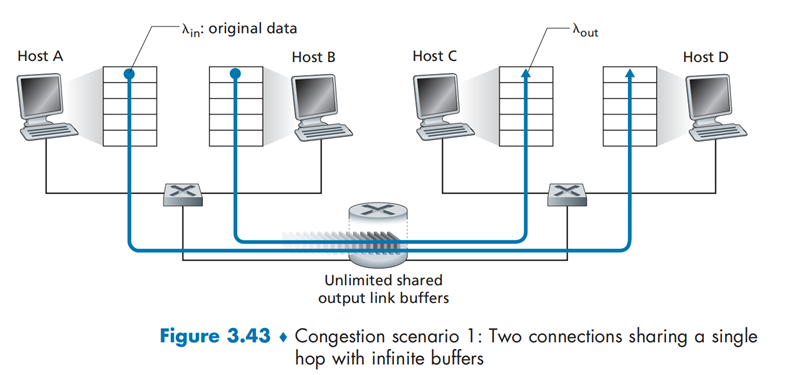
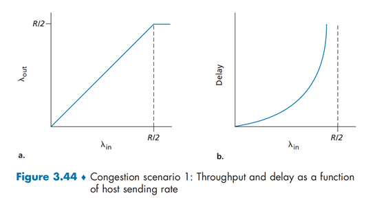
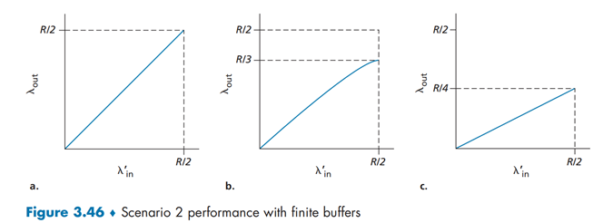
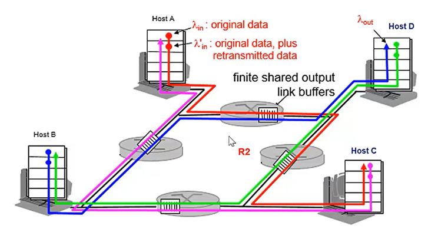
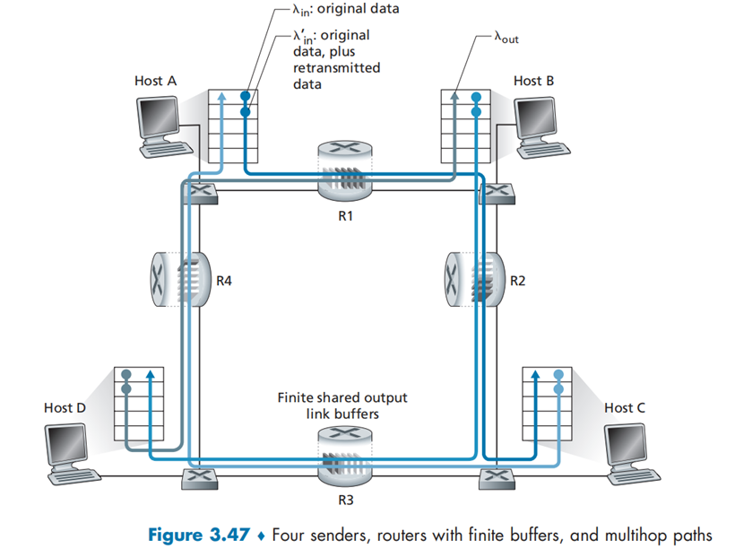

# 计算机网络中的流量控制与拥塞控制

TCP（Transmission Control Protocol）是面向连接的传输层协议，不仅具有多进程复用网络、差错校验功能，还有可靠数据传输、流量控制和拥塞控制功能。流量控制和拥塞控制都是通过控制发送方发送未被 ACK 的数据包的数量控制的。

## 流量控制

```

    0                   1                   2                   3
    0 1 2 3 4 5 6 7 8 9 0 1 2 3 4 5 6 7 8 9 0 1 2 3 4 5 6 7 8 9 0 1
   +-+-+-+-+-+-+-+-+-+-+-+-+-+-+-+-+-+-+-+-+-+-+-+-+-+-+-+-+-+-+-+-+
   |          Source Port          |       Destination Port        |
   +-+-+-+-+-+-+-+-+-+-+-+-+-+-+-+-+-+-+-+-+-+-+-+-+-+-+-+-+-+-+-+-+
   |                        Sequence Number                        |
   +-+-+-+-+-+-+-+-+-+-+-+-+-+-+-+-+-+-+-+-+-+-+-+-+-+-+-+-+-+-+-+-+
   |                    Acknowledgment Number                      |
   +-+-+-+-+-+-+-+-+-+-+-+-+-+-+-+-+-+-+-+-+-+-+-+-+-+-+-+-+-+-+-+-+
   |  Data |           |U|A|P|R|S|F|                               |
   | Offset| Reserved  |R|C|S|S|Y|I|            Window             |
   |       |           |G|K|H|T|N|N|                               |
   +-+-+-+-+-+-+-+-+-+-+-+-+-+-+-+-+-+-+-+-+-+-+-+-+-+-+-+-+-+-+-+-+
   |           Checksum            |         Urgent Pointer        |
   +-+-+-+-+-+-+-+-+-+-+-+-+-+-+-+-+-+-+-+-+-+-+-+-+-+-+-+-+-+-+-+-+
   |                    Options                    |    Padding    |
   +-+-+-+-+-+-+-+-+-+-+-+-+-+-+-+-+-+-+-+-+-+-+-+-+-+-+-+-+-+-+-+-+
   |                             data                              |
   +-+-+-+-+-+-+-+-+-+-+-+-+-+-+-+-+-+-+-+-+-+-+-+-+-+-+-+-+-+-+-+-+

                            TCP Header Format

          Note that one tick mark represents one bit position.

                               Figure 3.
```

这是 TCP 的报文结构，来自 RFC793，可以看到有一个 16 位的 Window 字段，RFC 中是这样解释的：

> The number of data octets beginning with the one indicated in the acknowledgment field which the sender of this segment is willing to accept.

也就是说，Window 大小是接收方愿意接受的数据的大小；这个数据会有一个放大倍数，是客户端和服务协商好的，比如下边这个是 256。


现在的问题是，如何计算自己的 Window size 呢？

TCP 是有缓冲区的，建立 TCP 连接之后，操作系统会分配缓冲区，缓冲区大小是有限的，数据的处理需要时间，中间丢包还需要暂存数据。一般来说，TCP 的一方（称其为 B）在接收时会维护两个状态：

`LastByteRead`：B 的应用层进程读出的最后一个字节的序号

`LastByteRcvd`：B 的网络层传到传输层的最后一个字节的序号

TCP 缓冲区不能溢出，所以我们规定：`LastByteRcvd - LastByteRead <= RecvBuffer`，注意这里的减法是$\mod 2$意义下的，永远都是自然数。

因此接收窗口`Receive Window`由公式计算得到：`rwnd = RecvBuffer - [LastByteRcvd - LastByteRead]`

和 B 建立连接的 A 也维护着 B 的两个状态：

`LastByteSent`：A 的传输层传到网络层的最后一个字节的需要

`LastByteAcked`：A 接收到最大的`ACK`的序号

在发送的时候，A 掌握着主动权，在传输的全过程中，它需要维持以下不等式成立：`LastByteSent - LastByteAcked <= rwnd`

有另外一个小问题：如果 B 的缓冲区满了，它送回一个 0，那么 A 怎么知道 B 的缓冲区什么时候空了呢？事实上，标准规定 A 在得知 B 的`rwnd`为 0 时，依然会持续发送一字节的报文，直到 B 返回的 ACK 报文中的`Window size`成为正值。

## 拥塞控制

网络拥塞（network congestion）是指在分组交换网络中传送分组的数目太多时，由于存储转发节点的资源有限而造成网络传输性能下降的情况。

拥塞的表现其一是路由器缓冲溢出导致的丢包——不是你丢包，就是我丢包，其二是由排队延迟造成的延迟过大。丢包的第一反应是重传，但重传应该属于“治标不治本”的下下策。解决网络拥塞的问题，最好的方法是发送方主动减少发包数量，各退一步，海阔天空。（下面我们会从例子看到为什么这么说）

> 小冷知识：`UNIX`系统作为分时操作系统，其上的`nice`程序的功能是“主动让出一部分CPU时间片给其它用户”。实际上，没有人会主动用这个程序

### 拥塞的原因

下面用三个例子分析一下拥塞的原因

#### 情况一：两个发送方和一台具有无穷大缓存的路由器'

假设

1. 路由器无限缓存：不会出现分组丢失，无需重传
2. 不执行流量控制或拥塞控制
3. 数据链路带宽为$R$
4. $λ_{in}$表示主机A和B 发送的速率；$λ_{out}$表示主机C和D接受的速率

网络拓扑如下



当发送速率在$0 \textasciitilde R/2$之间，接收方的吞吐量等于发送方的吞吐量。当发送速率超过$R/2$时，吞吐量停止在$R/2$，不再增长。

当$λ_{in}$逐渐增大时，时延也在增大。当$λ_{in}$靠近$R/2$时，时延快速增长到无穷大。



由此可以看出，拥塞带来的代价是吞吐的时延极大

#### 情况二：两个发送方和一台具有有限缓存的路由器

**假设：**

1. 路由器缓存容量有限：当缓存满时会丢包，需要重传
2. 没有拥塞控制和流量控制机制
3. 初始数据的发送速率为$λ_{in}$，初始数据加重传数据的发送速率为$λ_{in}^′$

$$
λ_{in}^′– λ_{in}= 重传的数据发送速率
$$


方式a：发送方可以获取路由器的buffer信息（实际上不存在这种情况），当路由器buffer有空闲时才发送分组。在这种情况下，不会产生丢包，吞吐量就是$λ_{in}$。

方式b：发送方仅在丢包后重传数据，对于超时则不理会（将超时时间设定的足够长即可）。此时$λ_{in}^′>λ_{out}$。平均来讲，在$R/2$的发送数据中，$R/3$为初始数据，$R/6$为重传数据。

方式c：分组丢失和超时后都重发，此时$λ_{in}^′$变得更大。此时初始数据发送的速率只有$R/4$，重传的数据达到了$R/4$

（平均每个分组被路由器转发两次时，由于每个分组被转发两次，当其供给载荷接近$R/2$时，其吞吐量将渐近$R/4$）

**代价：需要做更多的重传，并造成资源的浪费。**（重传数据需要再次使用数据链路）



#### 情况三：四个发送方和具有有限缓存的多台路由器及多跳路径

**假设：**

1. 四台主机互相发送分组，每台都通过交叠的两条路径传输
2. 每台主机都采用超时/重传机制来实现可靠数据传输服务
3. 所有主机都有相同的$λ_{in}$值，所有路由器带宽都是$R$字节/秒。 
4. 路由器缓存有限
5. $λ_{in}$依然表示初始数据的传送速率，$λ_{in}^′$表示初始数据+重传数据的传送速率





对路由器R2进行分析：

1. A到C传输最后经过R2路由器，而B到D传输首先经过R2路由器；
2. A与B会在路由器R2上发生竞争，但由于B先经过R2，B流过的速率会比A流过的大得多。
3. 由于A在对路由器R1的抢占过程中占优，因此R1中的大多数据为A发送的数据
4. R2会将A发送的数据大量丢包，这将导致“上游“路由器存储转发的大量数据作废。这也是图中当λ_in增加到一定程度时，其吞吐量会显著下降的原因。

代价：共享路由器的问题，**当分组被丢弃时，任何用于该分组的“上游“传输能力全部被浪费掉**

> When a packet is dropped along a path, the transmission capacity that was use at each of the upstream links to forward that packet to the point at which it is dropped ends up having been wasted.


###  TCP拥塞控制

TCP采用端到端的可靠数据传输机制（因为IP不提供可靠数据传输服务）。这就引出了一系列问题：

1. TCP发送方如何控制发送速度？
2. TCP发送方怎么知道网络中发生了拥塞？
3. 发送方知道网络中发生了拥塞，它根据何种算法调节自身的发送速度？

上面[流量控制](#流量控制)讲到，TCP使用一个`rwnd`变量控制发送方的发送速率，因此，我们也可以用同样的方式进行拥塞控制

```
LastByteSent - LastByteAcked <= min{cwnd, rwnd}
```

为了聚焦于拥塞控制，我们假设`rwnd`无限大——至少是不会比`cwnd`小。

当然，文章主要讲解了TCP/IP协议。除此之外，还有在Asynchronous Transfer Mode网络中的Available Bit-Rate服务。
