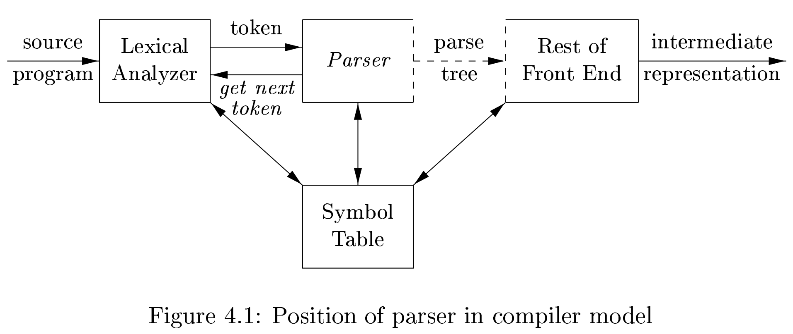
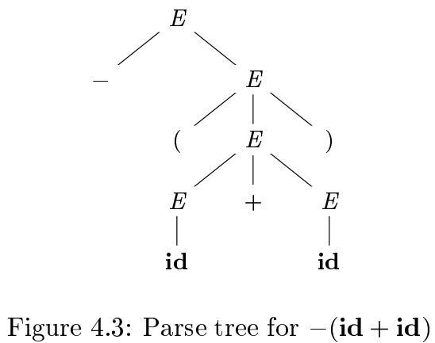
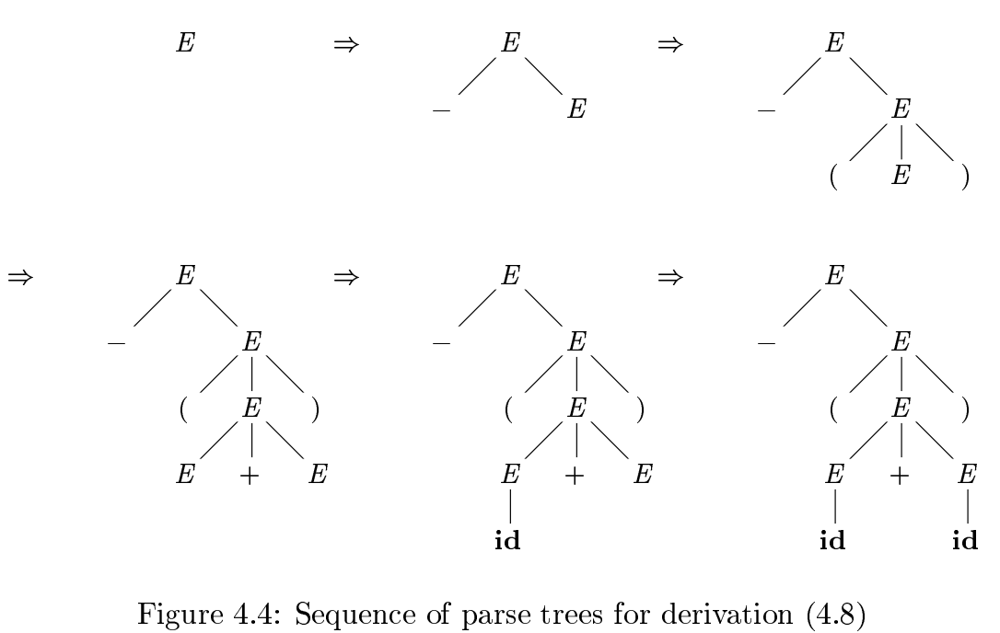
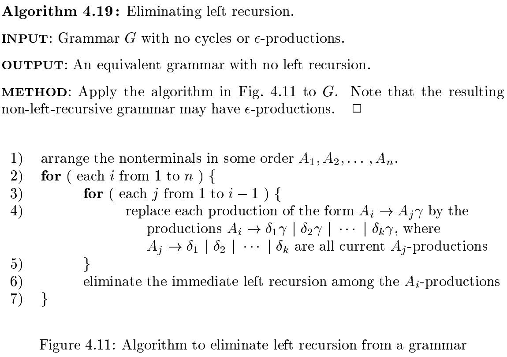
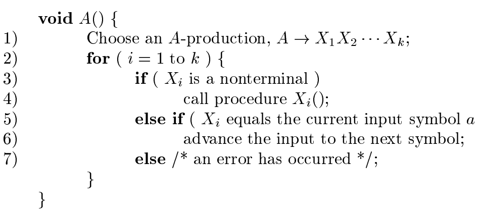
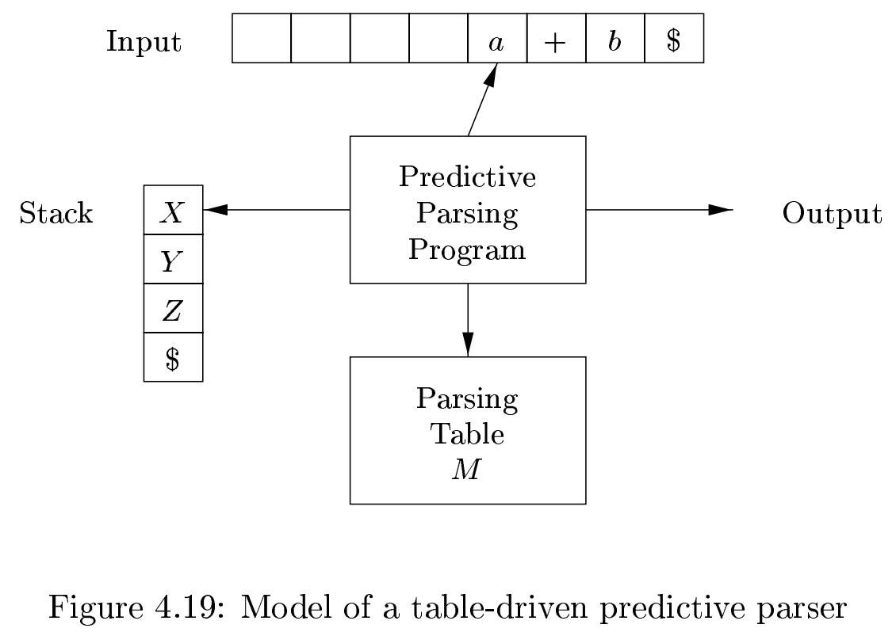
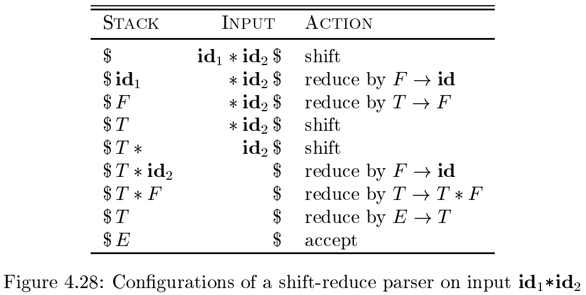
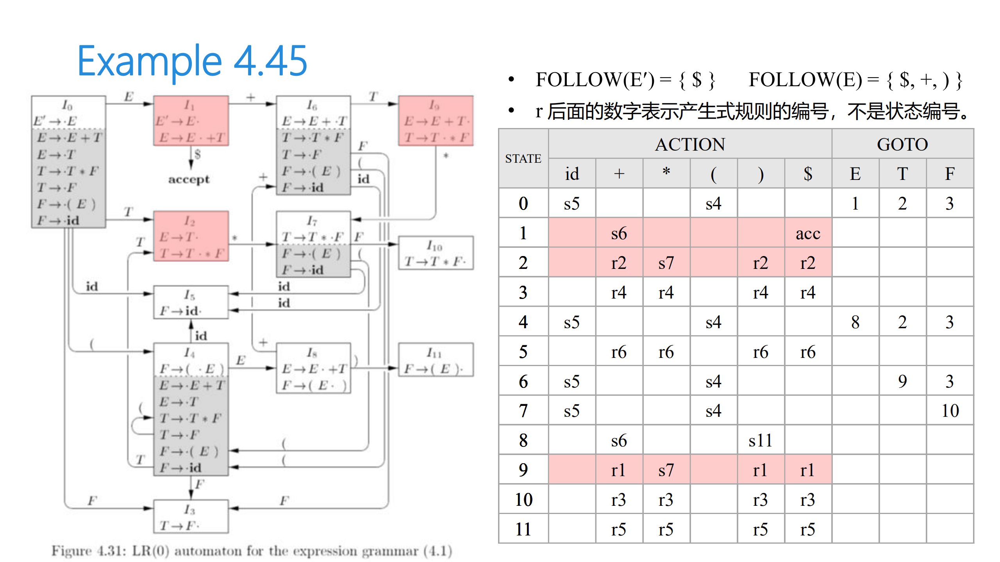
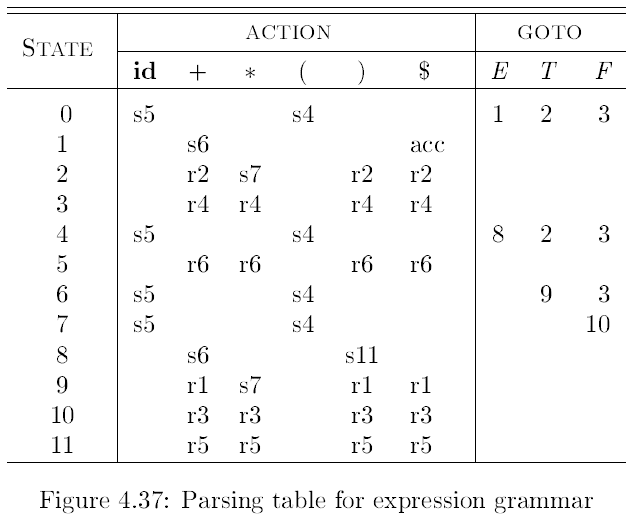

# 语法分析 Parse

语法给定了一个准确的编程语言的语言规则。

语法分析在编译器中

语法分析器有三种：universial，top-down、botton-up，universial 可以分析任何语法，但是实现太复杂，没有太大工程意义；后两者虽然只能处理语法的一个子集，但是运用这个子集也足以分析程序语言的语法。

## 上下文无关文法

$$
stmt \rightarrow \mathrm{if} \ \mathtt{(}\ expr\ \mathtt{)} \ stmt \ \mathrm{else} \ stmt
$$

### 规则定义

其正规定义如下：

1. 终结符 Terminal：组成字符串的基本符号
2. 非终结符 Nonterminal：代表一个字符串集合的语法上的变量
3. 开始符号 Start symbol：其中一个非终结符，它所代表的字符串集合就是这个语法的语言
4. 推导 Production：
   1. head (left)：一个非终结符。这个推导代表这个非终结符生成的一些字符串
   2. $\rightarrow$ 符号
   3. body (right)：零或多个终结符和非终结符，表示 head 生成字符串的一种方式

$$
\begin{aligned}
 { expression } & \rightarrow  { expression } \mathtt + { term } \\
 { expression } & \rightarrow  { expression }\mathtt{-} { term } \\
 { expression } & \rightarrow  { term } \\
 { term } & \rightarrow  { term } \mathtt*  { factor } \\
 { term } & \rightarrow  { term } \mathtt/  { factor } \\
 { term } & \rightarrow  { factor } \\
 { factor } & \rightarrow  { \mathtt{(} expression \mathtt ) } \\
 { factor } & \rightarrow \mathrm { id }
\end{aligned}
$$

我们进行一些约定，上述的语法规则可以简化成下边这样

$$
\begin{array}{ll}
E & \rightarrow E+T \mid E-T \mid T \\
T & \rightarrow T * F \mid T / F \mid F \\
F & \rightarrow(E) \mid \text { id }
\end{array}
$$

其中 $E$、$T$、$F$ 都是非终结符，$E$是开始符号，剩下的符号都是非终结符。

### 推导

推导的正规定义：设非终结符$A$， 希腊字母$\alpha$、 $\beta$、$\gamma$ 代表任意字符串（可空），有推导 $A \rightarrow \gamma$，那么我们可以写一个推导

$$
\alpha A \beta \Rightarrow \alpha \gamma \beta
$$

其中 $\Rightarrow$ 表示推导一步。如果有 $\alpha_{1} \Rightarrow \alpha_{2} \Rightarrow \cdots \Rightarrow \alpha_{n}$ 我们说 $a_1$ 推导出 $a_n$。类似闭包，我们用 $\stackrel{*}{\Rightarrow}$ 表示零步或多步推导，用 $\stackrel{+}{\Rightarrow}$ 表示一步或多步推导。

如果有 $S \stackrel{*}{\Rightarrow} \alpha$，其中 $S$ 是语法 $G$ 的一个起始符号，那么说 $\alpha$ 是 $G$ 的一个**句型**（sentential form）。

在编译器中常常采用**最左推导**（leftmost derivation）或**最右推导**两种方式。

最左推导就是每次替换最左边的非终结符，得到的句型叫**最左句型**。

依然是上边的语法规则，我们考虑以最左推导形式进行语法分析，如下：

$$
E \underset{l m}{\Rightarrow}-E \underset{l m}{\Rightarrow}-(E) \underset{l m}{\Rightarrow}-(E+E) \underset{l m}{\Rightarrow}-(\mathbf{i d}+E) \underset{l m}{\Rightarrow}-(\mathbf{i d}+\mathbf{i d})
$$

## 语法树

**语法树**是对推导的图形化表达。还是上边的推导，画成语法树是这个样子：

推导过程如下：

## 二义性

对于 $\mathbf{i d}+\mathbf{i d} * \mathbf{i d}$ 来说，有以下两种可能的推导：

$$
\begin{aligned}
E & \Rightarrow E+E \\
& \Rightarrow \quad \mathbf{i d}+E \\
& \Rightarrow \quad \mathbf{i d}+E * E \\
& \Rightarrow \quad \mathbf{i d}+\mathbf{i d} * E \\
& \Rightarrow \quad \mathbf{i d}+\mathbf{i d} * \mathbf{i d}
\end{aligned}
$$

$$
\begin{aligned}
E & \Rightarrow E * E \\
& \Rightarrow \quad E+E * E \\
& \Rightarrow \quad \mathbf{i d}+E * E \\
& \Rightarrow \quad \mathbf{i d}+\mathbf{i d} * E \\
& \Rightarrow \quad \mathbf{i d}+\mathbf{i d} * \mathbf{i d}
\end{aligned}
$$

这种语法是**有二义性**（ambiguous）的，对应到表达式求值上，就是 `(a+b)*c` 和 `a+(b*c)` 的算符**优先级**问题。

## 语法的完备性证明

证明完备性分两部分：证明语法 $G$ 生成的每一个字符串都在语言 $L$ 中，同时证明语言 $L$ 中的字符串都能被 $G$ 生成。

可以使用数学归纳法。

## 编写语法

### 消除二义性

首先我们拿 `if-else` 配对为例，下面语法会产生 dangling-else 这种常见的错误：

$$
\begin{array}{rcl}
\text { stmt } & \rightarrow  & \text { if expr then stmt } \\
& \mid & \text { if expr then stmt else stmt } \\
& \mid & \text { other }
\end{array}
$$

有如下 hack：

$$
\text { if } E_{1} \text { then } S_{1} \text { else if } E_{2} \text { then } S_{2} \text { else } S_{3}
$$

这种二义性语法本身造成的，需要通过改写语法消除二义性。

如下是没有二义性的文法，每一个 `else` 与最近的一个 `if` 配对。

### 消除左递归

当一个语法中存在如 $A \stackrel{+}{\Rightarrow} A\alpha$ 的语法时，我们说这个语法是**左递归**的。

如果我们有形如 $A \rightarrow A\alpha \mid \beta$ 的语法，我们可以如下改写：

$$
\begin{gathered}
A \rightarrow \beta A^{\prime} \\
A^{\prime} \rightarrow \alpha A^{\prime} \mid \epsilon
\end{gathered}
$$

上边例子是**直接左递归**，麻烦的是**间接左递归**。间接左递归可以用如下的算法消除。

其实就是一个将间接左递归展开为直接左递归，再手动消除直接左递归的过程。

### 左因子

左因子指一个非终结符的推导的两个或多个候选式中的公共前缀，如：

$$
\begin{array}{rcl}
\text { stmt } & \rightarrow & \text { if expr then stmt else } s t m t \\
&\mid  & \text { if expr then stmt }
\end{array}
$$

`if expr`就是一个左因子。

消除左因子的方法是提取左因子。假设有 $A$ 的两个推导 $A \rightarrow \alpha \beta_{1} \mid \alpha \beta_{2}$，有左因子 $\alpha$，提取左因子如下：

$$
\begin{aligned}
&A \rightarrow \alpha A^{\prime} \\
&A^{\prime} \rightarrow \beta_{1} \mid \beta_2
\end{aligned}
$$

## 自顶向下分析

### 递归下降分析

递归下降分析是最简单的一种自顶向下分析方法，但当一个非终结符有两种或以上推导时，需要进行试错与回溯。

### 前瞻语法 Lookahead Grammar

#### FIRST 和 FOLLOW

$\mathrm{FIRST}(\alpha)$，其中 $\alpha$ 是任意语法符号，定义为从 $\alpha$ 推导出的所有字符串中可能的首字符的集合。

$\mathrm{FOLLOW}(A)$ 定义为在某句型中直接出现在终结符 $A$ 之后的所有字符的集合，即 $S \stackrel{*}{\Rightarrow} \alpha Aa\beta$。

$\mathrm{FIRST}(X)$ 以如下算法计算：

1. 若 $X$ 是终结符，$\mathrm{FIRST}(X) = X$。
2. 若 $X$ 是非终结符且有推导 $X \rightarrow Y_1Y_2\ldots Y_k$，$k\ge1$，若对于某个 $i$，$\epsilon \in \cap_{s=1}^{i-1}(\mathrm{FIRST(Y_s)})$ 且 $a \in \mathrm{FIRST}(Y_i)$，将 $a$ 加入 $\mathrm{FIRST}(X)$
3. 如果有推导 $X \rightarrow \epsilon$，将 $\epsilon$ 加入 $\mathrm{FIRST(X)}$

$\mathrm{FOLLOW(A)}$ 以如下算法计算：

1. 从开始符号 $S$ 开始，将 $\$$ 加入 $\mathrm{FOLLOW(S)}$
2. 若有推导 $A \rightarrow \alpha B \beta$，将 $\mathrm{FIRST}(\beta)$ 中除 $\epsilon$ 外的所有元素加入 $\mathrm{FOLLOW}(B)$
3. 若有推导 $A \rightarrow \alpha B$ 或 $A \rightarrow \alpha B \beta$，其中 $\epsilon \in \mathrm{FIRST}(\beta)$，将 $\mathrm{FOLLOW}(A)$ 中所有元素加入 $\mathrm{FOLLOW}(B)$

### $\mathrm{LL}(1)$ 语法

第一个 $\mathrm L$ 指**自左向右扫描**输入字符串，第二个 $\mathrm L$ 代表**最左推导**。

$\mathrm{LL}(1)$ 以表驱动的方式进行推导，表 $M$ 中的每一项 $M[A, a]$ 代表当前看到了非终结符 $A$，扫描到的下一个非终结符是 $a$ 时应该执行的推导。

表的构造算法如下：

输入：语法 $G$

输出：Parsing Table $M$

方法：对于语法中每个推导 $A \rightarrow \alpha$，执行下列操作

1. 对于 $\mathrm{FIRST}(\alpha)$ 中的每一个终结符 $a$，将 $A\rightarrow \alpha$ 加入$M[A, a]$
2. 若 $\mathrm{FIRST}(\alpha)$ 中含有 $\epsilon$，对 $\mathrm{FOLLOW}(\alpha)$ 中所有非终结符 $b$，将 $A\rightarrow\alpha$ 加入 $M[A, b]$
3. 若 $\mathrm{FIRST}(\alpha)$ 中含有 $\epsilon$，对 $\mathrm{FOLLOW}(\alpha)$ 中含有 $\$$，把 $A\rightarrow\alpha$ 加入 $M[A, \$]$

最后，$M[A, a]$ 中的空项置为 $\mathbf{error}$。

对每一个 $\mathrm{LL}(1)$ 文法，parsing table 的每一项必须是唯一的推导或错误。如果不唯一，说明不是 $\mathrm{LL}(1)$ 文法。

### 非递归前瞻分析

程序需要显式维护一个栈，栈顶是当前正在处理的非终结符。

一次推导的过程如下

## 自底向上分析

### 规约分析

自底向上分析可以看做是规约分析，也就是说，从输入字符串开始，将一个与某个推导的 body 相同的子串，规约为这个推导的 head。如下的字符串

$$
\mathbf{i d} * \mathbf{i d}, \quad F * \mathbf{i d}, \quad T * \mathbf{i d}, \quad T * F, T, E
$$

对应了推导

$$
E \Rightarrow T \Rightarrow T * F \Rightarrow T * \mathbf{i d} \Rightarrow F * \mathbf{i d} \Rightarrow \mathbf{i d} * \mathbf{i d}
$$

### 移位归约分析

流程：

1. 首先，自左向右扫描输入字符串，将每个字符压栈。若栈顶构成某个推导 $A \rightarrow \beta$ 的结果 $\beta$，则将 $\beta$ 中全部符号出栈，$A$ 进栈。
2. 直到栈中剩下起始符号，输入已空，接受。

对语法的要求是无二义性，不能出现同时有两个 `handle` 的情况。

### LR 分析

LR 分析器通过维护**状态**来确定在分析的那个阶段，进而决定下一步是移位或是规约。

例如，推导 $A\rightarrow XYZ$ 可以产生如下四个**状态**：

$$
\begin{aligned}
A&\rightarrow \cdot X Y Z \\
A& \rightarrow X \cdot Y Z \\
A& \rightarrow X Y \cdot Z \\
A& \rightarrow X Y Z \cdot
\end{aligned}
$$

每一个 $\cdot$ 表示所处于推导中的位置，每一个状态代表一个**项目**。

$A \rightarrow \epsilon$ 只有一个状态：$A \rightarrow \cdot$。

文法的 $\mathrm{LR}(0)$ 项目分为四种：

- 规约项目：$A \rightarrow \alpha \cdot$
- 接受项目：$S \rightarrow \alpha \cdot$（特殊的规约项目）
- 移进项目：$A\rightarrow \alpha \cdot a \beta$
- 待约项目：$A \rightarrow \alpha \cdot B \beta$

为了计算语法的标准 $\mathrm{LR}(0)$ 集，我们介绍一种**增强语法**和 $\mathrm{CLOSURE}$ 与 $\mathrm{GOTO}$ 函数。

设原语法为 $G$，$G$ 中起始符号为 $S$，则增强语法 $G'$ 中，起始符号为 $S'$ 且有推导 $S' \rightarrow S$。

引入增强的起始状态的目的是，当完成推导 $S' \rightarrow S$ 并输入串扫描完毕时，接受。

#### $\mathrm{LR}(0)$ 分析

$\mathrm L$ 代表从左到右扫描输入字符串，$R$ 代表执行最右推导。

有四种 Action （行为）

- shift：读入下一个输入符号并将其移入栈
- reduce：当栈顶符号形成句柄时进行规约，用产生式左侧的非终结符替换栈顶的句柄。
- accept：当栈顶只有 $\$$ 和开始符号，输入串也只有 $\$$ 时，分析成功，是一种特殊的规约。
- error：发现一个语法错误，调用错误处理程序。

#### $\mathrm{CLOSURE}$

如果 $I$ 是语法 $G$ 的一个**项目集**，那么 $\mathrm{CLOSURE}(I)$ 可以由以下两条方法计算：

1. 初始，把 $I$ 中所有元素加入 $\mathrm{CLOSURE}(I)$。
2. 如果 $A \rightarrow \alpha \cdot B \beta$ 在 $\mathrm{CLOSURE}(I)$ 中，并且 $B \rightarrow \gamma$ 是一个推导，那么将 $B \rightarrow\cdot \gamma$ 加入 $\mathrm{CLOSURE}(I)$ 中。重复该步骤，直到没有新的 item 能被加入 $\mathrm{CLOSURE}(I)$ 中。

#### $\mathrm{GOTO}$

设 $I$ 是一个**项目集**，$X$ 是一个语法符号，$\mathrm{GOTO}(I,X)$ 是 $I$ 中 $[A\rightarrow \alpha X \cdot \beta]$ 中所有元素的闭包。

$\mathrm{GOTO}(I,X)$ 用于定义自动机中的转移。

### 自动机构造方法

1. 构造表达式文法的规范 $\mathrm{LR}(0)$ 项目集族

2. 若文法 $G$ 的 $\mathrm{LR}(0)$ 自动机不存在下述情况

   1. 既含移进项目又含规约项目
   2. 含有多个规约项目

   则称 $G$ 是一个 $\mathrm{LR}(0)$ 文法

3. 设 $I_k$ 为当前状态（的项集族）

   1. 规约项目：若 $A \rightarrow \alpha\cdot \in I_k$，则对所有终结符 $a$（或 $\$$），$\mathrm{ACTION}[k, a] = \mathrm{reduce}(A \rightarrow \alpha)$
   2. 接受项目：若 $S' \rightarrow S \in I_k$，则 $\mathrm{ACTION}[k, a] = \mathrm{success()}$
   3. 移进项目：若 $A \rightarrow \alpha \cdot a \beta$，且 $\mathrm{GOTO}(I_k, a) = I_j$，则 $\mathrm{ACTION}[k, a] = \mathrm{shift}(s_j)$
   4. 待约项目：若 $A \rightarrow \alpha \cdot B \beta$，且 $\mathrm{GOTO}(I_k, B) = I_j$，则 $\mathrm{GOTO}[k, B] = j$
   5. 分析表中空白位置为出错标志

### Problem & Solution

$\mathrm{LR}(0)$ 文法没有实用价值。（为什么？）

### 构造 $\mathrm{SLR}(1)$ 分析表

设 $I_k$ 为当前状态（的项集族）

1. 规约项目：若 $A \rightarrow \alpha\cdot \in I_k$，则对==所有$a \in \mathrm{FOLLOW}(A)$==，$\mathrm{ACTION}[k, a] = \mathrm{reduce}(A \rightarrow \alpha)$
2. 接受项目：若 $S' \rightarrow S \in I_k$，则 $\mathrm{ACTION}[k, a] = \mathrm{success()}$
3. 移进项目：若 $A \rightarrow \alpha \cdot a \beta$，且 $\mathrm{GOTO}(I_k, a) = I_j$，则 $\mathrm{ACTION}[k, a] = \mathrm{shift}(s_j)$
4. 待约项目：若 $A \rightarrow \alpha \cdot B \beta$，且 $\mathrm{GOTO}(I_k, B) = I_j$，则 $\mathrm{GOTO}[k, B] = j$
5. 分析表中空白位置为出错标志

### Problems & Solutions

- $\mathrm{FOLLOW}(A)$ 是指所有**可能推导出的句型中**，可以跟随在 $A$ 后边的符号集
- $\mathrm{LR}$ 分析法的规约应该仅对**右句型**中跟随在 $A$ 后的终结符有效。否则，规约之后得到的符号串可能不是右句型。

更强大的 LR 分析器过于复杂，就不再介绍了。
