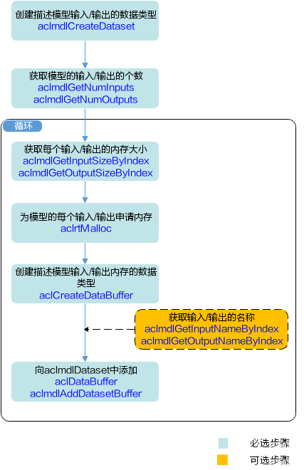

# AscendCL 编程简明广播体操

> 提示：本文使用`C++`进行开发，`Python` API 与之十分近似，可触类旁通。

AscendCL（Ascend Computing Language）是华为昇腾开发的异构计算架构，提供 Device 管理、Context 管理、Stream 管理、内存管理、模型加载与执行、算子加载与执行、媒体数据处理等 C 语言 API 库供用户开发深度神经网络应用，用于实现目标识别、图像分类等功能。

## 概念和术语

> - **Host**指与 Device 相连接的 X86 服务器、ARM 服务器，会利用 Device 提供的 NN（Neural-Network）计算能力，完成业务。
> - **Device**指安装了芯片的硬件设备，利用 PCIe 接口与 Host 侧连接，提供 NN 计算能力。\*\*
> - **Context**作为一个容器，管理了所有对象（包括 Stream、Event、设备内存等）的生命周期。不同 Context 的 Stream、不同 Context 的 Event 是完全隔离的，无法建立同步等待关系。
> - 多线程编程场景下，每切换一个线程，都要为该线程指定当前 Context，否则无法获取任何其他运行资源。该部分更多细节我们在“同步等待”实验中深入讨论。
>
> **Stream**用于维护一些异步操作的执行顺序，确保按照应用程序中的代码调用顺序在 Device 上执行。

以上摘自官网，用大家熟悉的例子作对比，Host 指主机和主机内存，Device 可以类比为显卡和显存，Context 是显存里一个“进程”（类比 CPU 进程）的生命周期，进程中有许多异步操作，异步操作的执行顺序用 Stream 描述。学习过`Nvidia CUDA`编程的同学对这些概念可能会对号入座。你们是对的，放心大胆地对号入座吧，你们一定比别人学得快。

## 注意：谨言慎行

因为这是相当 Low Level 的开发，报错信息不会十分”友好“的给你一个弹窗（因为内核越精简越好）。为了让开发者能获悉错误，`ACL`内部设置了`aclError`的一个变量，每次执行`ACL API`都会对这个变量进行赋值。一些函数会返回这个值的一个`copy`，如果没有，可以通过[`aclGetRecentErrMsg()`](https://support.huaweicloud.com/aclcppdevg-cann51RC1alpha1/aclcppdevg_03_0012.html)获得一个`char*`，如果上一个操作成功，则返回`nullptr`，否则返回一个指向有报错信息的位置。

> 要我说，华为真是内敛，这么好用的一个`API`竟然藏得这么深，看到时让我惊喜了一下，用了之后更加兴奋了。

我将错误检查的流程封装为两个宏函数：`CHECK`对返回`aclError`的函数进行检查，`CHECK_NULLPTR`对返回的指针进行检查。

```cpp
#include <cstdio>
#include <cstdlib>
#define CHECK(call)                                                        \
  do {                                                                     \
    const aclError error_code = call;                                      \
    if (error_code != ACL_SUCCESS) {                                       \
      fprintf(stderr, "\033[1;31mError in %s, file %s, line %d\033[0m\n",  \
              #call, __FILE__, __LINE__);                                  \
      fprintf(stderr, "\033[1;31mError code: %d\033[0m\n", error_code);    \
      fprintf(stderr, "\033[1;31mError message: %s\033[0m\n",              \
              aclGetRecentErrMsg());                                       \
      exit(0);                                                             \
    } else {                                                               \
      fprintf(stderr, "\033[1;32mASCEND API " #call " succeed!\033[0m\n"); \
    }                                                                      \
  } while (0)

#define CHECK_NULLPTR(pointer)                                               \
  do {                                                                       \
    if (pointer == nullptr && aclGetRecentErrMsg() == nullptr) {             \
      fprintf(stderr, "\033[1;31mPointer " #pointer " is nullptr\033[0m\n"); \
      fprintf(stderr, "\033[1;31mError message: %s\033[0m\n",                \
              aclGetRecentErrMsg());                                         \
      exit(0);                                                               \
    } else {                                                                 \
      fprintf(stderr,                                                        \
              "\033[1;32mPointer " #pointer                                  \
              " now is pointing at %#llX!\033[0m\n",                         \
              (unsigned long long)pointer);                                  \
    }                                                                        \
  } while (0)
```

## 正身：引用`ACL`头文件

```cpp
#include<acl/acl.h>
```

战歌，起！

这一句表示将`AscendCL`的所有头文件都包含进来，也就是可以使用`ACL`的全部功能。

## 起式：`AclInit()`

首先，我们要激发昇腾芯片的澎湃算力，就要对其进行初始化操作。

```cpp
aclError aclInit(const char *configPath)
```

其中，`aclError`为`int`类型的别名，返回值为$0$时为正常，返回值不为零时，有着各自的意义，可通过查阅[官方定义](https://support.huaweicloud.com/devg-cpp-Atlas200DK202/atlasapi_07_0217.html)判断错误类型。**同时特别提醒：不要以为“不可能在这里出错，一定要对返回值进行判断**，在真实的场景中真的有`aclInit()`都跑不过的情况，比如我有一次返回值是 545000，直接歇菜，重刷系统了。

参数`configPath`为一个字符数组指针，是配置文件的文件名，置为`NULL`表示空的配置文件。~~主要因为这个配置文件我也不会用~~

## 第一式：无中生有

> 您需要按顺序依次申请如下资源：Device、Context、Stream，确保可以使用这些资源执行运算、管理任务。

依照上文的概念和术语，Device 指的是昇腾 310 芯片，Context 指芯片上一个“进程”，Stream 指异步操作的执行顺序（有过网络编程经验用过`epoll`的同学可能有一些似曾相识？）

那么好，烧火做饭第一步，咱们先把锅（Device）架上！

等等，不急，咱们先摸摸底，看看有几口锅。

```cpp
aclError aclrtGetDeviceCount(uint32_t *count)
```

函数的命名采用经典的`C`语言 OOP 写法，解读一下：`acl.rt.GetDeviceCount`，`rt`代表 runtime 运行时。

返回值上面仔细讲过，不说了，`ACL`中的返回值全都是`aclError`，定义都是一样的，以下再也不提。

值得注意的是，这个函数会修改参数`uint32_t*`指向的内存地址为可用 Device 数量。建议在下面加一句`assert(count>0)`。_判断异常，人人有责。未来的你会感谢现在判断异常的自己。_

咱们有锅了~架上！

```cpp
aclError aclrtSetDevice(int32_t deviceId)
```

不多说~~因为我也不知道会有多少个 Device 我只用到过一个~~

## 第二式：木牛流马

```cpp
aclError aclrtCreateContext(aclrtContext *context, int32_t deviceId)
```

复杂起来了！返回值依然是经典的错误码（不行！程序员怎么能说是“错误码”呢！要说“正确码”！图个吉利）。

注意第二参数`deviceId`为值传参，是输入，输入的是一个在上一步`aclrtSetDevice`中成功设置的 device，~~我一般设为 0~~；第一参数`context`是一个`aclrtContext`指针（老 OOP 了），不需要初始化（良好的编程规范告诉我们初始化指针要置`NULL`），也千万不要拿到了内容之后给`free`掉。指针指向区域的具体内容没有文档资料，相当于私有成员了吧。只能通过文档中提供的`API`进行操作。

## 第三式：行云流水

> 硬件资源最多支持 1024 个 Stream……每个 Context 对应一个默认 Stream，该默认 Stream 是调用[aclrtSetDevice](https://support.huaweicloud.com/devg-cpp-Atlas200DK202/atlasapi_07_0015.html)接口或[aclrtCreateContext](https://support.huaweicloud.com/devg-cpp-Atlas200DK202/atlasapi_07_0022.html)接口隐式创建的。推荐调用 aclrtCreateStream 接口显式创建 Stream。

```cpp
aclError aclrtCreateStream(aclrtStream *stream)
```

函数似乎没有输入，但输入已经确定了是当前活动的 Context，输出自然是 stream 指针指向的内存区域了。

之前的一切都只是铺垫，下面终于搭好花轿子，准备请新娘登轿啦！（刚刚好像在用做饭作比喻这不重要）

## 第四式：飞龙探云手

？？？名字很怪大家见怪不怪就好

```cpp
aclError aclmdlLoadFromFile(const char *modelPath, uint32_t *modelId)
```

`modelPath`是输入的 om 文件的路径，**请确保执行程序的用户对这个路径中的文件有读权限**，输出一个`modelId`，相当于`Linux`系统中广泛使用的文件描述符（仅仅是相当于）。

https://support.huaweicloud.com/aclcppdevg-cann51RC1alpha1/aclcppdevg_000021.html

当然这个 API 还有高级版本，比如这个从内存里读模型：

```cpp
aclError aclmdlLoadFromMem(const void* model, size_t modelSize, uint32_t* modelId)
```

还有这个，连权值都让你自己分配

```cpp
aclError aclmdlLoadFromFileWithMem(const char *modelPath, uint32_t *modelId, void *workPtr, size_t workSize, void *weightPtr, size_t weightSize)
```

这 API 就需要用户自行调用`aclmdlQuerySize` `aclrtMalloc`等一系列函数自行管理内存，不到不得已不用这个函数。

## 第五式：吐息运气


取不起名字了……

创建输入数据集

```cpp
aclmdlDataset *aclmdlCreateDataset()
```

注意返回值！是一个指针。

返回的是一个数据集容器，要往里加图片需要

```cpp
aclError aclmdlAddDatasetBuffer(aclmdlDataset *dataset, aclDataBuffer *dataBuffer)
```

对，就是把`acldataBuffer`指向的内存加入`dataset`之中。

但问题来了！`dataBuffer`从哪里搞到？

```cpp
aclDataBuffer *aclCreateDataBuffer(void *data, size_t size)
```

`data`是程序员自行用`aclrtMalloc`创建的内存空间。policy 详情见[官方说明](https://support.huaweicloud.com/devg-cpp-Atlas200DK202/atlasapi_07_0057.html)

```cpp
aclError aclrtMalloc(void **devPtr, size_t size, aclrtMemMallocPolicy policy)
```

输出同时也需要一个数据集来存放！

在`Atlas 200 DK`中，`DEVICE`和`HOST`共享同一片内存（其他就不是了），所以可以通过对`dataBuffer`中指向区域的赋值进行修改。

```cpp
 CHECK(
      aclrtMalloc((void**)&inputBuffer, inputSize, ACL_MEM_MALLOC_NORMAL_ONLY));
  CHECK(aclrtMalloc((void**)&outputBuffer, outputSize,
                    ACL_MEM_MALLOC_NORMAL_ONLY));
  for (int i = 0; i < 28; ++i)
    for (int j = 0; j < 28; ++j) {
      inputBuffer[i * 28 + j] = (float)imageData[i * 28 + j] / 255.0;
    }
```

## 第六式：粮草先行



```cpp
aclDataBuffer* inDataBuffer = aclCreateDataBuffer(inputBuffer, inputSize);
aclDataBuffer* outDataBuffer = aclCreateDataBuffer(outputBuffer, outputSize);

CHECK_NULLPTR(inDataBuffer);
CHECK_NULLPTR(outDataBuffer);

CHECK(aclmdlAddDatasetBuffer(inputDataset, inDataBuffer));
CHECK(aclmdlAddDatasetBuffer(outputDataset, outDataBuffer));

CHECK(aclmdlExecute(modelId, inputDataset, outputDataset));
```

## 第七式：正菜！

```cpp
aclError aclmdlExecute(uint32_t modelId, const aclmdlDataset *input, aclmdlDataset *output)
```

自由了！就是这么轻松自在，我们的模型开始执行了！ 执行之后，结果会放到`output`里。这是个同步接口，还有一个异步接口叫做`aclmdlExecuteAsync`，需要指定 stream 才可以使用，并注意使用`aclrtSynchronizeStream(stream)`等待。

## 收式：卸磨杀驴

我的任务完成啦！！！

有始有终，咱们把自己申请的内存、加载的模型、`Stream`、`Context`、`Device`按申请的反顺序释放掉，最后释放掉`acl`。

```cpp
// aclrtFree释放自己申请的内存
CHECK(aclDestroyDataBuffer(inDataBuffer));
CHECK(aclDestroyDataBuffer(outDataBuffer));

CHECK(aclrtFree(inputBuffer));
CHECK(aclrtFree(outputBuffer));

CHECK(aclmdlDestroyDataset(inputDataset));
CHECK(aclmdlDestroyDataset(outputDataset));
CHECK(aclmdlDestroyDesc(modelDesc));

CHECK(aclrtDestroyStream(stream));
CHECK(aclrtDestroyContext(context));
CHECK(aclrtResetDevice(deviceId));
CHECK(aclFinalize());
```

有一说一，我觉得这一式的题目是这里面最贴切的。

## 进阶

昇腾芯片还具有更强大的能力：DVPP 数字图像硬件级解编码、AIPP 预处理等，这些功能都需要进一步学习。

另外，目前该项目的主要目的是为了普及基础知识，更多内容（内存优化、表现评估等）还需要进一步发掘。

## 完整代码

https://gitee.com/dandelight/acl_mnist

参考：[昇腾 CANN 社区版（5.1.RC1.alpha001）](https://support.huaweicloud.com/instg-cann51RC1alpha1/instg_000002.html)

[昇腾 CANN 社区版 5.0.2.alpha003](https://support.huaweicloud.com/aclcppdevg-cann502alpha3infer/atlasdevelopment_01_0001.html)
