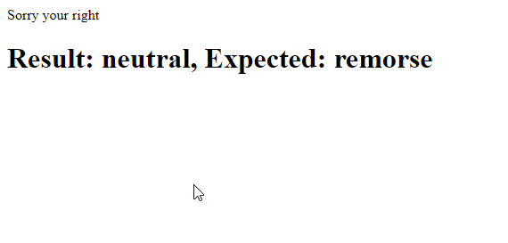

# AI Chatbots With TensorFlow.js: Detecting Emotion in Text


**[Raphael Mun](https://www.codeproject.com/script/Membership/View.aspx?mid=14796281)**

Rate me:


5.00/5 (2 votes)

15 Oct 2020[CPOL](http://www.codeproject.com/info/cpol10.aspx)4 min read

This is the first in a series of article where we'll explain how to create an AI chatbot using transformers.

In this article, you learned how to train an AI model that can compute one of 27 emotions for any English sentence using TensorFlow in your browser.

- [Download Project Code - 9.9 MB](https://www.codeproject.com/KB/AI/5282687/TensorFlowJS_Chatbots.zip)

[TensorFlow](https://www.tensorflow.org/js/) + [JavaScript](https://www.javascript.com/). The most popular, cutting-edge AI framework now supports the [most widely used programming language on the planet](https://www.statista.com/statistics/793628/worldwide-developer-survey-most-used-languages/). Let’s make text and [NLP ](https://en.wikipedia.org/wiki/Natural_language_processing)(Natural Language Processing) chatbot magic happen through Deep Learning right in our web browser, GPU-accelerated via WebGL using TensorFlow.js!


When babies learn their first words, they don’t look up their meaning in a dictionary; they make emotional associations with the expressions. Recognizing emotion in speech is a key piece to understanding natural language. How about we teach a computer to determine emotions within sentences through the power of [Deep Learning](https://machinelearningmastery.com/what-is-deep-learning/)?

You are welcome to [download the project code](https://www.codeproject.com/KB/AI/5282687/TensorFlowJS_Chatbots.zip).

I’m assuming that you are familiar with Tensorflow.js and are comfortable using it to create and train neural networks.

If you are new to TensorFlow.js, I recommend first checking out my guide, [Getting Started with Deep Learning in Your Browser Using TensorFlow.js](https://www.codeproject.com/Articles/5272760/Getting-Started-With-Deep-Learning-in-Your-Browser).

## Setting Up TensorFlow.js Code

This project will run entirely within a web page. Here is a starter template page with TensorFlow.js included and with a section reserved for our code. Let’s add two text elements to this page to show the emotion detection, as well as two utility functions that we will need later.

HTML

Shrink ▲ Copy Code

```html
<html>
  <head>
    <title>
      Detecting Emotion in Text: Chatbots in the Browser with TensorFlow.js
    </title>
    <script src="https://cdn.jsdelivr.net/npm/@tensorflow/tfjs@2.0.0/dist/tf.min.js"></script>
  </head>
  <body>
    <p id="text"></p>
    <h1 id="status">Loading...</h1>
    <script>
      function setText(text) {
        document.getElementById("status").innerText = text;
      }

      function shuffleArray(array) {
        for (let i = array.length - 1; i > 0; i--) {
          const j = Math.floor(Math.random() * (i + 1));
          [array[i], array[j]] = [array[j], array[i]];
        }
      }

      (async () => {
        // Your Code Goes Here
      })();
    </script>
  </body>
</html>
```

## GoEmotion Dataset

The data we’ll use to train our neural network comes from the [GoEmotions dataset](https://arxiv.org/abs/2005.00547) available from the [Google Research GitHub repository](https://github.com/google-research/google-research/tree/master/goemotions). It consists of 58 thousand English Reddit comments labeled with 27 emotion categories. You can use the full set for training if you would like, but we only need a small subset for this project, so downloading [this smaller test set](https://github.com/google-research/google-research/blob/master/goemotions/data/test.tsv) will be sufficient.

Place the file in the project folder where your webpage can retrieve it from the local web server such as `"web"`.

At the top of your script, define a list of emotion categories, which will be used for training and prediction:

HTML

Shrink ▲ Copy Code

```html
const emotions = [ "admiration", "amusement", "anger", "annoyance", "approval",
"caring", "confusion", "curiosity", "desire", "disappointment", "disapproval",
"disgust", "embarrassment", "excitement", "fear", "gratitude", "grief", "joy",
"love", "nervousness", "optimism", "pride", "realization", "relief", "remorse",
"sadness", "surprise", "neutral" ];
```

The test set _.tsv_ file we downloaded contains text lines each of which includes tab-separated elements: a sentence, emotion category identifiers, and a unique sentence identifier. We can load the data and randomize the lines of text in our code like this:

JavaScript

Copy Code

```javascript
(async () => {
  // Load GoEmotions data (https://github.com/google-research/google-research/tree/master/goemotions)
  let data = await fetch("web/emotions.tsv").then((r) => r.text());
  let lines = data.split("\n").filter((x) => !!x); // Split & remove empty lines

  // Randomize the lines
  shuffleArray(lines);
})();
```

## Bag of Words

Before passing sentences to the neural network, they need to be turned into a set of numbers.

A classic, straightforward way for this is to have a full vocabulary of words that we wish to use and to create a vector of length equal to the size of the vocabulary list, where each component maps to one of the words in the list. Then for each unique word in the sentence, we can set the matching component to 1 and the remaining components – to 0.

For example, if you are working with a vocabulary mapping to [ `"deep"`, `"learning"`, `"in"`, `"the"`, `"browser"`, `"detect"`, `"emotion"` ], then the sentence "detect emotion in my browser" would generate a vector of `[ 0, 0, 1, 0, 1, 1, 1 ]`.

In our code, we will take 200 sample lines from the shuffled set of parsed text, create a vocabulary list with it, and generate vectors to use for training. Let’s also generate the expected output classification vectors mapping to the emotion categories for the sentences.

JavaScript

Shrink ▲ Copy Code

```javascript
// Process 200 lines to generate a "bag of words"
const numSamples = 200;
let bagOfWords = {};
let allWords = [];
let wordReference = {};
let sentences = lines.slice(0, numSamples).map((line) => {
  let sentence = line.split("\t")[0];
  return sentence;
});

sentences.forEach((s) => {
  let words = s
    .replace(/[^a-z ]/gi, "")
    .toLowerCase()
    .split(" ")
    .filter((x) => !!x);
  words.forEach((w) => {
    if (!bagOfWords[w]) {
      bagOfWords[w] = 0;
    }
    bagOfWords[w]++; // Counting occurrence just for word frequency fun
  });
});

allWords = Object.keys(bagOfWords);
allWords.forEach((w, i) => {
  wordReference[w] = i;
});

// Generate vectors for sentences
let vectors = sentences.map((s) => {
  let vector = new Array(allWords.length).fill(0);
  let words = s
    .replace(/[^a-z ]/gi, "")
    .toLowerCase()
    .split(" ")
    .filter((x) => !!x);
  words.forEach((w) => {
    if (w in wordReference) {
      vector[wordReference[w]] = 1;
    }
  });
  return vector;
});

let outputs = lines.slice(0, numSamples).map((line) => {
  let categories = line
    .split("\t")[1]
    .split(",")
    .map((x) => parseInt(x));
  let output = [];
  for (let i = 0; i < emotions.length; i++) {
    output.push(categories.includes(i) ? 1 : 0);
  }
  return output;
});
```

## Training the AI Model

Now for the fun part. We can define a model with three hidden layers resulting in a categorical vector with length of 27 (the number of emotion categories) where the index of the maximum value is our predicted emotion identifier.

JavaScript

Copy Code

```javascript
// Define our model with several hidden layers
const model = tf.sequential();
model.add(
  tf.layers.dense({
    units: 100,
    activation: "relu",
    inputShape: [allWords.length],
  })
);
model.add(tf.layers.dense({ units: 50, activation: "relu" }));
model.add(tf.layers.dense({ units: 25, activation: "relu" }));
model.add(
  tf.layers.dense({
    units: emotions.length,
    activation: "softmax",
  })
);

model.compile({
  optimizer: tf.train.adam(),
  loss: "categoricalCrossentropy",
  metrics: ["accuracy"],
});
```

Finally, we can convert our input data to tensors and train the network.

JavaScript

Copy Code

```javascript
const xs = tf.stack(vectors.map((x) => tf.tensor1d(x)));
const ys = tf.stack(outputs.map((x) => tf.tensor1d(x)));
await model.fit(xs, ys, {
  epochs: 50,
  shuffle: true,
  callbacks: {
    onEpochEnd: (epoch, logs) => {
      setText(`Training... Epoch #${epoch} (${logs.acc})`);
      console.log("Epoch #", epoch, logs);
    },
  },
});
```

## Detecting Emotions in Text

It’s time to let the AI work its magic.

To test the trained network, we’ll pick a random line of text from the full list and generate the input vector from the bag of words, then pass it to the model to predict a category. This bit of code will run on a 5-second timer to load a new line of text each time.

JavaScript

Copy Code

```javascript
// Test prediction every 5s
setInterval(async () => {
  // Pick random text
  let line = lines[Math.floor(Math.random() * lines.length)];
  let sentence = line.split("\t")[0];
  let categories = line
    .split("\t")[1]
    .split(",")
    .map((x) => parseInt(x));
  document.getElementById("text").innerText = sentence;

  // Generate vectors for sentences
  let vector = new Array(allWords.length).fill(0);
  let words = sentence
    .replace(/[^a-z ]/gi, "")
    .toLowerCase()
    .split(" ")
    .filter((x) => !!x);
  words.forEach((w) => {
    if (w in wordReference) {
      vector[wordReference[w]] = 1;
    }
  });

  let prediction = await model.predict(tf.stack([tf.tensor1d(vector)])).data();
  // Get the index of the highest value in the prediction
  let id = prediction.indexOf(Math.max(...prediction));
  setText(`Result: ${emotions[id]}, Expected: ${emotions[categories[0]]}`);
}, 5000);
```



## Finish Line

Here is the full code for reference:

HTML

Shrink ▲ Copy Code

```html
<html>
  <head>
    <title>
      Detecting Emotion in Text: Chatbots in the Browser with TensorFlow.js
    </title>
    <script src="https://cdn.jsdelivr.net/npm/@tensorflow/tfjs@2.0.0/dist/tf.min.js"></script>
  </head>
  <body>
    <p id="text"></p>
    <h1 id="status">Loading...</h1>
    <script>
      const emotions = [
        "admiration",
        "amusement",
        "anger",
        "annoyance",
        "approval",
        "caring",
        "confusion",
        "curiosity",
        "desire",
        "disappointment",
        "disapproval",
        "disgust",
        "embarrassment",
        "excitement",
        "fear",
        "gratitude",
        "grief",
        "joy",
        "love",
        "nervousness",
        "optimism",
        "pride",
        "realization",
        "relief",
        "remorse",
        "sadness",
        "surprise",
        "neutral",
      ];

      function setText(text) {
        document.getElementById("status").innerText = text;
      }

      function shuffleArray(array) {
        for (let i = array.length - 1; i > 0; i--) {
          const j = Math.floor(Math.random() * (i + 1));
          [array[i], array[j]] = [array[j], array[i]];
        }
      }

      (async () => {
        // Load GoEmotions data (https://github.com/google-research/google-research/tree/master/goemotions)
        let data = await fetch("web/emotions.tsv").then((r) => r.text());
        let lines = data.split("\n").filter((x) => !!x); // Split & remove empty lines

        // Randomize the lines
        shuffleArray(lines);

        // Process 200 lines to generate a "bag of words"
        const numSamples = 200;
        let bagOfWords = {};
        let allWords = [];
        let wordReference = {};
        let sentences = lines.slice(0, numSamples).map((line) => {
          let sentence = line.split("\t")[0];
          return sentence;
        });

        sentences.forEach((s) => {
          let words = s
            .replace(/[^a-z ]/gi, "")
            .toLowerCase()
            .split(" ")
            .filter((x) => !!x);
          words.forEach((w) => {
            if (!bagOfWords[w]) {
              bagOfWords[w] = 0;
            }
            bagOfWords[w]++; // Counting occurrence just for word frequency fun
          });
        });

        allWords = Object.keys(bagOfWords);
        allWords.forEach((w, i) => {
          wordReference[w] = i;
        });

        // Generate vectors for sentences
        let vectors = sentences.map((s) => {
          let vector = new Array(allWords.length).fill(0);
          let words = s
            .replace(/[^a-z ]/gi, "")
            .toLowerCase()
            .split(" ")
            .filter((x) => !!x);
          words.forEach((w) => {
            if (w in wordReference) {
              vector[wordReference[w]] = 1;
            }
          });
          return vector;
        });

        let outputs = lines.slice(0, numSamples).map((line) => {
          let categories = line
            .split("\t")[1]
            .split(",")
            .map((x) => parseInt(x));
          let output = [];
          for (let i = 0; i < emotions.length; i++) {
            output.push(categories.includes(i) ? 1 : 0);
          }
          return output;
        });

        // Define our model with several hidden layers
        const model = tf.sequential();
        model.add(
          tf.layers.dense({
            units: 100,
            activation: "relu",
            inputShape: [allWords.length],
          })
        );
        model.add(tf.layers.dense({ units: 50, activation: "relu" }));
        model.add(tf.layers.dense({ units: 25, activation: "relu" }));
        model.add(
          tf.layers.dense({
            units: emotions.length,
            activation: "softmax",
          })
        );

        model.compile({
          optimizer: tf.train.adam(),
          loss: "categoricalCrossentropy",
          metrics: ["accuracy"],
        });

        const xs = tf.stack(vectors.map((x) => tf.tensor1d(x)));
        const ys = tf.stack(outputs.map((x) => tf.tensor1d(x)));
        await model.fit(xs, ys, {
          epochs: 50,
          shuffle: true,
          callbacks: {
            onEpochEnd: (epoch, logs) => {
              setText(`Training... Epoch #${epoch} (${logs.acc})`);
              console.log("Epoch #", epoch, logs);
            },
          },
        });

        // Test prediction every 5s
        setInterval(async () => {
          // Pick random text
          let line = lines[Math.floor(Math.random() * lines.length)];
          let sentence = line.split("\t")[0];
          let categories = line
            .split("\t")[1]
            .split(",")
            .map((x) => parseInt(x));
          document.getElementById("text").innerText = sentence;

          // Generate vectors for sentences
          let vector = new Array(allWords.length).fill(0);
          let words = sentence
            .replace(/[^a-z ]/gi, "")
            .toLowerCase()
            .split(" ")
            .filter((x) => !!x);
          words.forEach((w) => {
            if (w in wordReference) {
              vector[wordReference[w]] = 1;
            }
          });

          let prediction = await model
            .predict(tf.stack([tf.tensor1d(vector)]))
            .data();
          // Get the index of the highest value in the prediction
          let id = prediction.indexOf(Math.max(...prediction));
          setText(
            `Result: ${emotions[id]}, Expected: ${emotions[categories[0]]}`
          );
        }, 5000);
      })();
    </script>
  </body>
</html>
```

## What’s Next?

In this article, you learned how to train an AI model that can compute one of 27 emotions for any English sentence using TensorFlow in your browser. Try increasing the `numSamples` from 200 to 1,000, or perhaps even the entire list, and see if your emotion detector improves its accuracy. Now, what if we want our neural network to parse text and categorize to many more than 27?

Follow along the next article in this series, [Training a Trivia Expert Chatbot in the Browser with TensorFlow.js](https://www.codeproject.com/Articles/5282688/AI-Chatbots-With-TensorFlow-js-Training-a-Trivia-E)!


This article is part of the series 'AI Chatbot with Tensorflow[View All](https://www.codeproject.com/script/Content/ViewReadingList.aspx?rlid=29)
