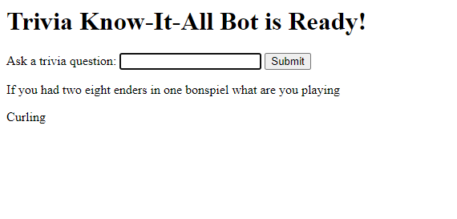

# AI Chatbots With TensorFlow.js: Training a Trivia Expert AI


**[Raphael Mun](https://www.codeproject.com/script/Membership/View.aspx?mid=14796281)**

Rate me:


5.00/5 (2 votes)

16 Oct 2020[CPOL](http://www.codeproject.com/info/cpol10.aspx)4 min read

In this article, we’ll build a trivia chatbot.

Here we'll be using an RNN, creating a Deep Learning chatbot to identify questions and give us answers from a large catalog of trivia question/answer pairs right in the browser.

- [Download Project Files - 9.9 MB](https://www.codeproject.com/KB/AI/5282688/TensorFlowJS_Chatbots.zip)

[TensorFlow](https://www.tensorflow.org/js/) + [JavaScript](https://www.javascript.com/). The most popular, cutting-edge AI framework now supports the [most widely used programming language on the planet](https://www.statista.com/statistics/793628/worldwide-developer-survey-most-used-languages/). So let’s make text and [NLP ](https://en.wikipedia.org/wiki/Natural_language_processing)(Natural Language Processing) chatbot magic happen through Deep Learning right in our web browser, GPU-accelerated via WebGL using TensorFlow.js!

You are welcome to download the project code.

In the previous article, we took you through the process of training an AI model that can compute one of 27 emotions for any English sentence using TensorFlow in your browser. In this one, we’ll build a trivia chatbot.



Answering trivia questions well requires knowing countless facts and being able to accurately recall the relevant knowledge. What a great opportunity to use a computer’s brain!

Let’s train a chatbot to give us the answers to hundreds of different trivia questions using a Recurrent Neural Network (RNN).

## Setting Up TensorFlow.js Code

In this project, we will interact with the chatbot, so let’s add some input elements and text responses from the bot to our template web page.

HTML

Copy Code

```html
<html>
  <head>
    <title>
      Trivia Know-It-All: Chatbots in the Browser with TensorFlow.js
    </title>
    <script src="https://cdn.jsdelivr.net/npm/@tensorflow/tfjs@2.0.0/dist/tf.min.js"></script>
  </head>
  <body>
    <h1 id="status">Trivia Know-It-All Bot</h1>
    <label>Ask a trivia question:</label>
    <input id="question" type="text" />
    <button id="submit">Submit</button>
    <p id="bot-question"></p>
    <p id="bot-answer"></p>
    <script>
      function setText(text) {
        document.getElementById("status").innerText = text;
      }

      (async () => {
        // Your Code Goes Here
      })();
    </script>
  </body>
</html>
```

## TriviaQA Dataset

The data we’ll use to train our neural network is from the [TriviaQA dataset](http://nlp.cs.washington.edu/triviaqa/) made available by the University of Washington. There are 95 thousand trivia question-answer pairs in a whopping 2.5 GB compressed file for download.

For now, we’ll use a smaller subset, `verified-wikipedia-dev.json`, that is included in this project’s sample code.

The TriviaQA JSON file consists of a Data array with individual Q&A elements that look similar to the following [sample file](https://github.com/mandarjoshi90/triviaqa/blob/master/samples/triviaqa_sample.json):

JavaScript

Shrink ▲ Copy Code

```javascript
{
  "Data": [
    {
      "Answer": {
        "Aliases": [
          "Sunset Blvd",
          "West Sunset Boulevard",
          "Sunset Boulevard",
          "Sunset Bulevard",
          "Sunset Blvd."
        ],
        "MatchedWikiEntityName": "Sunset Boulevard",
        "NormalizedAliases": [
          "west sunset boulevard",
          "sunset blvd",
          "sunset boulevard",
          "sunset bulevard"
        ],
        "NormalizedMatchedWikiEntityName": "sunset boulevard",
        "NormalizedValue": "sunset boulevard",
        "Type": "WikipediaEntity",
        "Value": "Sunset Boulevard"
      },
      "EntityPages": [
        {
          "DocSource": "TagMe",
          "Filename": "Andrew_Lloyd_Webber.txt",
          "LinkProbability": "0.02934",
          "Rho": "0.22520",
          "Title": "Andrew Lloyd Webber"
        }
      ],
      "Question": "Which Lloyd Webber musical premiered in the US on 10th December 1993?",
      "QuestionId": "tc_33",
      "QuestionSource": "http://www.triviacountry.com/",
      "SearchResults": [
        {
          "Description": "The official website for Andrew Lloyd Webber, ... from the Andrew Lloyd Webber/Jim Steinman musical Whistle ... American premiere on 9th December 1993 at the ...",
          "DisplayUrl": "www.andrewlloydwebber.com",
          "Filename": "35/35_995.txt",
          "Rank": 0,
          "Title": "Andrew Lloyd Webber | The official website for Andrew ...",
          "Url": "http://www.andrewlloydwebber.com/"
        }
      ]
    }
  ],
  "Domain": "Web",
  "VerifiedEval": false,
  "Version": 1.0
}
```

We can load the data in our code like this:

JavaScript

Copy Code

```javascript
(async () => {
  // Load TriviaQA data
  let triviaData = await fetch("web/verified-wikipedia-dev.json").then((r) =>
    r.json()
  );
  let data = triviaData.Data;

  // Process all QA to map to answers
  let questions = data.map((qa) => qa.Question);
})();
```

## Word Embedding and Tokenizing

With these trivia questions, and with the English sentences in general, the position and order of the words can impact the meaning. Because of this, we can’t simply use a "bag of words" that does not preserve the word positional information when turning a sentence into a vector. That’s why we’ll use a method called `word embedding`, and create a list of word indices representing the word and its position when preparing our training data.

First, we’ll go through all the available data and identify each unique word across all of the questions, just as we would do when preparing a bag of words. We want to add +1 to the index in `wordReference` to reserve the index 0 as a padding token in TensorFlow.

JavaScript

Copy Code

```javascript
let bagOfWords = {};
let allWords = [];
let wordReference = {};
questions.forEach((q) => {
  let words = q
    .replace(/[^a-z ]/gi, "")
    .toLowerCase()
    .split(" ")
    .filter((x) => !!x);
  words.forEach((w) => {
    if (!bagOfWords[w]) {
      bagOfWords[w] = 0;
    }
    bagOfWords[w]++; // Counting occurrence just for word frequency fun
  });
});

allWords = Object.keys(bagOfWords);
allWords.forEach((w, i) => {
  wordReference[w] = i + 1;
});
```

After we have a full vocabulary list that includes all our words and their indices, we can take each question sentence and create an array of positive integers that correspond to each word’s index. We need to make sure that the input vectors (entering the network) are of the same length. We can limit sentences to a maximum count of 30 words, and any question containing fewer than 30 words can set a zero index to represent empty padding.

Let’s also generate the expected output classification vectors mapping to each of the different question-answer pairs.

JavaScript

Shrink ▲ Copy Code

```javascript
// Create a tokenized vector for each question
const maxSentenceLength = 30;
let vectors = [];
questions.forEach((q) => {
  let qVec = [];
  // Use a regex to only get spaces and letters and remove any blank elements
  let words = q
    .replace(/[^a-z ]/gi, "")
    .toLowerCase()
    .split(" ")
    .filter((x) => !!x);
  for (let i = 0; i < maxSentenceLength; i++) {
    if (words[i]) {
      qVec.push(wordReference[words[i]]);
    } else {
      // Add padding to keep the vectors the same length
      qVec.push(0);
    }
  }
  vectors.push(qVec);
});

let outputs = questions.map((q, index) => {
  let output = [];
  for (let i = 0; i < questions.length; i++) {
    output.push(i === index ? 1 : 0);
  }
  return output;
});
```

## Training the AI Model

TensorFlow provides an [embedding layer type](https://js.tensorflow.org/api/latest/#layers.embedding) for tokenized vectors like the one we just created, and for turning them into dense vectors ready for the neural net. We are making use of an RNN architecture because the sequence of words matter in each question. We can train the neural network with a simple RNN layer, or with a bidirectional one. Feel free to uncomment/comment the code lines and experiment with one or the other.

The network should return a categorical vector where the index of the maximum value will correspond to the index of the question-answer pair. The finished setup of the model should look like this:

JavaScript

Copy Code

```javascript
// Define our RNN model with several hidden layers
const model = tf.sequential();
// Add 1 to inputDim for the "padding" character
model.add(
  tf.layers.embedding({
    inputDim: allWords.length + 1,
    outputDim: 128,
    inputLength: maxSentenceLength,
  })
);
// model.add(tf.layers.simpleRNN( { units: 32 } ) );
model.add(
  tf.layers.bidirectional({
    layer: tf.layers.simpleRNN({ units: 32 }),
    mergeMode: "concat",
  })
);
model.add(tf.layers.dense({ units: 50 }));
model.add(tf.layers.dense({ units: 25 }));
model.add(
  tf.layers.dense({
    units: questions.length,
    activation: "softmax",
  })
);

model.compile({
  optimizer: tf.train.adam(),
  loss: "categoricalCrossentropy",
  metrics: ["accuracy"],
});
```

Finally, we can convert our input data to tensors and train the network.

JavaScript

Copy Code

```javascript
const xs = tf.stack(vectors.map((x) => tf.tensor1d(x)));
const ys = tf.stack(outputs.map((x) => tf.tensor1d(x)));
await model.fit(xs, ys, {
  epochs: 20,
  shuffle: true,
  callbacks: {
    onEpochEnd: (epoch, logs) => {
      setText(`Training... Epoch #${epoch} (${logs.acc})`);
      console.log("Epoch #", epoch, logs);
    },
  },
});
```

## Trivia Chatbot In Action

We’re almost ready.

To test our chatbot, we need to be able to "talk" to it by submitting questions and having it respond with answers. Let’s notify the user when the bot has been trained and ready, and handle user input:

JavaScript

Copy Code

```javascript
setText("Trivia Know-It-All Bot is Ready!");

document.getElementById("question").addEventListener("keyup", function (event) {
  // Number 13 is the "Enter" key on the keyboard
  if (event.keyCode === 13) {
    // Cancel the default action, if needed
    event.preventDefault();
    // Trigger the button element with a click
    document.getElementById("submit").click();
  }
});

document
  .getElementById("submit")
  .addEventListener("click", async function (event) {
    let text = document.getElementById("question").value;
    document.getElementById("question").value = "";
    // Our prediction code will go here
  });
```

Finally, inside our "click" event handler, we can tokenize the user-submitted question just as we did with the training questions. We can then let the model work its magic to predict which question is the one most likely being asked and show both the trivia question and the answer.

When testing the chatbot, you may notice that the order of the words seems to matter a bit too much, or that the first word in your question significantly affects its output. We will improve on this in the next article. In the meantime, you can address this by using another method, called `Attention`, to train the bot to weigh certain words more than others.

If you’d like to learn more about it, I recommend checking out [this visualized article](https://jalammar.github.io/visualizing-neural-machine-translation-mechanics-of-seq2seq-models-with-attention/) on how Attention can be useful in sequence-to-sequence models.


## Finish Line

And now here is our full code:

HTML

Shrink ▲ Copy Code

```html
<html>
  <head>
    <title>
      Trivia Know-It-All: Chatbots in the Browser with TensorFlow.js
    </title>
    <script src="https://cdn.jsdelivr.net/npm/@tensorflow/tfjs@2.0.0/dist/tf.min.js"></script>
  </head>
  <body>
    <h1 id="status">Trivia Know-It-All Bot</h1>
    <label>Ask a trivia question:</label>
    <input id="question" type="text" />
    <button id="submit">Submit</button>
    <p id="bot-question"></p>
    <p id="bot-answer"></p>
    <script>
      function setText(text) {
        document.getElementById("status").innerText = text;
      }

      (async () => {
        // Load TriviaQA data
        let triviaData = await fetch("web/verified-wikipedia-dev.json").then(
          (r) => r.json()
        );
        let data = triviaData.Data;

        // Process all QA to map to answers
        let questions = data.map((qa) => qa.Question);

        let bagOfWords = {};
        let allWords = [];
        let wordReference = {};
        questions.forEach((q) => {
          let words = q
            .replace(/[^a-z ]/gi, "")
            .toLowerCase()
            .split(" ")
            .filter((x) => !!x);
          words.forEach((w) => {
            if (!bagOfWords[w]) {
              bagOfWords[w] = 0;
            }
            bagOfWords[w]++; // Counting occurrence just for word frequency fun
          });
        });

        allWords = Object.keys(bagOfWords);
        allWords.forEach((w, i) => {
          wordReference[w] = i + 1;
        });

        // Create a tokenized vector for each question
        const maxSentenceLength = 30;
        let vectors = [];
        questions.forEach((q) => {
          let qVec = [];
          // Use a regex to only get spaces and letters and remove any blank elements
          let words = q
            .replace(/[^a-z ]/gi, "")
            .toLowerCase()
            .split(" ")
            .filter((x) => !!x);
          for (let i = 0; i < maxSentenceLength; i++) {
            if (words[i]) {
              qVec.push(wordReference[words[i]]);
            } else {
              // Add padding to keep the vectors the same length
              qVec.push(0);
            }
          }
          vectors.push(qVec);
        });

        let outputs = questions.map((q, index) => {
          let output = [];
          for (let i = 0; i < questions.length; i++) {
            output.push(i === index ? 1 : 0);
          }
          return output;
        });

        // Define our RNN model with several hidden layers
        const model = tf.sequential();
        // Add 1 to inputDim for the "padding" character
        model.add(
          tf.layers.embedding({
            inputDim: allWords.length + 1,
            outputDim: 128,
            inputLength: maxSentenceLength,
            maskZero: true,
          })
        );
        model.add(tf.layers.simpleRNN({ units: 32 }));
        // model.add(tf.layers.bidirectional( { layer: tf.layers.simpleRNN( { units: 32 } ), mergeMode: "concat" } ) );
        model.add(tf.layers.dense({ units: 50 }));
        model.add(tf.layers.dense({ units: 25 }));
        model.add(
          tf.layers.dense({
            units: questions.length,
            activation: "softmax",
          })
        );

        model.compile({
          optimizer: tf.train.adam(),
          loss: "categoricalCrossentropy",
          metrics: ["accuracy"],
        });

        const xs = tf.stack(vectors.map((x) => tf.tensor1d(x)));
        const ys = tf.stack(outputs.map((x) => tf.tensor1d(x)));
        await model.fit(xs, ys, {
          epochs: 20,
          shuffle: true,
          callbacks: {
            onEpochEnd: (epoch, logs) => {
              setText(`Training... Epoch #${epoch} (${logs.acc})`);
              console.log("Epoch #", epoch, logs);
            },
          },
        });

        setText("Trivia Know-It-All Bot is Ready!");

        document
          .getElementById("question")
          .addEventListener("keyup", function (event) {
            // Number 13 is the "Enter" key on the keyboard
            if (event.keyCode === 13) {
              // Cancel the default action, if needed
              event.preventDefault();
              // Trigger the button element with a click
              document.getElementById("submit").click();
            }
          });

        document
          .getElementById("submit")
          .addEventListener("click", async function (event) {
            let text = document.getElementById("question").value;
            document.getElementById("question").value = "";

            // Run the calculation things
            let qVec = [];
            let words = text
              .replace(/[^a-z ]/gi, "")
              .toLowerCase()
              .split(" ")
              .filter((x) => !!x);
            for (let i = 0; i < maxSentenceLength; i++) {
              if (words[i]) {
                qVec.push(wordReference[words[i]]);
              } else {
                // Add padding to keep the vectors the same length
                qVec.push(0);
              }
            }

            let prediction = await model
              .predict(tf.stack([tf.tensor1d(qVec)]))
              .data();
            // Get the index of the highest value in the prediction
            let id = prediction.indexOf(Math.max(...prediction));

            document.getElementById("bot-question").innerText = questions[id];
            document.getElementById("bot-answer").innerText =
              data[id].Answer.Value;
          });
      })();
    </script>
  </body>
</html>
```

## What’s Next?

Using an RNN, we created a Deep Learning chatbot to identify questions and give us answers from a large catalog of trivia question/answer pairs right in the browser. Next, we are going to look at embedding entire sentences, rather than individual words, so that we can get much more accurate results in detecting emotion from the text.

Join me in the next article in this series, [Improved Text Emotion Detection in the Browser with TensorFlow.js](https://www.codeproject.com/Articles/5282690/AI-Chatbots-With-TensorFlow-js-Improved-Emotion-De).


This article is part of the series 'AI Chatbot with Tensorflow[◁ Prev](https://www.codeproject.com/Articles/5282687/AI-Chatbots-With-TensorFlow-js-Detecting-Emotion-i)[View All](https://www.codeproject.com/script/Content/ViewReadingList.aspx?rlid=29)[Next ▷](https://www.codeproject.com/Articles/5282690/AI-Chatbots-With-TensorFlow-js-Improved-Emotion-De)

## License

This article, along with any associated source code and files, is licensed under [The Code Project Open License (CPOL)](http://www.codeproject.com/info/cpol10.aspx)
