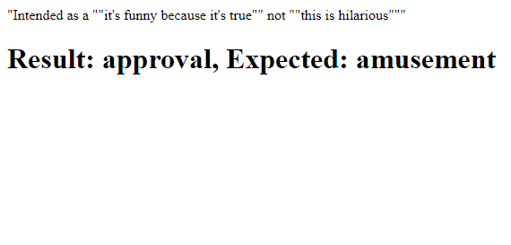

# AI Chatbots With TensorFlow.js: Improved Emotion Detection in Text


**[Raphael Mun](https://www.codeproject.com/script/Membership/View.aspx?mid=14796281)**

Rate me:


5.00/5 (3 votes)

19 Oct 2020[CPOL](http://www.codeproject.com/info/cpol10.aspx)4 min read

In this article we are going to look at embedding entire sentences, rather than individual words, so that we can get much more accurate results in detecting emotion from the text.

Here, by leveraging the powerful Universal Sentence Encoder library built on the transformer architecture, we will improve our model’s ability to comprehend sentences and distinguish between them.

- [Download Project Code - 9.9 MB](https://www.codeproject.com/KB/AI/5282690/TensorFlowJS_Chatbots.zip)

[TensorFlow](https://www.tensorflow.org/js/) + [JavaScript](https://www.javascript.com/). The most popular, cutting-edge AI framework now supports the [most widely used programming language on the planet](https://www.statista.com/statistics/793628/worldwide-developer-survey-most-used-languages/). So let’s make text and [NLP ](https://en.wikipedia.org/wiki/Natural_language_processing)(Natural Language Processing) chatbot magic happen through Deep Learning right in our web browser, GPU-accelerated via WebGL using TensorFlow.js!

You are welcome to download the [project code](https://www.codeproject.com/KB/AI/5282690/TensorFlowJS_Chatbots.zip).


In our first version of text emotion detection, we simply marked which words were contained in the sentence from a vocabulary "bag of words" to train our neural network. This method has some drawbacks that might be already evident to you.

One word can have drastically different meanings depending on its context. For example, phrases `"this strange seashell is pretty"` and `"this seashell is pretty strange"` have different meanings that would be hidden in just a collection of the words: `[ "is"`, `"pretty"`, `"seashell"`, `"strange"`, `"this"` ].

This is where transformers can come in handy. Transformers are behind the state-of-the-art neural network architecture running famous text generation models like GPT-2 and GPT-3, as well as the latest breakthroughs in high-quality language translations. It is also the technology powering the sentence-level embedding functionality that we’ll use to improve our emotion detection.

Some great resources explain transformers in-depth. For this project, it will be enough to know that they are a neural network model that analyzes both the word and its position in a sentence to infer its meaning and importance. If you are interested in reading up on transformers, here are some places you can start:

- [How Transformers Work](https://towardsdatascience.com/transformers-141e32e69591) – a guide to transformers
- [All You Need Is Attention](https://arxiv.org/abs/1706.03762) – a published paper on transformers
- [The Illustrated Transformer](https://jalammar.github.io/illustrated-transformer/) – a visual guide to transformers

## Setting Up TensorFlow.js Code with Universal Sentence Encoder

This project is very similar to our first emotion detection code, so let’s use the initial codebase as our starting point, with the word embeddings and prediction parts removed. We’ll add one important and incredibly powerful library here, _Universal Sentence Encoder_, which is a pre-trained transformer-based language processing model. This library is what we will use to generate much more meaningful input vectors for the AI from the text.

HTML

Shrink ▲ Copy Code

```html
<html>
  <head>
    <title>
      Detecting Emotion in Text: Chatbots in the Browser with TensorFlow.js
    </title>
    <script src="https://cdn.jsdelivr.net/npm/@tensorflow/tfjs@2.0.0/dist/tf.min.js"></script>
    <script src="https://cdn.jsdelivr.net/npm/@tensorflow-models/universal-sentence-encoder"></script>
  </head>
  <body>
    <p id="text"></p>
    <h1 id="status">Loading...</h1>
    <script>
      const emotions = [
        "admiration",
        "amusement",
        "anger",
        "annoyance",
        "approval",
        "caring",
        "confusion",
        "curiosity",
        "desire",
        "disappointment",
        "disapproval",
        "disgust",
        "embarrassment",
        "excitement",
        "fear",
        "gratitude",
        "grief",
        "joy",
        "love",
        "nervousness",
        "optimism",
        "pride",
        "realization",
        "relief",
        "remorse",
        "sadness",
        "surprise",
        "neutral",
      ];

      function setText(text) {
        document.getElementById("status").innerText = text;
      }

      function shuffleArray(array) {
        for (let i = array.length - 1; i > 0; i--) {
          const j = Math.floor(Math.random() * (i + 1));
          [array[i], array[j]] = [array[j], array[i]];
        }
      }

      (async () => {
        // Load GoEmotions data (https://github.com/google-research/google-research/tree/master/goemotions)
        let data = await fetch("web/emotions.tsv").then((r) => r.text());
        let lines = data.split("\n").filter((x) => !!x); // Split & remove empty lines

        // Randomize the lines
        shuffleArray(lines);

        const numSamples = 200;
        let sentences = lines.slice(0, numSamples).map((line) => {
          let sentence = line.split("\t")[0];
          return sentence;
        });
        let outputs = lines.slice(0, numSamples).map((line) => {
          let categories = line
            .split("\t")[1]
            .split(",")
            .map((x) => parseInt(x));
          let output = [];
          for (let i = 0; i < emotions.length; i++) {
            output.push(categories.includes(i) ? 1 : 0);
          }
          return output;
        });

        // TODO: Generate Training Input

        // Define our model with several hidden layers
        const model = tf.sequential();
        model.add(
          tf.layers.dense({ units: 100, activation: "relu", inputShape: [512] })
        );
        model.add(tf.layers.dense({ units: 50, activation: "relu" }));
        model.add(tf.layers.dense({ units: 25, activation: "relu" }));
        model.add(
          tf.layers.dense({
            units: emotions.length,
            activation: "softmax",
          })
        );

        model.compile({
          optimizer: tf.train.adam(),
          loss: "categoricalCrossentropy",
          metrics: ["accuracy"],
        });

        const xs = tf.stack(vectors.map((x) => tf.tensor1d(x)));
        const ys = tf.stack(outputs.map((x) => tf.tensor1d(x)));
        await model.fit(xs, ys, {
          epochs: 100,
          shuffle: true,
          callbacks: {
            onEpochEnd: (epoch, logs) => {
              setText(`Training... Epoch #${epoch} (${logs.acc})`);
              console.log("Epoch #", epoch, logs);
            },
          },
        });

        // Test prediction every 5s
        setInterval(async () => {
          // Pick random text
          let line = lines[Math.floor(Math.random() * lines.length)];
          let sentence = line.split("\t")[0];
          let categories = line
            .split("\t")[1]
            .split(",")
            .map((x) => parseInt(x));
          document.getElementById("text").innerText = sentence;

          // TODO: Add Model Prediction Code

          // let prediction = await model.predict( tf.stack( [ tf.tensor1d( vector ) ] ) ).data();
          // Get the index of the highest value in the prediction
          // let id = prediction.indexOf( Math.max( ...prediction ) );
          // setText( `Result: ${emotions[ id ]}, Expected: ${emotions[ categories[ 0 ] ]}` );
        }, 5000);
      })();
    </script>
  </body>
</html>
```

## GoEmotion Dataset

We’ll use the same data we’d used in the first version, from the [GoEmotions dataset](https://arxiv.org/abs/2005.00547) available on the [Google Research GitHub repository](https://github.com/google-research/google-research/tree/master/goemotions), to train our neural network. It consists of 58 thousand English Reddit comments labeled with 27 emotion categories. You can use the full set if you’d like, but we only need a small subset for this project, so downloading [this smaller test set](https://github.com/google-research/google-research/blob/master/goemotions/data/test.tsv) will work. Place the downloaded file in the project folder where your web page can retrieve it from the local web server such as `"web"`.

## Universal Sentence Encoder

[Universal Sentence Encoder](https://github.com/tensorflow/tfjs-models/tree/master/universal-sentence-encoder) (USE) is "a [pre-trained] model that encodes text into 512-dimensional embeddings." It’s based on the transformer architecture, and has been trained on a vocabulary of 8 thousand words that generate embeddings (sentence encoding vectors) that can map any sentence by how similar it is to any other potential sentence. As I mentioned earlier, using transformers, this model takes into account not just the words in the sentence but also their position and significance.

We can generate a unique ID for any sentence while calculating how similar it is to other sentences. This ability is quite powerful for NLP tasks because we can combine textual datasets with the embeddings as input into our neural networks to learn and extract different characteristics, such as inferring emotion from the text .

The USE is quite easy and straightforward to work with. Let’s load it up in our code before we define our network model and generate embeddings for each of the sentences.

JavaScript

Copy Code

```javascript
// Load the universal sentence encoder
setText("Loading USE...");
let encoder = await use.load();
setText("Loaded!");
let embeddings = await encoder.embed(sentences);
```

## Training the AI Model

We don’t have to change our model at all - but here it is again, to refresh your memory.

We define a network with three hidden layers outputting a categorical vector with a length of 27 (the number of emotion categories), where the index of the maximum value is our predicted emotion identifier.

JavaScript

Copy Code

```javascript
// Define our model with several hidden layers
const model = tf.sequential();
model.add(
  tf.layers.dense({
    units: 100,
    activation: "relu",
    inputShape: [allWords.length],
  })
);
model.add(tf.layers.dense({ units: 50, activation: "relu" }));
model.add(tf.layers.dense({ units: 25, activation: "relu" }));
model.add(
  tf.layers.dense({
    units: emotions.length,
    activation: "softmax",
  })
);

model.compile({
  optimizer: tf.train.adam(),
  loss: "categoricalCrossentropy",
  metrics: ["accuracy"],
});
```

And we can update the training input to directly take the sentence embeddings because they are already returned as tensors.

JavaScript

Copy Code

```javascript
const xs = embeddings;
const ys = tf.stack(outputs.map((x) => tf.tensor1d(x)));
await model.fit(xs, ys, {
  epochs: 50,
  shuffle: true,
  callbacks: {
    onEpochEnd: (epoch, logs) => {
      setText(`Training... Epoch #${epoch} (${logs.acc})`);
      console.log("Epoch #", epoch, logs);
    },
  },
});
```

## Let’s Detect Emotions

It’s time to see how well our upgraded emotion detector performs.

Inside the 5-second timer where we predict the emotion category, we can now generate a sentence embedding with USE for input.

Here’s what that looks like.

JavaScript

Copy Code

```javascript
// Test prediction every 5s
setInterval(async () => {
  // Pick random text
  let line = lines[Math.floor(Math.random() * lines.length)];
  let sentence = line.split("\t")[0];
  let categories = line
    .split("\t")[1]
    .split(",")
    .map((x) => parseInt(x));
  document.getElementById("text").innerText = sentence;

  let vector = await encoder.embed([sentence]);
  let prediction = await model.predict(vector).data();
  // Get the index of the highest value in the prediction
  let id = prediction.indexOf(Math.max(...prediction));
  setText(`Result: ${emotions[id]}, Expected: ${emotions[categories[0]]}`);
}, 5000);
```



## Finish Line

That’s all. Are you impressed yet? Here is our final code:

HTML

Shrink ▲ Copy Code

```html
<html>
  <head>
    <title>
      Detecting Emotion in Text: Chatbots in the Browser with TensorFlow.js
    </title>
    <script src="https://cdn.jsdelivr.net/npm/@tensorflow/tfjs@2.0.0/dist/tf.min.js"></script>
    <script src="https://cdn.jsdelivr.net/npm/@tensorflow-models/universal-sentence-encoder"></script>
  </head>
  <body>
    <p id="text"></p>
    <h1 id="status">Loading...</h1>
    <script>
      const emotions = [
        "admiration",
        "amusement",
        "anger",
        "annoyance",
        "approval",
        "caring",
        "confusion",
        "curiosity",
        "desire",
        "disappointment",
        "disapproval",
        "disgust",
        "embarrassment",
        "excitement",
        "fear",
        "gratitude",
        "grief",
        "joy",
        "love",
        "nervousness",
        "optimism",
        "pride",
        "realization",
        "relief",
        "remorse",
        "sadness",
        "surprise",
        "neutral",
      ];

      function setText(text) {
        document.getElementById("status").innerText = text;
      }

      function shuffleArray(array) {
        for (let i = array.length - 1; i > 0; i--) {
          const j = Math.floor(Math.random() * (i + 1));
          [array[i], array[j]] = [array[j], array[i]];
        }
      }

      (async () => {
        // Load GoEmotions data (https://github.com/google-research/google-research/tree/master/goemotions)
        let data = await fetch("web/emotions.tsv").then((r) => r.text());
        let lines = data.split("\n").filter((x) => !!x); // Split & remove empty lines

        // Randomize the lines
        shuffleArray(lines);

        const numSamples = 200;
        let sentences = lines.slice(0, numSamples).map((line) => {
          let sentence = line.split("\t")[0];
          return sentence;
        });
        let outputs = lines.slice(0, numSamples).map((line) => {
          let categories = line
            .split("\t")[1]
            .split(",")
            .map((x) => parseInt(x));
          let output = [];
          for (let i = 0; i < emotions.length; i++) {
            output.push(categories.includes(i) ? 1 : 0);
          }
          return output;
        });

        // Load the universal sentence encoder
        setText("Loading USE...");
        let encoder = await use.load();
        setText("Loaded!");
        let embeddings = await encoder.embed(sentences);

        // Define our model with several hidden layers
        const model = tf.sequential();
        model.add(
          tf.layers.dense({ units: 100, activation: "relu", inputShape: [512] })
        );
        model.add(tf.layers.dense({ units: 50, activation: "relu" }));
        model.add(tf.layers.dense({ units: 25, activation: "relu" }));
        model.add(
          tf.layers.dense({
            units: emotions.length,
            activation: "softmax",
          })
        );

        model.compile({
          optimizer: tf.train.adam(),
          loss: "categoricalCrossentropy",
          metrics: ["accuracy"],
        });

        const xs = embeddings;
        const ys = tf.stack(outputs.map((x) => tf.tensor1d(x)));
        await model.fit(xs, ys, {
          epochs: 50,
          shuffle: true,
          callbacks: {
            onEpochEnd: (epoch, logs) => {
              setText(`Training... Epoch #${epoch} (${logs.acc})`);
              console.log("Epoch #", epoch, logs);
            },
          },
        });

        // Test prediction every 5s
        setInterval(async () => {
          // Pick random text
          let line = lines[Math.floor(Math.random() * lines.length)];
          let sentence = line.split("\t")[0];
          let categories = line
            .split("\t")[1]
            .split(",")
            .map((x) => parseInt(x));
          document.getElementById("text").innerText = sentence;

          let vector = await encoder.embed([sentence]);
          let prediction = await model.predict(vector).data();
          // Get the index of the highest value in the prediction
          let id = prediction.indexOf(Math.max(...prediction));
          setText(
            `Result: ${emotions[id]}, Expected: ${emotions[categories[0]]}`
          );
        }, 5000);
      })();
    </script>
  </body>
</html>
```

## What’s Next?

By leveraging the powerful Universal Sentence Encoder library built on the transformer architecture, we improved our model’s ability to comprehend sentences and distinguish between them. Could this also apply to answering trivia questions?

Find out in the next article of this series, [Improved Trivia Expert: Chatbots in the Browser with TensorFlow.js](https://www.codeproject.com/Articles/5282692/AI-Chatbots-With-TensorFlow-js-Improved-Trivia-Exp).


This article is part of the series 'AI Chatbot with Tensorflow[◁ Prev](https://www.codeproject.com/Articles/5282688/AI-Chatbots-With-TensorFlow-js-Training-a-Trivia-E)[View All](https://www.codeproject.com/script/Content/ViewReadingList.aspx?rlid=29)[Next ▷](https://www.codeproject.com/Articles/5282692/AI-Chatbots-With-TensorFlow-js-Improved-Trivia-Exp)

## License

This article, along with any associated source code and files, is licensed under [The Code Project Open License (CPOL)](http://www.codeproject.com/info/cpol10.aspx)
