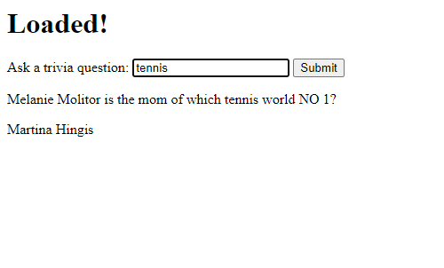

# AI Chatbots With TensorFlow.js: Improved Trivia Expert


**[Raphael Mun](https://www.codeproject.com/script/Membership/View.aspx?mid=14796281)**

Rate me:


5.00/5 (1 vote)

20 Oct 2020[CPOL](http://www.codeproject.com/info/cpol10.aspx)3 min read

In this article we will create a knowledge chatbot.

Here we’ll add Universal Sentence Encoder (USE), which is a pre-trained transformer-based language processing model. This is what we’ll use to determine the matching trivia question for the chatbot. We’ll also add two utility functions, to help us determine sentence similarity.

- [Download Project Code - 9.9 MB](https://www.codeproject.com/KB/AI/5282692/TensorFlowJS_Chatbots.zip)

[TensorFlow](https://www.tensorflow.org/js/) + [JavaScript](https://www.javascript.com/). The most popular, cutting-edge AI framework now supports the [most widely used programming language on the planet](https://www.statista.com/statistics/793628/worldwide-developer-survey-most-used-languages/). So let’s make text and [NLP ](https://en.wikipedia.org/wiki/Natural_language_processing)(Natural Language Processing) chatbot magic happen through Deep Learning right in our web browser, GPU-accelerated via WebGL using TensorFlow.js!

You are welcome to download the [project code](https://www.codeproject.com/KB/AI/5282692/TensorFlowJS_Chatbots.zip).


Version 1 of our trivia expert chatbot, built with a Recurrent Neural Network (RNN), had some shortcomings and limitations, which made it too often fail at predicting the matching trivia question to provide answers, unless the question was asked word for word as it appeared in the database. RNNs learn to predict from sequences, but they don’t necessarily know which parts of the sequences are the most significant.

This is where transformers can come in handy. We’ve discussed transformers in the previous article. There, we showed how they helped improve our emotion detector. Now let’s see what they can do for the trivia chatbot.

## Setting Up TensorFlow.js Code with Universal Sentence Encoder

This project is very similar to the first trivia expert code, so let’s use the initial codebase as our starting point, with the word embeddings, model, and prediction parts removed. We’ll add one important and incredibly powerful library here, Universal Sentence Encoder (USE), which is a pre-trained transformer-based language processing model. This is what we’ll use to determine the matching trivia question for the chatbot. We’ll also add two utility functions, `dotProduct` and `zipWith`, from the [USE readme example](https://github.com/tensorflow/tfjs-models/tree/master/universal-sentence-encoder) to help us determine sentence similarity.

HTML

Shrink ▲ Copy Code

```html
<html>
  <head>
    <title>
      Trivia Know-It-All: Chatbots in the Browser with TensorFlow.js
    </title>
    <script src="https://cdn.jsdelivr.net/npm/@tensorflow/tfjs@2.0.0/dist/tf.min.js"></script>
    <script src="https://cdn.jsdelivr.net/npm/@tensorflow-models/universal-sentence-encoder"></script>
  </head>
  <body>
    <h1 id="status">Trivia Know-It-All Bot</h1>
    <label>Ask a trivia question:</label>
    <input id="question" type="text" />
    <button id="submit">Submit</button>
    <p id="bot-question"></p>
    <p id="bot-answer"></p>
    <script>
      function setText(text) {
        document.getElementById("status").innerText = text;
      }

      // Calculate the dot product of two vector arrays.
      const dotProduct = (xs, ys) => {
        const sum = (xs) => (xs ? xs.reduce((a, b) => a + b, 0) : undefined);

        return xs.length === ys.length
          ? sum(zipWith((a, b) => a * b, xs, ys))
          : undefined;
      };

      // zipWith :: (a -> b -> c) -> [a] -> [b] -> [c]
      const zipWith = (f, xs, ys) => {
        const ny = ys.length;
        return (xs.length <= ny ? xs : xs.slice(0, ny)).map((x, i) =>
          f(x, ys[i])
        );
      };

      (async () => {
        // Load TriviaQA data
        let triviaData = await fetch("web/verified-wikipedia-dev.json").then(
          (r) => r.json()
        );
        let data = triviaData.Data;

        // Process all QA to map to answers
        let questions = data.map((qa) => qa.Question);

        // Load the universal sentence encoder
        setText("Loading USE...");
        let encoder = await use.load();
        setText("Loaded!");
        const model = await use.loadQnA();

        document
          .getElementById("question")
          .addEventListener("keyup", function (event) {
            // Number 13 is the "Enter" key on the keyboard
            if (event.keyCode === 13) {
              // Cancel the default action, if needed
              event.preventDefault();
              // Trigger the button element with a click
              document.getElementById("submit").click();
            }
          });

        document
          .getElementById("submit")
          .addEventListener("click", async function (event) {
            let text = document.getElementById("question").value;
            document.getElementById("question").value = "";

            // Run the calculation things
            const input = {
              queries: [text],
              responses: questions,
            };
            // console.log( input );
            let embeddings = await model.embed(input);
            tf.tidy(() => {
              const embed_query = embeddings["queryEmbedding"].arraySync();
              const embed_responses =
                embeddings["responseEmbedding"].arraySync();
              let scores = [];
              embed_responses.forEach((response) => {
                scores.push(dotProduct(embed_query[0], response));
              });
              // Get the index of the highest value in the prediction
              let id = scores.indexOf(Math.max(...scores));
              document.getElementById("bot-question").innerText = questions[id];
              document.getElementById("bot-answer").innerText =
                data[id].Answer.Value;
            });
            embeddings.queryEmbedding.dispose();
            embeddings.responseEmbedding.dispose();
          });
      })();
    </script>
  </body>
</html>
```

## TriviaQA Dataset

The data we’ll use for our improved trivia expert chatbot is the same as before, the [TriviaQA dataset](http://nlp.cs.washington.edu/triviaqa/) made available by the University of Washington. It includes 95 thousand trivia question-answer pairs but, to keep it simpler and train faster, we’ll use a smaller subset, `verified-wikipedia-dev.json`, which is included in this project’s sample code.

## Universal Sentence Encoder

The [Universal Sentence Encoder](https://github.com/tensorflow/tfjs-models/tree/master/universal-sentence-encoder) (USE) is "a [pre-trained] model that encodes text into 512-dimensional embeddings." See the previous article for a complete description of the USE and its architecture.

The USE is easy and straightforward to work with. Let’s load it up in our code before we define our network model and use its QnA dual encoder, which will give us full-sentence embeddings across all queries and all answers.

JavaScript

Copy Code

```javascript
// Load the universal sentence encoder
setText("Loading USE...");
let encoder = await use.load();
setText("Loaded!");
const model = await use.loadQnA();
```

## Trivia Chatbot In Action

Because the sentence embeddings already encode similarity into its vectors, we don’t need to train another model. All we need to do is figure out which of the trivia questions is most similar to the user’s submitted question. Let’s do it by making use of the QnA encoder and finding the best question.

JavaScript

Shrink ▲ Copy Code

```javascript
document
  .getElementById("submit")
  .addEventListener("click", async function (event) {
    let text = document.getElementById("question").value;
    document.getElementById("question").value = "";

    // Run the calculation things
    const input = {
      queries: [text],
      responses: questions,
    };
    // console.log( input );
    let embeddings = await model.embed(input);
    tf.tidy(() => {
      const embed_query = embeddings["queryEmbedding"].arraySync();
      const embed_responses = embeddings["responseEmbedding"].arraySync();
      let scores = [];
      embed_responses.forEach((response) => {
        scores.push(dotProduct(embed_query[0], response));
      });
      // Get the index of the highest value in the prediction
      let id = scores.indexOf(Math.max(...scores));
      document.getElementById("bot-question").innerText = questions[id];
      document.getElementById("bot-answer").innerText = data[id].Answer.Value;
    });
    embeddings.queryEmbedding.dispose();
    embeddings.responseEmbedding.dispose();
  });
```

If everything went well, you’ll notice that now we have a very well-performing chatbot that can pull up the proper trivia question-answer pair with just a keyword or two.



## Finish Line

To wrap up this project up, here is the complete code:

HTML

Shrink ▲ Copy Code

```html
<html>
  <head>
    <title>
      Trivia Know-It-All: Chatbots in the Browser with TensorFlow.js
    </title>
    <script src="https://cdn.jsdelivr.net/npm/@tensorflow/tfjs@2.0.0/dist/tf.min.js"></script>
    <script src="https://cdn.jsdelivr.net/npm/@tensorflow-models/universal-sentence-encoder"></script>
  </head>
  <body>
    <h1 id="status">Trivia Know-It-All Bot</h1>
    <label>Ask a trivia question:</label>
    <input id="question" type="text" />
    <button id="submit">Submit</button>
    <p id="bot-question"></p>
    <p id="bot-answer"></p>
    <script>
      function setText(text) {
        document.getElementById("status").innerText = text;
      }

      // Calculate the dot product of two vector arrays.
      const dotProduct = (xs, ys) => {
        const sum = (xs) => (xs ? xs.reduce((a, b) => a + b, 0) : undefined);

        return xs.length === ys.length
          ? sum(zipWith((a, b) => a * b, xs, ys))
          : undefined;
      };

      // zipWith :: (a -> b -> c) -> [a] -> [b] -> [c]
      const zipWith = (f, xs, ys) => {
        const ny = ys.length;
        return (xs.length <= ny ? xs : xs.slice(0, ny)).map((x, i) =>
          f(x, ys[i])
        );
      };

      (async () => {
        // Load TriviaQA data
        let triviaData = await fetch("web/verified-wikipedia-dev.json").then(
          (r) => r.json()
        );
        let data = triviaData.Data;

        // Process all QA to map to answers
        let questions = data.map((qa) => qa.Question);

        // Load the universal sentence encoder
        setText("Loading USE...");
        let encoder = await use.load();
        setText("Loaded!");
        const model = await use.loadQnA();

        document
          .getElementById("question")
          .addEventListener("keyup", function (event) {
            // Number 13 is the "Enter" key on the keyboard
            if (event.keyCode === 13) {
              // Cancel the default action, if needed
              event.preventDefault();
              // Trigger the button element with a click
              document.getElementById("submit").click();
            }
          });

        document
          .getElementById("submit")
          .addEventListener("click", async function (event) {
            let text = document.getElementById("question").value;
            document.getElementById("question").value = "";

            // Run the calculation things
            const input = {
              queries: [text],
              responses: questions,
            };
            // console.log( input );
            let embeddings = await model.embed(input);
            tf.tidy(() => {
              const embed_query = embeddings["queryEmbedding"].arraySync();
              const embed_responses =
                embeddings["responseEmbedding"].arraySync();
              let scores = [];
              embed_responses.forEach((response) => {
                scores.push(dotProduct(embed_query[0], response));
              });
              // Get the index of the highest value in the prediction
              let id = scores.indexOf(Math.max(...scores));
              document.getElementById("bot-question").innerText = questions[id];
              document.getElementById("bot-answer").innerText =
                data[id].Answer.Value;
            });
            embeddings.queryEmbedding.dispose();
            embeddings.responseEmbedding.dispose();
          });
      })();
    </script>
  </body>
</html>
```

## What’s Next?

Now that we’ve learned to create a knowledge chatbot, how about something with a bit more lights, camera, and action? Let’s create a chatbot we can have a dialogue with.

Build with me, in the next article in this series, [Movie Dialogue Chatbot in the Browser with TensorFlow.js](https://www.codeproject.com/Articles/5282694/AI-Chatbots-With-TensorFlow-js-Creating-a-Movie-Di).


This article is part of the series 'AI Chatbot with Tensorflow[◁ Prev](https://www.codeproject.com/Articles/5282690/AI-Chatbots-With-TensorFlow-js-Improved-Emotion-De)[View All](https://www.codeproject.com/script/Content/ViewReadingList.aspx?rlid=29)[Next ▷](https://www.codeproject.com/Articles/5282694/AI-Chatbots-With-TensorFlow-js-Creating-a-Movie-Di)

## License

This article, along with any associated source code and files, is licensed under [The Code Project Open License (CPOL)](http://www.codeproject.com/info/cpol10.aspx)
