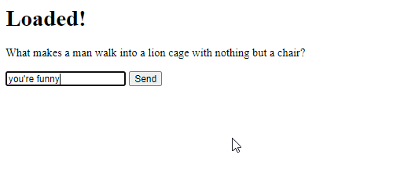

# AI Chatbots With TensorFlow.js: Creating a Movie Dialogue Chatbot


**[Raphael Mun](https://www.codeproject.com/script/Membership/View.aspx?mid=14796281)**

Rate me:


5.00/5 (4 votes)

21 Oct 2020[CPOL](http://www.codeproject.com/info/cpol10.aspx)3 min read

In this article, we'll create a chatbot we can have a dialogue with.

Here we are going to build a chatbot that talks like a movie and responds to us appropriately. And to make this work, we will use a TensorFlow library called Universal Sentence Encoder (USE) to figure out the best response to messages we type in.

- [Download Project Files - 9.9 MB](https://www.codeproject.com/KB/AI/5282694/TensorFlowJS_Chatbots.zip)

[TensorFlow](https://www.tensorflow.org/js/) + [JavaScript](https://www.javascript.com/). The most popular, cutting-edge AI framework now supports the [most widely used programming language on the planet](https://www.statista.com/statistics/793628/worldwide-developer-survey-most-used-languages/). So let’s make text and [NLP ](https://en.wikipedia.org/wiki/Natural_language_processing)(Natural Language Processing) chatbot magic happen through Deep Learning right in our web browser, GPU-accelerated via WebGL using TensorFlow.js!

You are welcome to download the [project code](https://www.codeproject.com/KB/AI/5282694/TensorFlowJS_Chatbots.zip).



Have you ever wondered what it’s like to be in a movie? To play a scene and be a part of the dialogue? Let’s make it happen with AI!

In this project, we are going to build a chatbot that talks like a movie and responds to us appropriately. And to make this work, we will use a TensorFlow library called Universal Sentence Encoder (USE) to figure out the best response to messages we type in.

## Setting UpTensorFlow.js Code

This project runs within a single web page. We’ll include TensorFlow.js and USE, which is a pre-trained transformer-based language processing model. We’ll add a couple of input elements for the user to type messages to our chatbot and read its responses. Two additional utility functions, `dotProduct` and `zipWith`, from the [USE readme example](https://github.com/tensorflow/tfjs-models/tree/master/universal-sentence-encoder), will help us determine sentence similarity.

HTML

Shrink ▲ Copy Code

```html
<html>
  <head>
    <title>
      AI Chatbot from Movie Quotes: Chatbots in the Browser with TensorFlow.js
    </title>
    <script src="https://cdn.jsdelivr.net/npm/@tensorflow/tfjs@2.0.0/dist/tf.min.js"></script>
    <script src="https://cdn.jsdelivr.net/npm/@tensorflow-models/universal-sentence-encoder"></script>
  </head>
  <body>
    <h1 id="status">Movie Dialogue Bot</h1>
    <p id="bot-text"></p>
    <input id="question" type="text" />
    <button id="submit">Send</button>
    <script>
      function setText(text) {
        document.getElementById("status").innerText = text;
      }

      // Calculate the dot product of two vector arrays.
      const dotProduct = (xs, ys) => {
        const sum = (xs) => (xs ? xs.reduce((a, b) => a + b, 0) : undefined);

        return xs.length === ys.length
          ? sum(zipWith((a, b) => a * b, xs, ys))
          : undefined;
      };

      // zipWith :: (a -> b -> c) -> [a] -> [b] -> [c]
      const zipWith = (f, xs, ys) => {
        const ny = ys.length;
        return (xs.length <= ny ? xs : xs.slice(0, ny)).map((x, i) =>
          f(x, ys[i])
        );
      };

      (async () => {
        // Your Code Goes Here
      })();
    </script>
  </body>
</html>
```

## Cornell Movie Quotes Dataset

Our chatbot will learn to respond with movie quotes from the [Cornell movie quotes dataset](https://www.cs.cornell.edu/~cristian/Cornell_Movie-Dialogs_Corpus.html). It consists of over 200 thousand conversational messages. For better performance, we’ll select a random subset to choose from to respond to each message. The two files we need to parse are _movie_lines.txt_ and _movie_conversations.txt_, so that we can create a collection of quotes and matching responses.

Let’s go through every conversation to fill a question/prompt array and a matching response array. Both files use the string `" +++$+++ "` as the delimiter, and the code looks like this:

JavaScript

Copy Code

```javascript
let movie_lines = await fetch("web/movie_lines.txt").then((r) => r.text());

let lines = {};
movie_lines.split("\n").forEach((l) => {
  let parts = l.split(" +++$+++ ");
  lines[parts[0]] = parts[4];
});

let questions = [];
let responses = [];
let movie_conversations = await fetch("web/movie_conversations.txt").then((r) =>
  r.text()
);
movie_conversations.split("\n").forEach((c) => {
  let parts = c.split(" +++$+++ ");
  if (parts[3]) {
    let phrases = parts[3]
      .replace(/[^L0-9 ]/gi, "")
      .split(" ")
      .filter((x) => !!x); // Split & remove empty lines
    for (let i = 0; i < phrases.length - 1; i++) {
      questions.push(lines[phrases[i]]);
      responses.push(lines[phrases[i + 1]]);
    }
  }
});
```

## Universal Sentence Encoder

The [Universal Sentence Encoder](https://github.com/tensorflow/tfjs-models/tree/master/universal-sentence-encoder) (USE) is "a [pre-trained] model that encodes text into 512-dimensional embeddings." For a complete description of the USE and its architecture, please see the Improved Emotion Detection article earlier in this series.

The USE is easy and straightforward to work with. Let’s load it up in our code before we define our network model, and use its QnA dual encoder that will give us full-sentence embeddings across all queries and all answers. This should perform better than word embeddings. We can use this to determine the most appropriate quote and response.

JavaScript

Copy Code

```javascript
// Load the universal sentence encoder
setText("Loading USE...");
let encoder = await use.load();
setText("Loaded!");
const model = await use.loadQnA();
```

## Movie Chatbot in Action

Because these sentence embeddings already encode similarity into its vectors, we don’t need to train a separate model. All we need to do is figure out which of the movie quotes is most similar to the user’s submitted message, so that we can get a response. This is done through the use of the QnA encoder. Putting all of the quotes into the encoder could take a long time, or overload our computer. So for now, we’ll get around this by choosing a random subset of 200 quotes for each chat message.

JavaScript

Copy Code

```javascript
document
  .getElementById("submit")
  .addEventListener("click", async function (event) {
    let text = document.getElementById("question").value;
    document.getElementById("question").value = "";

    // Run the calculation things
    const numSamples = 200;
    let randomOffset = Math.floor(Math.random() * questions.length);
    const input = {
      queries: [text],
      responses: questions.slice(randomOffset, numSamples),
    };
    let embeddings = await model.embed(input);
    tf.tidy(() => {
      const embed_query = embeddings["queryEmbedding"].arraySync();
      const embed_responses = embeddings["responseEmbedding"].arraySync();
      let scores = [];
      embed_responses.forEach((response) => {
        scores.push(dotProduct(embed_query[0], response));
      });
      let id = scores.indexOf(Math.max(...scores));
      document.getElementById("bot-text").innerText =
        responses[randomOffset + id];
    });
    embeddings.queryEmbedding.dispose();
    embeddings.responseEmbedding.dispose();
  });
```

And just like that, you’ve got a chatbot that can talk to you.


## Finish Line

Here is the code that makes this chatbot tick:

HTML

Shrink ▲ Copy Code

```html
<html>
  <head>
    <title>
      AI Chatbot from Movie Quotes: Chatbots in the Browser with TensorFlow.js
    </title>
    <script src="https://cdn.jsdelivr.net/npm/@tensorflow/tfjs@2.0.0/dist/tf.min.js"></script>
    <script src="https://cdn.jsdelivr.net/npm/@tensorflow-models/universal-sentence-encoder"></script>
  </head>
  <body>
    <h1 id="status">Movie Dialogue Bot</h1>
    <p id="bot-text"></p>
    <input id="question" type="text" />
    <button id="submit">Send</button>
    <script>
      function setText(text) {
        document.getElementById("status").innerText = text;
      }

      // Calculate the dot product of two vector arrays.
      const dotProduct = (xs, ys) => {
        const sum = (xs) => (xs ? xs.reduce((a, b) => a + b, 0) : undefined);

        return xs.length === ys.length
          ? sum(zipWith((a, b) => a * b, xs, ys))
          : undefined;
      };

      // zipWith :: (a -> b -> c) -> [a] -> [b] -> [c]
      const zipWith = (f, xs, ys) => {
        const ny = ys.length;
        return (xs.length <= ny ? xs : xs.slice(0, ny)).map((x, i) =>
          f(x, ys[i])
        );
      };

      (async () => {
        let movie_lines = await fetch("web/movie_lines.txt").then((r) =>
          r.text()
        );

        let lines = {};
        movie_lines.split("\n").forEach((l) => {
          let parts = l.split(" +++$+++ ");
          lines[parts[0]] = parts[4];
        });

        let questions = [];
        let responses = [];
        let movie_conversations = await fetch(
          "web/movie_conversations.txt"
        ).then((r) => r.text());
        movie_conversations.split("\n").forEach((c) => {
          let parts = c.split(" +++$+++ ");
          if (parts[3]) {
            let phrases = parts[3]
              .replace(/[^L0-9 ]/gi, "")
              .split(" ")
              .filter((x) => !!x); // Split & remove empty lines
            for (let i = 0; i < phrases.length - 1; i++) {
              questions.push(lines[phrases[i]]);
              responses.push(lines[phrases[i + 1]]);
            }
          }
        });

        // Load the universal sentence encoder
        setText("Loading USE...");
        let encoder = await use.load();
        setText("Loaded!");
        const model = await use.loadQnA();

        document
          .getElementById("question")
          .addEventListener("keyup", function (event) {
            // Number 13 is the "Enter" key on the keyboard
            if (event.keyCode === 13) {
              // Cancel the default action, if needed
              event.preventDefault();
              // Trigger the button element with a click
              document.getElementById("submit").click();
            }
          });

        document
          .getElementById("submit")
          .addEventListener("click", async function (event) {
            let text = document.getElementById("question").value;
            document.getElementById("question").value = "";

            // Run the calculation things
            const numSamples = 200;
            let randomOffset = Math.floor(Math.random() * questions.length);
            const input = {
              queries: [text],
              responses: questions.slice(randomOffset, numSamples),
            };
            let embeddings = await model.embed(input);
            tf.tidy(() => {
              const embed_query = embeddings["queryEmbedding"].arraySync();
              const embed_responses =
                embeddings["responseEmbedding"].arraySync();
              let scores = [];
              embed_responses.forEach((response) => {
                scores.push(dotProduct(embed_query[0], response));
              });
              let id = scores.indexOf(Math.max(...scores));
              document.getElementById("bot-text").innerText =
                responses[randomOffset + id];
            });
            embeddings.queryEmbedding.dispose();
            embeddings.responseEmbedding.dispose();
          });
      })();
    </script>
  </body>
</html>
```

## What’s Next?

In this article, we put together a chatbot that can hold a conversation with someone. But what’s better than a dialogue? What about… a monologue?

In the final article of this series, we’ll build a [Shakespearean Monologue Generator in the Browser with TensorFlow.js](https://www.codeproject.com/Articles/5282696/AI-Chatbots-With-TensorFlow-js-Generating-Shakespe).


This article is part of the series 'AI Chatbot with Tensorflow[◁ Prev](https://www.codeproject.com/Articles/5282692/AI-Chatbots-With-TensorFlow-js-Improved-Trivia-Exp)[View All](https://www.codeproject.com/script/Content/ViewReadingList.aspx?rlid=29)[Next ▷](https://www.codeproject.com/Articles/5282696/AI-Chatbots-With-TensorFlow-js-Generating-Shakespe)

## License

This article, along with any associated source code and files, is licensed under [The Code Project Open License (CPOL)](http://www.codeproject.com/info/cpol10.aspx)
