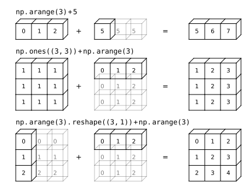

# NumPy 中的 Axis 与广播机制

NumPy 是一个高维数组库。数组由很多轴构成。数组的索引、运算、以及 NumPy 内置函数都需要轴与轴用到之间的关系，这也是和课本上所学线性代数所不同之处。本文介绍了 NumPy 中轴的编号、索引及运算关系，以备参考。

其实 NumPy 数组可以看做 Python 中的 `list`，甚至 `list` 的操作是 NumPy 操作的子集。

在 NumPy 中经常见到对数组的如下表示

```python
[[0., 0., 0.],
 [1., 1., 1.]]
```

数组有几维，只需要数最开始有几个 `[`，这定义了数组的深度，也就是其维数。

进一步地，**由外向内**，命名为第 $0, 1$ 维。

以 NumPy 内置函数 `sum` 为例，

```python
>>> import numpy as np
>>> a = np.array([[0., 0., 0.],
...  [1., 1., 1.]])
>>> a # (2, 3)
array([[0., 0., 0.],
       [1., 1., 1.]])
>>> np.sum(a, axis=0) # (3,)
array([1., 1., 1.])
>>> np.sum(a, axis=1) # (2,)
array([0., 3.])
>>> np.sum(a, axis=(0, 1)) # ()
3.0
```

尝试翻译为比较易懂的 `for` 循环

```python
>>> # np.sum(a, axis=0)
>>> res = np.zeros(a.shape[1])
>>> for i in range(a.shape[0]):
...     for j in range(a[i].shape[0]):
...        res[j] += a[i, j]
...
>>> res
array([1., 1., 1.])
```

```python
def my_sum(arr, axis):
    res = np.zeros(arr.shape[axis])
    for i in range(a.shape[0]):
        for j in range(a.shape[1]):
            res[axis] += a[i, j]
```

也就是说，

可以看到，`sum` 的结果的维度比输入低 `len(axis)`。若 `axis=0`，则相当于 `res[i] = a[:, i]`。

用一个三维矩阵来说明一下

```python
b = np.array([[[0, 1, 2, 3],
                           [4, 5, 6, 7]],
                          [[0, 1, 2, 3],
                           [4, 5, 6, 7]],
                          [[0 ,1 ,2, 3],
                           [4, 5, 6, 7]]])
```

`axis` 的值为被抹掉的那一维，也就是说，

```
res = b.sum(1)
assert res[2, 3] == b[2, :, 3].sum()
```

看完 `sum`，NumPy 中还有另一种常用的变换：转置。

转置理解起来比较简单，

```
arr[i, j, k, l] == arr.transpose((1, 3))[i, l, k, j]
```

拼接，

```python
>>> np_array_1s = np.array([[1,1,1],[1,1,1]])
>>> np_array_9s = np.array([[9,9,9],[9,9,9]])
>>> np.concatenate([np_array_1s, np_array_9s], axis = 0)
array([[1, 1, 1],
       [1, 1, 1],
       [9, 9, 9],
       [9, 9, 9]])
>>> np.concatenate([np_array_1s, np_array_9s], axis = 1)
array([[1, 1, 1, 9, 9, 9],
       [1, 1, 1, 9, 9, 9]])
```

NumPy 中有一个特殊的常量 `np.newaxis`，其实就是 Python 中的 `None`。

```python
>>> a = np.array([0.0, 10.0, 20.0, 30.0])
>>> a
array([ 0., 10., 20., 30.])
>>> a[:, None]
array([[ 0.],
       [10.],
       [20.],
       [30.]])
>>> a[:, None].shape
(4, 1)
```

`np.squeeze` 则是用于去掉只有一个列的轴。

`:` 和 `...` 作用基本相同，但……

```python
>>> a = np.array([[1,2],[3,4]])
>>> a
array([[1, 2],
       [3, 4]])

>>> a[:,np.newaxis]     #  <-- the shape of the rows are unchanged
array([[[1, 2]],

       [[3, 4]]])
>>> a[...,np.newaxis]   #  <-- the shape of the rows changed from horizontal to vertical
array([[[1],
        [2]],

       [[3],
        [4]]])
```

The original is (2,2)

With :, it becomes (2,1,2). The new axis added after the first dimension.

With ... the shape is (2,2,1), the new shape is added last.

`:` 仅代表一维，而 `...` 可代表无数多维。

```python
>>> aa[:, 0, :]
array([[[[0.]]]])
>>> aa[:, 0, ...]
array([[[[0.]]]])
>>> aa[..., 0, :]
array([[[[ 0.]],

        [[10.]],

        [[20.]],

        [[30.]]]])
```

因为 `...` 代表无数多维，所以一次下标只能用一个 `...`，下面的用法是错误的：

```python
>>> aa[..., 0, ...]
Traceback (most recent call last):
  File "<stdin>", line 1, in <module>
IndexError: an index can only have a single ellipsis ('...')
```

广播。广播机制，作为 NumPy 与其他软件不同的特性，既让人称道又令人诟病。很多 MATLAB 用户用不惯广播，认为广播带来了很多对于数组维度的隐含条件，并且不容易控制；但支持者说广播简化了编程，少写了很多的显式循环。不管怎样，使用 NumPy 编程，利用好广播是必须的。

广播规则适用于任何的 `ufunc`，即 Universal Function。



上边的图像是用这段代码生成的：

```python
# https://jakevdp.github.io/PythonDataScienceHandbook/06.00-figure-code.html
# Adapted from astroML: see http://www.astroml.org/book_figures/appendix/fig_broadcast_visual.html
import numpy as np
from matplotlib import pyplot as plt

#------------------------------------------------------------
# Draw a figure and axis with no boundary
fig = plt.figure(figsize=(6, 4.5), facecolor='w')
ax = plt.axes([0, 0, 1, 1], xticks=[], yticks=[], frameon=False)


def draw_cube(ax, xy, size, depth=0.4,
              edges=None, label=None, label_kwargs=None, **kwargs):
    """draw and label a cube.  edges is a list of numbers between
    1 and 12, specifying which of the 12 cube edges to draw"""
    if edges is None:
        edges = range(1, 13)

    x, y = xy

    if 1 in edges:
        ax.plot([x, x + size],
                [y + size, y + size], **kwargs)
    if 2 in edges:
        ax.plot([x + size, x + size],
                [y, y + size], **kwargs)
    if 3 in edges:
        ax.plot([x, x + size],
                [y, y], **kwargs)
    if 4 in edges:
        ax.plot([x, x],
                [y, y + size], **kwargs)

    if 5 in edges:
        ax.plot([x, x + depth],
                [y + size, y + depth + size], **kwargs)
    if 6 in edges:
        ax.plot([x + size, x + size + depth],
                [y + size, y + depth + size], **kwargs)
    if 7 in edges:
        ax.plot([x + size, x + size + depth],
                [y, y + depth], **kwargs)
    if 8 in edges:
        ax.plot([x, x + depth],
                [y, y + depth], **kwargs)

    if 9 in edges:
        ax.plot([x + depth, x + depth + size],
                [y + depth + size, y + depth + size], **kwargs)
    if 10 in edges:
        ax.plot([x + depth + size, x + depth + size],
                [y + depth, y + depth + size], **kwargs)
    if 11 in edges:
        ax.plot([x + depth, x + depth + size],
                [y + depth, y + depth], **kwargs)
    if 12 in edges:
        ax.plot([x + depth, x + depth],
                [y + depth, y + depth + size], **kwargs)

    if label:
        if label_kwargs is None:
            label_kwargs = {}
        ax.text(x + 0.5 * size, y + 0.5 * size, label,
                ha='center', va='center', **label_kwargs)

solid = dict(c='black', ls='-', lw=1,
             label_kwargs=dict(color='k'))
dotted = dict(c='black', ls='-', lw=0.5, alpha=0.5,
              label_kwargs=dict(color='gray'))
depth = 0.3

#------------------------------------------------------------
# Draw top operation: vector plus scalar
draw_cube(ax, (1, 10), 1, depth, [1, 2, 3, 4, 5, 6, 9], '0', **solid)
draw_cube(ax, (2, 10), 1, depth, [1, 2, 3, 6, 9], '1', **solid)
draw_cube(ax, (3, 10), 1, depth, [1, 2, 3, 6, 7, 9, 10], '2', **solid)

draw_cube(ax, (6, 10), 1, depth, [1, 2, 3, 4, 5, 6, 7, 9, 10], '5', **solid)
draw_cube(ax, (7, 10), 1, depth, [1, 2, 3, 6, 7, 9, 10, 11], '5', **dotted)
draw_cube(ax, (8, 10), 1, depth, [1, 2, 3, 6, 7, 9, 10, 11], '5', **dotted)

draw_cube(ax, (12, 10), 1, depth, [1, 2, 3, 4, 5, 6, 9], '5', **solid)
draw_cube(ax, (13, 10), 1, depth, [1, 2, 3, 6, 9], '6', **solid)
draw_cube(ax, (14, 10), 1, depth, [1, 2, 3, 6, 7, 9, 10], '7', **solid)

ax.text(5, 10.5, '+', size=12, ha='center', va='center')
ax.text(10.5, 10.5, '=', size=12, ha='center', va='center')
ax.text(1, 11.5, r'${\tt np.arange(3) + 5}$',
        size=12, ha='left', va='bottom')

#------------------------------------------------------------
# Draw middle operation: matrix plus vector

# first block
draw_cube(ax, (1, 7.5), 1, depth, [1, 2, 3, 4, 5, 6, 9], '1', **solid)
draw_cube(ax, (2, 7.5), 1, depth, [1, 2, 3, 6, 9], '1', **solid)
draw_cube(ax, (3, 7.5), 1, depth, [1, 2, 3, 6, 7, 9, 10], '1', **solid)

draw_cube(ax, (1, 6.5), 1, depth, [2, 3, 4], '1', **solid)
draw_cube(ax, (2, 6.5), 1, depth, [2, 3], '1', **solid)
draw_cube(ax, (3, 6.5), 1, depth, [2, 3, 7, 10], '1', **solid)

draw_cube(ax, (1, 5.5), 1, depth, [2, 3, 4], '1', **solid)
draw_cube(ax, (2, 5.5), 1, depth, [2, 3], '1', **solid)
draw_cube(ax, (3, 5.5), 1, depth, [2, 3, 7, 10], '1', **solid)

# second block
draw_cube(ax, (6, 7.5), 1, depth, [1, 2, 3, 4, 5, 6, 9], '0', **solid)
draw_cube(ax, (7, 7.5), 1, depth, [1, 2, 3, 6, 9], '1', **solid)
draw_cube(ax, (8, 7.5), 1, depth, [1, 2, 3, 6, 7, 9, 10], '2', **solid)

draw_cube(ax, (6, 6.5), 1, depth, range(2, 13), '0', **dotted)
draw_cube(ax, (7, 6.5), 1, depth, [2, 3, 6, 7, 9, 10, 11], '1', **dotted)
draw_cube(ax, (8, 6.5), 1, depth, [2, 3, 6, 7, 9, 10, 11], '2', **dotted)

draw_cube(ax, (6, 5.5), 1, depth, [2, 3, 4, 7, 8, 10, 11, 12], '0', **dotted)
draw_cube(ax, (7, 5.5), 1, depth, [2, 3, 7, 10, 11], '1', **dotted)
draw_cube(ax, (8, 5.5), 1, depth, [2, 3, 7, 10, 11], '2', **dotted)

# third block
draw_cube(ax, (12, 7.5), 1, depth, [1, 2, 3, 4, 5, 6, 9], '1', **solid)
draw_cube(ax, (13, 7.5), 1, depth, [1, 2, 3, 6, 9], '2', **solid)
draw_cube(ax, (14, 7.5), 1, depth, [1, 2, 3, 6, 7, 9, 10], '3', **solid)

draw_cube(ax, (12, 6.5), 1, depth, [2, 3, 4], '1', **solid)
draw_cube(ax, (13, 6.5), 1, depth, [2, 3], '2', **solid)
draw_cube(ax, (14, 6.5), 1, depth, [2, 3, 7, 10], '3', **solid)

draw_cube(ax, (12, 5.5), 1, depth, [2, 3, 4], '1', **solid)
draw_cube(ax, (13, 5.5), 1, depth, [2, 3], '2', **solid)
draw_cube(ax, (14, 5.5), 1, depth, [2, 3, 7, 10], '3', **solid)

ax.text(5, 7.0, '+', size=12, ha='center', va='center')
ax.text(10.5, 7.0, '=', size=12, ha='center', va='center')
ax.text(1, 9.0, r'${\tt np.ones((3,\, 3)) + np.arange(3)}$',
        size=12, ha='left', va='bottom')

#------------------------------------------------------------
# Draw bottom operation: vector plus vector, double broadcast

# first block
draw_cube(ax, (1, 3), 1, depth, [1, 2, 3, 4, 5, 6, 7, 9, 10], '0', **solid)
draw_cube(ax, (1, 2), 1, depth, [2, 3, 4, 7, 10], '1', **solid)
draw_cube(ax, (1, 1), 1, depth, [2, 3, 4, 7, 10], '2', **solid)

draw_cube(ax, (2, 3), 1, depth, [1, 2, 3, 6, 7, 9, 10, 11], '0', **dotted)
draw_cube(ax, (2, 2), 1, depth, [2, 3, 7, 10, 11], '1', **dotted)
draw_cube(ax, (2, 1), 1, depth, [2, 3, 7, 10, 11], '2', **dotted)

draw_cube(ax, (3, 3), 1, depth, [1, 2, 3, 6, 7, 9, 10, 11], '0', **dotted)
draw_cube(ax, (3, 2), 1, depth, [2, 3, 7, 10, 11], '1', **dotted)
draw_cube(ax, (3, 1), 1, depth, [2, 3, 7, 10, 11], '2', **dotted)

# second block
draw_cube(ax, (6, 3), 1, depth, [1, 2, 3, 4, 5, 6, 9], '0', **solid)
draw_cube(ax, (7, 3), 1, depth, [1, 2, 3, 6, 9], '1', **solid)
draw_cube(ax, (8, 3), 1, depth, [1, 2, 3, 6, 7, 9, 10], '2', **solid)

draw_cube(ax, (6, 2), 1, depth, range(2, 13), '0', **dotted)
draw_cube(ax, (7, 2), 1, depth, [2, 3, 6, 7, 9, 10, 11], '1', **dotted)
draw_cube(ax, (8, 2), 1, depth, [2, 3, 6, 7, 9, 10, 11], '2', **dotted)

draw_cube(ax, (6, 1), 1, depth, [2, 3, 4, 7, 8, 10, 11, 12], '0', **dotted)
draw_cube(ax, (7, 1), 1, depth, [2, 3, 7, 10, 11], '1', **dotted)
draw_cube(ax, (8, 1), 1, depth, [2, 3, 7, 10, 11], '2', **dotted)

# third block
draw_cube(ax, (12, 3), 1, depth, [1, 2, 3, 4, 5, 6, 9], '0', **solid)
draw_cube(ax, (13, 3), 1, depth, [1, 2, 3, 6, 9], '1', **solid)
draw_cube(ax, (14, 3), 1, depth, [1, 2, 3, 6, 7, 9, 10], '2', **solid)

draw_cube(ax, (12, 2), 1, depth, [2, 3, 4], '1', **solid)
draw_cube(ax, (13, 2), 1, depth, [2, 3], '2', **solid)
draw_cube(ax, (14, 2), 1, depth, [2, 3, 7, 10], '3', **solid)

draw_cube(ax, (12, 1), 1, depth, [2, 3, 4], '2', **solid)
draw_cube(ax, (13, 1), 1, depth, [2, 3], '3', **solid)
draw_cube(ax, (14, 1), 1, depth, [2, 3, 7, 10], '4', **solid)

ax.text(5, 2.5, '+', size=12, ha='center', va='center')
ax.text(10.5, 2.5, '=', size=12, ha='center', va='center')
ax.text(1, 4.5, r'${\tt np.arange(3).reshape((3,\, 1)) + np.arange(3)}$',
        ha='left', size=12, va='bottom')

ax.set_xlim(0, 16)
ax.set_ylim(0.5, 12.5)

fig.savefig('broadcasting.svg')
```

参考资料：

NumPy. Numpy project. <https://numpy.org/>

Numpy Axes, Explained. Sharp Sight. <https://www.sharpsightlabs.com/blog/numpy-axes-explained/>

Numpy Axis in Python With Detailed Examples. Python Pool. <https://www.pythonpool.com/numpy-axis/>

Python Numpy; difference between colon and ellipsis indexing. Stack Overflow. <https://stackoverflow.com/questions/61554714/python-numpy-difference-between-colon-and-ellipsis-indexing>

Python Data Science Handbook. Jake Vanderplas. <https://github.com/jakevdp/PythonDataScienceHandbook>
