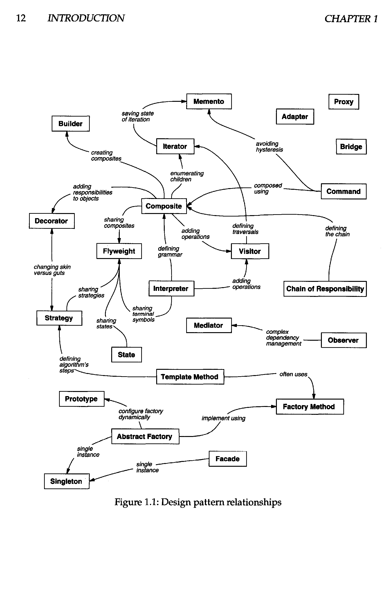
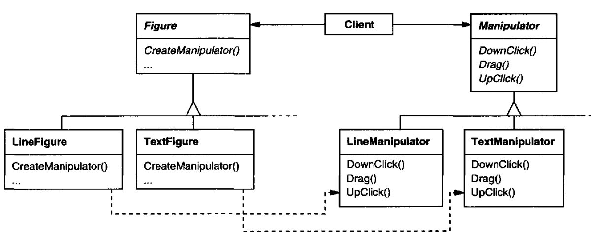

# 设计模式

> Designing object-oriented software is hard, and designing *reusable* object-oriented software is even harder.

In general, a pattern has four essential elements:
1. The **pattern name** is a handle we can use to describe a design problem, its solutions, and consequences in a word or two. Naming a pattern immediately
increases our design vocabulary. It lets us design at a higher level of abstraction.
Having a vocabulary for patterns lets us talk about them with our colleagues, in our documentation, and even to ourselves. It makes it easier to think about
designs and to communicate them and their trade-offs to others. Finding good
names has been one of the hardest parts of developing our catalog.
2. The **problem** describes when to apply the pattern .It explains the problem and its
context. It might describe specific design problems such as how to represent algorithms as objects.It might describe class or object structures that are symptomatic of an inflexible design. Sometimes the problem will include a list of conditions
that must be met before it makes sense to apply the pattern.
3. The **solution** describes the elements that make up the design, their relationships,
responsibilities, and collaborations. The solution doesn't describe a particular
concrete design or implementation, because a pattern is like a template that can be applied in many different situations. Instead, the pattern provides an abstract
description of a design problem and how a general arrangement of elements
(classes and objectsin our case) solves it.
4. The **consequences** are the results and trade-offs of applying the pattern. Though
consequences are often unvoiced when we describe design decisions, they are
critical for evaluating design alternatives and for understanding the costs and
benefits of applying the pattern.




## Creational Patterns 创建型设计模式

### 简单工厂模式

简单工厂模式不在GoF 23大设计模式之列，但有着广泛的应用。现在面向对象的程序中，对象越来越复杂， 但我们需要将对象的创建过程变得更简单，这就是简单工厂模式的理念。

```java
import java.util.ArrayList;

public class Main {
  public static void main(String[] args) {
    Student s = new Student();
    s.getCourse("Design Pattern");
    s.getCourse("Math");
    s.getCourse("Design Pattern");
    s.getCourse("NULL");
    s.learn();
  }
}

class Student {
  private ArrayList<Course> courses = new ArrayList<>();
  public void getCourse(String courseName) {
    try {
      Course selected = CourseFactory.getCourse(courseName);
      courses.add(selected);
    } catch (Exception e) {
      e.printStackTrace();
    }
  }
  public void learn() {
    for (var c : courses) {
      c.learn();
    }
  }
}

interface Course {
  public void learn();
}

class MathCourse implements Course {
  @Override
  public void learn() {
    System.out.println("Learning math");
  }
}

class DesignPatternCourse implements Course {
  @Override
  public void learn() {
    System.out.println("Design Pattern is GREAT!");
  }
}

class CourseFactory {
  public static Course getCourse(String courseName) throws NoSuchCourseException {
    if (courseName == "Math") {
      return new MathCourse();
    } else if (courseName == "Design Pattern") {
      return new DesignPatternCourse();
    } else {
      throw new NoSuchCourseException(courseName);
    }
  }
}

class NoSuchCourseException extends Exception {
  NoSuchCourseException(String msg) {
    super(msg);
  }
}
```

### Abstract Factory 抽象工厂模式

> Provide an interface for creating families of related or dependent objects without specifying their concrete classes.


抽象工厂用于由多个产品组成的产品族构建的系统的创建。系统应该与具体的产品独立，对于具体的产品，隐藏其实现而只暴露其接口。

假设你有两套UI，比方说一套Windows风格一套MAC风格，可以用一套生成窗口，生成滚动条，同样也可以用另一套生成窗口、生成滚动条，这就是抽象工厂模式。

优点：

1. 抽象工厂可保证客户端只使用同一个产品的产品族
2. 增强了程序的可扩展性，对于**新产品族**的加入，只需要实现一个新的具体工厂，不需要对现有代码修改

缺点：

1. 规定了所有可能被创建的产品的集合，增加**产品**需要对所有工厂代码进行修改，不符合开闭原则
2. 增加了系统的抽象性和理解难度

### Builder 建造者模式

> Separate the construction of a complex object from its representation so that the same construction process can create different representations.

#### 参与者

* Builder：抽象建造者
* Concrete Builder：具体建造者
* Director：指挥者
* Product：产品

```java
public class Main {
  public static void main(String[] args) {
    ComputerBuilder builder = new LaptopBuilder();
    Manufactor manufactor = new Manufactor();
    String newComputer = manufactor.buildComputer(builder);
    System.out.println(newComputer);
  }
}

interface ComputerBuilder {
  public void addScreen(String screen);
  public void addKeyboard(String keyboard);
  public String build();
}

class LaptopBuilder implements ComputerBuilder {
  private String screen = null;
  private String keyboard = null;
  @Override
  public void addScreen(String screen) {
    this.screen = screen;
  }
  @Override
  public void addKeyboard(String keyboard) {
    this.keyboard = keyboard;
  }
  @Override
  public String build() {
    return screen + ' ' + keyboard;
  }
}

class Manufactor {
  public String buildComputer(ComputerBuilder builder) {
    builder.addScreen("1024 x 768");
    builder.addKeyboard("QWERTY");
    return builder.build();
  }
}
```

### Factory Method 工厂方法模式

> Define an interface for creating an object, but let subclasses decide witch class to instantiate. Factory Method lets a class defer instantiation to subclasses.

在工厂方法模式中，将工厂继续拆分，工厂做专门的事情。

#### 角色

* 抽象工厂：所有工厂类的接口
* 具体工厂：负责创建具体对象
* 抽象产品：被程序依赖
* 具体产品：具体执行工作的产品



```java
public class Main {
  public static void main(String[] args) {
    IFactory factory = new FactoryA();
    IProduct product = factory.produce();
    product.doSomething();
  }
}

interface IFactory {
  public IProduct produce();
}

interface IProduct {
  public void doSomething();
}

class FactoryA implements IFactory {
  @Override
  public IProduct produce() {
    return new ProductA();
  }
}

class ProductA implements IProduct {
  @Override
  public void doSomething() {
    System.out.println("Product A produced");
  }
}
```

### Prototype 原型模式

> Specify the kinds of objects to create using a prototypical instance, and create new objects by copying this prototype.

简单地说，对于大型复杂的对象，可以创建一个对象并以之为原型，通过复制的方式获取大量该对象。

It hides the concrete product classes from the client, thereby reducing the number of names clients know about. Moreover, these patterns let a client work with application-specific classes without modification.

```java
public class Main {
  public static void main(String[] args) {
    ConcretePrototype prototype = new ConcretePrototype("original");

    ConcretePrototype clone = null;
    try {
      clone = prototype.clone();
    } catch (CloneNotSupportedException e) {
      e.printStackTrace();
    }

    clone.desc = "clone";
    System.out.println(prototype);
    System.out.println(clone);
  }

  static class ConcretePrototype implements Cloneable {
    private String desc;
    public ConcretePrototype(String desc) {
      this.desc = desc;
    }

    @Override
    protected ConcretePrototype clone() throws CloneNotSupportedException {
      return (ConcretePrototype) super.clone();
    }

    @Override
    public String toString() {
      return "ConcretePrototype{ " + desc + " }";
    }
  }
}
```

### Singleton 单例模式

> Ensure a class only has one instance, and provide a global point of access to it.

```java
public class Main {
  public static void main(String[] args) {
    Singleton s = Singleton.getSingleton();

    System.out.println(s);
    Singleton s2 = Singleton.getSingleton();
    System.out.println(s == s2);
  }
}

class Singleton {
  private static Singleton singleton = new Singleton();
  private Singleton() {}
  public static Singleton getSingleton() {
    return singleton;
  }
  @Override
  public String toString() {
    return super.toString();
  }
}
```

## Structural Patterns 结构型设计模式

### Adapter 适配器模式

> Convert the interface of a class into another interface clients except. Adapter lets classes work together that couldn't otherwise because of incompatible interfaces.


### Bridge 桥接模式

> Decouple an abstraction from its implementation so that the two can vary independently.

### Composite 组合模式

> Compose objects into tree structures to represent part-whole hierarchies. Composite lets clients treat individual objects and compositions of objects uniformly

### Decorator 装饰器模式

> Attach additional responsibilities to an object dynamically. Decorators provide a flexible alternative to subclassing for extending functionality.

### Facade 门面模式

> Provide a unified interface to a set of interfaces in a subsystem. Facade defines a higher-level interface that makes the subsystem easier to use.

### Flyweight 享元模式

> Use sharing to support large numbers of fine-grained objects efficiently.

### Proxy 代理模式

> Provide a surrogate or placeholder for another object to control access to it.

## Behavioral Patterns 行为型设计模式

### Chain of Responsibility 责任链模式

> Avoid coupling the sender of a request to its receiver by giving more that one chance to handle the request. Chain the receiving objects and pass the request along the chain until an object handles it.

### Command 命令模式

> Encapsulate a request as an object, thereby letting you parameterize clients with different requests, queue or log requests, and support undoable operations.

### Interpreter 解释器模式

> Given a language, define a representation for its grammar along with an interpreter that uses the representation to interpret sentences in the language.

### Iterator 迭代器模式

> Provide a way to access the elements of a aggregate object sequentially without exposing its underlying representation.

### Mediator 中介者模式

> Define an object that encapsulates how a set of objects interact. Mediator promotes loose coupling by keeping objects from referring to each other explicitly, and it lets you vary their interaction independently.

### Memento 备忘录模式

> Without violation encapsulation, capture and externalize an object's internal state so that the object can be restored to this state later.

### Observer 观察者模式

> Define a one-to-many dependency between objects so that when one object changes state, all its dependents a notified and updated automatically.

### State 状态模式

> Allow an object to alter its behavior when its internal state changes. The object will appear to change its class.

### Strategy 策略模式

> Define a family of algorithms, encapsulate each one, and make them interchangeable. Strategy lets the algorithm vary independently from clients that use it.

### Template Method 模板方法模式

> Define the skeleton of an algorithm in an operation, deferring some steps to subclasses. Template Method lets subclasses redefine certain steps of an algorithm without changing the algorithm's structure.

### Visitor 访问者模式

> Represent an operation to be preformed on elements of an object structure. Visitor lets you define a new operation without changing the classes of the elements on which it operates.