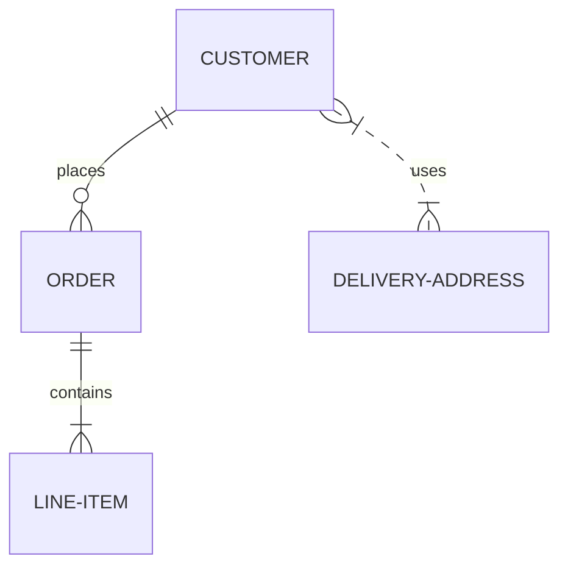
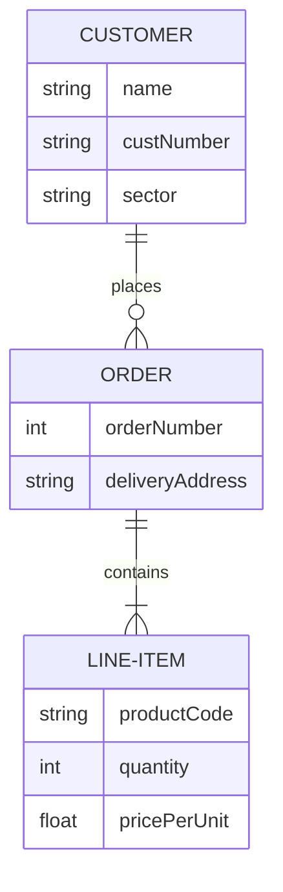

磨刀不误砍柴工，学习一下 ER 图

[Mermaid.js 官方文档](https://mermaid-js.github.io/mermaid/#/entityRelationshipDiagram)

实体-关系图（Entity-Relationship Diagram）表示在一个已知问题域中，感兴趣的事务（Things of Interest）之间的联系。每个**实体**是一个实体型的抽象实例，以名词单数命名。

`Mermaid.js`可以渲染 ER 图，如下：

> 可以访问博客源代码查看未渲染版本

ER 图中还会有各种属性，比如下图（低版本的`mermaid`不支持

关于 ER 图中基数的含义如下：

<!-- prettier-ignore-start -->

| Value (left) | Value (right) | Meaning                       |
| ------------ | ------------- | ----------------------------- |
| `|o`         | `o|`          | Zero or one                   |
| `||`         | `||`          | Exactly one                   |
| `}o`         | `o{`          | Zero or more (no upper limit) |
| `}|`         | `|{`          | One or more (no upper limit)  |

<!-- prettier-ignore-end -->
