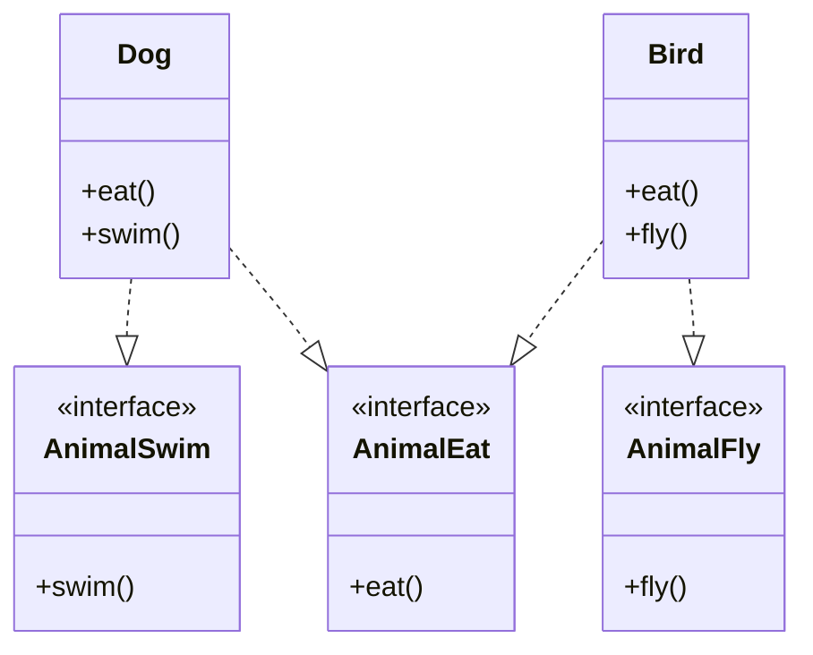

# 七大软件设计原则

[TOC]

## 开闭原则 Open Close Principle

开闭原则指一个**软件实体**（如类、模块和函数）应该**对扩展开放，对修改关闭**。

### 例：利用 IoC 框架动态创建对象

```java
import org.springframework.context.ApplicationContext;
import org.springframework.context.support.ClassPathXmlApplicationContext;

public static void main(String []args){
    //创建Spring容器，解析xml文件;
    // ApplicationContext为一接口，new后面的是它的实现类，参数为xml配置文件
    ApplicationContext context=new ClassPathXmlApplicationContext("bean.xml");
    //根据Bean的id查找对象
    HelloBean helloBean=(HelloBean)context.getBean("helloBean");     System.out.println(helloBean. getPrice());
    }
}
```

## 依赖倒置原则 Dependency Inversion Principles

依赖倒置原则指设计代码结构时，高层模块不应该依赖底层模块，二者都应该依赖其抽象。将底层模块作为不可分割的逻辑，将高层模块作为逻辑的再组装。

> **抽象**就是指接口或抽象类，两者都是不能直接被实例化的
>
> **细节**就是实现类，实现接口或继承抽象类而产生的类就是细节
>
> **点**就是可以直接被实例化
>
> 依赖倒置原则
>
> - 模块间的依赖通过抽象发生，实现类之间不发生直接的依赖关系，其依赖关系是通过接口或抽象类产生的；
> - 接口或抽象类不依赖于实现类；
> - 实现类依赖接口或抽象类。

### 示例

#### 错误示例

```csharp
public class MediaFile {
    public string FilePath { get; set; }
}
```

```csharp
public class Player {
    public void play(MediaFile file) {
        Console.WriteLine(file.FilePath);
    }
}
```

```csharp
public class User {
    public void playMedia() {
        MediaFile mediaFile = new MediaFile();
        Player player = new Player();
        player.play(mediaFile);
    }
}
```

#### 第一次重构

上层模块不应该依赖下层模块，二者都应该依赖其抽象。

```csharp
public interface IMediaFile {
    string FilePath { get; set; }
}
```

```csharp
public interface IPlayer {
    void play(IMediaFile file);
}
```

```csharp
public class MediaFile : IMediaFile {
    pulbic string FilePath { get; set;}
}
```

```csharp
public class Player : IPlayer {
    public void play(IMediaFile file) {
        Console.WriteLine(file.FilePath);
    }
}
```

```csharp
public class User {
    public void playMedia() {
        IMediaFile mediaFile = new MediaFile();
        IPlayer player = new Player();
        Player.play(mediaFile);
    }
}
```

### 第二次重构：控制反转

```csharp
/// <summary>
/// 用户播放媒体文件
/// </summary>
public class User {
   public void PlayMedia() {
       IMediaFile mediaFile = new MediaFile();
       IPlayer player = new Player();
       player.Play(mediaFile);
     }
}
```

```csharp
public void PlayMedia()
{
   IMediaFile media = Assembly.Load(ConfigurationManager.AppSettings["AssemName"]).CreateInstance(ConfigurationManager.AppSettings["MediaName"]);
   IPlayer player = Assembly.Load(ConfigurationManager.AppSettings["AssemName"]).CreateInstance(ConfigurationManager.AppSettings["PlayerName"]);
  player.Play(media);
}

```

控制反转 IoC：创建具体对象的控制权交给配置文件（Java 或者 C#通过反射机制动态创建对象）。

依赖注入 DI：所谓依赖注入，就是由 IoC 容器在运行期间，动态地将某种依赖关系注入到对象之中

> Spring(Java 平台)注入方式：
>
> 1. 构造函数注入
> 2. setter 注入
> 3. 基于注解的注入
>
> Unity(.Net 平台)注入方式:
>
> 1. 构造函数注入
> 2. 属性注入
> 3. 方法注入

> 总结
>
> 依赖倒置原则的本质就是通过抽象（接口或抽象类）使各个类或模块的实现彼此独立，不互相影响，实现模块间的松耦合
>
> 依赖倒置的基本要求
>
> - 每个类尽量都有接口或抽象类，或者抽象类和接口两者都具备
> - 接口和抽象类都是属于抽象的，有了抽象才可能依赖倒置。
> - 变量类型尽量是接口或者是抽象类
> - 任何类都不应该从具体类派生。(不一定)
> - 尽量不要覆写基类的方法
>
> 如果基类是一个抽象类，而且这个方法已经实现了，子类尽量不要覆写。类间依赖的是抽象，覆写了抽象方法，对依赖的稳定性会产生一定的影响。

## 单一职责原则 Simple Responsibility Principle

单一职责原则指不要存在一个以上导致类变更的原因，也就是，将两个职责用两个类实现。

### 例 1

还是拿我们经典的图书管理系统为例，**普通用户和管理员应该作为两个类**，而不是一个类里有一个`Boolean`表示是否为管理员。

### 例 2

```java
private void modifyUserInfo(String userName,String address){
    userName = "Jack";
    address = "USA";
}
```

拆分为两个函数：

```java
private void modifyUserName(String userName){
    userName = "Jack";
}
```

```java
private void modifyUserInfo(String address){
    address = "USA";
}
```

> 遵循单一职责原的优点有：
>
> - 可以降低类的复杂度，一个类只负责一项职责，其逻辑肯定要比负责多项职责简单的多。
> - 提高类的可读性，提高系统的可维护性。
> - 变更引起的风险降低，变更是必然的，如果单一职责原则遵守的好，当修改一个功能时，可以显著降低对其他功能的影响。
> - 需要说明的一点是单一职责原则不只适用于面向对象编程思想，只要是模块化的程序设计，都适用单一职责原则。
>
> 缺点
>
> - 最明显的是会增加编写代码的复杂度。当我们按照职责把对象分解成更小的粒度之后，实际上也增大了这些对象之间相互联系的难度。

## 接口隔离原则 Interface Segregation Priciple

指**使用多个专门的接口**，而不使用单一的总接口，客户端不应该依赖它不需要的接口。

我们在设计接口时应当注意以下几点：

- 一个类对一类的**依赖**应该建立在**最小的接口**之上。
- 建立单一接口，不要建立庞大臃肿的接口。
- 尽量细化接口，接口中的方法尽量少（不是越少越好，一定要适度）。

```java
public interface IAnimal {
    void eatFood();
    void flying();
    void swimming();
}
```

```java
public class Bird implements IAnimal{
    @Override
    public void eatFood() {}
    @Override
    public void flying() {}
    @Override
    public void swimming() {}
}
```

并不是很好。



还有更优雅的做法，就是**策略模式**。

## 迪米特法则 Law of Demeter

**一个对象应该对其他对象保持最少的了解**，尽量降低类与类之间的耦合。又叫最少知道原则(Least Knowledge Principle, LKP)。

主要强调*只和朋友交流，不和陌生人说话*。出现在成员变量、方法的输入、输出参数中的类都可以称之为成员朋友类，而出现在方法体内部的类不属于朋友类。

> 优点
>
> - **降低了类之间的耦合度**，提高了模块的相对独立性。
>
> - 由于亲合度降低，从而**提高了类的可复用率和系统的扩展性。**
>
> 缺点
>
> - 过度使用迪米特法则**会使系统产生大量的中介类，从而增加系统的复杂性，使模块之间的通信效率降低**。所以，在釆用迪米特法则时需要反复权衡，确保高内聚和低耦合的同时，保证系统的结构清晰。

## 里氏替换原则 Liskov Substitution Principle

定义

- 如果对每一个类型为 T1 的 对象 o1,都有类型为 T2 的对象 o2,使得以 T1 定义的所有程序 P 在所有的对象 o1 都替换成 o2 时，程序 P 的行为没有发生变化，那么类型 T2 是类型 T1 的子类型。

- 一个软件实体如果适用一个父类的话，那一定是适用于其子类，所有引用父类的地方必须能透明地使用其子类的对象，子类对象能够替换父类对象，而程序逻辑不变。

继承包含这样一层含义：**父类已经实现好的方法**（相对于抽象方法而言），实际上是在**设定一系列的规范和契约**，虽然它不强制要求所有的子类必须遵从这些契约，但是如果子类对这些非抽象方法任意修改，就会对整个继承体系造成破坏。

继承作为面向对象三大特性之一，在给程序设计带来巨大便利的同时，也带来了弊端。比如使用继承会给程序带来侵入性，程序的可移植性降低，增加了对象间的耦合性，如果一个类被其他的类所继承，则当这个类需要修改时，必须考虑到所有的子类，并且父类修改后，所有涉及到子类的功能都有可能会产生故障。

> 举例说明继承的风险

里氏替换原则的引申含义是，子类**可以扩展**父类的功能，但**不能改变父类原有的功能**。

1. 子类**可以实现**父类的抽象方法，但**不能覆盖**父类的非抽象方法。
2. 子类中**可以增加自己特有的方法**。
3. 当子类的方法**重载**父类的方法时，方法的**前置条件**（即方法的输入/入参）要比父类方法的输入参数**更宽松**。
4. 当子类的方法**实现**父类的方法时（重写/重载或实现抽象方法），方法的**后置条件**（即方法的输出/返回值）要比父类**相等或更严格**。

当子类覆盖或实现父类的方法时，方法的前置条件（即方法的形参）要比父类方法的输入参数更宽松。

### 注意：重载 Overload 和重写 Override

子类 Overload 父类是没有问题的，但 Override 父类时，要注意相同签名的方法，其表现不能不同。

在`Java`中子类 Overload 一个方法不会覆盖父类的全部同名方法。（C++中会！）

```java
public class Main {
  public static void main(String[] args) {
    B b = new B();
    b.show();
    b.show(42);
  }
}

class A {
  void show() {
    System.out.println("Nothing to show");
  }
}

class B extends A {
  void show(int val) {
    System.out.println(val);
  }
}
```

## 合成复用原则 Composite/Aggregate Reuse Priciple

又叫组合/聚合复用原则。它要求在软件复用时，要尽量**先使用组合或者聚合等关联关系**来实现，**其次才考虑使用继承关系**来实现。如果要使用继承关系，则必须严格**遵循里氏替换原则**。合成复用原则同里氏替换原则相辅相成的，两者都是开闭原则的具体实现规范。

复用分为继承复用和合成复用两种。

**继承复用**虽然有简单和易实现的优点，但它也存在以下缺点

- 继承复用**破坏了类的封装性**。因为继承会将父类的实现细节暴露给子类，父类对子类是透明的，所以这种复用又称为**“白箱”复用**。
- 子类与父类的**耦合度高**。父类的实现的任何改变都会导致子类的实现发生变化，这不利于类的扩展与维护。
- **它限制了复用的灵活性**。从父类继承而来的实现是**静态的**，在编译时已经定义，所以在运行时不可能发生变化。

**合成复用**将已有对象纳入新对象中，使之成为新对象的一部分，新对象可以调用已有对象的功能，它有以下优点

- **维持了类的封装性**。因为成分对象的内部细节是新对象看不见的，所以这种复用又称为**“黑箱”复用**。
- **新旧类之间的耦合度低**。这种复用所需的**依赖较少**，新对象存取成分对象的唯一方法是通过成分对象的接口。
- **复用的灵活性高**。这种复用可以在运行时**动态**进行，新对象可以动态地引用与成分对象类型相同的对象。

## 总结

- 开闭原则是总纲，它告诉我们要对扩展开放，对修改关闭；
- 里氏替换原则告诉我们不要破坏继承体系；
- 依赖倒置原则告诉我们要面向接口编程；
- 单一职责原则告诉我们实现类要职责单一；
- 接口隔离原则告诉我们在设计接口的时候要精简单一；
- 迪米特法则告诉我们要降低耦合度；
- 合成复用原则告诉我们要优先使用组合或者聚合关系复用，少用继承关系复用。

目的只有一个：

- 降低对象之间的耦合，增加程序的可复用性、可扩展性和可维护性。

> 记忆口诀
>
> **访问加限制，函数要节俭，依赖不允许，动态加接口，父类要抽象，扩展不更改。**
>
> 在程序设计时，我们应该将程序功能最小化，每个类只干一件事。若有类似功能基础之上添加新功能，则要合理使用继承。对于多方法的调用，要会运用接口，同时合理设置接口功能与数量。最后类与类之间做到低耦合高内聚。
