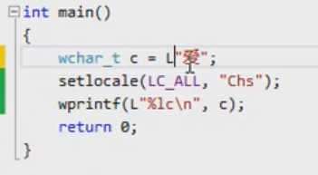
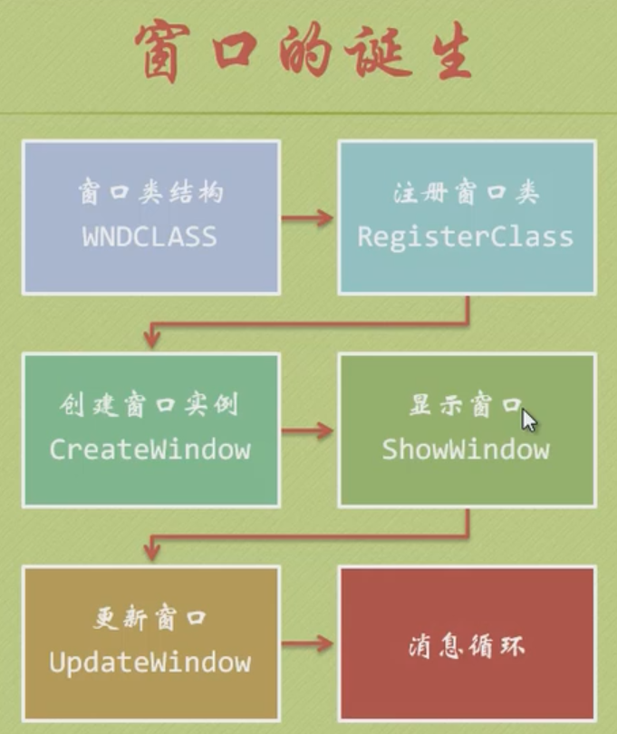
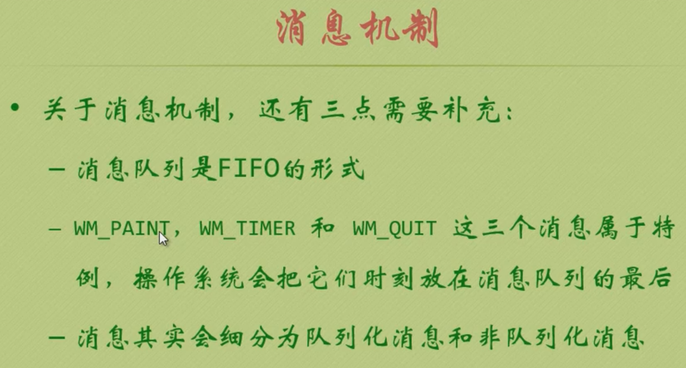
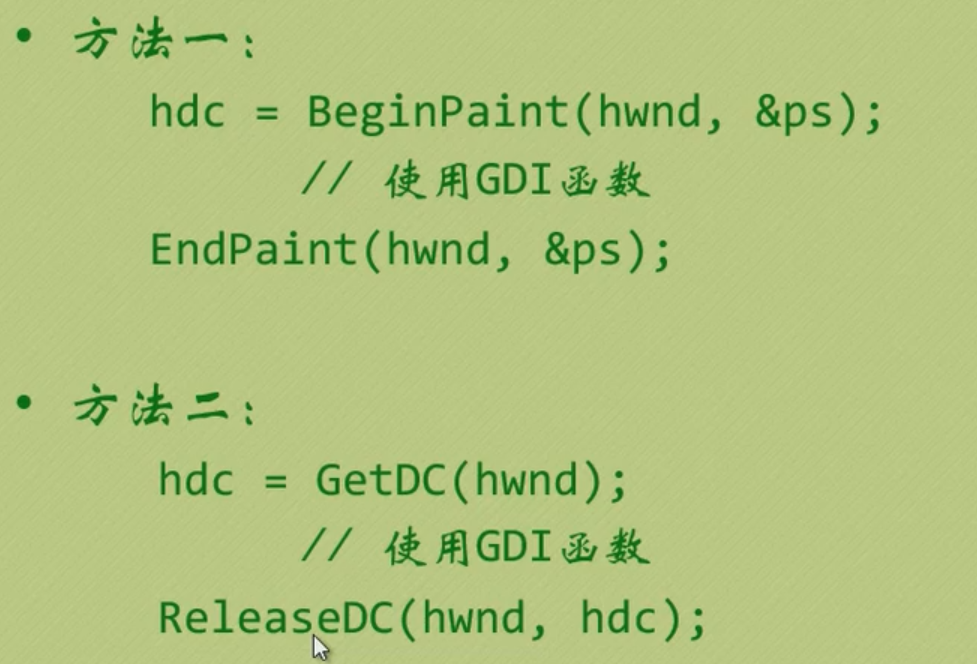
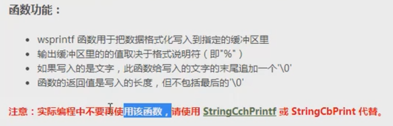
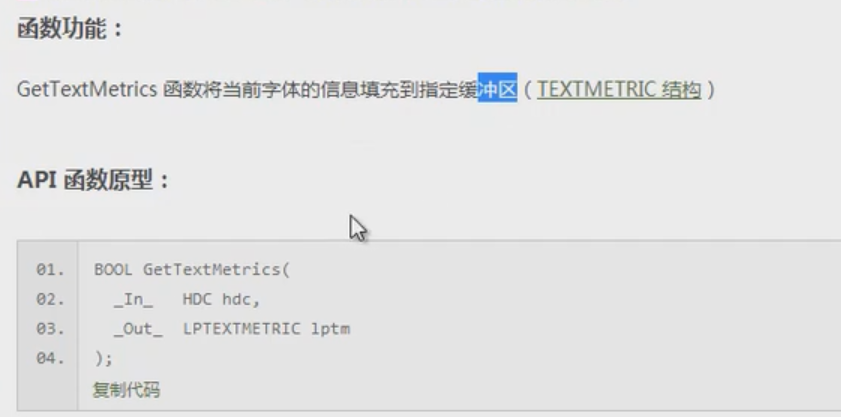

哔哩哔哩倍速，懂得都懂。

```javascript
document.querySelector("video").playbackRate = 3;
```

首先让我们来看一看一个完整的`Windows`窗口程序是如何构成的。

- 第一部分：Windows 基础
- 第二部分：MDI、多线程、数据库
- 第三部分：图片等

官方文档：https://docs.microsoft.com

### First program

```cpp
#include<stdio.h>
int main() {
    printf("Hello, world");
}
```

## firstwindow

```cpp
#include<windows.h>

int WINAPI WinMain(HINSTANCE hInstance, HINSTANCE hPrevInstance, PSTR szCmdLine, int iCmdShow) {
	MessageBox(NULL, TEXT("Text"), TEXT("HI"), MB_OK);
	return 0;
}
```

`unicode`



`L"String", LCHAR wchar_t`

`TCHAR`


```cpp
#include<windows.h>

LRESULT CALLBACK WndProc(HWND hwnd, UINT message, WPARAM wParam, LPARAM lParam);

int WINAPI WinMain(HINSTANCE hInstance, HINSTANCE hPrevInstance, PSTR szCmdLine, int iCmdShow) {
	static TCHAR szAppName[] = TEXT("MyWindow");
	HWND hwnd;
	MSG msg;
	WNDCLASS wndclass;

	wndclass.style = CS_HREDRAW | CS_VREDRAW;
	wndclass.lpfnWndProc = WndProc;
	wndclass.cbClsExtra = 0;
	wndclass.cbWndExtra = 0;
	wndclass.hInstance = hInstance;
	wndclass.hIcon = LoadIcon(NULL, IDI_APPLICATION);
	wndclass.hCursor = LoadCursor(NULL, IDC_ARROW);
	wndclass.hbrBackground = (HBRUSH)GetStockObject(WHITE_BRUSH);
	wndclass.lpszMenuName = NULL;
	wndclass.lpszClassName = szAppName;

    // Register the class
	if (!RegisterClass(&wndclass)) {
		MessageBox(NULL, TEXT("This should be run on Windows NT"), TEXT("CAP"), 0);
		return -1;
	}

	hwnd = CreateWindow(szAppName,// 创建类名称（基于哪个类）
		TEXT("dandelight"),//标题
		WS_OVERLAPPEDWINDOW,//风格
		CW_USEDEFAULT,//x, y, wid, hei
		CW_USEDEFAULT,
		CW_USEDEFAULT,
		CW_USEDEFAULT,
		NULL,
		NULL,
		hInstance,
		NULL);

	ShowWindow(hwnd, iCmdShow);
	UpdateWindow(hwnd);

	// Windows核心--消息循环
	while (GetMessage(&msg, NULL, 0, 0)) {
		TranslateMessage(&msg);
		DispatchMessage(&msg);
	}
	return msg.wParam;
}

LRESULT CALLBACK WndProc(HWND hwnd, UINT message, WPARAM wParam, LPARAM lParam) {
	HDC hdc; // device context
	PAINTSTRUCT ps;
	RECT rect;

	switch (message) {
	case WM_PAINT:
		hdc = BeginPaint(hwnd, &ps);
		GetClientRect(hwnd, &rect);
		DrawText(hdc, TEXT("HEllo, world"), -1, &rect,
			DT_SINGLELINE | DT_CENTER | DT_VCENTER);
		EndPaint(hwnd, &ps);
		return 0;
	case WM_DESTROY:
		PostQuitMessage(0);
		return 0;
	}

	return DefWindowProc(hwnd, message, wParam, lParam);
}
```

Windows

windows 到处都是窗口编程



Windows 是一个事件驱动、基于消息的操作系统







方法 1 适用于 MS_PAINT，方法 2 适用于任何时候








