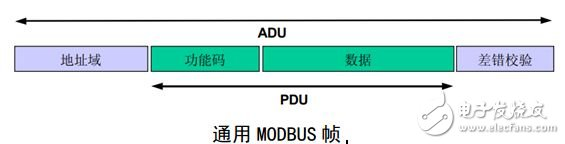
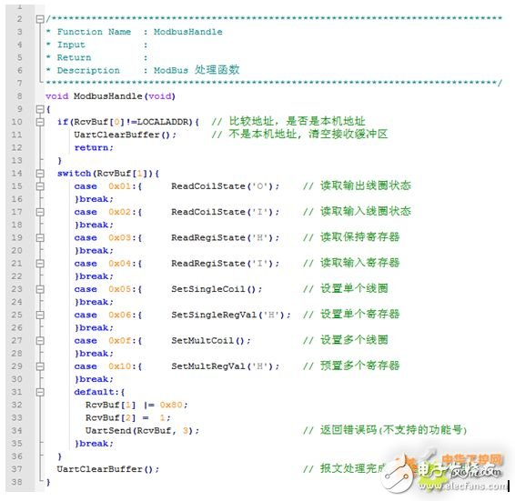

[https://modbus.org](https://modbus.org)

http://www.elecfans.com/rengongzhineng/596297.html#comment)

先来简单分析一条 MODBUS-RTU 报文，例如：01 06 00 01 00 17 98 04
01 06 00 01 00 17 98 04
从机地址 功能号 数据地址 数据 CRC 校验

这一串数据的意思是：把数据 0x0017(十进制 23) 写入 1 号从机地址 0x0001 数据地址。

先弄明白下面的东西。

1、报文
一个报文就是一帧数据，一个数据帧就一个报文： 指的是一串完整的指令数据，就像上面的一串数据。

2、CRC 校验
意义：例如上面的 98 04 是它前面的数据（01 06 00 01 00 17）通过一算法（见附录 2，很简单的）计算出来的结果，其实就像是计算累加和那样。（累加和：就是 010600010017 加起来的值，然后它的算法就是加法）。
作用：在数据传输过程中可能数据会发生错误，CRC[检验](http://www.hqpcb.com/zhuoluye11/?tid=26&plan=fashaoyou)检测接收的数据是否正确。比如主机发出 01 06 00 01 00 17 98 04，那么从机接收到后要根据 01 06 00 01 00 17 再计算 CRC 校验值，从机判断自己计算出来的 CRC 校验是否与接收的 CRC 校验（98 04 主机计算的）相等，如果不相等那么说明数据传输有错误这些数据不能要。

3、功能号
意义：modbus 定义。见附录 1。
作用：指示具体的操作。

MODBUS-RTU
**一、一个报文分析**
先声明下我们的目的，我们是要两个设备通讯，用的是 MODBUS 协议。上面简单介绍了：“报文”“CRC 校验”“功能号”。

在[单片机](http://www.elecfans.com/tags/单片机/)中拿出一部分内存（[RAM](http://www.elecfans.com/tags/ram/)）进行两个设备通讯，例如：

数组后面的注释，说明
OX[20] 代表是输出线圈，用功能码 0x01，0x05，0x0F 访问， 开头地址是 0 （这个后续说明）
IX[20] 代表是输入线圈，用功能码 0x02 访问， 开头地址是 1 （这个后续说明）
另外两个一样的道理。
注意：所谓的“线圈”“[寄存器](http://www.elecfans.com/tags/寄存器/)”就是“位变量”“16 位变量”，不要被迷惑。之所以称“线圈”我觉得应该是对于应用的设备，MODBUS 协议是专门针对 485 总线设备（例[PLC](http://www.elecfans.com/zt/542/)）开发的。

1、主机对从机写数据操作
如果单片机接收到一个报文那么就对报文进行解析执行相应的处理，如上面报文：
01 06 00 01 00 17 98 04
从机地址 功能号 数据地址 数据 CRC 校验

假如本机地址是 1 ，那么单片机接收到这串数据根据数据计算 CRC 校验判断数据是否正确，如果判断数据无误，则结果是：
HoldDataReg[1] = 0x0017;
MODBUS 主机就完成了一次对从机数据的写操作，实现了通讯。

2、主机对从机读数据操作
主机进行读 HoldDataReg[1] 操作，则报文是：
01 03 00 01 00 01 D5 CA
从机地址 功能号 数据地址 读取数据个数 CRC 校验
那么单片机接收到这串数据根据数据计算 CRC 校验判断数据是否正确，如果判断数据无误，则结果是：返回信息给主机，返回的信息也是有格式的：
返回内容：  
 01 03 02 0017 F8 4A
从机地址 功能号 数据字节个数 两个字节数据 CRC 校验
MODBUS 主机就完成了一次对从机数据的读操作，实现了通讯。

**二、MODBUS 报文模型**

以上了解到了 MODBUS 的一帧报文是如何通讯的，其实每个报文的格式都基本一样的。

这里两个缩略词以前不知道，但是现在要明白指的是什么，“ADU”“PDU”
ADU： 应用数据单元
PDU： 协议数据单元

**三、MODBUS 数据模型**

**四、MODBUS 事务处理**
下列状态图描述了在服务器侧 MODBUS 事务处理的一般处理过程。

**五、MODBUS 请求与响应**
看 MODBUS 协议手册，中文第 10 页开始，英文第 24 页开始。手册非常详细举例说明了 MODBUS 协议各个功能号的请求与响应。
modbus 协议在单片机上实现过程
MODBUS 任务处理函数

函数中，RcvBuf 为串口接收缓冲区，如果接收了一个报文则，RcvBuf[0] 为从机地址，RcvBuf[0] 为 MODBUS 功能号。根据功能号做出响应，而具体的操作根据功能号在各自的函数中执行，相当于解析接收到的数据。

附录 1：MODBUS-RTU 功能码
最常用功能码：
下面“线圈”“寄存器”其实分别直的就是“位变量”“16 位变量”
01 (0x01) 读线圈
02 (0x02) 读离散量输入
03 (0x03) 读保持寄存器
04(0x04) 读输入寄存器
05 (0x05) 写单个线圈
06 (0x06) 写单个寄存器
15 (0x0F) 写多个线圈
16 (0x10) 写多个寄存器

附录 2：CRC Genera[ti](http://www.elecfans.com/tags/德州仪器/)on

