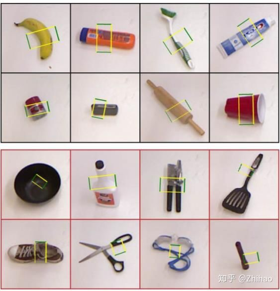
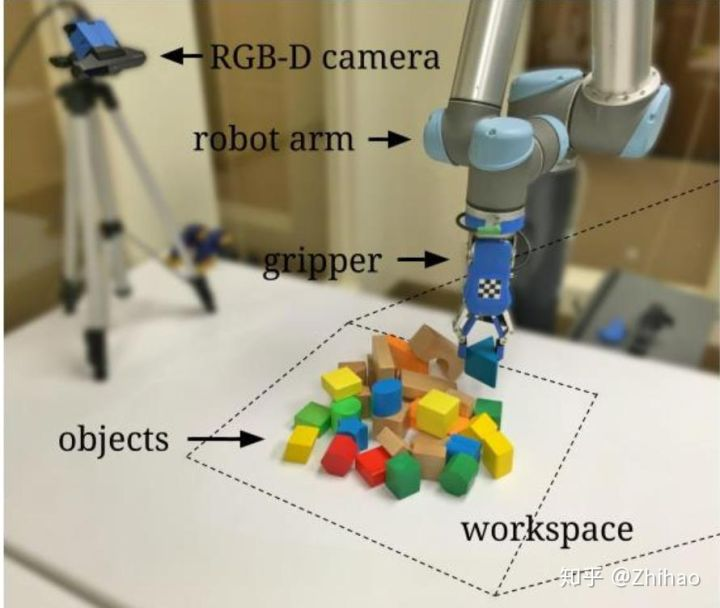
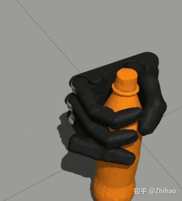
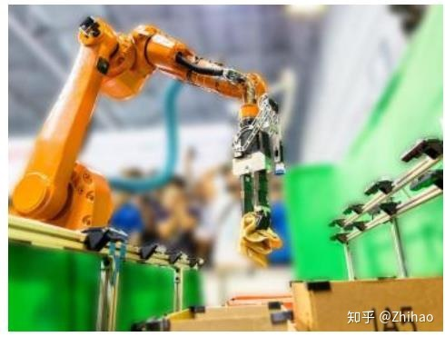

# The Mechanical design of ARGSS

[IEEE Xploer](https://ieeexplore.ieee.org/)暂时登录不上（HTTP 500），先把引文放在这里。【2021/10/17 12:55】

Joseph Redmon 的早期论文https://arxiv.org/abs/1412.3128v2中在[康奈尔抓取数据集](https://aistudio.baidu.com/aistudio/datasetdetail/27422)上进行实验，使用AlexNet作为骨干网络。对其进行[引文追踪](https://www.scopus.com/results/citedbyresults.uri?sort=plf-f&cite=2-s2.0-84938282388&src=s&imp=t&sid=3ef6556912b6717d7f7e21b6aeacb6e7&sot=cite&sdt=a&sl=0&origin=inward&editSaveSearch=&txGid=3b22f907e4bee2966cc2936b2225c198)，发现SOTA。

或者也可以去 Papers with Code 上看[排行榜]（https://paperswithcode.com/sota/robotic-grasping-on-cornell-grasp-dataset-1

Comprehensive Review on Reaching and Grasping of Objects in Robotics https://www.cambridge.org/core/journals/robotica/article/comprehensive-review-on-reaching-and-grasping-of-objects-in-robotics/527CD405F6D4509DEF52FBA3A5E317FE

https://ieeexplore.ieee.org/document/8954887/ 水面清洁无人船？

> 在 Cornell 抓取的数据集中有两个正样本 txt 文件中标注是 NaN，在进行训练时会导致出错，这两个文件分别为 pcd0132cpos.txt 和 pcd0165cpos.txt。由于其标注方式为每行表示一个点，每 4 行表示一个抓取框，因此只需要删除掉标注为 NaN 所在的抓取框相关的 4 行即可。
>
> ---
>
> 版权声明：本文为 CSDN 博主「不会写代码的完结」的原创文章，遵循 CC 4.0 BY-SA 版权协议，转载请附上原文出处链接及本声明。
> 原文链接：https://blog.csdn.net/qq_35218039/article/details/104296240

转载一些机械臂控制的开源项目

机械臂抓取开源项目总结

转自知乎 [Zhihao](https://www.zhihu.com/people/AI-Robotic)

基础入门

1. 首先对机械臂的整体认识:

[http://blog.exbot.net/archives/3337](https://link.zhihu.com/?target=http%3A//blog.exbot.net/archives/3337)

2. CSDN 上一个博主写的抓取、机械臂控制、机械臂抓取的代码解析：

[https://blog.csdn.net/zzu_seu/article/details/94617814](https://link.zhihu.com/?target=https%3A//blog.csdn.net/zzu_seu/article/details/94617814)

[https://blog.csdn.net/zzu_seu/article/details/89293241](https://link.zhihu.com/?target=https%3A//blog.csdn.net/zzu_seu/article/details/89293241)

[https://blog.csdn.net/zzu_seu/article/details/91347757](https://link.zhihu.com/?target=https%3A//blog.csdn.net/zzu_seu/article/details/91347757)

进阶攻略

1. 项目主要为了确定抓取位置，物体的哪个位置最容易抓取，最适合抓取，所产生的结果如下图所示，最好的抓取位置通过一个长方形框出。

代码地址：[https://github.com/tnikolla/robot-grasp-detection](https://link.zhihu.com/?target=https%3A//github.com/tnikolla/robot-grasp-detection)

论文：Real-Time Grasp Detection Using Convolutional Neural Networks



2. 分别通过 VERP 仿真、UR5，实现了机械臂的抓取。

代码地址：[https://github.com/andyzeng/visual-pushing-grasping](https://link.zhihu.com/?target=https%3A//github.com/andyzeng/visual-pushing-grasping)

论文：Learning Synergies between Pushing and Grasping with Self-supervised Deep Reinforcement Learning



3. 代码地址：[https://github.com/mirsking/Deep_learning_for_detectin_robotic_grasps/tree/master/deepGraspingCode](https://link.zhihu.com/?target=https%3A//github.com/mirsking/Deep_learning_for_detectin_robotic_grasps/tree/master/deepGraspingCode)

论文：Deep Learning for Detecting Robotic Grasps

通过 matlab 实现。


4. 代码地址：[https://github.com/dougsm/ggcnn](https://link.zhihu.com/?target=https%3A//github.com/dougsm/ggcnn)

论文：Closing the Loop for Robotic Grasping: A Real-time, Generative Grasp Synthesis Approach

5. 在 GAZEBO 仿真中，实现的机器人抓取

[https://github.com/jsbruglie/grasp](https://link.zhihu.com/?target=https%3A//github.com/jsbruglie/grasp)



6. 此项目在[Amazon Robotics Challenge](https://www.zhihu.com/question/268984064#/roboticschallenge)2017（[https://www.amazonrobotics.com/#/](https://www.zhihu.com/question/268984064#/)）中拿到了第一名。

代码地址：[https://github.com/caomw/arc-robot-vision](https://link.zhihu.com/?target=https%3A//github.com/caomw/arc-robot-vision)

论文：Robotic Pick-and-Place of Novel Objects in Clutter with Multi-Affordance Grasping and Cross-Domain Image Matching



7. 通过 ROS2 实现的机器人抓取

[https://github.com/JuFengWu/techman_robot_grasp_ros2](https://link.zhihu.com/?target=https%3A//github.com/JuFengWu/techman_robot_grasp_ros2)

8. 通过 ROS 实现 UR 机器人抓取。

[https://github.com/chjohnkim/MaskRCNN_Grasp_Detection/tree/master/maskrcnn](https://link.zhihu.com/?target=https%3A//github.com/chjohnkim/MaskRCNN_Grasp_Detection/tree/master/maskrcnn)

9. 通过 ROS 实现带有机械臂的移动机器人抓取。

[https://github.com/nkuzqy/move_and_grasp]()

发布于 2020-02-11

[工业机械臂](https://www.zhihu.com/topic/20682035)

[机器人](https://www.zhihu.com/topic/19551273)

[机械手抓取](https://www.zhihu.com/topic/20077057)

一系列 CoppeliaSim 参考

[Vrep 机器人动力学建模仿真-知乎专栏](https://zhuanlan.zhihu.com/c_156026799)

[V-REP（CoppeliaSim）自学笔记-腾讯云](https://cloud.tencent.com/developer/inventory/491)

[DYOR](http://dyor.roboticafacil.es/)：葡萄牙[Armesto Ángel, Leopoldo](http://www.upv.es/ficha-personal/leoaran)做的一个开源机器人，可以在 CoppeliaSim 里做出来。[视频教程（YouTube）](https://www.youtube.com/playlist?list=PLjzuoBhdtaXOoqkJUqhYQletLLnJP8vjZ) [B 站搬运](https://www.bilibili.com/video/BV1uK4y137sN)

```
Scopus
导出日期:2021-11-04

Yu, Q., Shang, W., Zhao, Z., Cong, S., Li, Z.
56067482600;23470800900;57208215166;7005067661;57218308705;
Robotic Grasping of Unknown Objects Using Novel Multilevel Convolutional Neural Networks: From Parallel Gripper to Dexterous Hand
(2021) IEEE Transactions on Automation Science and Engineering, 18 (4), pp. 1730-1741.
https://www.scopus.com/inward/record.uri?eid=2-s2.0-85090452520&doi=10.1109%2fTASE.2020.3017022&partnerID=40&md5=719814a5140511d1d5a5878cf8987756

DOI: 10.1109/TASE.2020.3017022
文献类型: Article
出版阶段： Final
来源出版物: Scopus
```

```
Scopus
导出日期:2021-11-04

Jiang, D., Li, G., Sun, Y., Hu, J., Yun, J., Liu, Y.
57194035495;13408307700;57191647189;57199837914;57214990509;57217425906;
Manipulator grabbing position detection with information fusion of color image and depth image using deep learning
(2021) Journal of Ambient Intelligence and Humanized Computing, 12 (12), pp. 10809-10822. 被引用 18 次.
https://www.scopus.com/inward/record.uri?eid=2-s2.0-85098598248&doi=10.1007%2fs12652-020-02843-w&partnerID=40&md5=502c69e8dc6d79d0b75bb71dd94978cc

DOI: 10.1007/s12652-020-02843-w
文献类型: Article
出版阶段： Final
来源出版物: Scopus
```

Comprehensive Review on Reaching and Grasping of Objects in Robotics

基于改进 CenterNet 的机械臂抓取检测

Robot grasp detection using multimodal deep convolutional neural networks

Robotic grasping: from wrench space heuristics to deep learning policies

Robotic Grasping of Unknown Objects Using Novel Multilevel Convolutional Neural Networks: From Parallel Gripper to Dexterous Hand

Robotic picking in dense clutter via domain invariant learning from synthetic dense cluttered rendering[Formula presented]

Manipulator grabbing position detection with information fusion of color image and depth image using deep learning
