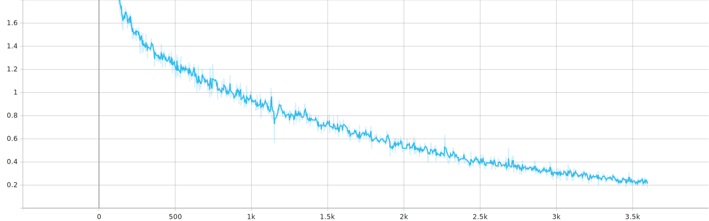

我们使用迁移学习，基于`ImageNet`预训练模型将`AlexNet`在华为云垃圾分类数据集上跑到了 63%的 top 1 accuracy，已经达到原论文中 top 1 error 3.75%的水准，任务成功。

准确率：

Loss：

比较有趣的是学习率的设置，第一次迁移学习`lr`设置为`5e-3`，结果模型的准确率停留在 0.06，只有 6%的结果是正确的。训练到 200 epoch 是这样，估计再训练下去也不会有太大进展。将学习率调节为`1e-5`后得出以上结果，但看到到后期模型可能也出现了和第一次类似的问题（`lr`过大），所以找了文章学习更新权值的方案。

最后没有跑一遍`validation`，下次注意。

$$
\begin{aligned}
v_{i+1} &:=0.9 \cdot v_{i}-0.0005 \cdot \epsilon \cdot w_{i}-\epsilon \cdot\left\langle\left.\frac{\partial L}{\partial w}\right|_{w_{i}}\right\rangle_{D_{i}} \\
w_{i+1} &:=w_{i}+v_{i+1}
\end{aligned}
$$

原文用了$0.0005$的`weight decay`，当时没有`Adam`，所以用了$0.9$的`momentum`，

然后发现 Alexander 用的相同学习率。还是早期的神经网络呀。

---

感谢 SCU Maker 提供的 NVIDIA 2080 Ti GPU 支持。
