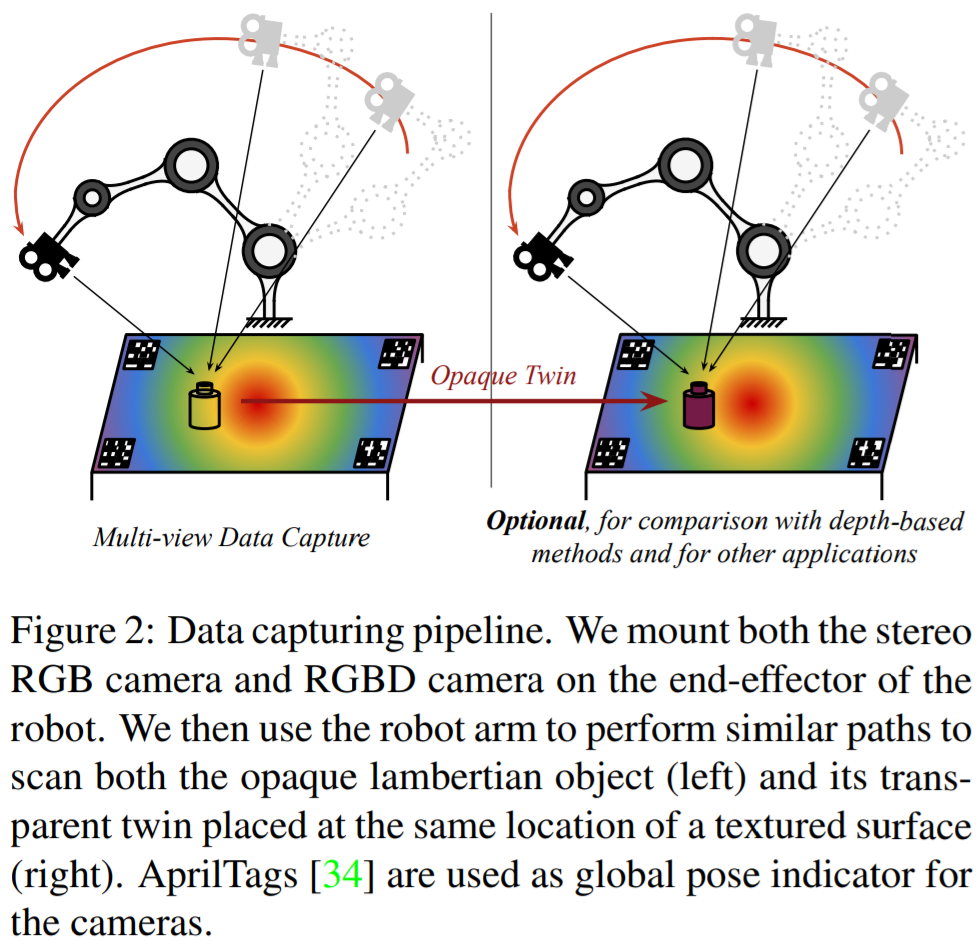

```plain
@incollection{SilbermanNathan2012ISaS,
  series    = {Lecture Notes in Computer Science},
  issn      = {0302-9743},
  abstract  = {We present an approach to interpret the major surfaces, objects, and support relations of an indoor scene from an RGBD image. Most existing work ignores physical interactions or is applied only to tidy rooms and hallways. Our goal is to parse typical, often messy, indoor scenes into floor, walls, supporting surfaces, and object regions, and to recover support relationships. One of our main interests is to better understand how 3D cues can best inform a structured 3D interpretation. We also contribute a novel integer programming formulation to infer physical support relations. We offer a new dataset of 1449 RGBD images, capturing 464 diverse indoor scenes, with detailed annotations. Our experiments demonstrate our ability to infer support relations in complex scenes and verify that our 3D scene cues and inferred support lead to better object segmentation.},
  pages     = {746--760},
  volume    = {7576},
  publisher = {Springer Berlin Heidelberg},
  booktitle = {Computer Vision – ECCV 2012},
  number    = {5},
  isbn      = {9783642337147},
  year      = {2012},
  title     = {Indoor Segmentation and Support Inference from RGBD Images},
  copyright = {Springer-Verlag Berlin Heidelberg 2012},
  language  = {eng},
  address   = {Berlin, Heidelberg},
  author    = {Silberman, Nathan and Hoiem, Derek and Kohli, Pushmeet and Fergus, Rob}
}
```

在此文章中，作者提出了一种理解室内 RGB-D 图像 major surfaces, objects 和 support relations 的方法。文章目标是实现理解常见的、经常是 messy 的室内场景，将其分成地面、墙面、supporting surfaces、object regions，并恢复 support relationships。作者主要目的是通过三维的线索（cue）理解一个更具结构化的三维空间。

同时，作者提出了一种整数规划的方法；推出了一个有 1449 张 RGBD 图像的数据集。

---

传统方法中对场景的理解需要对图像中每一个物体提供标签，但这些标签并不能告诉我们物体之间的物理关系和可能执行的动作，比如人看到水杯会将其拿起来，如果上面盖着一块 Kindle 要先把 Kindle 拿走。

这些任务需要将场景理解为物体、表面以及其之间的关系。这篇文章就提供了这样的理解方法。

本文提出的方法是：对表面与物体的可见部分进行分割后推测其之间的关系。

是一个分割问题，但是暂时没有发现如何处理丢失的深度信息的，去找一下引用它的文献。

文献代码：https://cs.nyu.edu/~silberman/code.html

---

## [KeyPose: multi-view 3D labeling and keypoint estimation for transparent objects](http://arxiv.org/abs/1912.02805)

```plain
@inproceedings{LiuXingyu2020KM3L,
  issn      = {1063-6919},
  pages     = {11599--11607},
  booktitle = {Proceedings of the IEEE Computer Society Conference on Computer Vision and Pattern Recognition},
  year      = {2020},
  title     = {KeyPose: Multi-View 3D Labeling and Keypoint Estimation for Transparent Objects},
  copyright = {Copyright 2020 Elsevier B.V., All rights reserved.},
  language  = {eng},
  author    = {Liu, Xingyu and Jonschkowski, Rico and Angelova, Anelia and Konolige, Kurt}
}
```

这篇由 Google Research 进行的工作从立体 RGB 图像中对三维物体进行关键点检测。

透明物体关键点检测有以下难点：

1. 没有大规模的数据集
2. 标注困难

3. 如何只通过 RGB 图像进行特征点估计，就此摆脱对深度信息的要求

### 主要贡献

1. 4D/6D/9D 姿势表达
2. 基于关键点的表达

3. （端到端的）立体偏移估计
4. 三维物体姿态检测数据集

#### 4D/6D/9D 姿势表达

1. 观测的 RGB 图像与渲染的 CAD 模型 there has been no work done on rendering depth images that faithfully reproduces the degraded depth seen in real-world RGBD data
2. 从 RGB 或三维点云中回归出对象坐标值

Our method does not assume object rigidity, and the object pose is based the locations of 3D keypoints, which can be used on articulated or deformable objects. Our method also does not rely on prior knowledge about each individual object, such as a 3D CAD model.

#### 基于关键点的表达

前人工作一部分主要集中在在二维平面上利用 RGB 或 RGBD 图像进行估计，并通过深度信息投影到三维空间。还有一部分使用单目视觉估计方法。虽然在利用二维信息估计三维坐标是一个 ill-conditioned problem，但模型在预训练期间已经习得了物体的先验大小。我们的工作受此启发，从立体信息中提取关键点，是一个 well-conditioned problem。

. Recently, a method similar to ours was proposed for hand tracking using raw strereo 这一句涉及最近工作

ClearGrasp：对透明物体进行检测

#### 端到端立体偏移估计

The success of deep-learning methods in computer vision inspired research in this area, using end-to-end deep networks equipped with a correlation cost volume [19, 11, 5, 36], or point-based depth representation and iterative refinement [3]

本文工作没有做密集预测，而是对**关键点**的偏移进行预测

#### 数据集

作为财力雄厚的谷歌公司，数据集自然不在话下。

```bash
# 其实可以用个循环的
wget https://storage.googleapis.com/keypose-transparent-object-dataset/ball_0.zip
wget https://storage.googleapis.com/keypose-transparent-object-dataset/bottle_0.zip
wget https://storage.googleapis.com/keypose-transparent-object-dataset/bottle_1.zip
wget https://storage.googleapis.com/keypose-transparent-object-dataset/bottle_2.zip
wget https://storage.googleapis.com/keypose-transparent-object-dataset/cup_0.zip
wget https://storage.googleapis.com/keypose-transparent-object-dataset/cup_1.zip
wget https://storage.googleapis.com/keypose-transparent-object-dataset/mug_0.zip
wget https://storage.googleapis.com/keypose-transparent-object-dataset/mug_1.zip
wget https://storage.googleapis.com/keypose-transparent-object-dataset/mug_2.zip
wget https://storage.googleapis.com/keypose-transparent-object-dataset/mug_3.zip
wget https://storage.googleapis.com/keypose-transparent-object-dataset/mug_4.zip
wget https://storage.googleapis.com/keypose-transparent-object-dataset/mug_5.zip
wget https://storage.googleapis.com/keypose-transparent-object-dataset/mug_6.zip
wget https://storage.googleapis.com/keypose-transparent-object-dataset/heart_0.zip
wget https://storage.googleapis.com/keypose-transparent-object-dataset/tree_0.zip
```

#### 对透明或反射性质物体的估计

Objects that are transparent or reflective present significant challenges for all camera-based depth estimation.

之前的应对的方法有 1) 预知物体的形状 2) 使用生成的 CAD 模型

本文的方法使大规模生成真实的数据成为可能，无需生成数据。

### 相关工作

```
pass
```

### 本文方法

#### 使用机器人进行数据采集



#### 从 RGB Stereo 图像进行三维关键点检测

物体左右有偏移（提问：哪里说有两个相机了），所以将 right crop 水平平移 30px，使得 apparent disparity 变成 18-66px。每个 crop 的输入大小为px。

### 方法

首先使用类似于 ClearGrasp 的方法进行目标检测；或者 heatmap。根据 bounding box 我们从左侧图片切下一块，从右侧切下对应的一块， preserving the epipolar geometry。（极线)

模型处理图像，使得对每一个关键点，都可以在（二维）图像上找到对应偏移的点；也就是说，三元组编码了一个三维空间的坐标，也就是定义了一个映射，其中是由相机参数决定的*projection matrix*。作者使用坐标计算 loss，反向传播到二维图片，反映到的更新上。**Reprojected pixel errors**是多视角几何常常采用的方法。评估三维的误差可能导致一个很大的 bias，因为三维误差是平方级增长的，大的误差很容易掩盖小的误差。

To encourage generalization, we perform geometric and photometric augmentation of the input images. 作者还对输入图片进行了正则化操作，但这种正则化操作不能未被 epipolar constraints.

### 三维姿势识别的估计

KeyPose 模型遵循一下原则：

1.  Use stereo images to introduce depth information to the model.
2.  Early Fusion：在模型的前期将信息和信息融合，让神经网路隐式确定其中的依赖

3.  Broad Context： Extend the spatial context of each keypoint as broadly as possible, to take advantage of any relevant shape information of the object. 也就是尽可能广的利用 keypoint 的上下文信息

### 模型结构


立体图像 stack 起来，喂进一组 exponentially-dilated 3x3 convolutions（_Multi-scale context aggregation by dilated convolutions_）来拓展关键点的上下文，有两个这样的组。通过 CNN 的 feature 的数量被严格控制（instance models 48, category models 64）。在此之后，_projection heads_，每个 keypoint 一个，提取坐标。作者调研了 direct regression 和 heapmaps 两种方法，Direct regression 通过 1x1 卷积层产生个数值坐标（为 keypoint 数目)，Heatmap 方法通过 probability map 和 disparity heapmap 进行密集预测；代码中作者通过`use_regress`参数进行了两种方法的选择。

为了证明 Early fusiong 的效果，作者也使用了 late fusion 方法作为对比


### 损失函数

#### Keypoint loss

设是预测得到的值，是标签（Ground Truth），通过平方估计误差；不直接使用三维误差是因为误差平方级增长，导致 bias 很大。

#### Projection loss

设是投影函数，，那么

这段损失还是没有看太明白，需要结合代码好好理解

#### Locality loss

虽然预测到了 keypoint，但不知道预测值与真实值之间的差距，Locality loss 有助于 probability map 向 keypoint 集中。，其中是环状正态分布，中心位于 keypoint 的标注的点，标准差为，而是一个正则化的逆：。作者选择为 10px。

总 Loss 是三者的加权和：。

同时，作者考虑到了 keypoint 的对称性问题，也就是，和其实是同样的关键点。 is evaluated for each of these permutations, and the minimum is chosen as the final loss.

### 训练

```yaml
batch_size: 32
epoch: 300
```

`DenseFusion`可能原来是`PyTorch`写的，估计可以加入我的代码库。https://github.com/j96w/DenseFusion

实验和消融实验就先不看了，咱们`GPU`上见！

## 思考

1. 机械臂的抓取是否也可以归类为一个关键点问题？

---

```plain
@article{Guo_Hua_2019,
  doi       = {10.1088/1742-6596/1183/1/012011},
  url       = {https://doi.org/10.1088/1742-6596/1183/1/012011},
  year      = 2019,
  month     = {mar},
  publisher = {{IOP} Publishing},
  volume    = {1183},
  pages     = {012011},
  author    = {Chen Guo-Hua and Wang Jun-Yi and Zhang Ai-Jun},
  title     = {Transparent object detection and location based on {RGB}-D camera},
  journal   = {Journal of Physics: Conference Series},
  abstract  = {In order to improve the accuracy and efficiency of robot grasping, we propose a new method for transparent object detection and location that utilize depth image, RGB image and IR image. In detection process, an active depth sensor (RealSense) is firstly employed to retrieve the transparent candidates from the depth image and the corresponding candidates in the RGB image and IR image are then extracted separately. A transparent candidate classification algorithm is subsequently presented that uses SIFT features to recognize the transparent ones from the candidates. In location process, we obtain a new group of RGB images and IR images by adjusting camera orientation to make its optical axis perpendicular to the normal direction of the plane on which the object is placed. The object contours in RGB image and IR image are then extracted, respectively. The three-dimensional object is finally reconstructed by means of stereo matching of the two contours, and the current pose information of the object is calculated in the end. In order to verify the feasibility of the method, we built a hand-eye test system with a movable industrial robot to detect and capture transparent objects at different locations. The final test results demonstrate that the method is more general and effective than the traditional one.}
}
Ruppel, Philipp, Michael Görner, Norman Hendrich, and Jianwei Zhang. "Detection and Reconstruction of Transparent Objects with Infrared Projection-Based RGB-D Cameras." Cognitive Systems and Signal Processing. Vol. 1397. Singapore: Springer Singapore, 2021. 558-69. Communications in Computer and Information Science. Web.
```

<iframe frameborder="no" border="0" marginwidth="0" marginheight="0" width=330 height=86 src="//music.163.com/outchain/player?type=2&id=1842025914&auto=1&height=66"></iframe>
