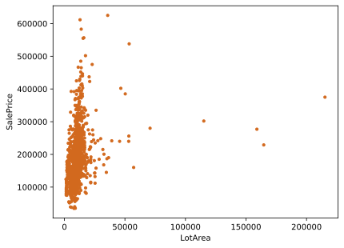
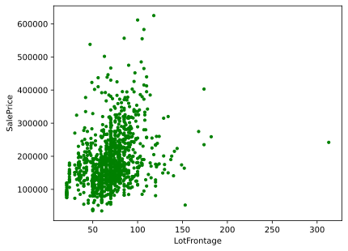
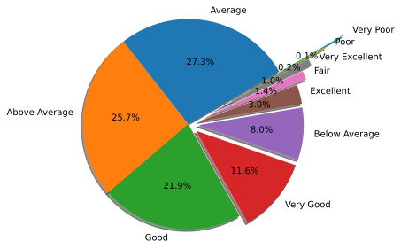
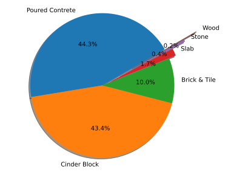
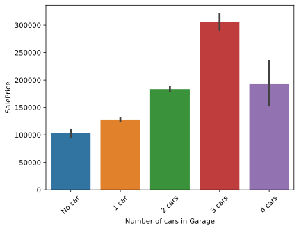
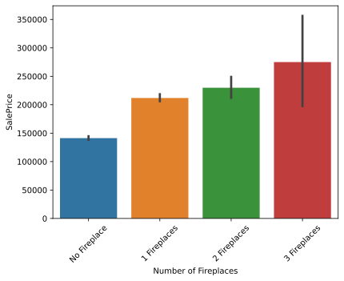
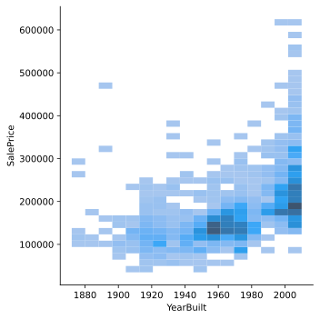
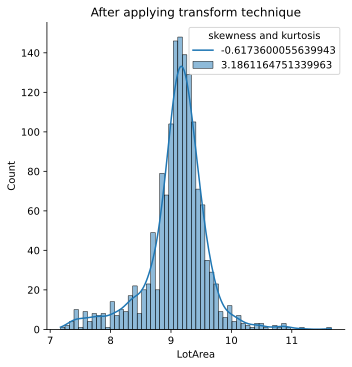
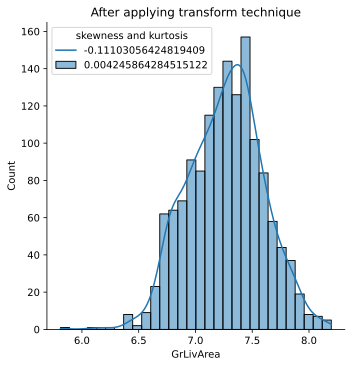
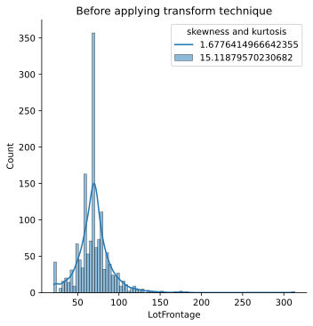

先说好，这个是我找的，而且我也不知道是从哪里找的……

# Overview

This notebook covers the step by step process of building a Machine Learning model to predict the House price. As in a standard machine learning workflow, the process is divided into the following steps:

1. Understanding the Problem;
2. Exploratory Data Analysis;
3. Data Preprocessing;
4. Feature Selection;
5. Modeling;
6. Evaluation.

## Understanding the problem

A dataset was given which has 79 explanatory variables describing (almost) every aspect of residential homes. Our task is to find prices of new houses using Machine Learning.

```python
# basic library import section
import numpy as np
import pandas as pd
import matplotlib.pyplot as plt
import seaborn as sns
import warnings
pd.set_option('display.max_rows', None) # display all rows
warnings.filterwarnings('ignore')
%matplotlib inline
import matplotlib_inline
matplotlib_inline.backend_inline.set_matplotlib_formats('svg')
```

```python
# loading our two required dataset
train = pd.read_csv(f'./house-prices-advanced-regression-techniques/train.csv')
test = pd.read_csv(f'./house-prices-advanced-regression-techniques/test.csv')
```

```python
train.shape, test.shape
```

    ((1460, 81), (1459, 80))

```python
train.head(20)
```

<div>
<style scoped>
    .dataframe tbody tr th:only-of-type {
        vertical-align: middle;
    }

    .dataframe tbody tr th {
        vertical-align: top;
    }

    .dataframe thead th {
        text-align: right;
    }

</style>
<table border="1" class="dataframe">
  <thead>
    <tr style="text-align: right;">
      <th></th>
      <th>Id</th>
      <th>MSSubClass</th>
      <th>MSZoning</th>
      <th>LotFrontage</th>
      <th>LotArea</th>
      <th>Street</th>
      <th>Alley</th>
      <th>LotShape</th>
      <th>LandContour</th>
      <th>Utilities</th>
      <th>...</th>
      <th>PoolArea</th>
      <th>PoolQC</th>
      <th>Fence</th>
      <th>MiscFeature</th>
      <th>MiscVal</th>
      <th>MoSold</th>
      <th>YrSold</th>
      <th>SaleType</th>
      <th>SaleCondition</th>
      <th>SalePrice</th>
    </tr>
  </thead>
  <tbody>
    <tr>
      <th>0</th>
      <td>1</td>
      <td>60</td>
      <td>RL</td>
      <td>65.0</td>
      <td>8450</td>
      <td>Pave</td>
      <td>NaN</td>
      <td>Reg</td>
      <td>Lvl</td>
      <td>AllPub</td>
      <td>...</td>
      <td>0</td>
      <td>NaN</td>
      <td>NaN</td>
      <td>NaN</td>
      <td>0</td>
      <td>2</td>
      <td>2008</td>
      <td>WD</td>
      <td>Normal</td>
      <td>208500</td>
    </tr>
    <tr>
      <th>1</th>
      <td>2</td>
      <td>20</td>
      <td>RL</td>
      <td>80.0</td>
      <td>9600</td>
      <td>Pave</td>
      <td>NaN</td>
      <td>Reg</td>
      <td>Lvl</td>
      <td>AllPub</td>
      <td>...</td>
      <td>0</td>
      <td>NaN</td>
      <td>NaN</td>
      <td>NaN</td>
      <td>0</td>
      <td>5</td>
      <td>2007</td>
      <td>WD</td>
      <td>Normal</td>
      <td>181500</td>
    </tr>
    <tr>
      <th>2</th>
      <td>3</td>
      <td>60</td>
      <td>RL</td>
      <td>68.0</td>
      <td>11250</td>
      <td>Pave</td>
      <td>NaN</td>
      <td>IR1</td>
      <td>Lvl</td>
      <td>AllPub</td>
      <td>...</td>
      <td>0</td>
      <td>NaN</td>
      <td>NaN</td>
      <td>NaN</td>
      <td>0</td>
      <td>9</td>
      <td>2008</td>
      <td>WD</td>
      <td>Normal</td>
      <td>223500</td>
    </tr>
    <tr>
      <th>3</th>
      <td>4</td>
      <td>70</td>
      <td>RL</td>
      <td>60.0</td>
      <td>9550</td>
      <td>Pave</td>
      <td>NaN</td>
      <td>IR1</td>
      <td>Lvl</td>
      <td>AllPub</td>
      <td>...</td>
      <td>0</td>
      <td>NaN</td>
      <td>NaN</td>
      <td>NaN</td>
      <td>0</td>
      <td>2</td>
      <td>2006</td>
      <td>WD</td>
      <td>Abnorml</td>
      <td>140000</td>
    </tr>
    <tr>
      <th>4</th>
      <td>5</td>
      <td>60</td>
      <td>RL</td>
      <td>84.0</td>
      <td>14260</td>
      <td>Pave</td>
      <td>NaN</td>
      <td>IR1</td>
      <td>Lvl</td>
      <td>AllPub</td>
      <td>...</td>
      <td>0</td>
      <td>NaN</td>
      <td>NaN</td>
      <td>NaN</td>
      <td>0</td>
      <td>12</td>
      <td>2008</td>
      <td>WD</td>
      <td>Normal</td>
      <td>250000</td>
    </tr>
    <tr>
      <th>5</th>
      <td>6</td>
      <td>50</td>
      <td>RL</td>
      <td>85.0</td>
      <td>14115</td>
      <td>Pave</td>
      <td>NaN</td>
      <td>IR1</td>
      <td>Lvl</td>
      <td>AllPub</td>
      <td>...</td>
      <td>0</td>
      <td>NaN</td>
      <td>MnPrv</td>
      <td>Shed</td>
      <td>700</td>
      <td>10</td>
      <td>2009</td>
      <td>WD</td>
      <td>Normal</td>
      <td>143000</td>
    </tr>
    <tr>
      <th>6</th>
      <td>7</td>
      <td>20</td>
      <td>RL</td>
      <td>75.0</td>
      <td>10084</td>
      <td>Pave</td>
      <td>NaN</td>
      <td>Reg</td>
      <td>Lvl</td>
      <td>AllPub</td>
      <td>...</td>
      <td>0</td>
      <td>NaN</td>
      <td>NaN</td>
      <td>NaN</td>
      <td>0</td>
      <td>8</td>
      <td>2007</td>
      <td>WD</td>
      <td>Normal</td>
      <td>307000</td>
    </tr>
    <tr>
      <th>7</th>
      <td>8</td>
      <td>60</td>
      <td>RL</td>
      <td>NaN</td>
      <td>10382</td>
      <td>Pave</td>
      <td>NaN</td>
      <td>IR1</td>
      <td>Lvl</td>
      <td>AllPub</td>
      <td>...</td>
      <td>0</td>
      <td>NaN</td>
      <td>NaN</td>
      <td>Shed</td>
      <td>350</td>
      <td>11</td>
      <td>2009</td>
      <td>WD</td>
      <td>Normal</td>
      <td>200000</td>
    </tr>
    <tr>
      <th>8</th>
      <td>9</td>
      <td>50</td>
      <td>RM</td>
      <td>51.0</td>
      <td>6120</td>
      <td>Pave</td>
      <td>NaN</td>
      <td>Reg</td>
      <td>Lvl</td>
      <td>AllPub</td>
      <td>...</td>
      <td>0</td>
      <td>NaN</td>
      <td>NaN</td>
      <td>NaN</td>
      <td>0</td>
      <td>4</td>
      <td>2008</td>
      <td>WD</td>
      <td>Abnorml</td>
      <td>129900</td>
    </tr>
    <tr>
      <th>9</th>
      <td>10</td>
      <td>190</td>
      <td>RL</td>
      <td>50.0</td>
      <td>7420</td>
      <td>Pave</td>
      <td>NaN</td>
      <td>Reg</td>
      <td>Lvl</td>
      <td>AllPub</td>
      <td>...</td>
      <td>0</td>
      <td>NaN</td>
      <td>NaN</td>
      <td>NaN</td>
      <td>0</td>
      <td>1</td>
      <td>2008</td>
      <td>WD</td>
      <td>Normal</td>
      <td>118000</td>
    </tr>
    <tr>
      <th>10</th>
      <td>11</td>
      <td>20</td>
      <td>RL</td>
      <td>70.0</td>
      <td>11200</td>
      <td>Pave</td>
      <td>NaN</td>
      <td>Reg</td>
      <td>Lvl</td>
      <td>AllPub</td>
      <td>...</td>
      <td>0</td>
      <td>NaN</td>
      <td>NaN</td>
      <td>NaN</td>
      <td>0</td>
      <td>2</td>
      <td>2008</td>
      <td>WD</td>
      <td>Normal</td>
      <td>129500</td>
    </tr>
    <tr>
      <th>11</th>
      <td>12</td>
      <td>60</td>
      <td>RL</td>
      <td>85.0</td>
      <td>11924</td>
      <td>Pave</td>
      <td>NaN</td>
      <td>IR1</td>
      <td>Lvl</td>
      <td>AllPub</td>
      <td>...</td>
      <td>0</td>
      <td>NaN</td>
      <td>NaN</td>
      <td>NaN</td>
      <td>0</td>
      <td>7</td>
      <td>2006</td>
      <td>New</td>
      <td>Partial</td>
      <td>345000</td>
    </tr>
    <tr>
      <th>12</th>
      <td>13</td>
      <td>20</td>
      <td>RL</td>
      <td>NaN</td>
      <td>12968</td>
      <td>Pave</td>
      <td>NaN</td>
      <td>IR2</td>
      <td>Lvl</td>
      <td>AllPub</td>
      <td>...</td>
      <td>0</td>
      <td>NaN</td>
      <td>NaN</td>
      <td>NaN</td>
      <td>0</td>
      <td>9</td>
      <td>2008</td>
      <td>WD</td>
      <td>Normal</td>
      <td>144000</td>
    </tr>
    <tr>
      <th>13</th>
      <td>14</td>
      <td>20</td>
      <td>RL</td>
      <td>91.0</td>
      <td>10652</td>
      <td>Pave</td>
      <td>NaN</td>
      <td>IR1</td>
      <td>Lvl</td>
      <td>AllPub</td>
      <td>...</td>
      <td>0</td>
      <td>NaN</td>
      <td>NaN</td>
      <td>NaN</td>
      <td>0</td>
      <td>8</td>
      <td>2007</td>
      <td>New</td>
      <td>Partial</td>
      <td>279500</td>
    </tr>
    <tr>
      <th>14</th>
      <td>15</td>
      <td>20</td>
      <td>RL</td>
      <td>NaN</td>
      <td>10920</td>
      <td>Pave</td>
      <td>NaN</td>
      <td>IR1</td>
      <td>Lvl</td>
      <td>AllPub</td>
      <td>...</td>
      <td>0</td>
      <td>NaN</td>
      <td>GdWo</td>
      <td>NaN</td>
      <td>0</td>
      <td>5</td>
      <td>2008</td>
      <td>WD</td>
      <td>Normal</td>
      <td>157000</td>
    </tr>
    <tr>
      <th>15</th>
      <td>16</td>
      <td>45</td>
      <td>RM</td>
      <td>51.0</td>
      <td>6120</td>
      <td>Pave</td>
      <td>NaN</td>
      <td>Reg</td>
      <td>Lvl</td>
      <td>AllPub</td>
      <td>...</td>
      <td>0</td>
      <td>NaN</td>
      <td>GdPrv</td>
      <td>NaN</td>
      <td>0</td>
      <td>7</td>
      <td>2007</td>
      <td>WD</td>
      <td>Normal</td>
      <td>132000</td>
    </tr>
    <tr>
      <th>16</th>
      <td>17</td>
      <td>20</td>
      <td>RL</td>
      <td>NaN</td>
      <td>11241</td>
      <td>Pave</td>
      <td>NaN</td>
      <td>IR1</td>
      <td>Lvl</td>
      <td>AllPub</td>
      <td>...</td>
      <td>0</td>
      <td>NaN</td>
      <td>NaN</td>
      <td>Shed</td>
      <td>700</td>
      <td>3</td>
      <td>2010</td>
      <td>WD</td>
      <td>Normal</td>
      <td>149000</td>
    </tr>
    <tr>
      <th>17</th>
      <td>18</td>
      <td>90</td>
      <td>RL</td>
      <td>72.0</td>
      <td>10791</td>
      <td>Pave</td>
      <td>NaN</td>
      <td>Reg</td>
      <td>Lvl</td>
      <td>AllPub</td>
      <td>...</td>
      <td>0</td>
      <td>NaN</td>
      <td>NaN</td>
      <td>Shed</td>
      <td>500</td>
      <td>10</td>
      <td>2006</td>
      <td>WD</td>
      <td>Normal</td>
      <td>90000</td>
    </tr>
    <tr>
      <th>18</th>
      <td>19</td>
      <td>20</td>
      <td>RL</td>
      <td>66.0</td>
      <td>13695</td>
      <td>Pave</td>
      <td>NaN</td>
      <td>Reg</td>
      <td>Lvl</td>
      <td>AllPub</td>
      <td>...</td>
      <td>0</td>
      <td>NaN</td>
      <td>NaN</td>
      <td>NaN</td>
      <td>0</td>
      <td>6</td>
      <td>2008</td>
      <td>WD</td>
      <td>Normal</td>
      <td>159000</td>
    </tr>
    <tr>
      <th>19</th>
      <td>20</td>
      <td>20</td>
      <td>RL</td>
      <td>70.0</td>
      <td>7560</td>
      <td>Pave</td>
      <td>NaN</td>
      <td>Reg</td>
      <td>Lvl</td>
      <td>AllPub</td>
      <td>...</td>
      <td>0</td>
      <td>NaN</td>
      <td>MnPrv</td>
      <td>NaN</td>
      <td>0</td>
      <td>5</td>
      <td>2009</td>
      <td>COD</td>
      <td>Abnorml</td>
      <td>139000</td>
    </tr>
  </tbody>
</table>
<p>20 rows × 81 columns</p>
</div>

Let's print a concise summary of our train DataFrame.

```python
train.info()
```

    <class 'pandas.core.frame.DataFrame'>
    RangeIndex: 1460 entries, 0 to 1459
    Data columns (total 81 columns):
     #   Column         Non-Null Count  Dtype
    ---  ------         --------------  -----
     0   Id             1460 non-null   int64
     1   MSSubClass     1460 non-null   int64
     2   MSZoning       1460 non-null   object
     3   LotFrontage    1201 non-null   float64
     4   LotArea        1460 non-null   int64
     5   Street         1460 non-null   object
     6   Alley          91 non-null     object
     7   LotShape       1460 non-null   object
     8   LandContour    1460 non-null   object
     9   Utilities      1460 non-null   object
     10  LotConfig      1460 non-null   object
     11  LandSlope      1460 non-null   object
     12  Neighborhood   1460 non-null   object
     13  Condition1     1460 non-null   object
     14  Condition2     1460 non-null   object
     15  BldgType       1460 non-null   object
     16  HouseStyle     1460 non-null   object
     17  OverallQual    1460 non-null   int64
     18  OverallCond    1460 non-null   int64
     19  YearBuilt      1460 non-null   int64
     20  YearRemodAdd   1460 non-null   int64
     21  RoofStyle      1460 non-null   object
     22  RoofMatl       1460 non-null   object
     23  Exterior1st    1460 non-null   object
     24  Exterior2nd    1460 non-null   object
     25  MasVnrType     1452 non-null   object
     26  MasVnrArea     1452 non-null   float64
     27  ExterQual      1460 non-null   object
     28  ExterCond      1460 non-null   object
     29  Foundation     1460 non-null   object
     30  BsmtQual       1423 non-null   object
     31  BsmtCond       1423 non-null   object
     32  BsmtExposure   1422 non-null   object
     33  BsmtFinType1   1423 non-null   object
     34  BsmtFinSF1     1460 non-null   int64
     35  BsmtFinType2   1422 non-null   object
     36  BsmtFinSF2     1460 non-null   int64
     37  BsmtUnfSF      1460 non-null   int64
     38  TotalBsmtSF    1460 non-null   int64
     39  Heating        1460 non-null   object
     40  HeatingQC      1460 non-null   object
     41  CentralAir     1460 non-null   object
     42  Electrical     1459 non-null   object
     43  1stFlrSF       1460 non-null   int64
     44  2ndFlrSF       1460 non-null   int64
     45  LowQualFinSF   1460 non-null   int64
     46  GrLivArea      1460 non-null   int64
     47  BsmtFullBath   1460 non-null   int64
     48  BsmtHalfBath   1460 non-null   int64
     49  FullBath       1460 non-null   int64
     50  HalfBath       1460 non-null   int64
     51  BedroomAbvGr   1460 non-null   int64
     52  KitchenAbvGr   1460 non-null   int64
     53  KitchenQual    1460 non-null   object
     54  TotRmsAbvGrd   1460 non-null   int64
     55  Functional     1460 non-null   object
     56  Fireplaces     1460 non-null   int64
     57  FireplaceQu    770 non-null    object
     58  GarageType     1379 non-null   object
     59  GarageYrBlt    1379 non-null   float64
     60  GarageFinish   1379 non-null   object
     61  GarageCars     1460 non-null   int64
     62  GarageArea     1460 non-null   int64
     63  GarageQual     1379 non-null   object
     64  GarageCond     1379 non-null   object
     65  PavedDrive     1460 non-null   object
     66  WoodDeckSF     1460 non-null   int64
     67  OpenPorchSF    1460 non-null   int64
     68  EnclosedPorch  1460 non-null   int64
     69  3SsnPorch      1460 non-null   int64
     70  ScreenPorch    1460 non-null   int64
     71  PoolArea       1460 non-null   int64
     72  PoolQC         7 non-null      object
     73  Fence          281 non-null    object
     74  MiscFeature    54 non-null     object
     75  MiscVal        1460 non-null   int64
     76  MoSold         1460 non-null   int64
     77  YrSold         1460 non-null   int64
     78  SaleType       1460 non-null   object
     79  SaleCondition  1460 non-null   object
     80  SalePrice      1460 non-null   int64
    dtypes: float64(3), int64(35), object(43)
    memory usage: 924.0+ KB

descriptive statistics of our train set

```python
train.describe().T
```

<div>
<style scoped>
    .dataframe tbody tr th:only-of-type {
        vertical-align: middle;
    }

    .dataframe tbody tr th {
        vertical-align: top;
    }

    .dataframe thead th {
        text-align: right;
    }

</style>
<table border="1" class="dataframe">
  <thead>
    <tr style="text-align: right;">
      <th></th>
      <th>count</th>
      <th>mean</th>
      <th>std</th>
      <th>min</th>
      <th>25%</th>
      <th>50%</th>
      <th>75%</th>
      <th>max</th>
    </tr>
  </thead>
  <tbody>
    <tr>
      <th>Id</th>
      <td>1460.0</td>
      <td>730.500000</td>
      <td>421.610009</td>
      <td>1.0</td>
      <td>365.75</td>
      <td>730.5</td>
      <td>1095.25</td>
      <td>1460.0</td>
    </tr>
    <tr>
      <th>MSSubClass</th>
      <td>1460.0</td>
      <td>56.897260</td>
      <td>42.300571</td>
      <td>20.0</td>
      <td>20.00</td>
      <td>50.0</td>
      <td>70.00</td>
      <td>190.0</td>
    </tr>
    <tr>
      <th>LotFrontage</th>
      <td>1201.0</td>
      <td>70.049958</td>
      <td>24.284752</td>
      <td>21.0</td>
      <td>59.00</td>
      <td>69.0</td>
      <td>80.00</td>
      <td>313.0</td>
    </tr>
    <tr>
      <th>LotArea</th>
      <td>1460.0</td>
      <td>10516.828082</td>
      <td>9981.264932</td>
      <td>1300.0</td>
      <td>7553.50</td>
      <td>9478.5</td>
      <td>11601.50</td>
      <td>215245.0</td>
    </tr>
    <tr>
      <th>OverallQual</th>
      <td>1460.0</td>
      <td>6.099315</td>
      <td>1.382997</td>
      <td>1.0</td>
      <td>5.00</td>
      <td>6.0</td>
      <td>7.00</td>
      <td>10.0</td>
    </tr>
    <tr>
      <th>OverallCond</th>
      <td>1460.0</td>
      <td>5.575342</td>
      <td>1.112799</td>
      <td>1.0</td>
      <td>5.00</td>
      <td>5.0</td>
      <td>6.00</td>
      <td>9.0</td>
    </tr>
    <tr>
      <th>YearBuilt</th>
      <td>1460.0</td>
      <td>1971.267808</td>
      <td>30.202904</td>
      <td>1872.0</td>
      <td>1954.00</td>
      <td>1973.0</td>
      <td>2000.00</td>
      <td>2010.0</td>
    </tr>
    <tr>
      <th>YearRemodAdd</th>
      <td>1460.0</td>
      <td>1984.865753</td>
      <td>20.645407</td>
      <td>1950.0</td>
      <td>1967.00</td>
      <td>1994.0</td>
      <td>2004.00</td>
      <td>2010.0</td>
    </tr>
    <tr>
      <th>MasVnrArea</th>
      <td>1452.0</td>
      <td>103.685262</td>
      <td>181.066207</td>
      <td>0.0</td>
      <td>0.00</td>
      <td>0.0</td>
      <td>166.00</td>
      <td>1600.0</td>
    </tr>
    <tr>
      <th>BsmtFinSF1</th>
      <td>1460.0</td>
      <td>443.639726</td>
      <td>456.098091</td>
      <td>0.0</td>
      <td>0.00</td>
      <td>383.5</td>
      <td>712.25</td>
      <td>5644.0</td>
    </tr>
    <tr>
      <th>BsmtFinSF2</th>
      <td>1460.0</td>
      <td>46.549315</td>
      <td>161.319273</td>
      <td>0.0</td>
      <td>0.00</td>
      <td>0.0</td>
      <td>0.00</td>
      <td>1474.0</td>
    </tr>
    <tr>
      <th>BsmtUnfSF</th>
      <td>1460.0</td>
      <td>567.240411</td>
      <td>441.866955</td>
      <td>0.0</td>
      <td>223.00</td>
      <td>477.5</td>
      <td>808.00</td>
      <td>2336.0</td>
    </tr>
    <tr>
      <th>TotalBsmtSF</th>
      <td>1460.0</td>
      <td>1057.429452</td>
      <td>438.705324</td>
      <td>0.0</td>
      <td>795.75</td>
      <td>991.5</td>
      <td>1298.25</td>
      <td>6110.0</td>
    </tr>
    <tr>
      <th>1stFlrSF</th>
      <td>1460.0</td>
      <td>1162.626712</td>
      <td>386.587738</td>
      <td>334.0</td>
      <td>882.00</td>
      <td>1087.0</td>
      <td>1391.25</td>
      <td>4692.0</td>
    </tr>
    <tr>
      <th>2ndFlrSF</th>
      <td>1460.0</td>
      <td>346.992466</td>
      <td>436.528436</td>
      <td>0.0</td>
      <td>0.00</td>
      <td>0.0</td>
      <td>728.00</td>
      <td>2065.0</td>
    </tr>
    <tr>
      <th>LowQualFinSF</th>
      <td>1460.0</td>
      <td>5.844521</td>
      <td>48.623081</td>
      <td>0.0</td>
      <td>0.00</td>
      <td>0.0</td>
      <td>0.00</td>
      <td>572.0</td>
    </tr>
    <tr>
      <th>GrLivArea</th>
      <td>1460.0</td>
      <td>1515.463699</td>
      <td>525.480383</td>
      <td>334.0</td>
      <td>1129.50</td>
      <td>1464.0</td>
      <td>1776.75</td>
      <td>5642.0</td>
    </tr>
    <tr>
      <th>BsmtFullBath</th>
      <td>1460.0</td>
      <td>0.425342</td>
      <td>0.518911</td>
      <td>0.0</td>
      <td>0.00</td>
      <td>0.0</td>
      <td>1.00</td>
      <td>3.0</td>
    </tr>
    <tr>
      <th>BsmtHalfBath</th>
      <td>1460.0</td>
      <td>0.057534</td>
      <td>0.238753</td>
      <td>0.0</td>
      <td>0.00</td>
      <td>0.0</td>
      <td>0.00</td>
      <td>2.0</td>
    </tr>
    <tr>
      <th>FullBath</th>
      <td>1460.0</td>
      <td>1.565068</td>
      <td>0.550916</td>
      <td>0.0</td>
      <td>1.00</td>
      <td>2.0</td>
      <td>2.00</td>
      <td>3.0</td>
    </tr>
    <tr>
      <th>HalfBath</th>
      <td>1460.0</td>
      <td>0.382877</td>
      <td>0.502885</td>
      <td>0.0</td>
      <td>0.00</td>
      <td>0.0</td>
      <td>1.00</td>
      <td>2.0</td>
    </tr>
    <tr>
      <th>BedroomAbvGr</th>
      <td>1460.0</td>
      <td>2.866438</td>
      <td>0.815778</td>
      <td>0.0</td>
      <td>2.00</td>
      <td>3.0</td>
      <td>3.00</td>
      <td>8.0</td>
    </tr>
    <tr>
      <th>KitchenAbvGr</th>
      <td>1460.0</td>
      <td>1.046575</td>
      <td>0.220338</td>
      <td>0.0</td>
      <td>1.00</td>
      <td>1.0</td>
      <td>1.00</td>
      <td>3.0</td>
    </tr>
    <tr>
      <th>TotRmsAbvGrd</th>
      <td>1460.0</td>
      <td>6.517808</td>
      <td>1.625393</td>
      <td>2.0</td>
      <td>5.00</td>
      <td>6.0</td>
      <td>7.00</td>
      <td>14.0</td>
    </tr>
    <tr>
      <th>Fireplaces</th>
      <td>1460.0</td>
      <td>0.613014</td>
      <td>0.644666</td>
      <td>0.0</td>
      <td>0.00</td>
      <td>1.0</td>
      <td>1.00</td>
      <td>3.0</td>
    </tr>
    <tr>
      <th>GarageYrBlt</th>
      <td>1379.0</td>
      <td>1978.506164</td>
      <td>24.689725</td>
      <td>1900.0</td>
      <td>1961.00</td>
      <td>1980.0</td>
      <td>2002.00</td>
      <td>2010.0</td>
    </tr>
    <tr>
      <th>GarageCars</th>
      <td>1460.0</td>
      <td>1.767123</td>
      <td>0.747315</td>
      <td>0.0</td>
      <td>1.00</td>
      <td>2.0</td>
      <td>2.00</td>
      <td>4.0</td>
    </tr>
    <tr>
      <th>GarageArea</th>
      <td>1460.0</td>
      <td>472.980137</td>
      <td>213.804841</td>
      <td>0.0</td>
      <td>334.50</td>
      <td>480.0</td>
      <td>576.00</td>
      <td>1418.0</td>
    </tr>
    <tr>
      <th>WoodDeckSF</th>
      <td>1460.0</td>
      <td>94.244521</td>
      <td>125.338794</td>
      <td>0.0</td>
      <td>0.00</td>
      <td>0.0</td>
      <td>168.00</td>
      <td>857.0</td>
    </tr>
    <tr>
      <th>OpenPorchSF</th>
      <td>1460.0</td>
      <td>46.660274</td>
      <td>66.256028</td>
      <td>0.0</td>
      <td>0.00</td>
      <td>25.0</td>
      <td>68.00</td>
      <td>547.0</td>
    </tr>
    <tr>
      <th>EnclosedPorch</th>
      <td>1460.0</td>
      <td>21.954110</td>
      <td>61.119149</td>
      <td>0.0</td>
      <td>0.00</td>
      <td>0.0</td>
      <td>0.00</td>
      <td>552.0</td>
    </tr>
    <tr>
      <th>3SsnPorch</th>
      <td>1460.0</td>
      <td>3.409589</td>
      <td>29.317331</td>
      <td>0.0</td>
      <td>0.00</td>
      <td>0.0</td>
      <td>0.00</td>
      <td>508.0</td>
    </tr>
    <tr>
      <th>ScreenPorch</th>
      <td>1460.0</td>
      <td>15.060959</td>
      <td>55.757415</td>
      <td>0.0</td>
      <td>0.00</td>
      <td>0.0</td>
      <td>0.00</td>
      <td>480.0</td>
    </tr>
    <tr>
      <th>PoolArea</th>
      <td>1460.0</td>
      <td>2.758904</td>
      <td>40.177307</td>
      <td>0.0</td>
      <td>0.00</td>
      <td>0.0</td>
      <td>0.00</td>
      <td>738.0</td>
    </tr>
    <tr>
      <th>MiscVal</th>
      <td>1460.0</td>
      <td>43.489041</td>
      <td>496.123024</td>
      <td>0.0</td>
      <td>0.00</td>
      <td>0.0</td>
      <td>0.00</td>
      <td>15500.0</td>
    </tr>
    <tr>
      <th>MoSold</th>
      <td>1460.0</td>
      <td>6.321918</td>
      <td>2.703626</td>
      <td>1.0</td>
      <td>5.00</td>
      <td>6.0</td>
      <td>8.00</td>
      <td>12.0</td>
    </tr>
    <tr>
      <th>YrSold</th>
      <td>1460.0</td>
      <td>2007.815753</td>
      <td>1.328095</td>
      <td>2006.0</td>
      <td>2007.00</td>
      <td>2008.0</td>
      <td>2009.00</td>
      <td>2010.0</td>
    </tr>
    <tr>
      <th>SalePrice</th>
      <td>1460.0</td>
      <td>180921.195890</td>
      <td>79442.502883</td>
      <td>34900.0</td>
      <td>129975.00</td>
      <td>163000.0</td>
      <td>214000.00</td>
      <td>755000.0</td>
    </tr>
  </tbody>
</table>
</div>

# Feature Selection

Seperating numaric columns and categorical columns

```python
numeric_cols = train.select_dtypes(exclude=['object'])
categorical_cols = train.select_dtypes(include=['object'])
```

```python
#finding important features
correlation_num = numeric_cols.corr()
correlation_num.sort_values(["SalePrice"], ascending = False, inplace = True)
correlation_num.SalePrice
```

    SalePrice        1.000000
    OverallQual      0.790982
    GrLivArea        0.708624
    GarageCars       0.640409
    GarageArea       0.623431
    TotalBsmtSF      0.613581
    1stFlrSF         0.605852
    FullBath         0.560664
    TotRmsAbvGrd     0.533723
    YearBuilt        0.522897
    YearRemodAdd     0.507101
    GarageYrBlt      0.486362
    MasVnrArea       0.477493
    Fireplaces       0.466929
    BsmtFinSF1       0.386420
    LotFrontage      0.351799
    WoodDeckSF       0.324413
    2ndFlrSF         0.319334
    OpenPorchSF      0.315856
    HalfBath         0.284108
    LotArea          0.263843
    BsmtFullBath     0.227122
    BsmtUnfSF        0.214479
    BedroomAbvGr     0.168213
    ScreenPorch      0.111447
    PoolArea         0.092404
    MoSold           0.046432
    3SsnPorch        0.044584
    BsmtFinSF2      -0.011378
    BsmtHalfBath    -0.016844
    MiscVal         -0.021190
    Id              -0.021917
    LowQualFinSF    -0.025606
    YrSold          -0.028923
    OverallCond     -0.077856
    MSSubClass      -0.084284
    EnclosedPorch   -0.128578
    KitchenAbvGr    -0.135907
    Name: SalePrice, dtype: float64

```python
# encode categorical columns
from sklearn.preprocessing import LabelEncoder
cat_le = categorical_cols.apply(LabelEncoder().fit_transform)
cat_le['SalePrice'] = train['SalePrice']
# find important features from categorical values
correlation_cat = cat_le.corr()
correlation_cat.sort_values(["SalePrice"], ascending = False, inplace = True)
correlation_cat.SalePrice
```

    SalePrice        1.000000
    Foundation       0.382479
    CentralAir       0.251328
    Electrical       0.234716
    PavedDrive       0.231357
    RoofStyle        0.222405
    SaleCondition    0.213092
    Neighborhood     0.210851
    HouseStyle       0.180163
    Fence            0.140640
    Alley            0.139868
    RoofMatl         0.132383
    ExterCond        0.117303
    Functional       0.115328
    Exterior2nd      0.103766
    Exterior1st      0.103551
    Condition1       0.091155
    MiscFeature      0.073609
    LandSlope        0.051152
    Street           0.041036
    MasVnrType       0.029658
    GarageCond       0.025149
    LandContour      0.015453
    BsmtCond         0.015058
    BsmtFinType2     0.008041
    Condition2       0.007513
    GarageQual       0.006861
    Utilities       -0.014314
    SaleType        -0.054911
    LotConfig       -0.067396
    BldgType        -0.085591
    Heating         -0.098812
    BsmtFinType1    -0.103114
    PoolQC          -0.126070
    MSZoning        -0.166872
    LotShape        -0.255580
    BsmtExposure    -0.309043
    HeatingQC       -0.400178
    GarageType      -0.415283
    FireplaceQu     -0.459605
    GarageFinish    -0.549247
    KitchenQual     -0.589189
    BsmtQual        -0.620886
    ExterQual       -0.636884
    Name: SalePrice, dtype: float64

Visualizing important features

```python
fig, axarr = plt.subplots(2, 1, figsize = (14, 18))
correlation_num.SalePrice.plot.bar(ax=axarr[0])
correlation_cat.SalePrice.plot.bar(ax=axarr[1])
axarr[0].set_title("Feature importance of numaric columns")
axarr[1].set_title("Feature importance of categorical columns");
```

​

​

# Data Preprocessing (Train set)

```python
# dropping colmuns where number of null values is greater than 500
null_values = train.loc[:, train.isnull().sum() > 500]
train.drop(null_values, axis = 1, inplace = True)
```

Let's remove features with less importance. **Less important features was selected by a smaller absolute value of correlation score**.

```python
# list of less important features
less_important = ['Id', 'MSSubClass', 'OverallCond', 'BsmtFinSF2', 'LowQualFinSF', 'BsmtHalfBath', 'KitchenAbvGr', 'EnclosedPorch',
 '3SsnPorch', 'PoolArea', 'MiscVal', 'MoSold', 'YrSold', 'MSZoning', 'Street', 'LotShape', 'LandContour', 'Utilities',
 'LotConfig', 'LandSlope', 'Condition2', 'BldgType', 'MasVnrType', 'ExterQual', 'BsmtQual', 'BsmtExposure','BsmtFinType1',
 'Heating', 'HeatingQC', 'KitchenQual', 'GarageType', 'GarageFinish','SaleType']

# dropping less important columns
train.drop(less_important, axis = 1, inplace = True)
```

Let's check for null values.

```python
pd.DataFrame(train.isna().sum())
```

<div>
<style scoped>
    .dataframe tbody tr th:only-of-type {
        vertical-align: middle;
    }

    .dataframe tbody tr th {
        vertical-align: top;
    }

    .dataframe thead th {
        text-align: right;
    }

</style>
<table border="1" class="dataframe">
  <thead>
    <tr style="text-align: right;">
      <th></th>
      <th>0</th>
    </tr>
  </thead>
  <tbody>
    <tr>
      <th>LotFrontage</th>
      <td>259</td>
    </tr>
    <tr>
      <th>LotArea</th>
      <td>0</td>
    </tr>
    <tr>
      <th>Neighborhood</th>
      <td>0</td>
    </tr>
    <tr>
      <th>Condition1</th>
      <td>0</td>
    </tr>
    <tr>
      <th>HouseStyle</th>
      <td>0</td>
    </tr>
    <tr>
      <th>OverallQual</th>
      <td>0</td>
    </tr>
    <tr>
      <th>YearBuilt</th>
      <td>0</td>
    </tr>
    <tr>
      <th>YearRemodAdd</th>
      <td>0</td>
    </tr>
    <tr>
      <th>RoofStyle</th>
      <td>0</td>
    </tr>
    <tr>
      <th>RoofMatl</th>
      <td>0</td>
    </tr>
    <tr>
      <th>Exterior1st</th>
      <td>0</td>
    </tr>
    <tr>
      <th>Exterior2nd</th>
      <td>0</td>
    </tr>
    <tr>
      <th>MasVnrArea</th>
      <td>8</td>
    </tr>
    <tr>
      <th>ExterCond</th>
      <td>0</td>
    </tr>
    <tr>
      <th>Foundation</th>
      <td>0</td>
    </tr>
    <tr>
      <th>BsmtCond</th>
      <td>37</td>
    </tr>
    <tr>
      <th>BsmtFinSF1</th>
      <td>0</td>
    </tr>
    <tr>
      <th>BsmtFinType2</th>
      <td>38</td>
    </tr>
    <tr>
      <th>BsmtUnfSF</th>
      <td>0</td>
    </tr>
    <tr>
      <th>TotalBsmtSF</th>
      <td>0</td>
    </tr>
    <tr>
      <th>CentralAir</th>
      <td>0</td>
    </tr>
    <tr>
      <th>Electrical</th>
      <td>1</td>
    </tr>
    <tr>
      <th>1stFlrSF</th>
      <td>0</td>
    </tr>
    <tr>
      <th>2ndFlrSF</th>
      <td>0</td>
    </tr>
    <tr>
      <th>GrLivArea</th>
      <td>0</td>
    </tr>
    <tr>
      <th>BsmtFullBath</th>
      <td>0</td>
    </tr>
    <tr>
      <th>FullBath</th>
      <td>0</td>
    </tr>
    <tr>
      <th>HalfBath</th>
      <td>0</td>
    </tr>
    <tr>
      <th>BedroomAbvGr</th>
      <td>0</td>
    </tr>
    <tr>
      <th>TotRmsAbvGrd</th>
      <td>0</td>
    </tr>
    <tr>
      <th>Functional</th>
      <td>0</td>
    </tr>
    <tr>
      <th>Fireplaces</th>
      <td>0</td>
    </tr>
    <tr>
      <th>GarageYrBlt</th>
      <td>81</td>
    </tr>
    <tr>
      <th>GarageCars</th>
      <td>0</td>
    </tr>
    <tr>
      <th>GarageArea</th>
      <td>0</td>
    </tr>
    <tr>
      <th>GarageQual</th>
      <td>81</td>
    </tr>
    <tr>
      <th>GarageCond</th>
      <td>81</td>
    </tr>
    <tr>
      <th>PavedDrive</th>
      <td>0</td>
    </tr>
    <tr>
      <th>WoodDeckSF</th>
      <td>0</td>
    </tr>
    <tr>
      <th>OpenPorchSF</th>
      <td>0</td>
    </tr>
    <tr>
      <th>ScreenPorch</th>
      <td>0</td>
    </tr>
    <tr>
      <th>SaleCondition</th>
      <td>0</td>
    </tr>
    <tr>
      <th>SalePrice</th>
      <td>0</td>
    </tr>
  </tbody>
</table>
</div>

```python
# filling null values
# for numerical columns, we will fill null values with mean of the rest of the column
train['LotFrontage'].fillna(train['LotFrontage'].mean(), inplace = True)
# for categorical columns, we will fill null values with stardard mode of that column
train['MasVnrArea'].fillna(0 , inplace = True)
train['BsmtCond'].fillna('NA' , inplace = True)
train['BsmtFinType2'].fillna('NA' , inplace = True)
train['Electrical'].fillna('SBrkr' , inplace = True)
train['GarageYrBlt'].fillna(0 , inplace = True)
train['GarageQual'].fillna('NA' , inplace = True)
train['GarageCond'].fillna('NA' , inplace = True)
```

# EDA

The overall quality of a house is a very important factor of the house price as indicated by the correlation value.

```python
plt.scatter(train.OverallQual, train.SalePrice, marker ="^")
plt.xlabel("OverallQual")
plt.ylabel("SalePrice")
plt.show()
```

​

​

It appear to be very correlated to the sales price, and we'll explore it again later.

Accroding to the correlation as well as our natural sense, ground living area is one of the major factor of the sale price. Let's first plot a scatter plot visualizing `GrLivArea` and `SalePrice`

```python
plt.scatter(train.GrLivArea, train.SalePrice, c = "lightcoral", s=10)
plt.xlabel("GrLivArea")
plt.ylabel("SalePrice")
plt.show()
```

​

​

There are some aberrating values that saying Ground living area is bigger than `4000`. We will treat them as outliers.

```python
# removing outliers
train = train[train.GrLivArea < 4000]
```

Let's plot another scatter plot visualizing `LotArea` and `SalePrice`

```python
plt.scatter(train.LotArea, train.SalePrice, c = "chocolate", s=10)
plt.xlabel("LotArea")
plt.ylabel("SalePrice")
plt.show()
```

​

​

We will consider `LotArea` greater than `150000` as outliers.

```python
#removing outliers
train = train[train.LotArea < 150000]
```

Another scatter plot of `LotFrontage` w.r.t `SalePrice`

```python
plt.scatter(train.LotFrontage, train.SalePrice, c = "green", s=10)
plt.xlabel("LotFrontage")
plt.ylabel("SalePrice")
plt.show()
```

​

​

`OverallQual` refers overall quality of the house. This is a important feature. SalePrice largly depends on it. Because if the house quality is `Very Excellent` than it is more likely to be sold with high price. Let's analyse this column.

```python
labels = 'Average', 'Above Average', 'Good', 'Very Good', 'Below Average','Excellent', 'Fair', 'Very Excellent', 'Poor', 'Very Poor'
explode = (0, 0.0, 0.0, 0.1, 0.1, 0.1, 0.2, 0.3, 0.5, 0.7)

fig1, ax1 = plt.subplots()
ax1.pie(train['OverallQual'].value_counts(), explode=explode, labels=labels, autopct='%1.1f%%',
        shadow=True, startangle=30)
ax1.axis('equal')
plt.show()
```

​

​

`27.3%` houses of the train dataset has `Average` quality. And `0.1%` houses are `Very Poor` in quality.

Let's see the `SalePrice` variation w.r.t `OverallQual`

```python
fig = sns.barplot(x = 'OverallQual',y = 'SalePrice', data = train)
fig.set_xticklabels(labels=['Very Poor', 'Poor', 'Fair', 'Below Average', 'Average', 'Above Average', 'Good', 'Very Good', 'Excellent', 'Very Excellent'], rotation=90);
```

​

​

`Foundation` is another important feature. It represent how strong a bulding can be. Buildings life depends on it. So, this column worth analysing.

```python
labels = 'Poured Contrete', 'Cinder Block', 'Brick & Tile', 'Slab', 'Stone', 'Wood'
explode = (0, 0.0, 0.0, 0.1, 0.3, 0.5)

fig1, ax1 = plt.subplots()
ax1.pie(train['Foundation'].value_counts(), explode=explode, labels=labels, autopct='%1.1f%%',
        shadow=True, startangle=30)
ax1.axis('equal')
plt.show()
```

​

​

```python
fig = sns.barplot(x = 'Foundation',y = 'SalePrice', data = train)
fig.set_xticklabels(labels=['Poured Contrete', 'Cinder Block', 'Brick & Tile', 'Wood', 'Slab', 'Stone'], rotation=45)
plt.xlabel("Types of Foundation");
```

​

​

Let's see how `SalePrice` varies w.r.t `GarageCars`

```python
fig = sns.barplot(x = 'GarageCars',y = 'SalePrice', data = train)
fig.set_xticklabels(labels=['No car', '1 car', '2 cars', '3 cars', '4 cars'], rotation=45)
plt.xlabel("Number of cars in Garage");
```

​

​

```python
fig = sns.barplot(x = 'Fireplaces',y = 'SalePrice', data = train)
fig.set_xticklabels(labels=['No Fireplace', '1 Fireplaces', '2 Fireplaces', '3 Fireplaces'], rotation=45)
plt.xlabel("Number of Fireplaces");
```

​

​

Let's plot a distribution plot of `YearBuilt` column representing the year of a house was bult w.r.t saleprice

```python
sns.displot(x = 'YearBuilt', y = 'SalePrice', data = train);
```

​

​

```python
corr = train.corr()
mask = np.triu(np.ones_like(corr, dtype=bool))
f, ax = plt.subplots(figsize=(11, 9))
cmap = sns.diverging_palette(230, 20, as_cmap=True)
sns.heatmap(corr, mask=mask, cmap=cmap, vmax=.3, center=0,
            square=True, linewidths=.5, cbar_kws={"shrink": .5});
```

​

​

# Feature Engineering

#### Reducing `Skewness` and `kurtosis` from data.

```python
sns.displot(x = 'LotArea', data = train, kde = True)
skewness = str(train["LotArea"].skew())
kurtosis = str(train["LotArea"].kurt())
plt.legend([skewness, kurtosis], title=("skewness and kurtosis"))
plt.title("Before applying transform technique")
plt.show()
```

​

​

```python
#applying log transform
train['LotArea']=np.log(train['LotArea'])
sns.displot(x = 'LotArea', data = train, kde = True)
skewness = str(train["LotArea"].skew())
kurtosis = str(train["LotArea"].kurt())
plt.legend([skewness, kurtosis],title=("skewness and kurtosis"))
plt.title("After applying transform technique")
plt.show()
```

​

​

```python
sns.displot(x = 'GrLivArea', data = train, kde = True)
skewness=str(train["GrLivArea"].skew())
kurtosis=str(train["GrLivArea"].kurt())
plt.legend([skewness,kurtosis],title=("skewness and kurtosis"))
plt.title("Before applying transform technique")
plt.show()
```

​

​

```python
train['GrLivArea']=np.log(train['GrLivArea'])
sns.displot(x = 'GrLivArea', data = train, kde = True)
skewness=str(train["GrLivArea"].skew())
kurtosis=str(train["GrLivArea"].kurt())
plt.legend([skewness,kurtosis],title=("skewness and kurtosis"))
plt.title("After applying transform technique")
plt.show()
```

​

​

```python
sns.displot(x = 'LotFrontage', data = train, kde = True)
skewness=str(train["LotFrontage"].skew())
kurtosis=str(train["LotFrontage"].kurt())
plt.legend([skewness,kurtosis],title=("skewness and kurtosis"))
plt.title("Before applying transform technique")
plt.show()
```

​

​

```python
train['LotFrontage'] = np.cbrt(train['LotFrontage'])
sns.displot(x = 'LotFrontage', data = train, kde = True)
skewness=str(train["LotFrontage"].skew())
kurtosis=str(train["LotFrontage"].kurt())
plt.legend([skewness,kurtosis],title=("skewness and kurtosis"))
plt.title("After applying transform technique")
plt.show()
```

​

​

# Modeling

It's time to create our independent and dependent matrix of feature.

```python
x = train.drop(['SalePrice'], axis = 1)
y = train['SalePrice']
```

```python
#labelencoding categorical variables from x
from sklearn.preprocessing import LabelEncoder
x = x.apply(LabelEncoder().fit_transform)
```

```python
x.head()
```

<div>
<style scoped>
    .dataframe tbody tr th:only-of-type {
        vertical-align: middle;
    }

    .dataframe tbody tr th {
        vertical-align: top;
    }

    .dataframe thead th {
        text-align: right;
    }

</style>
<table border="1" class="dataframe">
  <thead>
    <tr style="text-align: right;">
      <th></th>
      <th>LotFrontage</th>
      <th>LotArea</th>
      <th>Neighborhood</th>
      <th>Condition1</th>
      <th>HouseStyle</th>
      <th>OverallQual</th>
      <th>YearBuilt</th>
      <th>YearRemodAdd</th>
      <th>RoofStyle</th>
      <th>RoofMatl</th>
      <th>...</th>
      <th>GarageYrBlt</th>
      <th>GarageCars</th>
      <th>GarageArea</th>
      <th>GarageQual</th>
      <th>GarageCond</th>
      <th>PavedDrive</th>
      <th>WoodDeckSF</th>
      <th>OpenPorchSF</th>
      <th>ScreenPorch</th>
      <th>SaleCondition</th>
    </tr>
  </thead>
  <tbody>
    <tr>
      <th>0</th>
      <td>36</td>
      <td>327</td>
      <td>5</td>
      <td>2</td>
      <td>5</td>
      <td>6</td>
      <td>104</td>
      <td>53</td>
      <td>1</td>
      <td>0</td>
      <td>...</td>
      <td>90</td>
      <td>2</td>
      <td>220</td>
      <td>5</td>
      <td>5</td>
      <td>2</td>
      <td>0</td>
      <td>49</td>
      <td>0</td>
      <td>4</td>
    </tr>
    <tr>
      <th>1</th>
      <td>52</td>
      <td>498</td>
      <td>24</td>
      <td>1</td>
      <td>2</td>
      <td>5</td>
      <td>77</td>
      <td>26</td>
      <td>1</td>
      <td>0</td>
      <td>...</td>
      <td>63</td>
      <td>2</td>
      <td>149</td>
      <td>5</td>
      <td>5</td>
      <td>2</td>
      <td>187</td>
      <td>0</td>
      <td>0</td>
      <td>4</td>
    </tr>
    <tr>
      <th>2</th>
      <td>39</td>
      <td>702</td>
      <td>5</td>
      <td>2</td>
      <td>5</td>
      <td>6</td>
      <td>102</td>
      <td>52</td>
      <td>1</td>
      <td>0</td>
      <td>...</td>
      <td>88</td>
      <td>2</td>
      <td>260</td>
      <td>5</td>
      <td>5</td>
      <td>2</td>
      <td>0</td>
      <td>30</td>
      <td>0</td>
      <td>4</td>
    </tr>
    <tr>
      <th>3</th>
      <td>31</td>
      <td>489</td>
      <td>6</td>
      <td>2</td>
      <td>5</td>
      <td>6</td>
      <td>19</td>
      <td>20</td>
      <td>1</td>
      <td>0</td>
      <td>...</td>
      <td>85</td>
      <td>3</td>
      <td>284</td>
      <td>5</td>
      <td>5</td>
      <td>2</td>
      <td>0</td>
      <td>24</td>
      <td>0</td>
      <td>0</td>
    </tr>
    <tr>
      <th>4</th>
      <td>56</td>
      <td>925</td>
      <td>15</td>
      <td>2</td>
      <td>5</td>
      <td>7</td>
      <td>101</td>
      <td>50</td>
      <td>1</td>
      <td>0</td>
      <td>...</td>
      <td>87</td>
      <td>3</td>
      <td>378</td>
      <td>5</td>
      <td>5</td>
      <td>2</td>
      <td>118</td>
      <td>70</td>
      <td>0</td>
      <td>4</td>
    </tr>
  </tbody>
</table>
<p>5 rows × 42 columns</p>
</div>

```python
y.head()
```

    0    208500
    1    181500
    2    223500
    3    140000
    4    250000
    Name: SalePrice, dtype: int64

```python
x.shape, y.shape
```

    ((1453, 42), (1453,))

```python
#splitting the dataset into train and test set.
from sklearn.model_selection import train_test_split
x_train, x_test, y_train, y_test = train_test_split(x, y, random_state = 31)
```

```python
len(x_train), len(x_test), len(y_train), len(y_test)
```

    (1089, 364, 1089, 364)

```python
# feature scaling with x = (x - mean(x)) / std(x)
from sklearn.preprocessing import StandardScaler
scale = StandardScaler()
x_train = scale.fit_transform(x_train)
x_test = scale.transform(x_test)
```

```python
#model evaluation function
from sklearn.metrics import r2_score, mean_absolute_error
from sklearn.model_selection import cross_val_score

def model_evaluate(result_df, model, name, x_train, y_train, x_test, y_test):
    model.fit(x_train, y_train)
    score = model.score(x_train, y_train)
    r2 = r2_score(y_test, model.predict(x_test))
    r2cv = cross_val_score(model, x_train, y_train, cv = 5, n_jobs=-1).mean()
    rmse = -cross_val_score(model, x_train, y_train, cv = 5, scoring="neg_root_mean_squared_error", n_jobs=-1).mean()
    return pd.concat([result_df, pd.DataFrame({
        "Model": [name],
        "Score": [score],
        "R^2 Score": [r2],
        "R^2(CV) Score": [r2cv],
        "RMSE(CV)": [rmse]
    })], ignore_index = True)

```

```python
result_df = pd.DataFrame(
    columns = ["Model", "R^2 Score", "R^2(CV) Score", "Score", "RMSE(CV)"]
)
```

# Lasso

```python
from sklearn.linear_model import Lasso
lasso_reg = Lasso(alpha=0.1, random_state = 32)
result_df = model_evaluate(result_df, lasso_reg, "LASSO", x_train, y_train, x_test, y_test)
```

# Ridge

```python
from sklearn.linear_model import Ridge
ridge_reg = Ridge(alpha=.5)
result_df = model_evaluate(result_df, ridge_reg, "RIDGE", x_train, y_train, x_test, y_test)
```

# Random Forest

```python
from sklearn.ensemble import RandomForestRegressor
rf_reg = RandomForestRegressor(n_estimators=1000)
result_df = model_evaluate(result_df, rf_reg, "Random Forest", x_train, y_train, x_test, y_test)
```

# GradientBoostingRegressor

```python
from sklearn.ensemble import GradientBoostingRegressor
gbr_reg = GradientBoostingRegressor(n_estimators=1000, learning_rate=0.01, max_depth=1, random_state=31)
result_df = model_evaluate(result_df, gbr_reg, "Gradient Boosting", x_train, y_train, x_test, y_test)
```

# Xgboost

```python
import xgboost as XGB
xgb = XGB.XGBRegressor(learning_rate=0.01, n_estimators=1000, objective='reg:squarederror', random_state = 31)
result_df = model_evaluate(result_df, xgb, "XGBoost", x_train, y_train, x_test, y_test)
```

```python
result_df
```

<div>
<style scoped>
    .dataframe tbody tr th:only-of-type {
        vertical-align: middle;
    }

    .dataframe tbody tr th {
        vertical-align: top;
    }

    .dataframe thead th {
        text-align: right;
    }

</style>
<table border="1" class="dataframe">
  <thead>
    <tr style="text-align: right;">
      <th></th>
      <th>Model</th>
      <th>R^2 Score</th>
      <th>R^2(CV) Score</th>
      <th>Score</th>
      <th>RMSE(CV)</th>
    </tr>
  </thead>
  <tbody>
    <tr>
      <th>0</th>
      <td>LASSO</td>
      <td>0.856342</td>
      <td>0.832496</td>
      <td>0.846727</td>
      <td>31593.946886</td>
    </tr>
    <tr>
      <th>1</th>
      <td>RIDGE</td>
      <td>0.856368</td>
      <td>0.832531</td>
      <td>0.846727</td>
      <td>31590.819760</td>
    </tr>
    <tr>
      <th>2</th>
      <td>Random Forest</td>
      <td>0.895982</td>
      <td>0.877693</td>
      <td>0.983182</td>
      <td>26994.468702</td>
    </tr>
    <tr>
      <th>3</th>
      <td>Gradient Boosting</td>
      <td>0.869701</td>
      <td>0.859937</td>
      <td>0.895763</td>
      <td>28913.192718</td>
    </tr>
    <tr>
      <th>4</th>
      <td>XGBoost</td>
      <td>0.907326</td>
      <td>0.890311</td>
      <td>0.995235</td>
      <td>25477.275078</td>
    </tr>
  </tbody>
</table>
</div>

# Preparing test set

```python
test.head()
```

<div>
<style scoped>
    .dataframe tbody tr th:only-of-type {
        vertical-align: middle;
    }

    .dataframe tbody tr th {
        vertical-align: top;
    }

    .dataframe thead th {
        text-align: right;
    }

</style>
<table border="1" class="dataframe">
  <thead>
    <tr style="text-align: right;">
      <th></th>
      <th>Id</th>
      <th>MSSubClass</th>
      <th>MSZoning</th>
      <th>LotFrontage</th>
      <th>LotArea</th>
      <th>Street</th>
      <th>Alley</th>
      <th>LotShape</th>
      <th>LandContour</th>
      <th>Utilities</th>
      <th>...</th>
      <th>ScreenPorch</th>
      <th>PoolArea</th>
      <th>PoolQC</th>
      <th>Fence</th>
      <th>MiscFeature</th>
      <th>MiscVal</th>
      <th>MoSold</th>
      <th>YrSold</th>
      <th>SaleType</th>
      <th>SaleCondition</th>
    </tr>
  </thead>
  <tbody>
    <tr>
      <th>0</th>
      <td>1461</td>
      <td>20</td>
      <td>RH</td>
      <td>80.0</td>
      <td>11622</td>
      <td>Pave</td>
      <td>NaN</td>
      <td>Reg</td>
      <td>Lvl</td>
      <td>AllPub</td>
      <td>...</td>
      <td>120</td>
      <td>0</td>
      <td>NaN</td>
      <td>MnPrv</td>
      <td>NaN</td>
      <td>0</td>
      <td>6</td>
      <td>2010</td>
      <td>WD</td>
      <td>Normal</td>
    </tr>
    <tr>
      <th>1</th>
      <td>1462</td>
      <td>20</td>
      <td>RL</td>
      <td>81.0</td>
      <td>14267</td>
      <td>Pave</td>
      <td>NaN</td>
      <td>IR1</td>
      <td>Lvl</td>
      <td>AllPub</td>
      <td>...</td>
      <td>0</td>
      <td>0</td>
      <td>NaN</td>
      <td>NaN</td>
      <td>Gar2</td>
      <td>12500</td>
      <td>6</td>
      <td>2010</td>
      <td>WD</td>
      <td>Normal</td>
    </tr>
    <tr>
      <th>2</th>
      <td>1463</td>
      <td>60</td>
      <td>RL</td>
      <td>74.0</td>
      <td>13830</td>
      <td>Pave</td>
      <td>NaN</td>
      <td>IR1</td>
      <td>Lvl</td>
      <td>AllPub</td>
      <td>...</td>
      <td>0</td>
      <td>0</td>
      <td>NaN</td>
      <td>MnPrv</td>
      <td>NaN</td>
      <td>0</td>
      <td>3</td>
      <td>2010</td>
      <td>WD</td>
      <td>Normal</td>
    </tr>
    <tr>
      <th>3</th>
      <td>1464</td>
      <td>60</td>
      <td>RL</td>
      <td>78.0</td>
      <td>9978</td>
      <td>Pave</td>
      <td>NaN</td>
      <td>IR1</td>
      <td>Lvl</td>
      <td>AllPub</td>
      <td>...</td>
      <td>0</td>
      <td>0</td>
      <td>NaN</td>
      <td>NaN</td>
      <td>NaN</td>
      <td>0</td>
      <td>6</td>
      <td>2010</td>
      <td>WD</td>
      <td>Normal</td>
    </tr>
    <tr>
      <th>4</th>
      <td>1465</td>
      <td>120</td>
      <td>RL</td>
      <td>43.0</td>
      <td>5005</td>
      <td>Pave</td>
      <td>NaN</td>
      <td>IR1</td>
      <td>HLS</td>
      <td>AllPub</td>
      <td>...</td>
      <td>144</td>
      <td>0</td>
      <td>NaN</td>
      <td>NaN</td>
      <td>NaN</td>
      <td>0</td>
      <td>1</td>
      <td>2010</td>
      <td>WD</td>
      <td>Normal</td>
    </tr>
  </tbody>
</table>
<p>5 rows × 80 columns</p>
</div>

A lot of null values reflect poor quality of data. Drop less important features and columns with number of null values > 500

```python
null_values = test.loc[:, test.isnull().sum() > 500]
test.drop(null_values, axis = 1, inplace = True)
test.drop(less_important, axis = 1, inplace = True)
```

```python
# checking for null values in test set
pd.DataFrame(test.isna().sum())
```

<div>
<style scoped>
    .dataframe tbody tr th:only-of-type {
        vertical-align: middle;
    }

    .dataframe tbody tr th {
        vertical-align: top;
    }

    .dataframe thead th {
        text-align: right;
    }

</style>
<table border="1" class="dataframe">
  <thead>
    <tr style="text-align: right;">
      <th></th>
      <th>0</th>
    </tr>
  </thead>
  <tbody>
    <tr>
      <th>LotFrontage</th>
      <td>227</td>
    </tr>
    <tr>
      <th>LotArea</th>
      <td>0</td>
    </tr>
    <tr>
      <th>Neighborhood</th>
      <td>0</td>
    </tr>
    <tr>
      <th>Condition1</th>
      <td>0</td>
    </tr>
    <tr>
      <th>HouseStyle</th>
      <td>0</td>
    </tr>
    <tr>
      <th>OverallQual</th>
      <td>0</td>
    </tr>
    <tr>
      <th>YearBuilt</th>
      <td>0</td>
    </tr>
    <tr>
      <th>YearRemodAdd</th>
      <td>0</td>
    </tr>
    <tr>
      <th>RoofStyle</th>
      <td>0</td>
    </tr>
    <tr>
      <th>RoofMatl</th>
      <td>0</td>
    </tr>
    <tr>
      <th>Exterior1st</th>
      <td>1</td>
    </tr>
    <tr>
      <th>Exterior2nd</th>
      <td>1</td>
    </tr>
    <tr>
      <th>MasVnrArea</th>
      <td>15</td>
    </tr>
    <tr>
      <th>ExterCond</th>
      <td>0</td>
    </tr>
    <tr>
      <th>Foundation</th>
      <td>0</td>
    </tr>
    <tr>
      <th>BsmtCond</th>
      <td>45</td>
    </tr>
    <tr>
      <th>BsmtFinSF1</th>
      <td>1</td>
    </tr>
    <tr>
      <th>BsmtFinType2</th>
      <td>42</td>
    </tr>
    <tr>
      <th>BsmtUnfSF</th>
      <td>1</td>
    </tr>
    <tr>
      <th>TotalBsmtSF</th>
      <td>1</td>
    </tr>
    <tr>
      <th>CentralAir</th>
      <td>0</td>
    </tr>
    <tr>
      <th>Electrical</th>
      <td>0</td>
    </tr>
    <tr>
      <th>1stFlrSF</th>
      <td>0</td>
    </tr>
    <tr>
      <th>2ndFlrSF</th>
      <td>0</td>
    </tr>
    <tr>
      <th>GrLivArea</th>
      <td>0</td>
    </tr>
    <tr>
      <th>BsmtFullBath</th>
      <td>2</td>
    </tr>
    <tr>
      <th>FullBath</th>
      <td>0</td>
    </tr>
    <tr>
      <th>HalfBath</th>
      <td>0</td>
    </tr>
    <tr>
      <th>BedroomAbvGr</th>
      <td>0</td>
    </tr>
    <tr>
      <th>TotRmsAbvGrd</th>
      <td>0</td>
    </tr>
    <tr>
      <th>Functional</th>
      <td>2</td>
    </tr>
    <tr>
      <th>Fireplaces</th>
      <td>0</td>
    </tr>
    <tr>
      <th>GarageYrBlt</th>
      <td>78</td>
    </tr>
    <tr>
      <th>GarageCars</th>
      <td>1</td>
    </tr>
    <tr>
      <th>GarageArea</th>
      <td>1</td>
    </tr>
    <tr>
      <th>GarageQual</th>
      <td>78</td>
    </tr>
    <tr>
      <th>GarageCond</th>
      <td>78</td>
    </tr>
    <tr>
      <th>PavedDrive</th>
      <td>0</td>
    </tr>
    <tr>
      <th>WoodDeckSF</th>
      <td>0</td>
    </tr>
    <tr>
      <th>OpenPorchSF</th>
      <td>0</td>
    </tr>
    <tr>
      <th>ScreenPorch</th>
      <td>0</td>
    </tr>
    <tr>
      <th>SaleCondition</th>
      <td>0</td>
    </tr>
  </tbody>
</table>
</div>

```python
# taking care of null values
test['LotFrontage'].fillna(test['LotFrontage'].mean(), inplace = True)
test['MasVnrArea'].fillna(0 , inplace = True)
test['BsmtCond'].fillna('NA' , inplace = True)
test['BsmtFinType2'].fillna('NA' , inplace = True)
test['Electrical'].fillna('SBrkr' , inplace = True)
test['GarageYrBlt'].fillna(0 , inplace = True)
test['GarageQual'].fillna('NA' , inplace = True)
test['GarageCond'].fillna('NA' , inplace = True)
test['Exterior1st'].fillna('VinylSd' , inplace = True)
test['Exterior2nd'].fillna('VinylSd' , inplace = True)
test['BsmtFinSF1'].fillna(0 , inplace = True)
test['BsmtUnfSF'].fillna(0 , inplace = True)
test['TotalBsmtSF'].fillna(0 , inplace = True)
test['BsmtFullBath'].fillna(0 , inplace = True)
test['Functional'].fillna('Typ' , inplace = True)
test['GarageCars'].fillna(0 , inplace = True)
test['GarageArea'].fillna(0, inplace = True)
```

```python
# reducing Skewness and Kurtosis
test['LotFrontage'] = np.cbrt(test['LotFrontage'])
test['GrLivArea'] = np.log(test['GrLivArea'])
test['LotArea'] = np.log(test['LotArea'])
```

```python
# labelencode test data
test = test.apply(LabelEncoder().fit_transform)
```

```python
# scale test data
test = scale.transform(test)
```

# Model Comparison

**_The less the Root Mean Squared Error (RMSE), The better the model is._**

```python
result_df.sort_values(by="RMSE(CV)")
```

<div>
<style scoped>
    .dataframe tbody tr th:only-of-type {
        vertical-align: middle;
    }

    .dataframe tbody tr th {
        vertical-align: top;
    }

    .dataframe thead th {
        text-align: right;
    }

</style>
<table border="1" class="dataframe">
  <thead>
    <tr style="text-align: right;">
      <th></th>
      <th>Model</th>
      <th>R^2 Score</th>
      <th>R^2(CV) Score</th>
      <th>Score</th>
      <th>RMSE(CV)</th>
    </tr>
  </thead>
  <tbody>
    <tr>
      <th>4</th>
      <td>XGBoost</td>
      <td>0.907326</td>
      <td>0.890311</td>
      <td>0.995235</td>
      <td>25477.275078</td>
    </tr>
    <tr>
      <th>2</th>
      <td>Random Forest</td>
      <td>0.895982</td>
      <td>0.877693</td>
      <td>0.983182</td>
      <td>26994.468702</td>
    </tr>
    <tr>
      <th>3</th>
      <td>Gradient Boosting</td>
      <td>0.869701</td>
      <td>0.859937</td>
      <td>0.895763</td>
      <td>28913.192718</td>
    </tr>
    <tr>
      <th>1</th>
      <td>RIDGE</td>
      <td>0.856368</td>
      <td>0.832531</td>
      <td>0.846727</td>
      <td>31590.819760</td>
    </tr>
    <tr>
      <th>0</th>
      <td>LASSO</td>
      <td>0.856342</td>
      <td>0.832496</td>
      <td>0.846727</td>
      <td>31593.946886</td>
    </tr>
  </tbody>
</table>
</div>

```python
plt.figure(figsize=(12,8))
sns.barplot(x="Model", y="RMSE(CV)", data=result_df)
plt.title("Models' RMSE Scores (Cross-Validated)", size=15)
plt.xticks(rotation=30, size=12)
plt.show()
```

​

​

```python
ax = result_df.plot(x="Model", y=["Score", "R^2 Score", "R^2(CV) Score"], kind='bar', figsize=(6, 6))
```

​

​

As a result, we think the `XGBoost` is the best model.

# Creating submission file

```python
# predict with XGBoost
xgb.fit(x, y)
predictions = xgb.predict(test)
```

```python
sample_sub = pd.read_csv("./house-prices-advanced-regression-techniques/sample_submission.csv")
final_data = {'Id': sample_sub.Id, 'SalePrice': predictions}
final_submission = pd.DataFrame(data=final_data)
final_submission.to_csv('submission_file.csv', index =False)
```
