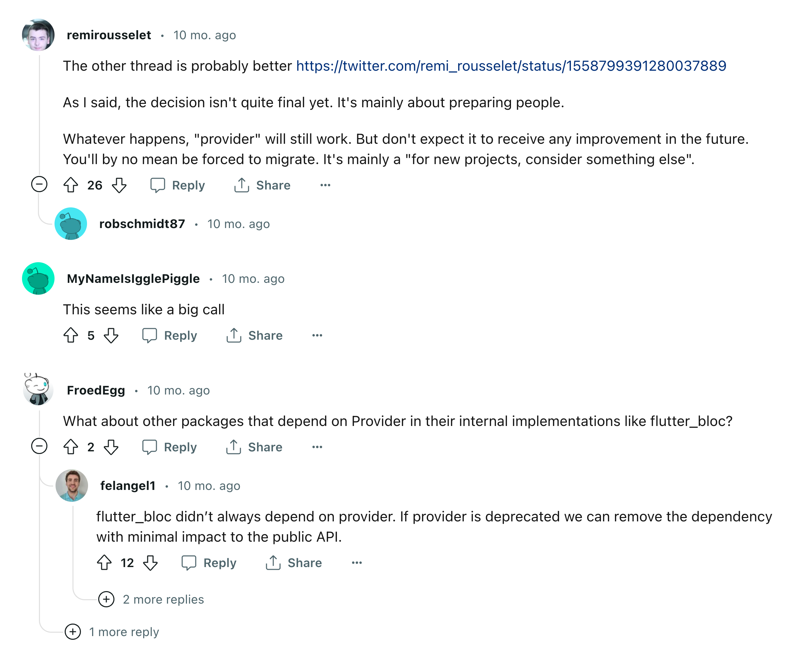

# BLoC 模式

简而言之，定义 `event` 和 `state`，`bloc` 负责响应来自视图层的 `event`，维护自身的的 `state`；另外有 `repository` 提供数据源。

传统的 MVC 模式中，Model 和 View 是分开的，Controller 将二者联系起来；BLoC 是 Google 提出的一种新的响应式风格，将 app 内所有内容都表现为事件流，部分 widget 发送事件，另一部分 widget 接收事件。

`BLoC` 的一大优点是文档丰富，可以在 `examples` 目录下找到很多使用示例。

一个 `BLoC` 模式的的 widget 由

- `cubit` / `bloc`：
- `model`：用于数据存储
- `view`：用于数据展示

三部分组成。

`cubit` 是 `bloc` 的子集，包含了基本的状态管理功能。简单地说，就是 `Cubit` 与 `State` 之间通过 `emit` 交互——`State` 定义状态，而 `Cubit` 相应状态。

，Bloc 框架对开发页面，做了很清晰划分，框架强行定了两种开发模式

- Bloc 模式：该模式划分四层结构
  - bloc：逻辑层
  - state：数据层
  - event：所有的交互事件
  - view：页面
- Cubit 模式：该模式划分了三层结构
  - cubit：逻辑层
  - state：数据层
  - view：页面

如果用 GoF 的传统设计模式来看，`bloc` 模式更像**状态模式**和**策略模式**的合体。`cubit` 模式中，省去了 `state`，也就是省掉了状态转移。

`Bloc` 模式的核心逻辑是：`view` 层向 `bloc` 发送 `event`，`bloc`响应 `event`，更新 `state`；`view` 响应 `state` 的更新，重绘界面。

上文没有提到的是 `repository`。在更模块化的设置下，`bloc` 不应该包含从数据源（网络请求、本地数据库）获取数据的逻辑，而是将这些逻辑交给 `repository`。这样统一了数据获取接口，也便于缓存的实现。

另外，`bloc` 之间应该是独立的，**永远不要假设一个 `bloc` 依赖另一个 `bloc`**，比如 `IMBloc` 不能依赖 `UserBloc`，这种关联应该提升到视图层或者下沉到 `Repository` 层。

该模式几乎是完美符合“高内聚、低耦合”的要求， 非常方便复用和测试。但是也有人批评 `bloc` 的规定过于死板，更倾向于简单易用的 `provider` 或者 `getx`。但我认为，`bloc` 这套逻辑非常适合大项目。

对 `BLoC` 源码的解读参照：<https://juejin.cn/post/6973900070358319135>

---

示例来自 `bloc` 官网，以最简单的注册逻辑为例，页面入口：

```Dart
import 'package:authentication_repository/authentication_repository.dart';
import 'package:flutter/material.dart';
import 'package:flutter_bloc/flutter_bloc.dart';
import 'package:flutter_login/login/login.dart';

class LoginPage extends StatelessWidget {
  const LoginPage({super.key});

  static Route<void> route() {
    return MaterialPageRoute<void>(builder: (_) => const LoginPage());
  }

  @override
  Widget build(BuildContext context) {
    return Scaffold(
      appBar: AppBar(title: const Text('Login')),
      body: Padding(
        padding: const EdgeInsets.all(12),
        child: BlocProvider(
          create: (context) {
            return LoginBloc(
              authenticationRepository:
                  RepositoryProvider.of<AuthenticationRepository>(context),
            );
          },
          child: const LoginForm(),
        ),
      ),
    );
  }
}
login/bloc/login_bloc.dart
import 'package:authentication_repository/authentication_repository.dart';
import 'package:bloc/bloc.dart';
import 'package:equatable/equatable.dart';
import 'package:flutter_login/login/login.dart';
import 'package:formz/formz.dart';

part 'login_event.dart';
part 'login_state.dart';

class LoginBloc extends Bloc<LoginEvent, LoginState> {
  LoginBloc({
    required AuthenticationRepository authenticationRepository,
  })  : _authenticationRepository = authenticationRepository,
        super(const LoginState()) {
    on<LoginUsernameChanged>(_onUsernameChanged);
    on<LoginPasswordChanged>(_onPasswordChanged);
    on<LoginSubmitted>(_onSubmitted);
  }

  final AuthenticationRepository _authenticationRepository;

  void _onUsernameChanged(
    LoginUsernameChanged event,
    Emitter<LoginState> emit,
  ) {
    final username = Username.dirty(event.username);
    emit(
      state.copyWith(
        username: username,
        isValid: Formz.validate([state.password, username]),
      ),
    );
  }

  void _onPasswordChanged(
    LoginPasswordChanged event,
    Emitter<LoginState> emit,
  ) {
    final password = Password.dirty(event.password);
    emit(
      state.copyWith(
        password: password,
        isValid: Formz.validate([password, state.username]),
      ),
    );
  }

  Future<void> _onSubmitted(
    LoginSubmitted event,
    Emitter<LoginState> emit,
  ) async {
    if (state.isValid) {
      emit(state.copyWith(status: FormzSubmissionStatus.inProgress));
      try {
        await _authenticationRepository.logIn(
          username: state.username.value,
          password: state.password.value,
        );
        emit(state.copyWith(status: FormzSubmissionStatus.success));
      } catch (_) {
        emit(state.copyWith(status: FormzSubmissionStatus.failure));
      }
    }
  }
}
login/bloc/login_event.dart
part of 'login_bloc.dart';

sealed class LoginEvent extends Equatable {
  const LoginEvent();

  @override
  List<Object> get props => [];
}

final class LoginUsernameChanged extends LoginEvent {
  const LoginUsernameChanged(this.username);

  final String username;

  @override
  List<Object> get props => [username];
}

final class LoginPasswordChanged extends LoginEvent {
  const LoginPasswordChanged(this.password);

  final String password;

  @override
  List<Object> get props => [password];
}

final class LoginSubmitted extends LoginEvent {
  const LoginSubmitted();
}
login/bloc/login_state.dart
part of 'login_bloc.dart';

final class LoginState extends Equatable {
  const LoginState({
    this.status = FormzSubmissionStatus.initial,
    this.username = const Username.pure(),
    this.password = const Password.pure(),
    this.isValid = false,
  });

  final FormzSubmissionStatus status;
  final Username username;
  final Password password;
  final bool isValid;

  LoginState copyWith({
    FormzSubmissionStatus? status,
    Username? username,
    Password? password,
    bool? isValid,
  }) {
    return LoginState(
      status: status ?? this.status,
      username: username ?? this.username,
      password: password ?? this.password,
      isValid: isValid ?? this.isValid,
    );
  }

  @override
  List<Object> get props => [status, username, password];
}
```

关于 Provider 将被 Deprecate 的问题，Provider 作者也作出了回应了；`provider` 还会正常工作，但基本不会有功能改进；但也不是必须要更新。

另外，`flutter_bloc` 虽然依赖于 `provider`，但一旦 `provider` 被废弃，也有理由相信 `bloc` 的公有方法不会受到太大影响。

简而言之，定义 `event` 和 `state`，`bloc` 负责响应来自视图层的 `event`，维护自身的的 `state`；另外有 `repository` 提供数据源。

传统的 MVC 模式中，Model 和 View 是分开的，Controller 将二者联系起来；BLoC 是 Google 提出的一种新的响应式风格，将 app 内所有内容都表现为事件流，部分 widget 发送事件，另一部分 widget 接收事件。

`BLoC` 的一大优点是文档丰富，可以在 `examples` 目录下找到很多使用示例。

一个 `BLoC` 模式的的 widget 由

- `cubit` / `bloc`：
- `model`：用于数据存储
- `view`：用于数据展示

三部分组成。

`cubit` 是 `bloc` 的子集，包含了基本的状态管理功能。简单地说，就是 `Cubit` 与 `State` 之间通过 `emit` 交互——`State` 定义状态，而 `Cubit` 相应状态。

，Bloc 框架对开发页面，做了很清晰划分，框架强行定了两种开发模式

- Bloc 模式：该模式划分四层结构
  - bloc：逻辑层
  - state：数据层
  - event：所有的交互事件
  - view：页面
- Cubit 模式：该模式划分了三层结构
  - cubit：逻辑层
  - state：数据层
  - view：页面

https://juejin.cn/post/6973900070358319135

以最简单的注册逻辑为例，页面入口：

```Dart
import 'package:authentication_repository/authentication_repository.dart';
import 'package:flutter/material.dart';
import 'package:flutter_bloc/flutter_bloc.dart';
import 'package:flutter_login/login/login.dart';

class LoginPage extends StatelessWidget {
  const LoginPage({super.key});

  static Route<void> route() {
    return MaterialPageRoute<void>(builder: (_) => const LoginPage());
  }

  @override
  Widget build(BuildContext context) {
    return Scaffold(
      appBar: AppBar(title: const Text('Login')),
      body: Padding(
        padding: const EdgeInsets.all(12),
        child: BlocProvider(
          create: (context) {
            return LoginBloc(
              authenticationRepository:
                  RepositoryProvider.of<AuthenticationRepository>(context),
            );
          },
          child: const LoginForm(),
        ),
      ),
    );
  }
}
login/bloc/login_bloc.dart
import 'package:authentication_repository/authentication_repository.dart';
import 'package:bloc/bloc.dart';
import 'package:equatable/equatable.dart';
import 'package:flutter_login/login/login.dart';
import 'package:formz/formz.dart';

part 'login_event.dart';
part 'login_state.dart';

class LoginBloc extends Bloc<LoginEvent, LoginState> {
  LoginBloc({
    required AuthenticationRepository authenticationRepository,
  })  : _authenticationRepository = authenticationRepository,
        super(const LoginState()) {
    on<LoginUsernameChanged>(_onUsernameChanged);
    on<LoginPasswordChanged>(_onPasswordChanged);
    on<LoginSubmitted>(_onSubmitted);
  }

  final AuthenticationRepository _authenticationRepository;

  void _onUsernameChanged(
    LoginUsernameChanged event,
    Emitter<LoginState> emit,
  ) {
    final username = Username.dirty(event.username);
    emit(
      state.copyWith(
        username: username,
        isValid: Formz.validate([state.password, username]),
      ),
    );
  }

  void _onPasswordChanged(
    LoginPasswordChanged event,
    Emitter<LoginState> emit,
  ) {
    final password = Password.dirty(event.password);
    emit(
      state.copyWith(
        password: password,
        isValid: Formz.validate([password, state.username]),
      ),
    );
  }

  Future<void> _onSubmitted(
    LoginSubmitted event,
    Emitter<LoginState> emit,
  ) async {
    if (state.isValid) {
      emit(state.copyWith(status: FormzSubmissionStatus.inProgress));
      try {
        await _authenticationRepository.logIn(
          username: state.username.value,
          password: state.password.value,
        );
        emit(state.copyWith(status: FormzSubmissionStatus.success));
      } catch (_) {
        emit(state.copyWith(status: FormzSubmissionStatus.failure));
      }
    }
  }
}
login/bloc/login_event.dart
part of 'login_bloc.dart';

sealed class LoginEvent extends Equatable {
  const LoginEvent();

  @override
  List<Object> get props => [];
}

final class LoginUsernameChanged extends LoginEvent {
  const LoginUsernameChanged(this.username);

  final String username;

  @override
  List<Object> get props => [username];
}

final class LoginPasswordChanged extends LoginEvent {
  const LoginPasswordChanged(this.password);

  final String password;

  @override
  List<Object> get props => [password];
}

final class LoginSubmitted extends LoginEvent {
  const LoginSubmitted();
}
login/bloc/login_state.dart
part of 'login_bloc.dart';

final class LoginState extends Equatable {
  const LoginState({
    this.status = FormzSubmissionStatus.initial,
    this.username = const Username.pure(),
    this.password = const Password.pure(),
    this.isValid = false,
  });

  final FormzSubmissionStatus status;
  final Username username;
  final Password password;
  final bool isValid;

  LoginState copyWith({
    FormzSubmissionStatus? status,
    Username? username,
    Password? password,
    bool? isValid,
  }) {
    return LoginState(
      status: status ?? this.status,
      username: username ?? this.username,
      password: password ?? this.password,
      isValid: isValid ?? this.isValid,
    );
  }

  @override
  List<Object> get props => [status, username, password];
}
```

关于 Provider 将被 Deprecate 的问题，Provider 作者也作出了回应了；`provider` 还会正常工作，但基本不会有功能改进；但也不是必须要更新。

另外，`flutter_bloc` 虽然依赖于 `provider`，但一旦 `provider` 被废弃，也有理由相信 `bloc` 的公有方法不会受到太大影响。


