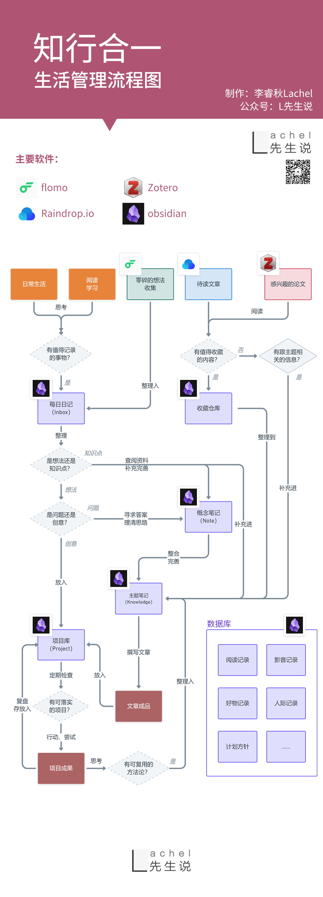

# 项目孵化器

我是计算机专业的研究生，平时，此处记录了孵化中的许多项目

## `FunCLoud` 函数计算服务器框架

需求：随着前端主导团队的兴起，Serverless 的发展，国外 Firebase 和 Supabase 对个人开发者高速普及，颠覆开发体验。中国有腾讯云、阿里云云开发，LeanCloud，但都没有国外 Firebase 的势头。本项目不仅要创造简单易用的函数式开发体验，更希望将函数式开发方法极简化。

也就是说，我们希望做一个多层次的 Firebase：

- 对于个人开发者：一个人可以拿下前后端
- **对于前端主导团队**：一种新的开发范式
- 对于一个已经成型的框架：可以像插件一样即插即用

## 统一的知识入口

灵感来自 [L 先生说微信公众号的一篇文章](https://mp.weixin.qq.com/s/yPJyRROXVHgQYWML1BmU5g)，描述了作者的“知行合一生活管理流程图”。为防断链，原图我贴在页面结尾。我的问题是：通过**一个**软件完成这些流程，是否有意义和价值？（没有问是否可行，是因为一定可行）

## Open Source Typora Alternative

`Markdown` 编辑器千千万，没有哪款能像 Typora 一样集简单、优雅于一体，可谓出道即巅峰。但是，在出道之后基本没有添加新功能。Obsidian、Zettlr 等 Markdown 编辑器，飞书、语雀等兼容 Markdown 语法的在线工具的流畅度也远不如 Typora。但 Typora 并非全能，其可定制性在界面上不如可以在 Marndown 中使用 React 组件的 [MDX](https://mdxjs.com/) ，在插件生态上不如 Obsidian。能否通过一个开源的 Typora 替代品解决界面可定制性和插件生态的双重问题？

## 不打书签

每次打开浏览器查论文资料都恨不得把互联网翻个底朝天，堆积了 20 多个 tab 拖慢运行速度，但就是没法读完。能不能把这些标签页收入进一个软件里，通过 AI 自动总结网页内容并分门别类，以日报的形式推送给读者？

这是一个工具类软件，主要壁垒是迁移成本（用户已经打过的书签）。开发需要浏览器插件和客户端。感觉还不错。

## `UnivGPT` 大学生活好伙伴

需求：初入大学的大学生对学习生活各方面充满了迷茫。

参考项目：ChatGLM 提出的 UnivGLM，已在安徽大学等多所高校试点

为什么之前没人做：？

我们的创新点/优势：？

我们的壁垒：目前很怀疑这个项目的壁垒。没有网络效应、切换成本极低（就好像从 ChatGPT 切换到文心一言）。而且容易出现风险言论。整体上不是一个很有前景的项目，可以给低年级练手用。

---

## 知行合一生活管理流程图

