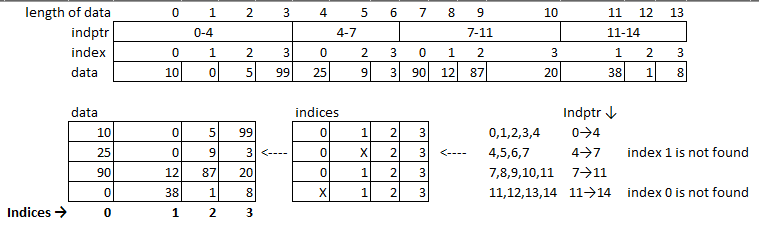

Maybe this explanation can help understand the concept:

- `data` is an array containing all the non zero elements of the sparse matrix.
- `indices` is an array mapping each element in `data` to its column in the sparse matrix.
- `indptr` then maps the elements of `data` and `indices` to the rows of the sparse matrix. This is done with the following reasoning:
  1. If the sparse matrix has **M** rows, `indptr` is an array containing **M+1** elements
  2. for row **i**, `[indptr[i]:indptr[i+1]]` returns the indices of elements to take from `data` and `indices` corresponding to row **i**. So suppose `indptr[i]=k` and `indptr[i+1]=l`, the data corresponding to row **i** would be `data[k:l]` at columns `indices[k:l]`. This is the tricky part, and I hope the following example helps understanding it.

**EDIT** : I replaced the numbers in `data` by letters to avoid confusion in the following example.

[](https://i.stack.imgur.com/12bPL.png)

Note: the values in `indptr` are necessarily increasing, because the next cell in `indptr` (the next row) is referring to the next values in `data` and `indices` corresponding to that row.

<https://stackoverflow.com/a/52299730/20148196>

---

Represent the "data" in a 4 X 4 Matrix:

```py
data = np.array([10,0,5,99,25,9,3,90,12,87,20,38,1,8])
indices = np.array([0,1,2,3,0,2,3,0,1,2,3,1,2,3])
indptr  = np.array([0,4,7,11,14])
```

[](https://i.stack.imgur.com/eOGhx.png)

- 'indptr'- Index pointers is linked list of pointers to 'indices' (Column index Pointers)...
- indptr[i:i+1] represents i to i+1 index of pointer
- 14 reprents len of Data len(data)... indptr = np.array([0,4,7,11,len(data)]) other way of represenint 'indptr'
- 0,4 --> 0:4 represents pointers to indices 0,1,2,3
- 4,7 --> 4:7 represents the pointers of indices 0,2,3
- 7,11 --> 7:11 represents the pointers of 0,1,2,3
- 11,14 --> 11:14 represents pointers 1,2,3

```py
#  Representing the data in a 4,4 matrix

a = csr_matrix((data,indices,indptr),shape=(4,4),dtype=np.int)
a.todense()

matrix([[10,  0,  5, 99],
        [25,  0,  9,  3],
        [90, 12, 87, 20],
        [ 0, 38,  1,  8]])
```

<https://stackoverflow.com/a/62118005/20148196>
