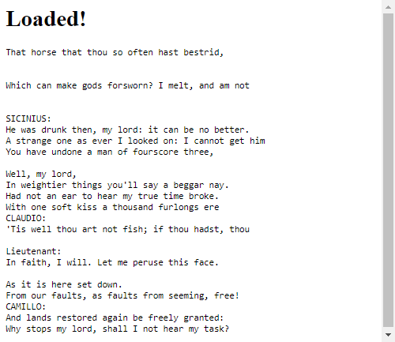

# AI Chatbots With TensorFlow.js: Generating Shakespeare Monologue


**[Raphael Mun](https://www.codeproject.com/script/Membership/View.aspx?mid=14796281)**

Rate me:


5.00/5 (1 vote)

22 Oct 2020[CPOL](http://www.codeproject.com/info/cpol10.aspx)2 min read

In this article we’ll build a Shakespearean Monologue Generator in the Browser with TensorFlow.js.

Here we will demonstrate how you can use TensorFlow.js with textual data right in the browser, as well as the power of transformer architecture models like USE, for accomplishing Natural Language Processing tasks and building chatbots.

- [Download Project Code - 9.9 MB](https://www.codeproject.com/KB/AI/5282696/TensorFlowJS_Chatbots.zip)

[TensorFlow](https://www.tensorflow.org/js/) + [JavaScript](https://www.javascript.com/). The most popular, cutting-edge AI framework now supports the [most widely used programming language on the planet](https://www.statista.com/statistics/793628/worldwide-developer-survey-most-used-languages/). So let’s make text and [NLP ](https://en.wikipedia.org/wiki/Natural_language_processing)(Natural Language Processing) chatbot magic happen through Deep Learning right in our web browser, GPU-accelerated via WebGL using TensorFlow.js!

You are welcome to download the [project code](https://www.codeproject.com/KB/AI/5282696/TensorFlowJS_Chatbots.zip).



Ay! ‘Tis a Shakespeare. In this article – the last in the series – we’ll generate some Shakespearean monologue using AI.

## Setting Up TensorFlow.js Code

This project runs within a single web page. We will include TensorFlow.js and Universal Sentence Encoder (USE), which is a pre-trained transformer-based language processing model. We’ll print the bot output to the page. Two of the additional utility functions, `dotProduct` and `zipWith`, from the [USE readme example](https://github.com/tensorflow/tfjs-models/tree/master/universal-sentence-encoder), will help us determine sentence similarity.

HTML

Shrink ▲ Copy Code

```html
<html>
  <head>
    <title>
      Shakespearean Monologue Bot: Chatbots in the Browser with TensorFlow.js
    </title>
    <script src="https://cdn.jsdelivr.net/npm/@tensorflow/tfjs@2.0.0/dist/tf.min.js"></script>
    <script src="https://cdn.jsdelivr.net/npm/@tensorflow-models/universal-sentence-encoder"></script>
  </head>
  <body>
    <h1 id="status">Shakespearean Monologue Bot</h1>
    <pre id="bot-text"></pre>
    <script>
      function setText(text) {
        document.getElementById("status").innerText = text;
      }

      // Calculate the dot product of two vector arrays.
      const dotProduct = (xs, ys) => {
        const sum = (xs) => (xs ? xs.reduce((a, b) => a + b, 0) : undefined);

        return xs.length === ys.length
          ? sum(zipWith((a, b) => a * b, xs, ys))
          : undefined;
      };

      // zipWith :: (a -> b -> c) -> [a] -> [b] -> [c]
      const zipWith = (f, xs, ys) => {
        const ny = ys.length;
        return (xs.length <= ny ? xs : xs.slice(0, ny)).map((x, i) =>
          f(x, ys[i])
        );
      };

      (async () => {
        // Your Code Goes Here
      })();
    </script>
  </body>
</html>
```

## TinyShakespeare Dataset

For this project, our bot will generate its own Shakespeare script using quotes from the [TinyShakespeare dataset](https://github.com/karpathy/char-rnn/blob/master/data/tinyshakespeare/input.txt). It contains 40 thousand lines of text from the various Shakespeare plays. We’ll use it to create a collection of phrases and their "next-phrases."

Let’s go through every line to fill a message array and a matching response array. The code should look like this:

JavaScript

Copy Code

```javascript
let shakespeare_lines = await fetch("web/tinyshakespeare.txt").then((r) =>
  r.text()
);
let lines = shakespeare_lines.split("\n").filter((x) => !!x); // Split & remove empty lines

let messages = [];
let responses = [];
for (let i = 0; i < lines.length - 1; i++) {
  messages.push(lines[i]);
  responses.push(lines[i + 1]);
}
```

## Universal Sentence Encoder

The [Universal Sentence Encoder](https://github.com/tensorflow/tfjs-models/tree/master/universal-sentence-encoder) (USE) is "a [pre-trained] model that encodes text into 512-dimensional embeddings." For a complete description of the USE and its architecture, please see the Improved Emotion Detection article earlier in this series.

The USE is easy and straightforward to work with. Let’s load it up in our code right before we define our network model and use its QnA dual encoder, which will give us full-sentence embeddings across all queries and all answers, which should perform better than word embeddings. We can use this to determine the most similar current message and response.

JavaScript

Copy Code

```javascript
// Load the universal sentence encoder
setText("Loading USE...");
let encoder = await use.load();
setText("Loaded!");
const model = await use.loadQnA();
```

## Shakespeare Monologue in Action

Because the sentence embeddings already encode similarity into its vectors, we don’t need to train a separate model. Starting with the hard-coded line, `"ROMEO:"`, every 3-seconds, we’ll choose a random subset of 200 lines and let USE do the hard work. It will figure out which of those lines is the most similar to the last printed line using the QnA encoder, and then look up the response.

JavaScript

Copy Code

```javascript
// Add to the monologue every 3s
setInterval(async () => {
  // Run the calculation things
  const numSamples = 200;
  let randomOffset = Math.floor(Math.random() * messages.length);
  const input = {
    queries: [text],
    responses: messages.slice(randomOffset, numSamples),
  };
  let embeddings = await model.embed(input);
  tf.tidy(() => {
    const embed_query = embeddings["queryEmbedding"].arraySync();
    const embed_responses = embeddings["responseEmbedding"].arraySync();
    let scores = [];
    embed_responses.forEach((response) => {
      scores.push(dotProduct(embed_query[0], response));
    });
    let id = scores.indexOf(Math.max(...scores));
    text = responses[randomOffset + id];
    document.getElementById("bot-text").innerText += text + "\n";
  });
  embeddings.queryEmbedding.dispose();
  embeddings.responseEmbedding.dispose();
}, 3000);
```

Now, when you open the page, it will begin to write lines of Shakespeare every 3 seconds.


## Finish Line

Here is the code that puts it all together:

HTML

Shrink ▲ Copy Code

```html
<html>
  <head>
    <title>
      Shakespearean Monologue Bot: Chatbots in the Browser with TensorFlow.js
    </title>
    <script src="https://cdn.jsdelivr.net/npm/@tensorflow/tfjs@2.0.0/dist/tf.min.js"></script>
    <script src="https://cdn.jsdelivr.net/npm/@tensorflow-models/universal-sentence-encoder"></script>
  </head>
  <body>
    <h1 id="status">Shakespearean Monologue Bot</h1>
    <pre id="bot-text"></pre>
    <script>
      function setText(text) {
        document.getElementById("status").innerText = text;
      }

      // Calculate the dot product of two vector arrays.
      const dotProduct = (xs, ys) => {
        const sum = (xs) => (xs ? xs.reduce((a, b) => a + b, 0) : undefined);

        return xs.length === ys.length
          ? sum(zipWith((a, b) => a * b, xs, ys))
          : undefined;
      };

      // zipWith :: (a -> b -> c) -> [a] -> [b] -> [c]
      const zipWith = (f, xs, ys) => {
        const ny = ys.length;
        return (xs.length <= ny ? xs : xs.slice(0, ny)).map((x, i) =>
          f(x, ys[i])
        );
      };

      (async () => {
        let shakespeare_lines = await fetch("web/tinyshakespeare.txt").then(
          (r) => r.text()
        );
        let lines = shakespeare_lines.split("\n").filter((x) => !!x); // Split & remove empty lines

        let messages = [];
        let responses = [];
        for (let i = 0; i < lines.length - 1; i++) {
          messages.push(lines[i]);
          responses.push(lines[i + 1]);
        }

        // Load the universal sentence encoder
        setText("Loading USE...");
        let encoder = await use.load();
        setText("Loaded!");
        const model = await use.loadQnA();

        let text = "ROMEO:";
        // Add to the monologue every 3s
        setInterval(async () => {
          // Run the calculation things
          const numSamples = 200;
          let randomOffset = Math.floor(Math.random() * messages.length);
          const input = {
            queries: [text],
            responses: messages.slice(randomOffset, numSamples),
          };
          let embeddings = await model.embed(input);
          tf.tidy(() => {
            const embed_query = embeddings["queryEmbedding"].arraySync();
            const embed_responses = embeddings["responseEmbedding"].arraySync();
            let scores = [];
            embed_responses.forEach((response) => {
              scores.push(dotProduct(embed_query[0], response));
            });
            let id = scores.indexOf(Math.max(...scores));
            text = responses[randomOffset + id];
            document.getElementById("bot-text").innerText += text + "\n";
          });
          embeddings.queryEmbedding.dispose();
          embeddings.responseEmbedding.dispose();
        }, 3000);
      })();
    </script>
  </body>
</html>
```

## To Sum It Up

This article, along with the others in our series, demonstrated how you can use TensorFlow.js with textual data right in the browser, as well as the power of transformer architecture models like USE, for accomplishing Natural Language Processing tasks and building chatbots.

I hope these examples will inspire you to do even more with AI and Deep Learning. Build away and don’t forget to have fun while doing so!

This article is part of the series 'AI Chatbot with Tensorflow[◁ Prev](https://www.codeproject.com/Articles/5282694/AI-Chatbots-With-TensorFlow-js-Creating-a-Movie-Di)[View All](https://www.codeproject.com/script/Content/ViewReadingList.aspx?rlid=29)

## License

This article, along with any associated source code and files, is licensed under [The Code Project Open License (CPOL)](http://www.codeproject.com/info/cpol10.aspx)
