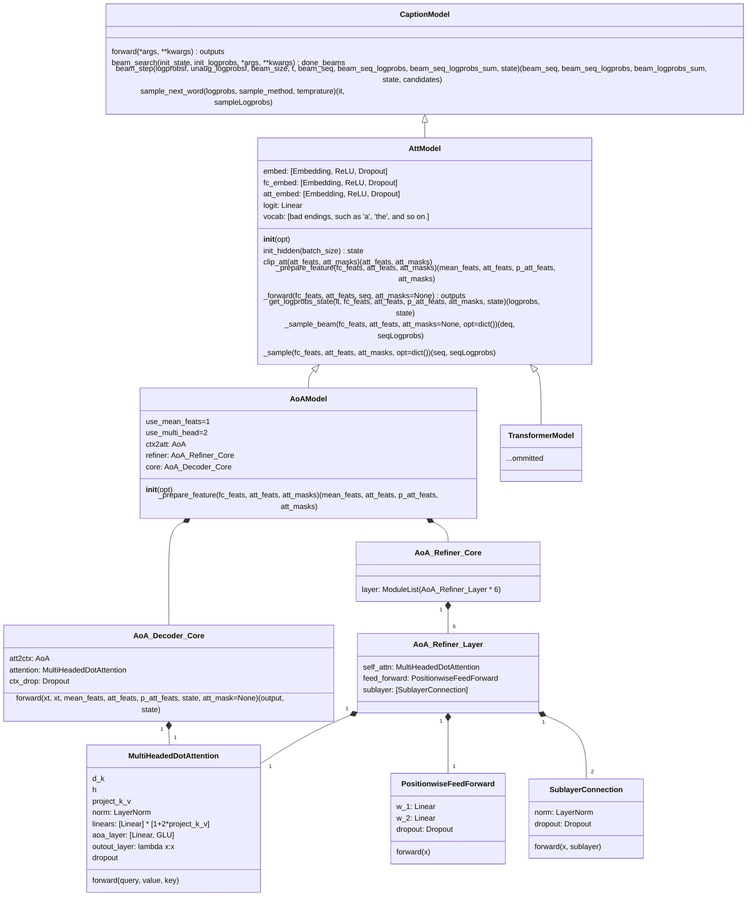

Tech Report

# 在 COCO 2014 数据集上训练 AoAnet

基于[AoAnet](https://github.com/husthuaan/AoANet)进行训练，参考文献：https://arxiv.org/abs/1908.06954

```tex
@inproceedings{huang2019attention,
  title={Attention on Attention for Image Captioning},
  author={Huang, Lun and Wang, Wenmin and Chen, Jie and Wei, Xiao-Yong},
  booktitle={International Conference on Computer Vision},
  year={2019}
}
```

## 数据

### 数据集的下载

#### COCO 图片

项目需要 COCO 2014 数据集的 train 和 val，可以从官网下载：

```bash
wget -c http://images.cocodataset.org/zips/train2014.zip http://images.cocodataset.org/annotations/image_info_val2014.zip
```

> 全部链接：
>
> http://images.cocodataset.org/zips/train2014.zip
>
> http://images.cocodataset.org/annotations/annotations_trainval2014.zip
>
> http://images.cocodataset.org/zips/val2014.zip
>
> http://images.cocodataset.org/annotations/image_info_val2014.zip
>
> http://images.cocodataset.org/zips/test2014.zip
>
> http://images.cocodataset.org/annotations/image_info_test2014.zip

也可以通过 Redmon 的镜像站：https://pjreddie.com/projects/coco-mirror/

**注意`train2014`中有一张图像坏掉了，需要替换**，[参考](https://github.com/karpathy/neuraltalk2/issues/4)，替换方式：

```bash
cd train2014
curl https://msvocds.blob.core.windows.net/images/262993_z.jpg >> COCO_train2014_000000167126.jpg
```

#### 预处理后的描述

```bash
wget http://cs.stanford.edu/people/karpathy/deepimagesent/caption_datasets.zip
```

### 代码仓库

```bash
git clone https://github.com/husthuaan/AoANet.git --recursive
```

注意两个`submodule`是不是都下载下来了。

### 数据预处理

#### 预处理标注

下面这个预处理需要`python2`的环境，搭建环境：

```bash
conda create -n py2 python<3
conda activate py2
conda install pytorch cpuonly -c pytorch
conda install six
```

```bash
python scripts/prepro_ngrams.py --input_json data/dataset_coco.json --dict_json data/cocotalk.json --output_pkl data/coco-train --split train
```

本项目使用 ResNet 提取特征，预处理流程如下。

下载模型：

```bash
curl https://download.pytorch.org/models/resnet101-63fe2227.pth >> ./data/imagenet_weights/resnet101.pth
```

创建环境，此处使用`docker`

```yaml
# docker-compose.yml
version: "3"
services:
  pytorch:
    image: "ufoym/deepo:pytorch-cu111"
    ports:
      - "0:22"
    volumes:
      - $HOME:$HOME
      - /nvme:/nvme
      # 记得把代码所在目录映射进来
    shm_size: "32gb"
    deploy:
      resources:
        reservations:
          devices:
            - capabilities: ["gpu"]
```

```bash
docker-compose up -d
docker exec -it AoAnet_pytorch bash # 进入容器
cd # 代码所在目录
pip install h5py yacs lmdbdict pyemd
export PYTHONPATH=`pwd`
```

然后就可以开始进行预处理

```bash
python scripts/prepro_labels.py --input_json data/dataset_coco.json --output_json data/cocotalk.json --output_h5 data/cocotalk
```

```bash
python scripts/prepro_feats.py --input_json data/dataset_coco.json --output_dir data/cocotalk --images_root $IMAGE_ROOT
```

预处理速度很慢，耐心等待

在训练时遇到了问题，没库，没依赖，作者也不提供一下参考

```bash
sudo apt install openjdk-8-jdk # 依赖
pip install gensim # NLP库

# 下载Word2Vec的一个模型
cd coco-caption/pycocoevalcap/wmd/data
wget -c "https://s3.amazonaws.com/dl4j-distribution/GoogleNews-vectors-negative300.bin.gz"
gzip -d GoogleNews-vectors-negative300.bin.gz
```

```python
from gensim import models
w = models.KeyedVectors.load_word2vec_format('./GoogleNews-vectors-negative300.bin', binary=True)
```

作者怎么不把依赖写全，非要等到跑到一个 epoch 结束扔个异常出来。气。抓异常只抓`(RuntimeError, KeyboardInterrupt)`，您就没考虑过有人可能没装全依赖吗。

### 使用 ResNet feature

```bash
python scripts/prepro_feats.py --input_json data/dataset_coco.json --output_dir data/cocotalk --images_root $IMAGE_ROOT
```

使用 ResNet feature 训练，需要修改`train.sh`中的配置使目录指向 cocotalk 目录。实测 25 epoch 指标：

```yaml
Bleu_1: 0.724
Bleu_2: 0.551
Bleu_3: 0.405
Bleu_4: 0.295
METEOR: 0.250
ROUGE_L: 0.530
CIDEr: 0.954
SPICE: 0.182
WMD: 0.533
```

指标并不能达到论文中的高度，怀疑是数据使用出了问题。论文中使用的 feature 是 bottom-up feature，

### 使用 Bottom-Up feature

> Download pre-extracted feature from [link](https://github.com/peteanderson80/bottom-up-attention). You can either download adaptive one or fixed one.

下载方式如下：

```bash
mkdir data/bu_data; cd data/bu_data
wget https://storage.googleapis.com/up-down-attention/trainval.zip
unzip trainval.zip
# 切回项目根目录
cd ..
conda acitivate py2 # python2文件，因为reader迭代器返回了byte
python scripts/make_bu_data.py --output_dir data/cocobu
```

然后我把`train.sh`改了回去(`git checkout train.sh`)，备份了`checkpoint`s，清理项目目录，重新开始训练。

## 测试指标

本次使用五个指标：Bleu、METEOR、ROUGE-L、CIDEr、SPICE。

目标指标如下：

```json
{
    ‘Bleu_1’: 0.8054903453672397,
    ‘Bleu_2’: 0.6523038976984842,
    ‘Bleu_3’: 0.5096621263772566,
    ‘Bleu_4’: 0.39140307771618477,
    ‘METEOR’: 0.29011216375635934,
    ‘ROUGE_L’: 0.5890369750273199,
    ‘CIDEr’: 1.2892294296245852,
    ‘SPICE’: 0.22680092759866174
}
```

### Perplexity

$$
\log_2\operatorname{PPL}(w_{1:L}|I) = -\frac{1}{L}\sum_{n=1}^L(\log_2\operatorname{P}(w_n | w_{1:n-1}, I))
$$

其中，$L$是句子的长度，$\operatorname{PPL}(w_{1:L},I)$是根据图像$I$给出的描述句子$w_{1:L}$的$\operatorname{preplexity}$，而$\operatorname{P}(w_n | w_{1:n-1}, I)$是根据图像$I$和前$n-1$个单词组成的序列生成下一个单词$w_n$的概率。

$\operatorname{preplexity}$用于判断模型的稳定性，得分越低就认为模型的预测越稳定，翻译质量越好。

### Bleu

Bilingual Evaluation Underatudy，用于分析候选译文和参考译文中$N$元组共同出现的程度，重合程度越高就认为译文质量越高。

$$
\operatorname{BLEU} = BP \times \exp\left(\sum_{n=1}^N w_n \log P_n \right)
$$

$BP$表示短句子的惩罚因子（Brevity Penalty），用$l_r$表示最短的参考翻译的长度，$l_c$表示候选翻译的长度，具体计算方法：

$$
BP =
\begin{cases}
1 & l_c > l_s \\
\mathrm{e}^{1-\frac{l_s}{l_c}} & l_c \le l_s
\end{cases}
$$

$P(n)$表示 n-gram 的覆盖率，计算方式为：

$$
p_{n}=\frac{\sum_{C \in\{\text { Candidates }\}} \sum_{\text { n-gram } \in C} \text { Count }_{\text {clip }}(\text { n-gram })}{\sum_{C^{\prime} \in\{\text { Candidates }\}} \sum_{\text { n-gram } \in C^{\prime}} \text { Count }(\text { n-gram })}
$$

其中$\text{Count}_{\text{clip}}$是截断技术，其计数方式为：将一个 n-gram 在候选翻译中出现的次数，与在各个参考翻译中出现次数的最大值进行比较，取较小的那一个。

### METEOR

Metric for Evaluation of Translation with Explicit ORdering 基于 BLEU 进行了一些改进，使用 WordNet 计算特有的序列匹配、同义词、词根和词缀，以及释义之间的匹配关系。

$$
\operatorname{METEOR} = (1-Pen) \times F_{\text{means}}
$$

其中$Pen = \frac{\#chucks}{m}$为惩罚因子，惩罚候选翻译中词序与参考翻译中次词序的不同。

$$
F_\text{meams} = \frac{PR}{\alpha P + (1-\alpha)R}
$$

其中$\alpha$为超参数，$P=\frac{m}{c}$，$R = \frac{m}{r}$，$m$为候选翻译中能够被匹配的一元组的数量，$c$为候选翻译的长度，$r$为参考翻译的长度。

METEOR 基于准确率和召回率，得分越高说明

### ROUGE

Recall-Oriented Understudy for Gisting Evaluation，大致分为四种：ROUGE-N，ROUGE-L，ROUGE-W，ROUGE-S。

$$
\operatorname{ROUGE-N}=\frac{\sum_{S \in\{\text { ReferenceSummaries }\}} \sum_{\text {gram }_{n} \in S} \text { Count }_{\text {match }}\left(\text { gram }_{n}\right)}{\sum_{S \in\{\text { ReferenceSummaries }\}} \sum_{\text {gram }_{n} \in S} \text { Count }\left(\text { gram }_{n}\right)}
$$

其中$n$表示 n-gram，$\text{Count}{(\text{gram}_n)}$表示一个 n-gram 出现的次数，$\text{Count}_{\text{match}}{(\text{gram}_n)}$表示一个 n-gram 共现的次数。

$$
\begin{aligned}
\operatorname{ROUGE-L} &=\frac{\left(1+\beta^{2}\right) R_{l c s} P_{l c s}}{R_{l c s}+\beta^{2} P_{l c s}} \\
R_{l c s} &=\frac{\operatorname{LCS}(X, Y)}{m} \\
P_{l c s} &=\frac{\operatorname{LCS}(X, Y)}{n}
\end{aligned}
$$

其中，$X$表示候选摘要，$Y$表示参考摘要，$\operatorname{LCS}$表示候选摘要与参考摘要的最长公共子序列的长度，$m$表示参考摘要的长度，$n$表示候选摘要的长度。

### CIDEr

Consensus-based Image Description Evaluation 将每个句子看成文档，计算其 Term Frequency Inverse Document Frequency（TF-IDF）向量的余弦夹角，据此得到候选句子和参考句子的相似程度。

$$
\operatorname{CIDEr}_n(c, S) = \frac{1}{M} \sum_{i=1}^M \frac{g^n(c)\cdot g^n\left(S_i\right)}{||g^n(c)|| \times ||g^n\left(S_i\right)||}
$$

其中$c$表示候选标题，$S$表示参考标题集合，$n$表示评估的是 n-gram，M 表示标题的数量，$g^n(\cdot)$表示基于 n-gram 的 TF-IDF 向量。

$$
\operatorname{CIDEr}\left(c_{i}, S_{i}\right)=\sum_{n=1}^{N} w_{n} \operatorname{CIDEr}_{n}\left(c_{i}, S_{i}\right)
$$

TF-IDF 的计算方式为：

$$
g_{k}\left(s_{i j}\right)=\frac{h_{k}\left(s_{i j}\right)}{\sum_{\omega_{l} \in \Omega} h_{l}\left(s_{i j}\right)} \log \left(\frac{|I|}{\sum_{I_{p} \in I} \min \left\{1, \sum_{q} h_{k}\left(s_{p q}\right)\right\}}\right)
$$

### SPICE

Semantic Propositional Image Caption Evaluation 使用基于图的语义表示来编码 caption 中的 objects，attributes 和 relationships。它先将待评价 caption 和参考 captions 用 Probabilistic Context-Free Grammar (PCFG) dependency parser parse 成 syntactic dependencies trees，然后用基于规则的方法把 dependency tree 映射成 scene graphs。最后计算待评价的 caption 中 objects, attributes 和 relationships 的 F-score 值。

$$
\begin{aligned}
\operatorname{SPICE}(c, S) &=F_{1}(c, S)=\frac{2 \cdot P(c, S) \cdot R(c, S)}{P(c, S)+R(c, S)} \\
P(c, S) &=\frac{|T(G(c)) \otimes T(G(S))|}{|T(G(c))|} \\
R(c, S) &=\frac{|T(G(c)) \otimes T(G(S))|}{|T(G(S))|}
\end{aligned}
$$

其中，$c$表示候选标题，$S$表示参考标题集合，$G(\cdot)$表示利用某种方法将一段文本转化为一个 Scene Graph，$T(\cdot)$表示将一个 Scene Graph 转换为一个 Tuple 的集合。$\otimes$运算类似于交集，但其匹配类似于 METEOR 中的基于 WordNet 的匹配。

### WMD

Word Mover’s Distance[^wmd]

## 算法分析

## 模型分析

### 类图



[^zhihu108630305]: https://zhuanlan.zhihu.com/p/108630305
[^jianshu60deff0f64e1]: https://www.jianshu.com/p/60deff0f64e1
[^wmd]: https://mkusner.github.io/publications/WMD.pdf
