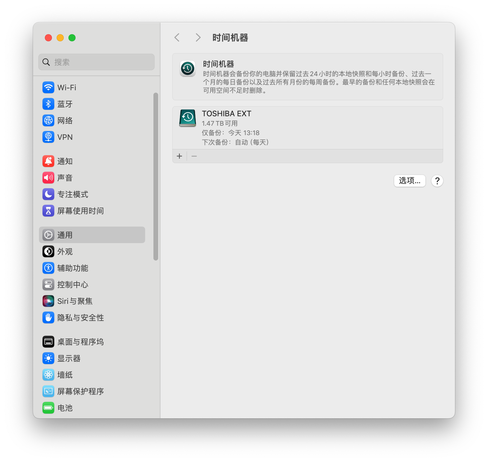

# 活在互联网上

如题，我是一个每天高强度上网的人，可以说除了吃饭睡觉走路，都生活在网上。

## 一些工具

### 命令行工具

- `homebrew`: macOS 的软件管理工具
- `CocoaPods`: Swift/Objective-C 的包管理工具

### VS Code

平台：Windows、macOS、Linux

### IntelliJ IDEA

不用介绍了吧，代码静态分析的神，动态调试也很好用。

## Mac

mac 定义了一套刚开始感觉很难用，但习惯了之后特别愉悦的流程，所以我把用得不爽的原生 APP 都替换了

### Raycast 替代 Spotlight

Raycast 可以基于 node 编写扩展，但是代码包本身却并不大。可惜了，只支持 macOS。

### QSpace Pro 替代 Finder

设置里甚至可以将 Reveal in Finder 设置为

### AltTab 替代原生 Alt+Tab

当我在 macOS 上使用原生 Alt+Tab 时，我有两大痛点：

1. 显示窗口截图。Windows 10 已经做到了，macOS 没跟进啊。
2. macOS 从设计之初就不是以窗口区分 APP，而是以文档区分 APP，这么多年从没改过。所以假设打开了两个 Word，Alt+Tab 里只有一个 Word 的图标。

AltTab 解决了这两个痛点，真的很好用。

### HiddenBar + iBar

我觉得苹果推出刘海屏时，也没想清楚，如果 APP 太多被刘海挡住了怎么处理。HiddenBar 在外接屏上使用，iBar 在没用外接屏的时候用。

### MonitControl

很方便的外接显示屏调亮度

### `Royal TSX`（对标 Windows 上的 `MobaXTerm`）

### 外设管理类

- `MonitorControl`：外接显示屏亮度控制
- `stats`: 在状态栏上显示统计信息

### 解决刘海屏挡图标问题

- `Hidden Bar`
- `iBar`

### 磁盘清理

- `Tencent Lemon`
- `CleanMyMac`
- `Disk Space Analyzer`

### 其他

- 键指如飞：快捷键管理
- 全能解压：压缩、解压、局域网分享
- `AnyGo`：`iPhone` 免越狱改定位

### Time Machine

系统自带，还算方便，我 1T 多数据，备份完只有 500M 的包。换机非常好用，因为我 mac 的硬盘是换过的，所以还是有必要保存备份。

### ~~华强北~~

并不推荐每个人都这么折腾自己的电脑，但作为 Flutter 开发者，为了打包出两个各不到 100MB 的安装包，我需要安装近 50GB 的软件（IntelliJ IDEA + Android Studio + Android SDK + Maven、XCode + Cocoapods），256 GB 真的不够用，所以花 1400 送到华强北换了两张 2T 硬盘。但，问题不是一点没有，电脑有的时候掀起屏幕，屏幕还是黑的，只能强制重启。
