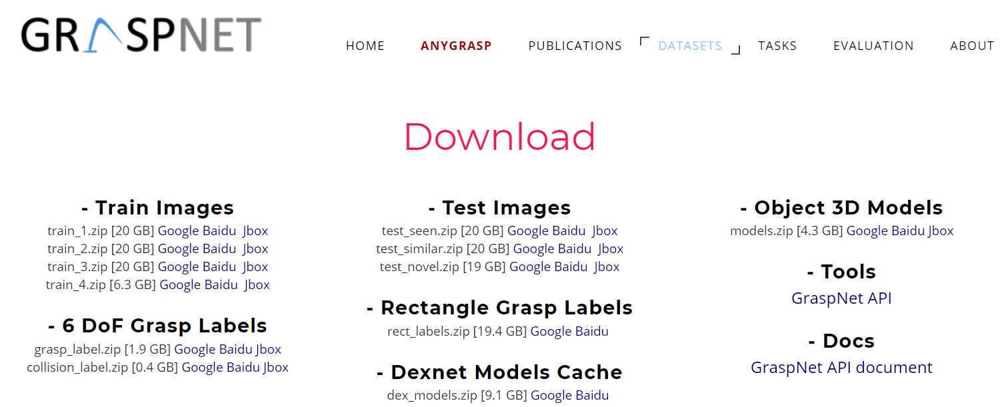

# GraspNet 通用物品抓取数据集

GraspNet 是一个通用物品抓取的开源项目，现包含

- [GraspNet-1Biliion](https://graspnet.net/datasets.html)：使用平行爪进行抓取
- [SuctionNet-1Billion](https://graspnet.net/suction)：使用吸盘进行抓取

下面就 GraspNet-1Billion 展开介绍

## 数据集



### 训练图片

训练图片共 100 个场景，每个场景由 Kinect 和 RealSense 相机分别拍摄 256 张 RGB-D 图片。一个场景中的信息如下

```
scene_0000
|-- object_id_list.txt              # 场景中的object-id
|-- rs_wrt_kn.npy                   # RealSense相对Kinect相机的位置shape: 256x(4x4)
|-- kinect                          # kinect相机数据
|   |-- rgb
|   |   |-- 0000.png to 0255.png    # 256 rgb images
|   `-- depth
|   |   |-- 0000.png to 0255.png    # 256 depth images
|   `-- label
|   |   |-- 0000.png to 0255.png    # 256 object mask images, 0 is background, 1-88 denotes each object (1-indexed), same format as YCB-Video dataset
|   `-- annotations
|   |   |-- 0000.xml to 0255.xml    # 256 object 6d pose annotation. ‘pos_in_world' and'ori_in_world' denotes position and orientation w.r.t the camera frame.
|   `-- meta
|   |   |-- 0000.mat to 0255.mat    # 256 object 6d pose annotation, same format as YCB-Video dataset for easy usage
|   `-- rect
|   |   |-- 0000.npy to 0255.npy    # 256 2D planar grasp labels
|   |
|   `-- camK.npy                    # camera intrinsic, shape: 3x3, [[f_x,0,c_x], [0,f_y,c_y], [0,0,1]]
|   `-- camera_poses.npy            # 256 camera poses with respect to the first frame, shape: 256x(4x4)
|   `-- cam0_wrt_table.npy          # first frame's camera pose with respect to the table, shape: 4x4
|
`-- realsense
    |-- same structure as kinect
```

`train_1.zip`到`train_4.zip`四个压缩包中是采集的 99 个场景 Ground Truth 及其描述信息，下载下来之后将其中的内容全部解压到一个`graspnet/scenes`文件夹下，解压完成后目录结构如图：

```
|-- graspnet
    |-- scenes
    |   |-- scene_0000/
    |   |-- scene_0001/
    |   |-- ... ...
    |   `-- scene_0099/
```

紧接着是测试图片，其目录结构与训练图片相同，也解压到`graspnet/scenes`文件夹下：

```
|-- graspnet
    |-- scenes
    |   |-- scene_0000/
    |   |-- scene_0001/
    |   |-- ... ...
    |   `-- scene_0189/
```

6 DoF grasp labels 是抓取的标签，需要解压到`graspnet/grasp_label`文件夹下，
