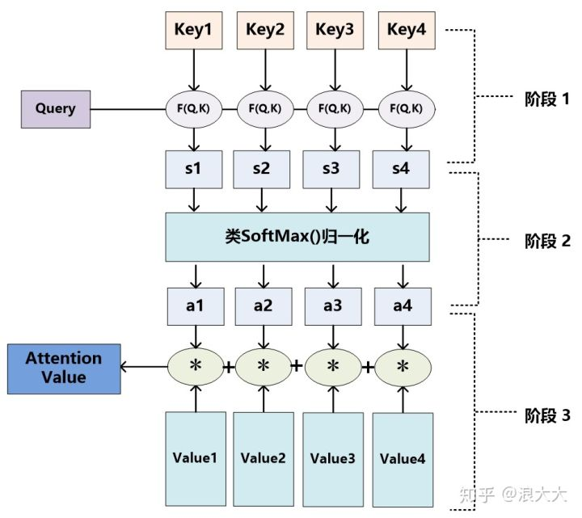

<!-- # Attention: the building block -->

## The Attention Operation

Attention is an operation that produce a result from two sequences: one sequence is $Q$, and the other is the $(K, V)$ pair. The $(K, V)$ pair mimics the key-value pair in database retrival, and $Q$ models the query of the retrival. Suppose we have $n$ sample, we have inputs $Q, K \in \mathbb{R}^{n \times d^k}$ and $V \in \mathbb{R}^{n\times d^v}$. The attention is calculated as

$$
\operatorname{Attention}(Q, K, V) = \operatorname{softmax}\left( \frac{QK^T}{\sqrt{d^k}} \right)V,
$$

Let's understand this operation step-by-step. In the softmax function, $C =\left( \frac{QK^T}{\sqrt{d^k}}\right) \in \mathbb{R}^{n\times n}$ is the covariance between $Q$ and $K$. A softmax of each row cast the row vectors as probability scores. Formally, each row of $\hat{C} = \operatorname{softmax}(C)$ gives the components to linearly combine the rows of $V$ to form the output vector.

In **self-attention**, the $Q, K, V$ are linear projections of input $X$ by different weight matrices, i.e.,

$$
\begin{aligned}
Q &= X W^Q \\
K &= X W^K \\
V &= X W^V.
\end{aligned}
$$

To extract more diverse information, multi-head attention is employed. The $Q, K, V$ are projected $h$ times using different $W_i^{\{Q, K, V\}}$. The $h$ $d_v$-dimensional output vectors are concatenanted and linearly projected to form a $d_v$ dimensional vector.

$$
\begin{aligned}
\operatorname{MultiHead}(Q, K, V) & =\operatorname{Concat}\left(\operatorname{head}_1, \ldots, \operatorname{head}_{\mathrm{h}}\right) W^O \\
\text { where head }_{\mathrm{i}} & =\operatorname{Attention}\left(Q W_i^Q, K W_i^K, V W_i^V\right)
\end{aligned}
$$

In cross-attention, $Q$ and $(K, V)$ come sources. It is found to be benificial to fuse (or align) multimodal data.

### Position Embedding

$$
\begin{gathered}
P E_{(p o s, 2 i)}=\sin \left(p o s / 10000^{2 i / d}\right) \\
P E_{(\text {pos }, 2 i+1)}=\cos \left(\text { pos } / 10000^{2 i / d}\right)
\end{gathered}
$$

Where $pos$ is the position of the word in the text sequence.

### Add & Norm

Transformers solves the long-term dependency problem of the privious models, and can compute in parallel.

### Attention mask

In single-directional (or causal) attention, the model predict the next work with only previous words, thus

> [nlp - Uni-directional Transformer VS Bi-directional BERT - Stack Overflow](https://stackoverflow.com/questions/55114128/uni-directional-transformer-vs-bi-directional-bert)

The original Transformer model from Vaswani et al. is an encoder-decoder architecture. Therefore the statement "Transformer is uni-directional" is misleading.

In fact, the transformer _encoder_ is bi-directional, which means that the self-attention can attend to tokens both on the left and right. In contrast, the _decoder_ is uni-directional, since while generating text one token at a time, you cannot allow the decoder to attend to the right of the current token. The transformer decoder constrains the self-attention by masking the tokens to the right.

BERT uses the transformer encoder architecture and can therefore attend both to the left and right, resulting in "bi-directionality".

From the BERT paper itself:

> We note that in the literature the bidirectional Transformer is often referred to as a “Transformer encoder” while the left-context-only version is referred to as a “Transformer decoder” since it can be used for text generation.
