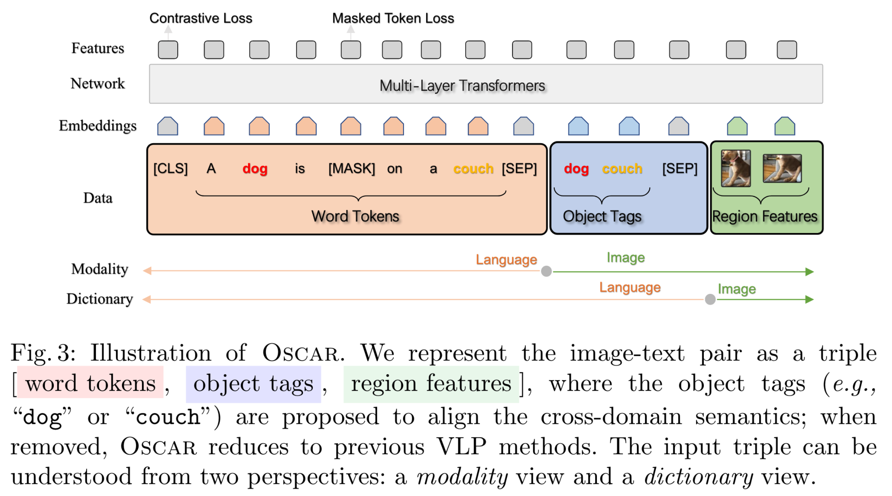

# Oscar: Object-Semantics Aligned Pre-training for Vision-Language Tasks

Oscar is a novel method for explicitly learning correlations between images and text with salient object as anchor points. It utilized the features extracted by image model and text model to pertrain the network. Then the pretrained network is fine-tuned on a variaty of downstream tasks.

## Problem statement

Given a dataset $\mathcal{D} = \{(\mathbf{I}_i, \boldsymbol{w}\}_{i=1}^N$, with image $\mathbf{I}$ and text sequence $\boldsymbol{w}$. With an object detection model $f$, we obtain vision region features $\boldsymbol{v}=\{v_1, \ldots, v_K\} = f(\mathbf{I})$. Similarly we get a sequence of word embeddings $\boldsymbol{w} = \{w_1, \ldots, w_T\}$. Previous vision-language pertraining (VLP) methods employs multi-layer self-attention Transformers to learn cross-modal _contextualized_ representations based on teh _sigular_ embedding of each modality.

$$
\mathit{output} = \operatorname{Transformer}(\boldsymbol{v}, \boldsymbol{w}).
$$

Though simple and effective, existing methods suffer from two issues:

1. **Ambiguity**: Vision region features extracted by Faster R-CNN inevitably overlaps with among image regions at different positions. This renders ambiguities for the extracted visual embeddings.
2. **Lack of grounding**: As a weakly-supervised task, there is no explicitly labeled alignments between $\boldsymbol{v}$ and $\boldsymbol{w}$. However, the authors observe that salient objects can be used as anchor points for learning semantic alignments.

## Method

Oscar introduces the Word-Tag-Image triple $(\boldsymbol{w}, \boldsymbol{q}, \boldsymbol{v})$, where

- $\boldsymbol{v}=(v', z)$, where $v'\in \mathbb{R}^p$ is the feature vectors from Faster R-CNN, and $z\in\mathbb{R}^R$ is the region vector ($R=4\text{ or }6$, for top-left, bottom-right, and/or height & width)
- $\boldsymbol{q}$ is the word embedding sequence of object tags (in text) detected from the image.
- $\boldsymbol{w}$ is the text emhedding sequence.

$$
\boldsymbol{x} \triangleq[\underbrace{\boldsymbol{w}}_{\text {language }}, \underbrace{\boldsymbol{q}, \boldsymbol{v}}_{\text {image }}]=[\underbrace{\boldsymbol{w}, \boldsymbol{q}}_{\text {language }}, \underbrace{\boldsymbol{v}}_{\text {image }}] \triangleq \boldsymbol{x}^{\prime},
$$

where $x$ is a _modality_ view to distinguish the representations between a text and an image; while $x'$ is a _dictionary_ view to distinguish the two different semantic spaces in which the input is represented.

**Modality view**: Contrastive Loss. For each triple, we group $\boldsymbol{h}^{\prime} \triangleq[\boldsymbol{q}, \boldsymbol{v}]$ to represent the image modality, and consider the $\boldsymbol{w}$ as the text modality. We then randomly replace 50% of $\boldsymbol{q}$ with **a** different tag sequence randomly sampled from the dataset $\mathcal{D}$. On the `[CLS]` token, the model outputs the fused vision-language representation of $(\boldsymbol{h}', \boldsymbol{w})$, the authors apply a fully-connected layer as a binary classifier to predict whether the pair contains the original image representation $(y=1)$ or **any** polluted ones $(y=0)$.

$$
\mathcal{L}_{\mathrm{C}}=-\mathbb{E}_{\left(\boldsymbol{h}^{\prime}, \boldsymbol{w}\right) \sim \mathcal{D}} \log p\left(y \mid f\left(\boldsymbol{h}^{\prime}, \boldsymbol{w}\right)\right)
$$

**Dictionary view**: Masked Token Loss. Each word randomly masked (replaced with a special token `[MASK]`) with a probability of 15%. The model is required to predict the masked word. This actually follows the setting of BERT.

$$
\mathcal{L}_{\mathrm{MTL}}=-\mathbb{E}_{(\boldsymbol{v}, \boldsymbol{h}) \sim \mathcal{D}} \log p\left(h_i \mid \boldsymbol{h}_{\backslash i}, \boldsymbol{v}\right)
$$

This Oscar method is illustrated as following:



The full-pretraining objective of Oscar is:

$$
\mathcal{L}_{\text {Pre-training }}=\mathcal{L}_{\mathrm{MTL}}+\mathcal{L}_{\mathrm{C}}
$$

## Relations with BERT

Despite the fact that Bert and Oscar are both characters in [Sesame Street](https://www.sesamestreetchina.com.cn/), the design of Oscar's training procedure shares lots of similarities with the BERT. As a recap, the BERT model is pretrained on two tasks:

- Masked Language Modeling (MLM): As a _Cloze_ task, BERT masks 15% of training tokens, and feed the final hidden vectors corresponding to the mask tokens into an output softmax over the vocabulary. This helps the model build a deep bidirectional modeling of the representation.

  - However, the `[MASK]` token does not appear in fine-tuning, creating a mismatch between pretraining and fine-tuning. To mitigate this, for a masked token, it is replaced with
    - the `[MASK]` token for 80% of the time
    - a random token for 10% of the time
    - itself for 10% of the time

- Next Sentence Prediction (NSP): Suppose we have `A` as a question and `B` as its answer. we randomly replace `B` with another sentense from the corpus with a probability of 50%. The final hidden vector corresponding to the `[CLS]` token is used for NSP prediction. It is a binary prediction of whether `B` `isNext` or `isNotNext`. This helps the model understand the _relationships_ between two sentences, which is not directly captured by language modeling.

And we can assert that the two objectives of Oscar have the following reasons.

- Modality View: Analogy to NSP, to capture the relationship between two modalities.
- Dictionary View: Analogy to MLM, to capture the deep bidirectional modeling of the representation.

In addition, the BERT loss functions are:

$$


$$

> [!NOTE]- Code
>
> ```python
> def get_masked_lm_output(bert_config, input_tensor, output_weights, positions,
>                          label_ids, label_weights):
>   """Get loss and log probs for the masked LM."""
>   input_tensor = gather_indexes(input_tensor, positions)
>
>   with tf.variable_scope("cls/predictions"):
>     # We apply one more non-linear transformation before the output layer.
>     # This matrix is not used after pre-training.
>     with tf.variable_scope("transform"):
>       input_tensor = tf.layers.dense(
>           input_tensor,
>           units=bert_config.hidden_size,
>           activation=modeling.get_activation(bert_config.hidden_act),
>           kernel_initializer=modeling.create_initializer(
>               bert_config.initializer_range))
>       input_tensor = modeling.layer_norm(input_tensor)
>
>     # The output weights are the same as the input embeddings, but there is
>     # an output-only bias for each token.
>     output_bias = tf.get_variable(
>         "output_bias",
>         shape=[bert_config.vocab_size],
>         initializer=tf.zeros_initializer())
>     logits = tf.matmul(input_tensor, output_weights, transpose_b=True)
>     logits = tf.nn.bias_add(logits, output_bias)
>     log_probs = tf.nn.log_softmax(logits, axis=-1)
>
>     label_ids = tf.reshape(label_ids, [-1])
>     label_weights = tf.reshape(label_weights, [-1])
>
>     one_hot_labels = tf.one_hot(
>         label_ids, depth=bert_config.vocab_size, dtype=tf.float32)
>
>     # The `positions` tensor might be zero-padded (if the sequence is too
>     # short to have the maximum number of predictions). The `label_weights`
>     # tensor has a value of 1.0 for every real prediction and 0.0 for the
>     # padding predictions.
>     per_example_loss = -tf.reduce_sum(log_probs * one_hot_labels, axis=[-1])
>     numerator = tf.reduce_sum(label_weights * per_example_loss)
>     denominator = tf.reduce_sum(label_weights) + 1e-5
>     loss = numerator / denominator
>
>   return (loss, per_example_loss, log_probs)
>
>
> def get_next_sentence_output(bert_config, input_tensor, labels):
>   """Get loss and log probs for the next sentence prediction."""
>
>   # Simple binary classification. Note that 0 is "next sentence" and 1 is
>   # "random sentence". This weight matrix is not used after pre-training.
>   with tf.variable_scope("cls/seq_relationship"):
>     output_weights = tf.get_variable(
>         "output_weights",
>         shape=[2, bert_config.hidden_size],
>         initializer=modeling.create_initializer(bert_config.initializer_range))
>     output_bias = tf.get_variable(
>         "output_bias", shape=[2], initializer=tf.zeros_initializer())
>
>     logits = tf.matmul(input_tensor, output_weights, transpose_b=True)
>     logits = tf.nn.bias_add(logits, output_bias)
>     log_probs = tf.nn.log_softmax(logits, axis=-1)
>     labels = tf.reshape(labels, [-1])
>     one_hot_labels = tf.one_hot(labels, depth=2, dtype=tf.float32)
>     per_example_loss = -tf.reduce_sum(one_hot_labels * log_probs, axis=-1)
>     loss = tf.reduce_mean(per_example_loss)
>     return (loss, per_example_loss, log_probs)
> ```

## Q & A

### Why the feature corresponding to the `[CLS]` loss can be used in the Contrastive loss? Why not others?

## Appendix

### Vision model

Oscar method requires good features. In the paper, the authors use Faster R-CNN to extract vision features. For an understanding of the Oscar methods, you can refer to <https://zhuanlan.zhihu.com/p/31426458>.

### Weakly-supervised methods

- Incomplete supervision
- Inexact supervision
- Inaccurate supervision

### Negative Log-Likelihood
