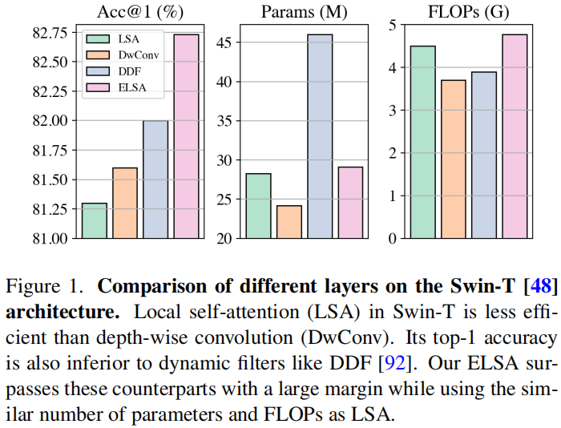
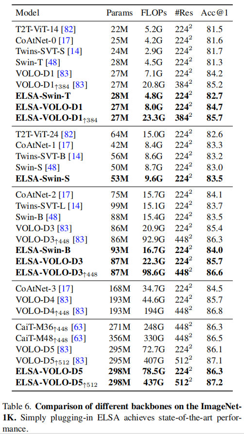

Self-Attention 擅长捕捉长距离（或者说全局）依赖，但其对局部、细粒度的特征捕捉能力有限。

LSA 刚刚能达到卷积的能力，却赶不上 dynamic filters。

Self-Attention 在视觉领域大获成功的背后，Multihead Self Attention 扮演着至关重要的角色。

最近的研究发现 MHSA 倾向于关注在 ViT 前几层的局部信息，所以许多方法试图引入 Inductive Bias 来强制前几层学习局部细节。Swin Transformer 在这方面取得了很大的突破。

但是，奇怪的是，使用 depth-wise convolution 取代 local self-attention 也能取得相媲美（甚至更好）的成绩，并且 LSA 的 FLOPs 更大。



就此，作者提出了文章的核心问题：_what makes local self-attention mediocre?_

作者首先从 local self-attention、depth-wise convolution 和 dynamic filters 的不同点谈起。

现在在 Vision Transformer 领域公认的是将 Channel 和 Spacial 分开讨论，这篇文章也不例外。

## 通道设置

DwConv 和 LSA 最直观的区别在通道设置上。LSA 在**一组**通道之间共享 filter，但 DwConv 对每个通道使用一个单独的 filter。作者认为 DwConv 是当**每组通道里只有一个通道**的 LSA，也就是一种 LSA 的特殊情况，进而猜想增加的 Attention Head 数造成是 DwConv 优异表现的关键。但是，经过作者尝试增加 LSA 的头数等于通道数（虽然没有加到，显存不足，见原文 Figure 2），还是表现齐平，或者 DwConv 略胜一筹，并且直接增加 LSA 头数不会提升其表现。

## 空间处理

DwConv 在每个 feature pixel 中以滑动窗口的方式共享一个静态的 filter，Dynamic Filters 使用一个 bypass network（通常是$1\times 1$卷积）对一个像素生成一个空间相关的 filter，再把这个 filter 应用到该像素的邻域上。按这个逻辑范式，LSA 使用 $qurey$ 和 $key$ 矩阵的点乘生成的 attention map 也可以看成一种空间相关的 filter。LSA 将这些 filters 应用到 local windows 上。

通过作者研究发现，DwConv、Dynamic Filter 和 Local Self-Attention 有相似之处，可以**统一到一个范式中**，通过设置并调节超参数做到公平对比，进而寻找最优结构。

作者将以上三种结构统一到了统一范式中，对三种结构在 parameterization、normalization 和 filter application 三方面进行了对比研究，发现 relative position embedding 和 neighboring filter application 是影响表现的关键因素==如何影响？==

在这些发现的基础之上，作者提出了 Enhanced Local Self Attention，引入了 Hadamard attention 和 ghost head，可以用来替换 Swin-Transformer 或 VOLO 模型中的 LSA 模块

作者使用 ELSA-Swin 等网络在上下游任务进行了广泛的实验验证，其结果在基线水平上都有了一定提升。

> However, calculating the dot product of queries and keys in the neighboring case is not computational-friendly. An effificient way of fifilter generation in the neighboring case is needed to replace the dot product while maintaining performance.
>
> 这句也没懂。


> We compare two versions of Swin
>
> T [48] under the same hyperparameters, and only modify
>
> the head setting each time. Setting 1 means that the number
>
> of heads is set to 1 for all layers. Setting 1*×* represents the
>
> original setting of Swin-T, that is, the head numbers of four
>
> stages are set to *{*3,6,12,24*}*. Setting 2*×* means to double
>
> the original setting, _i.e_., *{*6,12,24,48*}*. Setting C denotes
>
> that the number of heads is set to the number of channels
>
> for all layers.

其实这个实验没有算做完，但是增加 LSA 的通道数做不下去了，因为显存不够。

## Spacial Processing

### 卷积/Depth-wise Conv

$$
\mathbf{x}'_{i}=\sum_{j \in \Theta} \mathbf{w}_{j-i} \mathbf{x}_{j}
$$

> $j$不是一般用来代表一维数组下标吗，这里用来代表二维合适吗

### Dynamic Filters

$$
\mathbf{x}'_{i}=\sum_{j \in \Theta} \operatorname{Norm}\left(\mathbf{x}_{i} \mathbf{w}\right) \mathbf{x}_{j}
$$

$\mathrm{w}$是一个$1\times 1$的卷积权值；Norm 可以为任意的归一化函数，比如 indentity mapping、filter normalization 或 softmax

### Local Self-attention

$$
\mathbf{x}'_{i}=\sum_{j \in \Omega} \operatorname{Softmax}_{j}\left(\mathbf{q}_{i} \mathbf{k}_{j}\right) \mathbf{v}_{j}
$$

### 作者说：我全要

所以作者把以上三种组合起来，就成了

$$
\mathbf{x}'_{i}=\sum_{j \in \Phi} \operatorname{Norm}_{j}\left(\mathbf{q}_{i} \mathbf{k}_{j}+\mathbf{q}_{i} \mathbf{r}_{j-i}^{k}+\mathbf{r}_{j-i}^{q} \mathbf{k}_{j}+\mathbf{r}_{j-i}^{b}\right) \mathbf{v}_{j}
$$

其中$\Phi$指邻域，Norm 是一种归一化操作，$r^k_{j-i}$和$r^q_{j-i}$是相对位置编码，$r^b_{j-1}$是相对位置偏置。

对于 DwConv，只使用$r^b_{j-1}$作为参数，将$\Phi$设置为$\Theta$，也就是邻域

对于 Dynamic Filter，使用$q_ir^k_{j-i}$作为参数

对于 LSA，使用$q_ik_i$作为参数，将$\Phi$设置为窗口

整个公式一功能有三个地方可调：$\Phi$、$\text{Norm}$和括号里要哪些不要哪些

基于以上，作者将 Swin Transformer 作为 baseline，提出了七种网络


在 Experiments 阶段作者讨论的都是自己做了什么工作，主要是解释上边几张表。

## 讨论

### 关键因素

作者认为让 LSA 平凡的原因有两点：

1. 没有 relative position embedding，主要是 net 5 6 7
2. 没有 filter application，局部的比全局的好

### 局部窗口和邻域

作者实验的结论是**局部窗口比邻域的性能差**。并且局部窗口，像 Swin 中的，需要 Swin 层成对出现。

但邻域的缺点是：吞吐量小，原因是==是否强加因果?==在 sliding neighbors 中计算$q$和$k$的点乘并不容易，需要 sliding chuck、unfold operations、以及特殊的 CUDA 算子，程序设计很难，运行的时空成本也很大。

## ELSA

基于以上实验结果，作者提出了一种新型的 LSA 模块：ELSA。关键技术是 Hadamard attention 和 ghost head module.


$$
\mathbf{x}'_{i}=\sum_{j \in \Theta} \mathrm{G}\left(\mathbf{h}_{j-i}\right) \mathbf{v}_{j}
$$

其中$\mathbf{h}$表示 Hadamard attention 的值，$\mathrm G(\cdot)$表示 Ghost Attention.

$$
\mathbf{h}_{j-i}=\operatorname{Softmax}_{j}\left(\left(\mathbf{q}_{i} \odot \mathbf{k}_{i}\right) \mathbf{r}_{j-i}^{k}+\mathbf{r}_{j-i}^{q}\left(\mathbf{q}_{j} \odot \mathbf{k}_{j}\right)+\mathbf{r}_{j-i}^{b}\right)
$$

**定义** 设 $A, B \in \mathbb{C}^{m \times n}$ 且 $A=\left\{a_{i j}\right\}, B=\left\{b_{i j}\right\}$ ，称 $m \times n$ 矩阵

$$
\left[\begin{array}{cccc}
a_{11} b_{11} & a_{12} b_{12} & \cdots & a_{1 n} b_{1 n} \\
a_{21} b_{21} & a_{22} b_{22} & \cdots & a_{2 n} b_{2 n} \\
\vdots & \vdots & & \vdots \\
a_{m 1} b_{m 1} & a_{m 2} b_{m 2} & \cdots & a_{m n} b_{m n}
\end{array}\right]
$$

为矩阵 $\mathrm{A}$ 与 $\mathrm{B}$ 的哈达玛(Hadamard)积，记作 $A \odot B$ 。

$$
\hat{h}_{j-i}^{c}=\operatorname{Pow}\left(o_{j-i}^{c}, \lambda\right) h_{j-i}^{c^{\prime}}+\gamma s_{j-i}^{c}
$$

计算复杂度：$O\left(n_{c} \times k s \times k s \times n_{p}\right)$

```python
# B: batch size, C: channel size
# N: the number of pixels
# H: the number of heads, K: kernel size
# h_attn: Hadamard attention with size (B, H, N, K*K) # lambda, gamma: hyperparameters
def init()
	mul_matrix = nn.Parameters(torch.randn(C, K, K))
	add_matrix = nn.Parameters(torch.zeros(C, K, K))
	trunc_normal_(add_matrix, std=0.02)
def ghost_head(h_attn):
	# change the size of h_attn to (B, 1, H, N, K*K)
	h_attn = h_attn.unsqueeze(1)
	# reshape the size of matrices
	mul_matrix = mul_matrix.reshape(1, C//H, H, 1, K*K)
	add_matrix = add_matrix.reshape(1, C//H, H, 1, K*K)
	# Equation 8
	h_attn = (mul_matrix ** lambda) * h_attn + gamma * add_matrix
	return h_attn.reshape(B, C, N, K*K)
```

## 结果



下游任务：


当然，这篇文章在写作上有许多的问题

1. 英文表达太不地道
2. 逻辑因果不明显，甚至有刻意模糊因果的嫌疑
3. 数学公式使用符号太过随意，不正式，给读者的理解增加了难度
4. 前一段研究和后一段实验的联系，过渡不自然

这篇文章也引出了一些问题：

1. 如何提高 LSA 的效果
2. LSA 到底学到了什么
