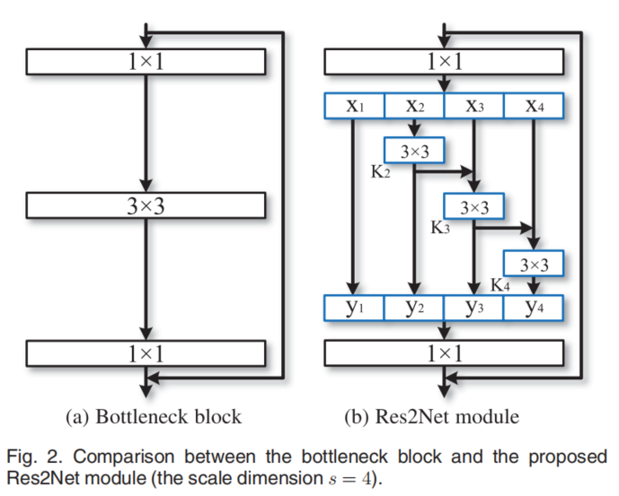

```tex
@ARTICLE{8821313,  author={Gao, Shang-Hua and Cheng, Ming-Ming and Zhao, Kai and Zhang, Xin-Yu and Yang, Ming-Hsuan and Torr, Philip},  journal={IEEE Transactions on Pattern Analysis and Machine Intelligence},   title={Res2Net: A New Multi-Scale Backbone Architecture},   year={2021},  volume={43},  number={2},  pages={652-662},  doi={10.1109/TPAMI.2019.2938758}}
```

图像中往往存在着多尺度的物体，准确表述多尺度物体的特征对多种计算机视觉任务有着重要的意义。现有方法对多尺度信息的处理仅停留在神经网络的层级之间，而本文将残差网络安排在残差网络中，在粒度级表征多尺度图像特征，增大了神经网络中每一层的感受野。Res2Net 骨干网络可以用来替换现有的 SOTA 骨干网络，以在计算机视觉各大任务中取得超过基线水平的效果。

## 背景引入

### 研究背景

视觉模式在自然场景中通常以不同尺度出现：第一是视觉实体大小不同；二是识别一个物体需要比该物体更大的区域；第三，了解更大的区域对语义分割、细粒度分类有重要意义。卷积神经网络在提取多尺度特征中取得了一定的成效。但是，现有方法对多尺度信息的处理仅停留在神经网络的层级之间。

本文提出了一个简单高效的多尺度特征提取方法。Res2Net 在发挥在粒度（granular）方面提取特征的能力

在现有的 width, height, cardinality 维度基础上拓展了 scale 维度

## 相关工作

从卷积神经网络发展历程来看，AlexNet 和 VGGNet 采用的是直接堆叠更深的卷积层，而 GoogLeNet 采用了多路径的方法扩展感受野；ResNet 采用残差连接；后来有 DenseNet 使得网络有更大范围的尺度信息，DLA 将各层组成树状结构，这种层级的树状结构让网络有很好的层与层之间的表达能力。但这些都是调整层级之间产生的联系，没有层级之内，也就是粒度层面的联系。

## 研究方法

$$
\mathbf{y}_{i}= \begin{cases}\mathbf{x}_{i} & i=1 \\ \mathbf{K}_{i}\left(\mathbf{x}_{i}\right) & i=2 \\ \mathbf{K}_{i}\left(\mathbf{x}_{i}+\mathbf{y}_{i-1}\right) & 2<i \leqslant s\end{cases}
$$



(a)为 ResNet 等网络中的残差层，(b)为本文提出的残差层，可以看到，一个 feature $\mathbf{x}_1$直接输出为$\mathbf{y}_1$，$\mathbf{x}_2$经过一个$3\times 3$的卷积输出复制为两路，一路输出为$\mathbf{y}_2$，另一路加到$\mathbf{x}_3$的输入上。$\mathbf{x}_3$之后的输出都会加到下一个卷积核的输入。

这就引入了一个新的超参数$s$，也就是层中的残差层的数量

Cardinality 是什么方法

## 评估方法


在语义分割方面，Res2Net 会在细节方面有一定提升，这种提升在一定程度上是很明显的


还有 Salient Object Detection，


## 讨论与总结

不是一个太大的改动——但取得了一定的效果

数据并行性会不会受到影响？因为后一个卷积核$\mathbf{x}_3$必须等$\mathbf{x}_2$的结果出来才能执行，效率可能受到影响（没有实验）

引文

DLA

SPP => Faster R-CNN => FPN

SSD

DeepLab cascaded atrous convolutional module

Big-Little Net、MSNet、HRNet
