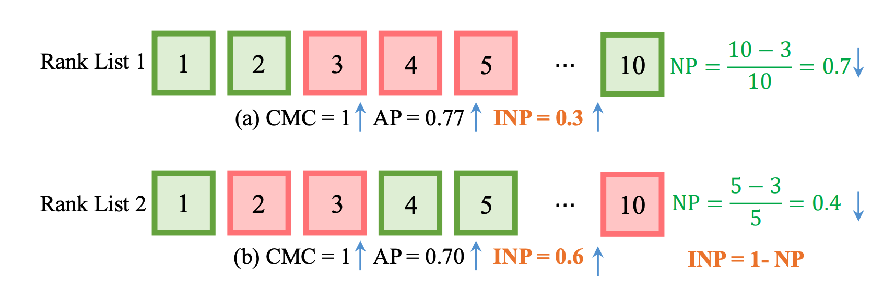

# ReID 的评估指标

Re-Identification 是信息检索任务的一种。模型在给定训练集 $\mathcal{T}$（train）上训练后，给定已知图像集（gallary），通过检索图像集 $\mathcal{Q}$（query）检索得到 $\mathcal{G}$ 中的结果。

ReID 的评估指标主要有 Mean Average Precision (mAP)，Cumulative Matching Characteristic (CMC) 和 Inverse Negative Penalty (INP)。

## Mean Average Precision

mAP 是信息检索领域常用的指标。回忆下 Precision（查准率）和 Recall（查全率）的概念，

$$
\text { precision }=\frac{\mid\{\text { relevant documents }\} \cap\{\text { retrieved documents }\} \mid}{\mid \text { retrieved documents }\} \mid}
$$

$$
\text { recall }=\frac{\mid\{\text { relevant documents }\} \cap\{\text { retrieved documents }\} \mid}{\mid \text { relevant documents }\} \mid}
$$

设查全率为 $r$，查准率 $p(r)$ 是 $r$ 的函数，则 Average Precision 定义为

$$
\mathrm{AveP} = \int_0^1 p(r) \,\mathrm{d} r
$$

即 Precision-Recall 函数在 $[0, 1]$ 上的积分。回忆信息检索时，检索引擎返回的是一个文档的有序列表，我们希望更有用的信息排名更靠前。设文档的排名为 $k$，则有

$$
\operatorname{AveP}=\sum_{k=1}^n P(k) \Delta r(k)
$$

其中 $r(k)$ 是 recall 关于 $k$ 的函数，$\Delta r(k)$ 是从第 $k-1$ 到 $k$ 位 $r(k)$ 的变化量。该式等价于

$$
\text { AveP }=\frac{\sum_{k=1}^n P(k) \times \operatorname{rel}(k)}{\text { total number of relevant documents }}
$$

其中 $\mathrm{rel}(k) = 1$ 当且仅当第 $k$ 位的文档是有关的[^wikipedia-average-precision]。

## Cumulative Matching Characteristic

当 $\mathcal{G}$ 中有且仅有一个与询问实例 $q$ 相关的文档时，$\mathrm{CMC}_k$ 的定义十分简单：排序前 $k$ 的文档中是否有与 $q$ 相关的文档。

$$
\mathrm{CMC}_k = \begin{cases}
1 & \text{if 排序前 }k\text{ 的文档中有与 }q\text{ 相关的文档} \\
0 & \text{otherwise}
\end{cases}
$$

Sadly，如果 $G$ 中有大于一个相关文档时，CMC 的定义并不统一[^open-reid]。

- [CUHK03](https://cysu.github.io/open-reid/notes/www.cv-foundation.org/openaccess/content_cvpr_2014/papers/Li_DeepReID_Deep_Filter_2014_CVPR_paper.pdf): Query and gallery sets are from different camera views. For each query, they randomly sample one instance for each gallery identity, and compute a CMC curve in the *single-gallery-shot* setting. The random sampling is repeated for $N$ times and the expected CMC curve is reported.
- [Market-1501](http://www.cv-foundation.org/openaccess/content_iccv_2015/papers/Zheng_Scalable_Person_Re-Identification_ICCV_2015_paper.pdf): Query and gallery sets could have same camera views, but for each individual query identity, his/her gallery samples from the same camera are excluded. They do not randomly sample only one instance for each gallery identity. This means the query will always match the “easiest” positive sample in the gallery while does not care other harder positive samples when computing CMC.
- 还有，去掉了 `Gallary samples` 中与 `query` 有同样的 PersionID 和 CameraID 的样本，再计算 CMC 的，比如 [alibaba/cluster-contrast-reid/clustercontrast/evaluation_metrics/ranking.py](https://github.com/alibaba/cluster-contrast-reid/blob/57b62e95eb3ade3da4a464c5eead69ca7d5f4e1d/clustercontrast/evaluation_metrics/ranking.py#L46)。

```python
def cmc(distmat, query_ids=None, gallery_ids=None,
        query_cams=None, gallery_cams=None, topk=100,
        separate_camera_set=False,
        single_gallery_shot=False,
        first_match_break=False):
    """
    https://github.com/alibaba/cluster-contrast-reid/blob/57b62e95eb3ade3da4a464c5eead69ca7d5f4e1d/clustercontrast/evaluation_metrics/ranking.py#L18
    """
    distmat = to_numpy(distmat)
    m, n = distmat.shape
    # Fill up default values
    if query_ids is None:
        query_ids = np.arange(m)
    if gallery_ids is None:
        gallery_ids = np.arange(n)
    if query_cams is None:
        query_cams = np.zeros(m).astype(np.int32)
    if gallery_cams is None:
        gallery_cams = np.ones(n).astype(np.int32)
    # Ensure numpy array
    query_ids = np.asarray(query_ids)
    gallery_ids = np.asarray(gallery_ids)
    query_cams = np.asarray(query_cams)
    gallery_cams = np.asarray(gallery_cams)
    # Sort and find correct matches
    indices = np.argsort(distmat, axis=1)
    matches = (gallery_ids[indices] == query_ids[:, np.newaxis])
    # Compute CMC for each query
    ret = np.zeros(topk)
    num_valid_queries = 0
    for i in range(m):
        # Filter out the same id and same camera
        valid = ((gallery_ids[indices[i]] != query_ids[i]) |
                 (gallery_cams[indices[i]] != query_cams[i]))
        if separate_camera_set:
            # Filter out samples from same camera
            valid &= (gallery_cams[indices[i]] != query_cams[i])
        if not np.any(matches[i, valid]): continue
        if single_gallery_shot:
            repeat = 10
            gids = gallery_ids[indices[i][valid]]
            inds = np.where(valid)[0]
            ids_dict = defaultdict(list)
            for j, x in zip(inds, gids):
                ids_dict[x].append(j)
        else:
            repeat = 1
        for _ in range(repeat):
            if single_gallery_shot:
                # Randomly choose one instance for each id
                sampled = (valid & _unique_sample(ids_dict, len(valid)))
                index = np.nonzero(matches[i, sampled])[0]
            else:
                index = np.nonzero(matches[i, valid])[0]
            delta = 1. / (len(index) * repeat)
            for j, k in enumerate(index):
                if k - j >= topk: break
                if first_match_break:
                    ret[k - j] += 1
                    break
                ret[k - j] += delta
        num_valid_queries += 1
    if num_valid_queries == 0:
        raise RuntimeError("No valid query")
    return ret.cumsum() / num_valid_queries

```

## Inverse Negative Penalty

INP 的提出基于如下考虑：一个检索系统返回的结果是给人看的，所以我们希望把重要的内容前几位都展示完。mAP 虽然也一定程度上有这样的约束，但并不完全适用，比如如下情况，假设 $\mathcal{G}$ 中共有十个样本，其中与 $q$ 匹配的有三个[^mang2020survey]。



Rank List 2 在前 5 位就展示完了 3 个匹配的文档，而 Rank List 1 虽然把两个正确的文档放到了 1、2 位，但第 3 个相关文档要到第 10 位才能找到。如果使用 AP，我们会觉得 List 1 比 List 2 更好，但 List 2 的 Negative Penalty 比 List 1 更低（越低越好）[^lcn463365355]。

$$
\mathrm{NP}_i=\frac{R_i^{\text {hard }}-\left|G_i\right|}{R_i^{\text {hard }}}
$$

因为指标一般都是越高越好，所以用 Inverse NP 来评估。

$$
\mathrm{mINP}=\frac{1}{n} \sum_i\left(1-\mathrm{NP}_i\right)=\frac{1}{n} \sum_i \frac{\left|G_i\right|}{R_i^{\text {hard }}}
$$

## References

[^wikipedia-average-precision]: https://en.wikipedia.org/wiki/Evaluation_measures_(information_retrieval)#Average_precision
[^open-reid]: https://cysu.github.io/open-reid/notes/evaluation_metrics.html
[^mang2020survey]: https://arxiv.org/abs/2001.04193
[^lcn463365355]: https://blog.csdn.net/lcn463365355/article/details/113662667
[^cluster-contrast]: https://arxiv.org/abs/2103.11568
