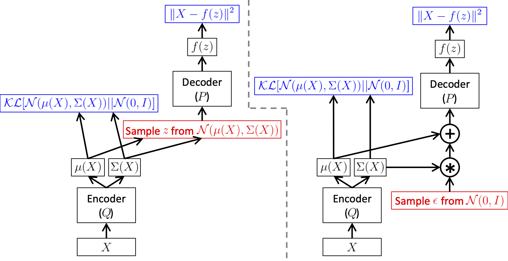
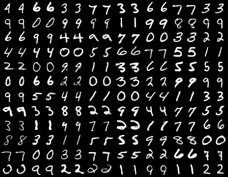
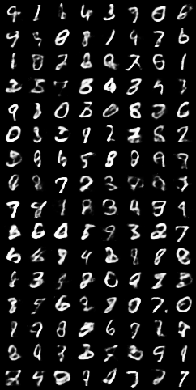

# Variational Autoencoder

First, we start from such a scenario: we have a set of observations $X = \{x_1, x_2, \ldots, x_n\}$. We want to model the data _generatively_. For instance, an image is made up of millions or billions of pixels, which can be seen as a data point located in a high-dimensional space. The images in the high-dimensional space have some unknown structures, and we'd like to capture this latent structure. One straightforward kind of generative model is to directly compute the $P(X)$ numerically. In the example of images, $x$'s which look like real images have high probabilities, and those that look unlike real images, or even like random noise, should have a low probability.

In contrast to getting random noises, generating real images is more valuable to explore. This is decisive in our choice of KL divergence as the cost function, which preserves larger probabilities and relatively ignores small ground truth probabilities. Formally, we'd like to get examples $X$ distributed according to some unknown distribution $P_{gt}(X)$. If getting the exact $P_{gt}(X)$ is infeasible, we'd at least learn a model $P$ which we can sample from, such that $P$ is as close (similar) as possible to $P_{gt}(X)$.

Most previous attempts have had one of the three limitations

1. Require strong assumptions about the structure of the data
2. Make severe approximations, leading to sub-optimal models
3. Rely on computationally expensive inference procedures like Markov Chain Monte Carlo.

Recent advancements in neural networks have given rise to promising frameworks which can use backpropagation-based function approximators to build generative models.

## Latent Variable Models

Suppose we have an image $x$. How can we generate it, from the void? When we say 'an image of a rose', we have a mental image of a rose. So we assume an image-generating model also has a 'mental image', which is formally called the _latent variable_. However, this latent variable is hard to be assigned by hand, and we need a method to infer it.

Before we can say anything about our model, we need to make sure that for every datapoint $x_i \in X$, there are one or more settings of latent variables which cause the model to generate $x_i$. Formally, say we have a vector of latent variables $z$ in a high-dimensional space $\mathcal{Z}$ which we can easily sample according to some probability density function (PDF) $P(z)$ defined over $\mathcal{Z}$. After obtaining $z$, we use a family of deterministic functions $f(z; \theta)$ to map $z$ to $x$. The function $f(z; \theta)$ is a _family_ of functions in the sense that the functions are different with different $\theta$'s, and _deterministic_ for once the $\theta \in \Theta$ is set, the value of the function only rely on the $z$ it is evaluated on. So we have $f(\cdot; \theta): \mathcal{Z} \to \mathcal{X}$.We hope to find a $\theta$ such that we sample $z$ from $P(z)$ and, with high probability, $f(z; \theta)$ will be like the $x$'s in $X$.

Mathematically, we are aiming at maximizing the probability of each $x$ in the training set under the entire generative process, according to:

$$
P(x) \overset{\text{def}}{=} \int P(x|z;\theta)P(z) \,\mathrm{d}z
$$

Here, the probability distribution $P(x|z; \theta)$ allows us to make the dependence of $x$ on $z$ explicit by using **the law of total probability**. This framework, called **maximum likelihood**, aims at making the model more likely to produce samples similar to those in the dataset.

It is called the Variational Inference, which means the inference of functions. Variation is the extension of differential in function space. It represents the principal part of the change in a functional $F(y(x))$ concerning changes in the independent variable $y(x)$. Variational problem is the extreme value problem of functional. The essence of variational inference is to solve the extremum problem of the functional. Given a set of observations $X = \{x_1, x_2, \ldots, x_n\}$ and a latent variable model $P(X, Z)$, how to infer $P(Z|X)$?

According to the Bayes' Theorem

$$
P(Z|X) = \frac{P(X|Z)P(Z)}{P(X)} = \frac{P(X, Z)}{P(X)}
$$

$P(X, Z)$ is known but the marginal distribution $P(X)$ (a.k.a. Evidence) is intractable. for（为啥）

$$
P(X) = \int P(X, Z) \,\mathrm{d}z,
$$

Thus the posterior probability $P(Z|X)$ is intractable.

To solve this problem, we can use a simple and tractable distribution $Q(Z)$ to approximate $P(Z|X)$, i.e.,

$$
Q(Z) \approx P(Z|X)
$$

Now we want to optimize $P(x)$. We can use gradient-based methods such as stochastic gradient descent (SGD) if the $P(x|z)$ is differentiable.

Two solve the equation, there are two problems that we must deal with:

1. How to define the latent variable $z$
2. How to deal with the integral over $z$

For the first problem, the 'latent' decisions that the model needs to make can be rather complicated. Ideally, we want to avoid deciding by hand what information each dimension of $z$ encodes. We also want to avoid explicitly describing the dependencies, i.e., the latent structure, between the dimensions of $z$.

For the second problem, if we can find a computable formula for $P(X)$, and we can take the gradient of that formula, then we can optimize the model using SGD. It is straightforward:

$$
P(X) \approx \frac{1}{n}\sum_i P(X|z_i)
$$

The only problem that remains is that in high dimensional spaces, $n$ might need to be extremely large before we have an accurate estimate of $P(X)$. If we use the metric of mean square error (MSE), minimizing Euclidean distance between the ground truth and the generated images, we may be posed with a rather difficult optimization problem, and need much more data to optimize.

The variation inference works by choosing a family of probability density functions and then finding the one closest to the actual probability density. In Variational Autoencoders, the choice of the output distribution of Gaussian, i.e., $P(X | z ; \theta)=\mathcal{N}\left(X | f(z ; \theta), \sigma^2 * I\right)$. It has mean $f(z;\theta)$ and covariance equal to the identity matrix $I$ times some scalar $\sigma$, which is a hyperparameter. By using Gaussian distribution, we can take the gradient descent method --- which is impossible if $P(X|z)$ was a Dirac delta function, as it would be if we used $X = f(z; \theta)$ deterministically. In fact, the $P(X|z)$ need not be Gaussian: the important property is that $P(X|z)$ can be computed, and continuous in $\theta$.

VAE makes a special assumption on the latent variable: the $z$ is drawn from the standard normal distribution $\mathcal{N}(\mathbf{0}, I)$, where the mean $\mathbf{0}$ is a vector of zeros, and the covariance matrix $I$ is the identity matrix. The key is that any distribution in $d$ dimensions can be generated by taking a set of $d$ variables that are normally distributed and mapped through a sufficiently complicated function, which can be approximated by neural networks.

As for the questing of how to maximize the Equation, now we have $P(z)=\mathcal{N}(z|0, I)$. It is differentiable with regard to $\theta$. In practice, for most $z$, $P(X|z)$ will be nearly zero, contributing almost nothing to our estimate of $P(X)$. The key idea of VAE is to attempt to sample values of $z$ that are likely to ==have produced== $X$, and compute $P(X)$ just from those.

For this problem, we need a new function $Q(z|X)$ which can take a value of $X$ and give us a distribution over $z$ values that are likely to produce $X$. Hopefully, the space of $z$ values that are likely under $Q$ will be much smaller than the space of all $z$'s that are likely under the prior $P(z)$. This lets us compute $E_{z\sim Q}P(X|z)$ relatively easily.

> However, if $z$ is sampled from an arbitrary PDF, not $\mathcal{N}(0, I)$, then how does that help us optimize $P(X)$?

We first assume that $Q$ does not depend on $X$, and use $Q(z)$ to approximate $P(z|X)$. A good function to evaluate the likeliness is the Kullback-Leibler divergence (KL divergence of $\mathcal{D}$). We have

$$
\begin{aligned}
\mathcal{D}[Q(z) \| P(z | X)] &=E_{z \sim Q}[\log Q(z)-\log P(z | X)] \\
&=E_{z \sim Q}\left[\log Q(z)-\frac{\log P(X | z)P(z)}{P(X)}\right] \\
&=E_{z \sim Q}[\log Q(z)-\log P(X | z)-\log P(z)]+\log P(X) \\
&=E_{z \sim Q}\left[\log \frac{Q(z)}{P(z)}\right]-E_{z \sim Q}[\log P(X | z)]+\log P(X) \\
&= \mathcal{D}(Q(z)||P(z))-E_{z \sim Q}[\log P(X | z)]+\log P(X) \\
\end{aligned}
$$

This formula can be transformed to

$$
\log P(X)-\mathcal{D}[Q(z) \| P(z | X)]=E_{z \sim Q}[\log P(X | z)]-\mathcal{D}[Q(z) \| P(z)]
$$

Note that $X$ is fixed, and $Q$ can be _any_ distribution. Since we're interested in inferring $P(X)$, it makes sense to construct a $Q$ which _does_ depend on $X$, and in particular, one which make $\mathcal{D}[Q(z)||P(z|X)]$ small:

$$
\log P(X)-\mathcal{D}[Q(z | X) \| P(z | X)]=E_{z \sim Q}[\log P(X | z)]-\mathcal{D}[Q(z | X) \| P(z)]
\label{eq:obj}
$$

On the left, there is the quantity that we want to optimize: $\log P(X)$ (plus an error term, which makes $Q$ produce $z$'s that can reproduce a given $X$). On the right is something we can optimize via SGD.

## Evidence Lower Bound

The right side of the equation is referred to as the _Evidence Lower Bound_ (ELBO，证据率下界), in which _Evidence_ means $P(X)$. The KL-Divergence has the special property that $D_{K L}(p(x) \| q(x)) \geq 0, D_{K L}(p(x) \| q(x))=0$ if and only if $p=q$. Another proof of the existence of the ELBO leverages Jensen's inequality.

> ![Theorem] [Jensen Inequility](https://en.wikipedia.org/wiki/Jensen's_inequality)
>
> For a convex function $f$ and $t \in [0, 1]$, we have
>
> $$
> f(tx_1 + (1-t)x_2) \le tf(x_1) + (1-t)f(x_2)
> $$
>
> In the context of probability theory, if $X$ is a random variable and $\varphi$ is a convex function, then
>
> $$
> \varphi(\mathrm{E}[X]) \leq \mathrm{E}[\varphi(X)]
> $$
>
> The difference between the two sides of the inequility, $\mathrm{E}[\varphi(X)] - \varphi(\mathrm{E}[X])$, is called the _Jenson gap_.

We have

$$
\begin{aligned}
\log P(X) & =\log \int P(X, Z) d Z \\
& =\log \int\left(\frac{P(X, Z)}{Q(Z)} Q(Z)\right) d Z \\
& =\log E_Z\left[\frac{P(X, Z)}{Q(Z)}\right] \\
& \geq E_Z\left[\log \frac{P(X, Z)}{Q(Z)}\right] \quad \text{(Jensen's Inequality)} \\
& =E_Z[\log P(X, Z)]-E_Z[\log Q(Z)] \\
& =\int Q(Z) \log P(X, Z) d Z-\int Q(Z) \log Q(Z) d Z
\end{aligned}
$$

So if we want to optimize $P(X)$, one of the tractable solutions is to optimize the ELBO. The next section will discuss how the optimization is conducted.

## Optimizing the objective

So how can we perform stochastic gradient descent on the right-hand side of Equation $(\ref{eq:obj})$? First, we need to be a bit more specific about the form that $Q(z|X)$ will take. The usual choice is to say that $Q(z|X) = \mathcal{N}(z|\mu(X;\phi), \Sigma(X, \phi))$, where $\mu$ and $\Sigma$ are arbitrary deterministic functions with parameters $\phi$ that can be learned from data. In practice, $\mu$ and $\Sigma$ are also generated by neural networks, and $\Sigma$ is constrained to be a diagonal matrix. Now the last term, $\mathcal{D}[Q(z | X) \| P(z)]$, is now a KL-divergence between two multivariate Gaussian distributions, which can be computed in closed form as (proof at the end of the article):

$$
\mathcal{D}\left[\mathcal{N}\left(\mu_0, \Sigma_0\right) \| \mathcal{N}\left(\mu_1, \Sigma_1\right)\right]= \frac{1}{2}\left(\operatorname{tr}\left(\Sigma_1^{-1} \Sigma_0\right)+\left(\mu_1-\mu_0\right)^{\top} \Sigma_1^{-1}\left(\mu_1-\mu_0\right)-k+\log \left(\frac{\operatorname{det} \Sigma_1}{\operatorname{det} \Sigma_0}\right)\right)
$$

Where $k$ is the dimensionality of the distribution. In our case, this simplifies to

$$
\mathcal{D}[\mathcal{N}(\mu(X), \Sigma(X)) \| \mathcal{N}(0, I)]=
\frac{1}{2}\left(\operatorname{tr}(\Sigma(X))+(\mu(X))^{\top}(\mu(X))-k-\log \operatorname{det}(\Sigma(X))\right)
$$

The first term, $E_{z \sim Q}[\log P(X | z)]$, is a bit more tricky. We would use sampling to estimate this value, but getting a good estimate would require many samples of $z$ through $f$, which would be expensive. Hence, as is standard in SGD, we take one sample of $z$ and treat $\log P(X|z)$ for that $z$ as an approximation of $E_{z\sim Q}[\log P(X|z)]$. The full equation we want to optimize is:

$$
E_{X \sim D}[\log P(X)-\mathcal{D}[Q(z | X) \| P(z | X)]]=E_{X \sim D}\left[E_{z \sim Q}[\log P(X | z)]-\mathcal{D}[Q(z | X) \| P(z)]\right]
$$

If we take the gradient of this equation, the gradient symbol can be moved into the Expectations. Therefore, we can sample a single value of $X$ and a single value of $z$ from the distribution $Q(z|X)$, and compute the gradient of:

$$
\log P(X | z)-\mathcal{D}[Q(z | X) \| P(z)]
$$

However, this equation has a significant problem. $\log P(X | z)$ depends on the value of $Q$ through $z$. This dependency disappeared from the Equation. This is because the Gaussian sampling is non-differentiable. The solution called the _reparameterization trick_, is to move a sampling to an input layer. Given $\mu(X)$ and $\Sigma(X)$, the mean and the covariance of $Q(z|X)$, we can sample from $\mathcal{N}(\mu(X), \Sigma(X))$ by first sampling $\epsilon \sim \mathcal{N}(0, 1)$, then computing $z = \mu(X) + \Sigma^{1/2}*\epsilon$. The equation that we actually take the gradient of is:

$$
E_{X \sim D}\left[E_{\epsilon \sim \mathcal{N}(0, I)}\left[\log P\left(X | z=\mu(X)+\Sigma^{1 / 2}(X) * \epsilon\right)\right]-\mathcal{D}[Q(z | X) \| P(z)]\right]
$$

## Implement as a Variational Autoencoder

In practice, variational autoencoder takes an Expectation-Maximization approach.

- Expectation: compute $z$ from $X$ as $Q(z|X)$.
- Maximization: Maximize the likelihood $P(X|z)$,

where $P(X|z;\theta)$ and $Q(z|X; \phi)$ are implemented as nerual networks. They are differentiable with regard to $\theta$ and $\phi$ respectively, so an end-to-end SGD optimization is tractable.



## Testing

The testing is remarkably simple. We remove the encoder and directly input values $z \sim \mathcal{N}(0, 1)$ into the encoder.

~~First, we need to relate $E_{z\sim Q}P(X|z)$ and $P(X)$.~~

## Experiments

The reconstructed images in the training (images are presented in pairs, for each pair, the left is the GT, and the right is the model prediction)



The images generated from random normally distributed $z$:



## Limitations

- It is difficult to control which image is generated with $z$.

---

KL Divergence between two univariate Gaussian <http://yunjey47.tistory.com/43>

$$
\begin{aligned}
K L(P \| Q) & =\int p(x) \log \frac{p(x)}{q(x)} d x \\
& =\int p(x)(\log p(x)-\log q(x)) d x \\
& =\int p(x)\left(-\log \sqrt{2 \pi} \sigma_1-\frac{\left(x-\mu_1\right)^2}{2 \sigma_1^2}+\log \sqrt{2 \pi} \sigma_2+\frac{\left(x-\mu_2\right)^2}{2 \sigma_2{ }^2}\right) d x \\
& =\int p(x)\left(\log \frac{\sigma_2}{\sigma_1}-\frac{\left(x-\mu_1\right)^2}{2 \sigma_1^2}+\frac{\left(x-\mu_2\right)^2}{2 \sigma_2{ }^2}\right) d x \\
& =E_{x \sim p(x)}\left[\log \frac{\sigma_2}{\sigma_1}-\frac{\left(x-\mu_1\right)^2}{2 \sigma_1^2}+\frac{\left(x-\mu_2\right)^2}{2 \sigma_2{ }^2}\right] \\
& =\log \frac{\sigma_2}{\sigma_1}-\frac{1}{2 \sigma_1^2} E_{x \sim p(x)}\left[\left(x-\mu_1\right)^2\right]+\frac{1}{2 \sigma_2^2} E_{x \sim p(x)}\left[\left(x-\mu_2\right)^2\right] \\
& =\log \frac{\sigma_2}{\sigma_1}-\frac{1}{2 \sigma_1^2} \sigma_1^2+\frac{1}{2 \sigma_2^2} E_{x \sim p(x)}\left[\left(x-\mu_1+\mu_1-\mu_2\right)^2\right] \\
& =\log \frac{\sigma_2}{\sigma_1}-\frac{1}{2}+\frac{1}{2 \sigma_2^2} E_{x \sim p(x)}\left[\left(x-\mu_1\right)^2+2\left(\mu_1-\mu_2\right)\left(x-\mu_1\right)+\left(\mu_1-\mu_2\right)^2\right] \\
& =\log \frac{\sigma_2}{\sigma_1}-\frac{1}{2}+\frac{1}{2 \sigma_2^2}\left(\sigma_1^2+0+\left(\mu_1-\mu_2\right)^2\right) \\
& =\log \frac{\sigma_2}{\sigma_1}-\frac{1}{2}+\frac{\sigma_1^2+\left(\mu_1-\mu_2\right)^2}{2 \sigma_2^2}
\end{aligned}
$$

### Code

```python
# https://blog.csdn.net/baidu_35231778/article/details/116044429
# Variational Autoencoder
import os
import torch
import torch.nn as nn
import torch.nn.functional as F
import torchvision
from torchvision import transforms
from torchvision.utils import save_image


# Device configuration
device = torch.device('cuda' if torch.cuda.is_available() else 'cpu')

# Create a directory if not exists
sample_dir = 'samples'
if not os.path.exists(sample_dir):
    os.makedirs(sample_dir)

# Hyper-parameters
image_size = 784
h_dim = 400
z_dim = 20
num_epochs = 150
batch_size = 128
learning_rate = 1e-3

# MNIST dataset
dataset = torchvision.datasets.MNIST(
    root='data',
    train=True,
    transform=transforms.ToTensor(),
    download=True)

# Data loader
data_loader = torch.utils.data.DataLoader(
    dataset=dataset,
    batch_size=batch_size,
    shuffle=True)


# VAE model
class VAE(nn.Module):
    def __init__(self, image_size=784, h_dim=400, z_dim=20):
        super(VAE, self).__init__()
        self.encoder = nn.Linear(image_size, h_dim)
        self.mu_proj = nn.Linear(h_dim, z_dim)
        self.logvar_proj = nn.Linear(h_dim, z_dim)
        self.decoder = nn.Sequential(
            nn.Linear(z_dim, h_dim),
            nn.ReLU(True),
            nn.Linear(h_dim, image_size),
            nn.Sigmoid()
        )

    def encode(self, x):
        h = F.relu(self.encoder(x))
        return self.mu_proj(h), self.logvar_proj(h) # two encoders for mu and var, respectively

    def reparameterize(self, mu, log_var):
        std = torch.exp(log_var/2)
        eps = torch.randn_like(std)
        return mu + eps * std

    def decode(self, x):
        return self.decoder(x)

    def forward(self, x):
        mu, log_var = self.encode(x)
        z = self.reparameterize(mu, log_var)
        x_reconst = self.decode(z)
        return x_reconst, mu, log_var


model = VAE().to(device)
optimizer = torch.optim.Adam(model.parameters(), lr=learning_rate)


# Start training
for epoch in range(num_epochs):
    for i, (x, _) in enumerate(data_loader):
        # Forward pass
        x = x.to(device).view(-1, image_size)
        x_reconst, mu, log_var = model(x)

        # Compute reconstruction loss and kl divergence
        reconst_loss = F.binary_cross_entropy(x_reconst, x, reduction='sum')
        kl_div = - 0.5 * torch.sum(1 + log_var - mu.pow(2) - log_var.exp())

        # Backprop and optimize
        loss = reconst_loss + kl_div
        optimizer.zero_grad()
        loss.backward()
        optimizer.step()

        if (i+1) % 100 == 0:
            print ("Epoch[{}/{}], Step [{}/{}], Reconst Loss: {:.4f}, KL Div: {:.4f}"
                   .format(epoch+1, num_epochs, i+1, len(data_loader), reconst_loss.item(), kl_div.item()))

    with torch.no_grad():
        # Save the generated images
        z = torch.randn(batch_size, z_dim).to(device)
        out = model.decode(z).view(-1, 1, 28, 28)
        save_image(out, os.path.join(sample_dir, 'epoch{}-generated.png'.format(epoch+1)))

        # Save the reconstructed images
        out, _, _ = model(x)
        x_concat = torch.cat([x.view(-1, 1, 28, 28), out.view(-1, 1, 28, 28)], dim=3)
        save_image(x_concat, os.path.join(sample_dir, 'epoch{}-reconstructed.png'.format(epoch+1)))
```
