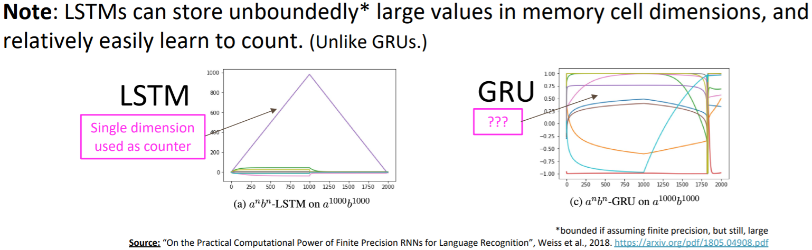

## 从`RNN`说起

`RNN`的输出：

$$
\hat{\boldsymbol y} = \mathrm{softmax}\left(\boldsymbol{U}\boldsymbol{h}^{(t)} + \boldsymbol b_2 \right) \in \mathbf{R}^{|V|}
$$

`RNN`的隐藏状态：

$$
\boldsymbol{h}^{(t)} = \sigma\left(\boldsymbol{W}_h\boldsymbol{h}^{(t-1)} + \boldsymbol{W}_e \boldsymbol{e}^{(t)} + \boldsymbol{b}_1 \right)
$$

其中$\boldsymbol{h}^{(0)}$是初识隐藏状态，词嵌入

$$
\boldsymbol{e}^{(t)} = \boldsymbol{E}\boldsymbol{x}^{(t)}
$$

词（`one-hot`向量）$\boldsymbol{x}^{(t)} \in \mathbf{R}^{|V|}$

反向传播的过程：

$$
\frac{\partial J^{(t)}}{\partial \boldsymbol{W}_\boldsymbol{h}} = \left.\sum_{i=1}^{t} \frac{\partial J^{(t)}}{\partial \boldsymbol{W}_{\boldsymbol{h}}}\right|_{(i)}
$$

此策略被称为**Backpropagation through time**[^1]。

评估语言模型的最基本方案是$\mathrm{perplexity}$，

$$
\begin{aligned}
\text { perplexity } &=\prod_{t=1}^{T}\left(\frac{1}{P_{\mathrm{LM}}\left(\boldsymbol{x}^{(t+1)} \mid \boldsymbol{x}^{(t)}, \ldots, \boldsymbol{x}^{(1)}\right)}\right)^{1 / T} \\
&=\prod_{t=1}^{T}\left(\frac{1}{\hat{\boldsymbol{y}}_{\boldsymbol{x}_{t+1}}^{(t)}}\right)^{1 / T}=\exp \left(\frac{1}{T} \sum_{t=1}^{T}-\log \hat{\boldsymbol{y}}_{\boldsymbol{x}_{t+1}}^{(t)}\right)\\&=\exp (J(\theta))

\end{aligned}
$$

也就是交叉熵的指数。

但是，`RNN`需要将一个序列读入，全部计算梯度后才能反向传播，容易引起梯度消失和梯度爆炸。有人提出了梯度裁剪和 truncated backpropagation through time，但是都没有从根本上解决问题。

## LSTM

$$
\begin{aligned}
\boldsymbol{f}^{(t)} &=\sigma\left(\boldsymbol{W}_{f} \boldsymbol{h}^{(t-1)}+\boldsymbol{U}_{f} \boldsymbol{x}^{(t)}+\boldsymbol{b}_{f}\right) \\
\boldsymbol{i}^{(t)} &=\sigma\left(\boldsymbol{W}_{i} \boldsymbol{h}^{(t-1)}+\boldsymbol{U}_{i} \boldsymbol{x}^{(t)}+\boldsymbol{b}_{i}\right) \\
\boldsymbol{o}^{(t)} &=\sigma\left(\boldsymbol{W}_{o} \boldsymbol{h}^{(t-1)}+\boldsymbol{U}_{o} \boldsymbol{x}^{(t)}+\boldsymbol{b}_{o}\right) \\
\tilde{\boldsymbol{c}}^{(t)} &=\tanh \left(\boldsymbol{W}_{c} \boldsymbol{h}^{(t-1)}+\boldsymbol{U}_{c} \boldsymbol{x}^{(t)}+\boldsymbol{b}_{c}\right) \\
\boldsymbol{c}^{(t)} &=\boldsymbol{f}^{(t)} \circ \boldsymbol{c}^{(t-1)}+\boldsymbol{i}^{(t)} \circ \tilde{\boldsymbol{c}}^{(t)} \\
\boldsymbol{h}^{(t)} &=\boldsymbol{o}^{(t)} \circ \tanh \boldsymbol{c}^{(t)}
\end{aligned}
$$

LSTM 有三个门、三个状态：

- $\boldsymbol f$被称为 forget gate，决定对 cell 的哪些状态“记住”哪些进行“遗忘”；
- $\boldsymbol i$被称为“输入门”，用于决定输入$\boldsymbol x$的哪些部分会进入 cell；
- $\boldsymbol o$被称为“输出门”，用于决定 cell 的哪部分会影响输出；

- $\tilde{\boldsymbol{c}}^{(t)}$为由$x$计算得到的 cell 的新状态
- $\boldsymbol c^{(t)}$为 cell 下一时刻的状态
- $\boldsymbol h^{(t)}$为输出状态

## GRU

$$
\begin{aligned}
&\boldsymbol{u}^{(t)}=\sigma\left(\boldsymbol{W}_{u} \boldsymbol{h}^{(t-1)}+\boldsymbol{U}_{u} \boldsymbol{x}^{(t)}+\boldsymbol{b}_{u}\right) \\
&\boldsymbol{r}^{(t)}=\sigma\left(\boldsymbol{W}_{r} \boldsymbol{h}^{(t-1)}+\boldsymbol{U}_{r} \boldsymbol{x}^{(t)}+\boldsymbol{b}_{r}\right) \\
&\tilde{\boldsymbol{h}}^{(t)}=\tanh \left(\boldsymbol{W}_{h}\left(\boldsymbol{r}^{(t)} \circ \boldsymbol{h}^{(t-1)}\right)+\boldsymbol{U}_{h} \boldsymbol{x}^{(t)}+\boldsymbol{b}_{h}\right) \\
&\boldsymbol{h}^{(t)}=\left(1-\boldsymbol{u}^{(t)}\right) \circ \boldsymbol{h}^{(t-1)}+\boldsymbol{u}^{(t)} \circ \tilde{\boldsymbol{h}}^{(t)}
\end{aligned}
$$

与 LSTM 相比，GRU 没有 cell 的概念，而是使用 update gate 和 reset gate 来控制对 hidden state 的更新。

## LSTM vs. GRU

LSTM 和 GRU 是最常用的 RNN 变种，在通常情况下，LSTM 是不错的选择，但 GRU 有更少的参数量和更快的训练速度。

还有个很有意思的事实是，LSTM 比 GRU 更容易学会计数[^cs224n-lecture06]。

[^1]: Werbos, P.G., 1988, Neural Networks 1, and others
[^cs224n-lecture06]: http://web.stanford.edu/class/cs224n/slides/cs224n-2022-lecture06-fancy-rnn.pdf
