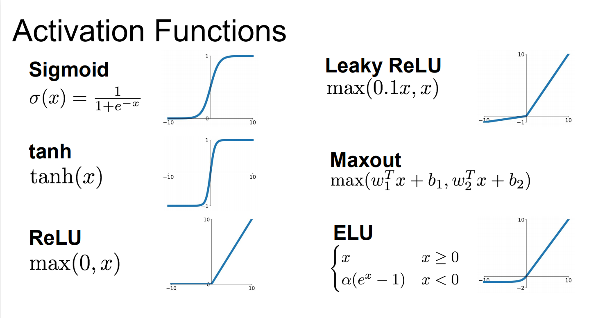

# ConvNets!

神经网络是一个网络接一个网络，每个网络后面接一个非线性激活函数，比如$s = W_3 \max(0, W_2 \max(0, W_1 x))$就是非线性套非线性

## 从一个神经元开始


单个的神经元可以认为是线性二分类器，对神经元施加的`weight decay`等正则化手段可以类比为“遗忘”。

## 非线性激活函数

TODO：如何画图？



最常用的、应该首先尝试的是`ReLU`。

## 神经网络架构

神经网络就是以神经元为节点的图。

但作为命名习惯，称一个$N$层神经网络时，输入层不计入。

## 前馈计算

就那么算。

## 数学原理

$$
\forall x, \mid f(x) - g(x) \mid < \epsilon
$$

其中，$f(x)$是目标函数，$g(x)$是神经网络拟合出的函数，故神经网络也被称为**通用函数拟合器 universal function approximators**

## 数据预处理

### 减去均值

减掉均值，使数据的中点与原点重合

### 正则化

使向量各分量的数据尺度近似相同

### 权值初始化

误区：全是 0，所有神经元将产生同样的梯度，所有的参数更新都是相同的，达不到训练效果

#### 小随机数

比较好一点，但是如果过小会出现梯度消失现象

####较推荐的初始化方式

使用`ReLU`激活单元，初始权值设置为`w = np.random.randn(n) * sqrt(2.0/n)`

### 批正则化

$$
\hat{x}^{(k)} = \frac{x^{(k)} - \operatorname{E}[x^{(k)}]}{\sqrt{\operatorname{Var}[x^{(k)}]}}
$$

### 正则化

#### L2 正则化

That is, for every weight $w$ in the network, we add the term $\frac{1}{2} \lambda w^2$ to the objective, where $\lambda$ is the regularization strength.

#### L1 正则化

$\lambda |w|$

#### Elastic net regularization

$\lambda_1 |w| + \lambda_2 w^2$

#### 最大范数约束

$||\vec w||_2 < c$，$c$的数量级在$3$~$4$。

#### Dropout

随机将一些神经元的输出置$0$。

但这也带来了新的问题：假设 dropout 概率为$0.5$，测试时不使用 dropout，那么要将 dropout 层的输出除以$2$，下一层的神经元才能接收到合理的输出。这就造成了在测试时的多余计算。所以，使用 inverse dropout 解决，即在训练时就将 dropout 层的结构乘以$1/p$，测试时原样输出。

### In Practice

常用做法是使用一个全局 L2 正则化，交叉验证，每一层后都有 dropout，默认设置$p=0.5$。

## 损失函数

### 分类

分类的损失函数有 SVM loss

$$
L_i = \sum_{j\neq y_i} \max(0, f_j - f_{y_i} + 1)
$$

或者有人用平方脊损失$\max(0, f_j - f_{y_i} + 1)^2$

cross-entropy loss

$$
L_i = -\log\left(\frac{e^{f_{y_i}}}{ \sum_j e^{f_j} }\right)
$$

或者对每一个类训练一个 logistic regression

$$
P(y = 1 \mid x; w, b) = \frac{1}{1 + e^{-(w^Tx +b)}} = \sigma (w^Tx + b)
$$

加起来就成了这样：

$$
L_i = -\sum_j y_{ij} \log(\sigma(f_j)) + (1 - y_{ij}) \log(1 - \sigma(f_j))
$$

上边式子看起来复杂，其实$f$的导数非常简单明了：$\frac{\partial L_i}{\partial f_j} = \sigma(f_j)-y_{ij}$

### 回归

最简单的就是 L1 范式$L_i = ||f-y_i||_1$和 L2 范式的平方$L_i = ||f-y_i||^2_2$。

## 学习与训练

### 计算梯度时的注意事项

#### 使用中心差分方法

$$
\frac{d f(x)}{d x}=\frac{f(x+h)-f(x-h)}{2 h}
$$

#### 使用相对误差比较解析梯度和数值梯度

$$
\frac{\left|f_{a}^{\prime}-f_{n}^{\prime}\right|}{\max \left(\left|f_{a}^{\prime}\right|,\left|f_{n}^{\prime}\right|\right)}
$$

#### 用`double`，注意浮点数计算

如果 loss 非常小（1e-10 以下），可以考虑将 loss 放大一点。

#### Kinks

Kinks 指目标函数中不可微的部分，此时的数值微分不是准确的。

#### 少选数据点

数据点越少，kinks 越少

#### 步长$h$

不要设置得太小。

#### 在有“特性”的时候进行梯度校对

如果没有“特性”，随机性太严重。

#### 不要让正则化的力度超过数据等的力度

#### 注意关闭 dropout 和数据增强

#### 只看一部分条件

现实中，一个神经网络有上百万个参数，不可能把每个参数的梯度都计算一遍。

### 训练前

#### loss 是否在正常范围内

#### 提高正则化在 loss 中的权值应该会使 loss 提高

#### 先 overfit 一部分数据

### 训练时

#### 基本更新

$$
x_{t+1} = x_t - lr\times dx
$$

#### 动量更新

$$
v_{t+1} = mu \times v_t - lr \times dx_t \\
x_{t+1} = x_t + v_{t+1}
$$

#### Nesterov 动量


```python
x_ahead = x + mu * v
# evaluate dx_ahead (the gradient at x_ahead instead of at x)
v = mu * v - learning_rate * dx_ahead
x += v
```

```python
v_prev = v # back this up
v = mu * v - learning_rate * dx # velocity update stays the same
x += -mu * v_prev + (1 + mu) * v # position update changes form
```

#### Adagrad

```python
# Assume the gradient dx and parameter vector x
cache += dx**2
x += - learning_rate * dx / (np.sqrt(cache) + eps)
```

#### RMSProp

```python
cache = decay_rate * cache + (1 - decay_rate) * dx**2
x += - learning_rate * dx / (np.sqrt(cache) + eps)
```

#### Adam

```python
m = beta1*m + (1-beta1)*dx
v = beta2*v + (1-beta2)*(dx**2)
x += - learning_rate * m / (np.sqrt(v) + eps)
```

Adam 论文中推荐的参数设置是 `eps = 1e-8`, `beta1 = 0.9`, `beta2 = 0.999`。学习率设置在`5e-3`（从头训练）到`1e-5`（迁移学习）

一般用 Adam，有时 Adagrad>Adam (任务不同)

#### 超参搜索

网格搜索和随机搜索
