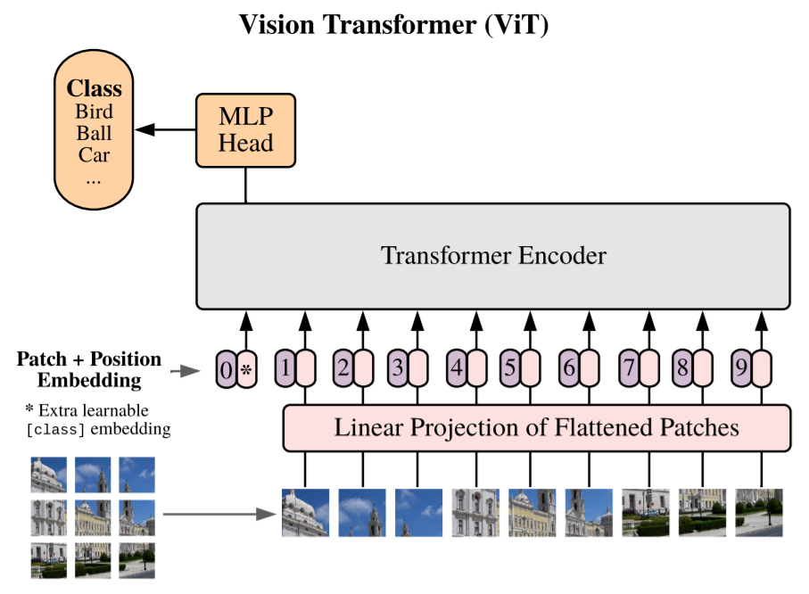

各位小伙伴们，大家下午好。下周四我将进行研读论文的题目是《Res2Net: A New Multi-Scale Backbone Architecture》和《Swin Transformer: Hierarchical Vision Transformer Using Shifted Windows》，论文PDF已上传至群文件，请感兴趣的小伙伴自行查阅。

```tex
@InProceedings{Liu_2021_ICCV,
    author    = {Liu, Ze and Lin, Yutong and Cao, Yue and Hu, Han and Wei, Yixuan and Zhang, Zheng and Lin, Stephen and Guo, Baining},
    title     = {Swin Transformer: Hierarchical Vision Transformer Using Shifted Windows},
    booktitle = {Proceedings of the IEEE/CVF International Conference on Computer Vision (ICCV)},
    month     = {October},
    year      = {2021},
    pages     = {10012-10022}
}
```

Transformer是在自然语言处理领域大获成功的RNN模型，并且在计算机视觉任务中也表现出优异的成绩。但是，因为CV和NLP两个领域中的不同点，比如，CV中视觉实体的尺度变化更大、像素的分辨率比文字更高等，都给Transformer在CV的应用带来了挑战。为了解决此问题，作者提出了一种层级化的Transformer网络，并使用Shifted Windows方法进行representation的计算。Shifted Windows（简称Swin）方法将自注意力的计算限制在不重叠的局部窗口中，通过shift（位移）操作实现跨窗口信息连接。网络的层级化结构使得网络能够适应多种尺度的视觉目标，并且Swin的计算只有线性时间复杂度。以Swin Transformer作为骨干网络的模型在多个计算机视觉任务中取得了SOTA的成绩。

## 背景引入

研究动机

>  to expand the applicability of Transformer such that it can serve as a general-purpose backbone for computer vision, as it does for NLP and as CNNs do in vision.

相较于CV界各种维度、各种残差连接、各种计算层（研究结构、研究单层（depth wise convolution [70] and deformable convolution [18, 84].））的卷积神经网络百花齐放，NLP界的Transformer一枝独秀。Transformer具有强大的学习数据中长期依赖的能力，在以往的研究中，将Transformer迁移到计算机视觉领域取得了成功，但在CV任务上完全发挥Transformer的能力有很大挑战，主要有两点：1. 在NLP中，文字的token即为实体的最小元素；而在CV中，一个实体可以由几个到几万个像素表达；2. 在基于Transformer的模型中，token的大小处于固定不变的尺度，但在CV中不是如此，甚至在场景分割等任务中需要预测每一个像素点所属类别，Transformer计算量过大而不可行。

### Transformer

#### Self-attention based

滑动窗口访问内存的随机性导致计算性能并不好

#### Transformers to complement CNNs


### ViT & ResNe(X)t



### To overcome…

hierachical feature maps => conveniently leverage advanced techniques for dense predicion such as FPN or U-Net

shifted windows

linear complexity to image size <= The numbers of patches in each window is fixed (previous: quadratic)

### key design

理解这个*shift**ed***，注意用的是shifted而不是sliding或shifting，是现在完成时而不是进行时，所以在神经网络训练过程中是不会出现shift这个操作的，这个我最开始也没想明白。

 all *query* patches within a window share the same *key* set1 ,


### Transformer

要理解文中的Swin Transformer，需要先了解Transformer和Vision Transformer。