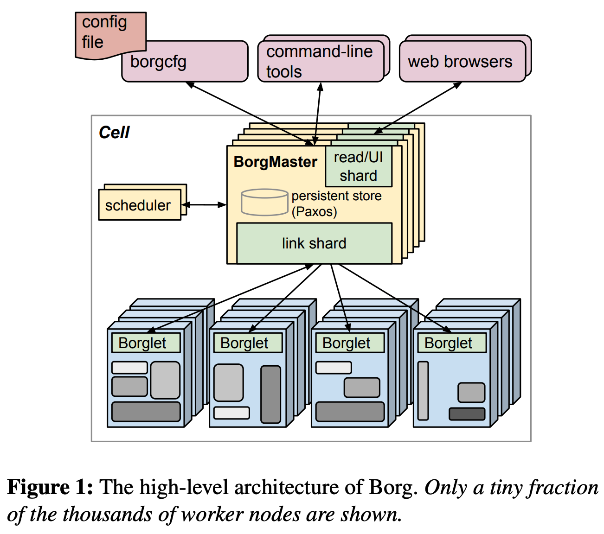

# Kubernetes

## Google Borg

<https://research.google/pubs/pub43438/>

* 物理资源利用率高
* 服务器共享，在进程级别做隔离
* 应用高可用，故障恢复时间段
* 调度策略灵活
* 应用接入和使用方便，提供了完备的 Job 描述语言，服务发现，实时状态监控和诊断工具

优势：

* 对外隐藏底层资源管理和调度、故障处理等
* 实现应用的高可靠和高可用
* 足够弹性，支持应用跑在成千上万的机器上

### 基本概念

* workload
  * Product workload，应该永远在线，如 Google Search
  * 批处理应用，实时性不高但是很耗资源
* Cell 让 Borg 对服务器资源进行抽闲
* Job 和 Task
* Naming：服务对外提供域名

### 架构

Borgmaster 主进程

* 处理客户端 RPC 请求，比如创建 Job、查询 Job 等
* 维护系统组件和服务的状态，比如服务器、Task 等
* 负责与 Broglet 通信

Schuduler 进程：

* 调度策略
  * worst fit
  * best fit
  * hybrid
* 调度优化
  * Score caching
  * Equivalence classes
  * Relaxed randomization

### 应用高可用
