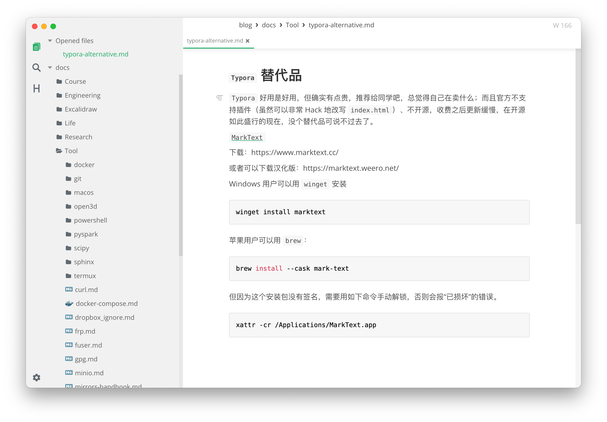
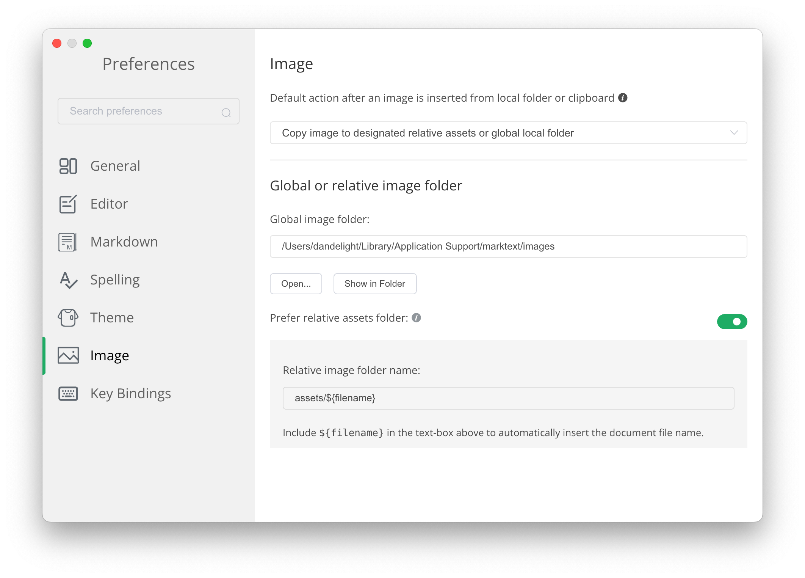

# `Typora` 替代品

`Typora` 好用是好用，但确实有点贵，推荐给同学吧，总觉得自己在卖什么；而且官方不支持插件（虽然可以非常 Hack 地改写 `index.html`）、不开源，收费之后更新缓慢，在开源如此盛行的现在，没个替代品可说不过去了。

[`MarkText`](https://github.com/marktext/marktext)

下载：https://www.marktext.cc/

或者可以下载汉化版：https://marktext.weero.net/

Windows 用户可以用 `winget` 安装

```powershell
winget install marktext
```

苹果用户可以用 `brew`：

```shell
brew install --cask mark-text
```

但因为这个安装包没有签名，需要用如下命令手动解锁，否则会报“已损坏”的错误。

```shell
xattr -cr /Applications/MarkText.app
```

## 效果



## 图片配置


