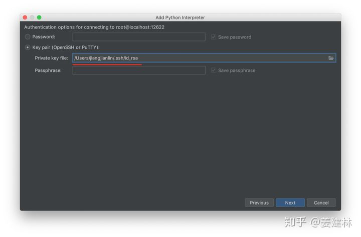
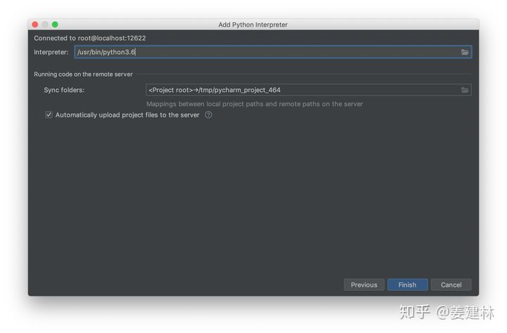
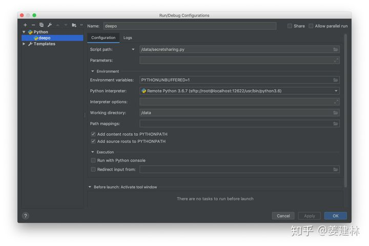
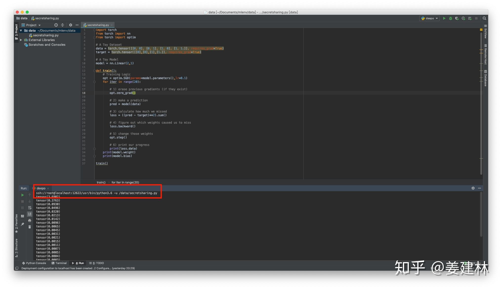

# Docker+PyCharm快速搭建机器学习开发环境

[](https://www.zhihu.com/people/jiang-jian-lin-74)

转发自：[姜建林](https://www.zhihu.com/people/jiang-jian-lin-74)

CS研究生

162 人赞同了该文章

本文介绍使用Docker容器结合PyCharm快速搭建机器学习类任务开发环境。机器学习的开发往往会涉及到很多python的包，环境的搭建和维护是一件头疼的事，使用Docker现成的机器学习工具Deepo能跳过环境搭建的过程，再结合PyCharm可以实现本地开发调试。本文在Mac上做的尝试，linux操作系统同理，windows也有相应的docker软件使用，Pycharm的设置都是相似的。最终的效果是省略环境搭建的步骤，使用PyCharm进行代码的开发和调试。

## Docker

  Docker是一种容器技术，类似于虚拟机，但比虚拟机更轻便。Docker容器内的应用程序直接运行于宿主的内核，而没有自己的内核，而且也没有硬件虚拟。更多Docker的相关知识可以看《Docker-从入门到实践》。

## Deepo

[Deepo](https://link.zhihu.com/?target=https%3A//github.com/ufoym/deepo)是一个包含一系列Docker镜像的项目，这些镜像中包含了TensorFlow、Caffe和Torch等多种深度学习框架。也就是说，在这些镜像中已经包含了大部分流行的机器学习框架，只需要将镜像下载到本地，运行容器即可直接使用这些框架。
  Deepo提供了GPU和CPU版本的框架，这里使用的mac以CPU的镜像为例子，对于GPU版本的镜像需要先安装Nvidia官方的nividia-docker和相应版本的NVIDIA驱动。
  在github页面可以看到Deepo拥有众多的不同的镜像，以tag来区分，可以根据需要下载对应的镜像。这里以`docker pull ufoym/deepo:cpu`为例，这样会下载包含cpu版本的机器学习框架的镜像。

## Deepo-ssh镜像

  在有了Deepo镜像之后，为了方便使用，可以在Deepo镜像基础上配置ssh服务，以便于mac通过ssh连接登录到容器，以及PyCharm调用远程的python的interpreter。
  登录到现有的Deepo容器，以`docker run -it ufoym/deepo:cpu bash`交互式的进入deepo容器中。
**配置容器ssh连接**  这一步可以使用mac通过ssh连接ubuntu容器。首先通过`apt-get install openssh-server`用于开启ssh服务的外部连接。
**配置sshd** 修改sshd的默认配置，编辑文件`/etc/ssh/sshd_config`，修改文件中的以下三行：

```text
PermitRootLogin yes # 可以登录 root 用户
PubkeyAuthentication yes # 可以使用 ssh 公钥许可
AuthorizedKeysFile  .ssh/authorized_keys # 公钥信息保存到该文件中
```

**重启sshd** `/etc/init.d/ssh restart`使得这些配置生效。
**添加mac的公钥到容器** 这一步是为了能免密码ssh登录到容器中。

1. 在容器中`mkdir ~/.ssh`
2. `touch ~/.ssh/authorized_keys`
3. 新开一个mac终端窗口，`ssh-keygen -t rsa -C "youremail@example.com"`（替换为你自己的邮箱），会在`~/.ssh`目录下生成三个文件`id_rsa`、`id_rsa.pub`、`known_hosts`。复制`id_rsa.pub`文件中的内容。
4. 将复制的内容粘贴到容器`~/.ssh/authorized_keys`文件中。

**提交修改到镜像** 以上对容器的修改并不会改变镜像文件，需要提交修改生成一个新的镜像。

1. `docker ps -a`查看刚刚使用deepo容器，记录下该容器的`CONTAINER ID`，例如`8b5a86d18e58`。
2. `docker commit -m 'add ssh' -a 'your-name' 8b5a86d18e58 deepo-ssh`这样会将刚刚在deepo容器中配置的ssh服务保存，并生成新的deepo-ssh镜像。在后续使用`docker images`命令可以查看到新的镜像已经被保存。

**运行最终的容器**
`docker run -d -p 12622:22 -v ~/data:/data -v ~/config:/config deepo-ssh /usr/sbin/sshd -D`

- -d | 后台运行
- -p 12622:22 | 绑定当前mac的12622端口到deepo-ssh容器的22端口（ssh服务默认为22端口）
- -v ~/data:/data | 将mac的~/data目录挂载到容器/data目录
- /usr/sbin/sshd -D | 容器运行的命令和参数，开启ssh服务 

这样就可以通过`ssh -p 12622 root@localhost`连接到容器，可以进入python解释程序，执行`import torch`等命令查看机器学习框架是否能正常使用。在`exit`退出ssh连接后，容器仍运行在后台。
  以上的操作是在mac本地，同样适合在一台远程的linux服务器上，部署一个docker容器。那么在ssh连接时，`localhost`就需要改为该服务器的公网或者内网IP。同时本地的`~/data`和`~/config`目录和deepo-ssh容器中的`/data`和`/config`目录相互绑定。如果是远程服务器的情景，那么就是服务器上的目录和容器中的目录相互绑定，不再和本地mac有关。

### PyCharm+Docker

  经过以上的操作，可以理解成本地12622端口开启了ssh服务，运行一个独立的ubuntu服务器。接下来介绍如何使用PyCharm调用Docker容器中的解释器。（注意需要PyCharm专业版）
在Pycharm中PyCharm-->Project-->Project Interpreter，如下图所示：


点击右上按钮选择添加解释器。


选择`SSH Interpreter`，按图中内容。



选用openssh连接，并添加私钥文件。



选择docker容器内的python解释器。 这样在PyCharm写代码时就会调用已经包含机器学习框架的python解释器，能够代码提醒和智能补全。
接下来配置Run/Debug Configurations，



  如上配置，这里解释器是docker中的解释器，注意`Working Directory`是docker容器中的目录，这为`/data`，由于docker的设置，本机`~/data`和docker容器中的`/data`目录相映射，因此需要执行的文件可以放入本机`~/data`目录。以上就可以在Pycharm调用容器内的解释器以使用容器中已安装的机器学习框架，而且执行和调试可以在本地进行，提高开发效率。
  以上结合Docker和PyCharm快速搭建机器学习开发环境，这例子的情景是在mac后台运行容器，并将本机的端口映射到容器的22端口，实现ssh连接容器，并在PyCharm中调用容器的解释器，以实现本地的机器学习任务的开发调式。以上的模式对于一个远程的服务器同样适用，在服务器上创建docker容器并运行在后台，映射到服务器的一个端口。在Pycharm中调用远程服务器的解释器，并创建本地目录和服务器目录的映射（在Deployment配置），就可以实现在本地写代码和调试。

最终效果