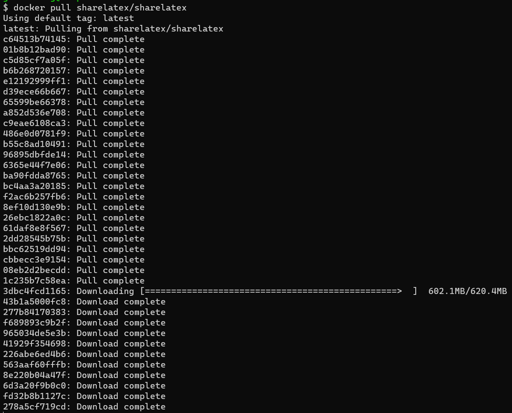

# Overleaf 私有化部署

没想到，这个写论文神器居然是开源的！

https://github.com/overleaf/overleaf



```bash
# 清华大学为例
tlmgr option repository https://mirrors.tuna.tsinghua.edu.cn/CTAN/systems/texlive/tlnet
# 华中科技大学安装源
tlmgr repository set http://mirror.hust.edu.cn/CTAN/systems/texlive/tlnet

# 华为云源：https://mirrors.huaweicloud.com/CTAN/systems/texlive/tlnet
```

> 这是一个悲伤的故事，一个孩子写完文章后没有保存就`git commit`，结果文档被`git-hooks`给格式化，导致什么都没保存下来

## 获取`docker-compose.yml`

```bash
wget https://github.com/overleaf/overleaf/raw/old-master/docker-compose.yml
```

如果你访问不到，那就用下边这个：

```yaml
version: "2.2"
services:
  sharelatex:
    restart: always
    # Server Pro users:
    # image: quay.io/sharelatex/sharelatex-pro
    image: sharelatex/sharelatex
    container_name: sharelatex
    depends_on:
      mongo:
        condition: service_healthy
      redis:
        condition: service_started
    ports:
      - 80:80
    links:
      - mongo
      - redis
    volumes:
      - ~/sharelatex_data:/var/lib/sharelatex
      ########################################################################
      ####  Server Pro: Uncomment the following line to mount the docker  ####
      ####             socket, required for Sibling Containers to work    ####
      ########################################################################
      # - /var/run/docker.sock:/var/run/docker.sock
    environment:
      SHARELATEX_APP_NAME: Overleaf Community Edition

      SHARELATEX_MONGO_URL: mongodb://mongo/sharelatex

      # Same property, unfortunately with different names in
      # different locations
      SHARELATEX_REDIS_HOST: redis
      REDIS_HOST: redis

      ENABLED_LINKED_FILE_TYPES: "url,project_file"

      # Enables Thumbnail generation using ImageMagick
      ENABLE_CONVERSIONS: "true"

      # Disables email confirmation requirement
      EMAIL_CONFIRMATION_DISABLED: "true"

      # temporary fix for LuaLaTex compiles
      # see https://github.com/overleaf/overleaf/issues/695
      TEXMFVAR: /var/lib/sharelatex/tmp/texmf-var

      ## Set for SSL via nginx-proxy
      #VIRTUAL_HOST: 103.112.212.22

      # SHARELATEX_SITE_URL: http://sharelatex.mydomain.com
      # SHARELATEX_NAV_TITLE: Our ShareLaTeX Instance
      # SHARELATEX_HEADER_IMAGE_URL: http://somewhere.com/mylogo.png
      # SHARELATEX_ADMIN_EMAIL: support@it.com

      # SHARELATEX_LEFT_FOOTER: '[{"text": "Powered by <a href=\"https://www.sharelatex.com\">ShareLaTeX</a> 2016"},{"text": "Another page I want to link to can be found <a href=\"here\">here</a>"} ]'
      # SHARELATEX_RIGHT_FOOTER: '[{"text": "Hello I am on the Right"} ]'

      # SHARELATEX_EMAIL_FROM_ADDRESS: "team@sharelatex.com"

      # SHARELATEX_EMAIL_AWS_SES_ACCESS_KEY_ID:
      # SHARELATEX_EMAIL_AWS_SES_SECRET_KEY:

      # SHARELATEX_EMAIL_SMTP_HOST: smtp.mydomain.com
      # SHARELATEX_EMAIL_SMTP_PORT: 587
      # SHARELATEX_EMAIL_SMTP_SECURE: false
      # SHARELATEX_EMAIL_SMTP_USER:
      # SHARELATEX_EMAIL_SMTP_PASS:
      # SHARELATEX_EMAIL_SMTP_TLS_REJECT_UNAUTH: true
      # SHARELATEX_EMAIL_SMTP_IGNORE_TLS: false
      # SHARELATEX_EMAIL_SMTP_NAME: '127.0.0.1'
      # SHARELATEX_EMAIL_SMTP_LOGGER: true
      # SHARELATEX_CUSTOM_EMAIL_FOOTER: "This system is run by department x"

      ################
      ## Server Pro ##
      ################

      # SANDBOXED_COMPILES: 'true'

      # SANDBOXED_COMPILES_SIBLING_CONTAINERS: 'true'
      # SANDBOXED_COMPILES_HOST_DIR: '/var/sharelatex_data/data/compiles'
      # SYNCTEX_BIN_HOST_PATH: '/var/sharelatex_data/bin/synctex'

      # DOCKER_RUNNER: 'false'

      ## Works with test LDAP server shown at bottom of docker compose
      # SHARELATEX_LDAP_URL: 'ldap://ldap:389'
      # SHARELATEX_LDAP_SEARCH_BASE: 'ou=people,dc=planetexpress,dc=com'
      # SHARELATEX_LDAP_SEARCH_FILTER: '(uid={{username}})'
      # SHARELATEX_LDAP_BIND_DN: 'cn=admin,dc=planetexpress,dc=com'
      # SHARELATEX_LDAP_BIND_CREDENTIALS: 'GoodNewsEveryone'
      # SHARELATEX_LDAP_EMAIL_ATT: 'mail'
      # SHARELATEX_LDAP_NAME_ATT: 'cn'
      # SHARELATEX_LDAP_LAST_NAME_ATT: 'sn'
      # SHARELATEX_LDAP_UPDATE_USER_DETAILS_ON_LOGIN: 'true'

      # SHARELATEX_TEMPLATES_USER_ID: "578773160210479700917ee5"
      # SHARELATEX_NEW_PROJECT_TEMPLATE_LINKS: '[ {"name":"All Templates","url":"/templates/all"}]'

      # SHARELATEX_PROXY_LEARN: "true"

  mongo:
    restart: always
    image: mongo:4.0
    container_name: mongo
    expose:
      - 27017
    volumes:
      - ~/mongo_data:/data/db
    healthcheck:
      test: echo 'db.stats().ok' | mongo localhost:27017/test --quiet
      interval: 10s
      timeout: 10s
      retries: 5

  redis:
    restart: always
    image: redis:5
    container_name: redis
    expose:
      - 6379
    volumes:
      - ~/redis_data:/data

  # ldap:
  #    restart: always
  #    image: rroemhild/test-openldap
  #    container_name: ldap
  #    expose:
  #        - 389

  # See https://github.com/jwilder/nginx-proxy for documentation on how to configure the nginx-proxy container,
  # and https://github.com/overleaf/overleaf/wiki/HTTPS-reverse-proxy-using-Nginx for an example of some recommended
  # settings. We recommend using a properly managed nginx instance outside of the Overleaf Server Pro setup,
  # but the example here can be used if you'd prefer to run everything with docker-compose

  # nginx-proxy:
  #     image: jwilder/nginx-proxy
  #     container_name: nginx-proxy
  #     ports:
  #       #- "80:80"
  #       - "443:443"
  #     volumes:
  #       - /var/run/docker.sock:/tmp/docker.sock:ro
  #       - /home/sharelatex/tmp:/etc/nginx/certs
```

接着

```bash
docker-compose up -d # 启动服务
docker exec sharelatex tlmgr update --self # 升级TeX Live包管理器
docker exec sharelatex tlmgr install scheme-full --repository https://mirrors.huaweicloud.com/CTAN/systems/texlive/tlnet # 安装完整版TeX Live
docker commit sharelatex sharelatex/sharelatex:with-texlive-full # 保存现场
```

然后，修改`docker-compose.yml`

```yaml
# ...
services:
  sharelatex:
    image: sharelatex/sharelatex:with-texlive-full
# ...
```

```
docker exec sharelatex /bin/bash -c "cd /var/www/sharelatex; grunt user:create-admin --email=joe@example.com" # 创建用户
```

> 希望这次我记得先保存再`commit`，或者设置一个自动保存。
