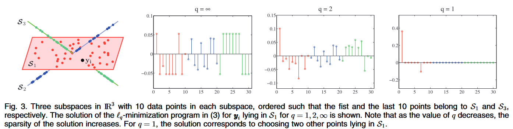

# Sparse Subspace Clustering and Low Rank Representation

> 如不另行说明，文中的“之前”、“近期”等表示相对时间的词汇都相对于“SSC 论文发表”而言。

## Sparse Subspace Clustering

稀疏子空间聚类（SSC）基于“同一类的数据点在同一子空间内”的假设。该假设与传统聚类方法（K-Means、谱聚类）的不同之处在于，子空间聚类不以欧氏距离为判定标准，而是以是否在一个子空间中为标准。这一点在论文中以图示形式说明[^tpami_ssc]。

### 单一子空间中的稀疏表示

向量 $x\in \mathbb{R}^D$ 可以表示为 $D$ 个向量组成的一组基 $\{\psi_i \in \mathbb{R}^D\}_{i=1}^D$ 的线性组合。把这组基写为矩阵 $\mathbb{\Psi} = [\psi_1, \ldots, \psi_D]^T$，我们可以将 $x$ 表示为

$$
x = \sum_{i=1}^Ds_i\phi_i = \Psi s,
$$

其中 $s = [s_1, \ldots, s_D]^T$。在各自的基下，$x$ 和 $s$ 表示同一个向量；当 $\mathbf{\Phi}=\mathbf{I}$ 时，$x = s$。

之前的研究表明，对于一个合适的基 $\mathbf{\Phi}$，$s$ 可能之后很少的非零项。如果 $s$ 最多有 $K$ 个非零项，我们称 $x$ 是 $K$-_sparse_ 的。在实际中，如果 $s$ 有 $K$ 个很大的项，其余项都接近 $0$，也称其为 $K$-sparse。我们对于 $K \ll D$ 的情况很感兴趣。

现在假设我们不直接观测 $x$，而是观测 $x=[x_1, \ldots, x_n]$ 中 $x_i$ 的线性组合。定义 $\{y_i = \phi_i^T x\}_{i=1}^m$，我们有

$$
\begin{aligned}
\boldsymbol{y} &= [y_1, y_2, \ldots, y_m]^T \\
&= \boldsymbol{\Phi x} \\
&= \boldsymbol{\Phi \Psi x} \\
&= A\boldsymbol{s}
\end{aligned}
$$

其中 $\Phi = [\phi_1, \ldots, \phi_m]^T \in \mathbb{R}^{m\times D}$ 称为度量矩阵（measurement matrix）。可证明的是，给定 $m$ 个观测，如果有 $K \lesssim m / \log (D / m)$，则可以重构 $K$-sparse 的向量（其中 $A \lesssim B$ 等价于 $A \lesssim cB$，其中 $c$ 是一个常量。

我们可以通过最小化 $s$ 的 $\ell_0$ 范数 $\| s \|_0$ 来获得稀疏解

$$
\min\ \|s\|_0 \quad \text{subject to } y = As,
$$

但该问题是 NP-hard 的。虽然基本上只具有理论价值，该目标函数依然催生了一批高效的近似算法。如 Basis Pursuit (BP) 算法，将非凸的 $\ell_0$ 替换为凸函数 $\ell_1$，得到

$$
\min\ \|s\|_1\quad \text{subject to } y = As.
$$

已有学者证明 $A$ 在 isometry constant 条件下，该目标函数可以完美复原一个 $K$-sparse 向量。

### 多个子空间中的稀疏表示

之前对于子空间学习的研究多集中于向量集中于同一个子空间的情形。当子空间仅在原点相交（disjoint）时，若已知每个子空间的基，以及满足一些 modified isometry constant 条件成立时，块稀疏向量（block-sparse vector）$s$ 可以使用一个 $\ell_1/\ell_2$ 优化精确解出。

设 $\{A_i \in \mathbb{R}^{D\times d_i}\}_{i=1}^n$ 为 $n$ 组基，其中 $A_i$ 为一组维度为 $d_i$ 的子空间的基。如果向量 $y$ 属于第 $i$ 个子空间，我们可以将它表示为稀疏形式

$$
y = As = [A_1, \ldots, A_n] \times [s_1^T, \ldots, s_n^T]^T,
$$

其中 $s_i \in \mathbb{R}^{d_i}$ 为非零向量，所有其它向量 $\{s_j \in \mathbb{R}^{d_j}\}_{j\neq i}$ 为 $0$。因此，$s$ 即为如下非凸优化的解

$$
\min\ \sum_{i=1}^n 1(\| s_i \|_2 \ge 0)\quad \text{subject to }y = As,
$$

其中 $1(\| s_i \|_2 \ge 0)$ 表示 $\| s_i \|_2 \ge 0$ 时取 $1$ 否则取 $0$。如果一个 a modified isometry constant 满足特定条件，则其解与下式等价

$$
\min\ \sum_{i=1}^n \| s_i \|_2 \quad \text{subject to } y = As.
$$

## 基于稀疏表示的子空间聚类

### 线性子空间聚类

假设 $\{y_i \in \mathbb{R}\}_{j=1}^N$ 为从 $n$ 个无关的线性子空间 $\{\mathcal{S}_i\}$ 中采样得到的向量，无关指 $\operatorname{dim}\left(\bigoplus_{i=1}^n S_i\right)=\sum_{i=1}^n \operatorname{dim}\left(S_i\right)$。设 $\{A_i \in \mathbb{R}^{D\times d_i}\}_{i=1}^n$ 为 $n$ 个空间的基，$\{d_i \ll D\}_{i=1}^n$ 为这 $n$ 个空间的维度。设 $Y_i\in\mathbb{R}^{D\times N_i}$ 为从子空间 $\mathcal{S}_i$ 中采样得到的 $N_i$ 个数据点组成的矩阵。当然，在聚类之前，我们不知道 $y_i$ 属于哪个子空间，也不知道子空间的基或任何其他信息，我们只有一个整体的数据矩阵

$$
Y = [y_1, y_2, \ldots, y_N] = [Y_1, Y_2, \ldots, Y_n]\Gamma \in \mathbb{R}^{D\times N}
$$

其中 $N=\sum_{i=1}^n N_i$，$\Gamma \in \mathbb{R}^{N\times N}$ 为表示数据类别的排列矩阵（permutation matrix）。

虽然我们不知道子空间的基，但我们知道子空间的基是从 $Y$ 的列向量中选取的。如果 $Y$ 满足以下假设：

- 每个线性子空间采样足够多的数据点，即 $N_i \ge d_i$
- 数据分布均匀（general），即子空间 $\mathcal{S}_i$ 的 $d_i$ 个点不会位于一个 $(d_i - 1)$ 维度的子空间中，而是应该位于一个低于 $(d_i-1)$ 维度的空间中（可以考虑 $d=3$ 的情况下，三个点必定在一条直线上（总不能在一个点上吧））

则称该数据点集为 _self-expressive_。这意味着，如果在 $\mathcal{S}_i$ 中有一个新的数据点 $y$，它可以表示为该子空间中 $d_i$ 个点的线性组合。设 $s=\Gamma^{-1}[s_1^T, s_2^T, \ldots, s_n^T] \in \mathbb{R}^{N_i}$，其中 $s_i\in \mathbb{R}^{N_i}$，则 $y$ 有一个 $d_i$-sparse 表示，该表示可通过

$$
y = Ys
$$

重构，其中 $s_i\neq 0$ 且 $\forall j\neq i, s_j = 0$。建模为优化问题，目标函数为

$$
\min\ \| s \|_0 \quad \text{subject to }y = Ys
$$

不出意外地，目标函数非凸，问题 NP-hard。但是，**若子空间相互独立**的情况下，

$$
\min\ \| s \|_1 \quad \text{subject to }y = Ys
$$

该 $\ell_1$ 优化问题给出的块稀疏解中非零块（假设为 $s_i$）对应于 $y$ 中同样的子空间 $\mathcal{S}_i$。

**证明**：设 $s$ 是数据点 $y \in \mathcal{S}_i$ 的块稀疏表示，即 $y = Ys$，其中 $s_i\neq 0$ 且 $\forall j\neq i, s_j = 0$。因为每个点都在 general position，对每个 $y$ 都存在一个 $s$。设 $s^*$ 为上述 $\ell_1$ 优化问题的最优解，$h = s^* - s$ 为该最优解与标准解的差距。$h$ 又可以表示为两个向量之和：

- $h_i$：子空间 $\mathcal{S}_i$ 中对应点的误差
- $h_{i^c}$：子空间 $\mathcal{S}_i$ 外对应点的误差

**采用反证法**，下假设 $h_{i^c}\neq 0$。由上式得

$$
s^* = s + h_i + h_{i^c},
$$

我们有

$$
y = Ys^* = Y(s + h_i) + Yh_{i^c}.
$$

又因为 $y \in \mathcal{S}_i$, $Y(s+h_i) \in \mathcal{S}_i$，且由独立性假设有 $Yh_{i^c} \notin \mathcal{S}_i$，我们有 $Yh_{i^c} = 0$。这意味着

$$
y = Ys^* = Y(s+h_i).
$$

因为 $h_i$ 与 $h_{i^c}$ 分别有不相交（disjointed）的下标支持（support）我们有

$$
\|s+h_i\|_1 < \| s + h_i + h_{i^c}\|_1 = \|s^*\|_1.
$$

即，$s+h_i$ 是目标函数的更优的可行解，这与我们假设 $s^*$ 为可行解相**矛盾**。故**必有**$h_{c^i}=0$，即有 $s^*_{i^c} = s_{i^c} = 0$，也就是只有 $\mathcal{S}_i$ 子空间对应的下标非零。**Quod Erat Demonstrandum**。

该定理给出了将新数据点表示为在同一子空间的训练数据的线性组合形式的充分条件（对于子空间和矩阵而言）。~~艰难证毕之后，我们可以放心大胆地使用该定理了。~~下面给出该定理在多子空间降维中的应用。

设 $Y_{\hat{i}} \in \mathbb{R}^{D\times(N-1)}$ 为从 $Y$ 中去掉 $y_i$ 后得到的矩阵。假设 $y_i \in \mathcal{S}_j$，那么它可以表示为 $Y_{\hat{i}}$ 和一个块稀疏向量 $c_i$ 的矩阵积，$c_i$ 可以通过如下 $\ell_1$ 规划求得

$$
\min\ \| c_i \|_1 \quad \text{subject to } y_i = Y_{\hat{i}}c_i.
$$

最优解 $c_i \in \mathbb{R}^{N-1}$ 为块稀疏向量，非零值的下标对应 $Y_{\hat{i}}$ 中统一子空间的向量。

For $i=1, \ldots, N$ 求解上式后，我们得到了一个系数矩阵 $C = [\hat{c}_1, \hat{c}_2, \ldots, \hat{c}_N] \in \mathbb{R}^{N\times N}$。使用该矩阵，我们定义一张有向图 $G = (V, E)$，其中 $V$ 表示 $N$ 个数据点，存在一条有向边 $(v_i, v_j) \in E$ 当且仅当 $y_j$ 是 $y_i$ 的稀疏表示中的一个向量，当且仅当 $C_{ji} \neq 0$。$G$ 的邻接矩阵为 $C$~~，白费这么半天功夫定义它~~。

当然，$C$ 不一定对称。为了让 $C$ 对称，定义图 $\tilde{G}$，其邻接矩阵为 $\tilde{C}$，其中 $\tilde{C}_{ij} = | C_{ij} | + | C_{ji} |$。因为“处于同一子空间”是一种等价关系，$y_i$ 的稀疏表达里有 $y_j$，$y_j$ 的系数表达里也应该有 $y_j$，故这种处理是合理的。

依据定理一，在同一子空间的点构成图 $\tilde{G}$ 的一个强联通分量，于是 $\tilde{C}$ 可写为块对角矩阵

$$
\tilde{C} = \begin{bmatrix}
\tilde{C}_1 & 0 & \ldots & 0 \\
0 & \tilde{C}_2 & \ldots & 0 \\
\vdots & \vdots & \ddots & \vdots \\
0 & 0 & \ldots & \tilde{C}_n \\
\end{bmatrix}\Gamma
$$

其中 $\Gamma$ 为排列矩阵。

下面终于到了我们熟悉的 Spectral Graph Theory 时间。该理论已经介绍过了~~（其实没有我看什么时候放上来）~~，便不再重复。总而言之，我们可以在 $\tilde{C}$ 的列向量上跑一个 K-Means 或任何一个聚类算法聚类结果就出来啦\~

[^tpami_ssc]: Elhamifar, E., Vidal, R., 2013. Sparse Subspace Clustering: Algorithm, Theory, and Applications. IEEE Trans. Pattern Anal. Mach. Intell. 35, 2765–2781. [https://doi.org/10.1109/TPAMI.2013.57](https://doi.org/10.1109/TPAMI.2013.57)
