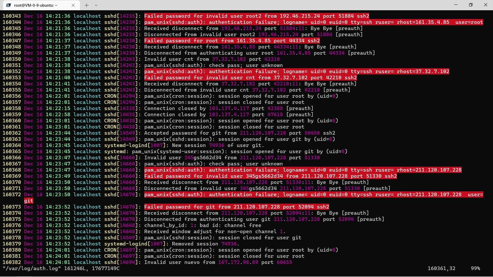

# 项目概况

使用 [`mkdocs`](https://github.com/mkdocs/mkdocs/) 进行编译，采用 [`mkdocs-material`](https://squidfunk.github.io/mkdocs-material/) 主题，各项配置可在本项目仓库中 `.github/workflows/deploy_to_pages.yml`。

依赖 `mkdocs-git-revision-date-plugin` 在页脚处显示更新时间（没错，我就是懒得在 YAML Front Matter 里写更新日期）。

> [!INFO] 最近又支持了 `Callouts`，感谢 <https://github.com/sondregronas/mkdocs-callouts>
> 编辑器端，Obsidian 提供了[官方 Callouts 支持](https://help.obsidian.md/Editing+and+formatting/Callouts)，网页端通过 `mkdocs-callouts` 插件转义为 [`mkdocs-material` 支持的 `Admonitions` 格式](https://squidfunk.github.io/mkdocs-material/reference/admonitions/)，实现了统一的富文本编辑功能。
> 如果要支持 Obsidian 的 wikilink 语法，可以考虑 <https://github.com/ndy2/mkdocs-obsidian-support-plugin> （新项目，实测有些问题，再观察一段时间）

目前项目托管在 `GitHub Pages`，通过 `GitHub Actions` 自动编译部署 [](https://github.com/Dandelight/dandelight.github.io/actions/workflows/deploy_to_pages.yml)，使用 `Cloudflare CDN` 加速访问。

在此之前，我曾使用过

- 租用云服务器，自己用 C 语言写静态服务器，使用 `WebHook` 实现 `git push` 后部署。
- 租用云服务器，使用 `Nginx` 作为静态服务器。
- 对象存储托管，本地编译后上传。
- 利用 `GitHub Actions`，`push` 后触发编译部署流程，部署到 `GitHub Pages`。通过设置 `CNAME` 自定义域名。

~~由此可见我的技术是怎么一点点退化的。~~

## 之前的情况

项目发布流程如下：

```shell
npm run go
```

`npm` 由 `node.js` 提供；如果您没有 `npm` 可以等价地执行以下三条命令：

```
mkdocs build # 编译
python scripts/add_meta.py # 手动增加一个 <meta> 标签
python upload_qcloud.py # 托管到腾讯云
```

编译后的 HTML 页面在腾讯云对象存储（COS）上托管。

`build.py` 文件是我原本打算自己写一个增量编译的脚本，但发现不能增量编译，`mkdocs` 这个框架甚至没留出并行的空间，必须全部文件打个包。后来了解到 [`Hugo`](https://gohugo.io/) 项目性能等都不错，但配置了一个晚上没配好，就没有迁移的动力了。或者 `docsify` 这种前端渲染 `Markdown` 的解决方案更适合？

想自己搭建博客，还是推荐 [`Wordpress`](https://wordpress.org/)，便捷高效，主题和插件丰富，又方便管理。虽然自己没实际应用过就推荐是不太负责任的行为……

> 另外有一个很离谱的事情，Windows 编译一分钟，macOS 编译 7 秒。

## 服务器

自己在学 `Linux` 网络编程时仿照 [`NginX`](https://nginx.org/)  写过一个 `web`  静态页面服务器，放在 [dandelight/enging](https://gitee.com/dandelight/enging)，但是出于未知的原因突然就只能 serve HTML 文件，`css` 和 `js` 无法加载，所以就用真正的 `NginX`  替代了。后来因为要上传图片，需要静态托管，就迁移到了对象存储上。

### 关于 80 端口被 `Welcome to nginx!` 页面占用

找到 `/etc/nginx/site-enabled/default` 文件，把 80 端口的占用指向另一个端口。

> 提问：这样做还要占掉一个端口，有没有其他方法？
>
> 更新：把 `site-enabled` 当成主界面就好。

## `SSH` 禁用密码登录

首先修改 `/etc/ssh/sshd_config`

```ssh
# 禁用密码验证
PasswordAuthentication no
# 启用密钥验证
PubkeyAuthentication yes
```

然后重启 `ssh` 服务

```shell
service sshd restart # centos
service ssh restart # ubuntu
/etc/init.d/ssh restart # debian
```

## 被攻击实录



2022 年 12 月 16 日 14:20 开始，本主机遭到来自日本 IP 的 `ssh` 爆破攻击，攻击者使用大量枚举常见的用户名和弱口令。本机因 `git` 用户密码设置过于简单而被登录，所幸 `git` 用户的 `login shell` 是 `no-login`，攻击者没能进行进一步攻击。此事件及时发现之后，本主机关闭了 `git` 用户的密码登录。
